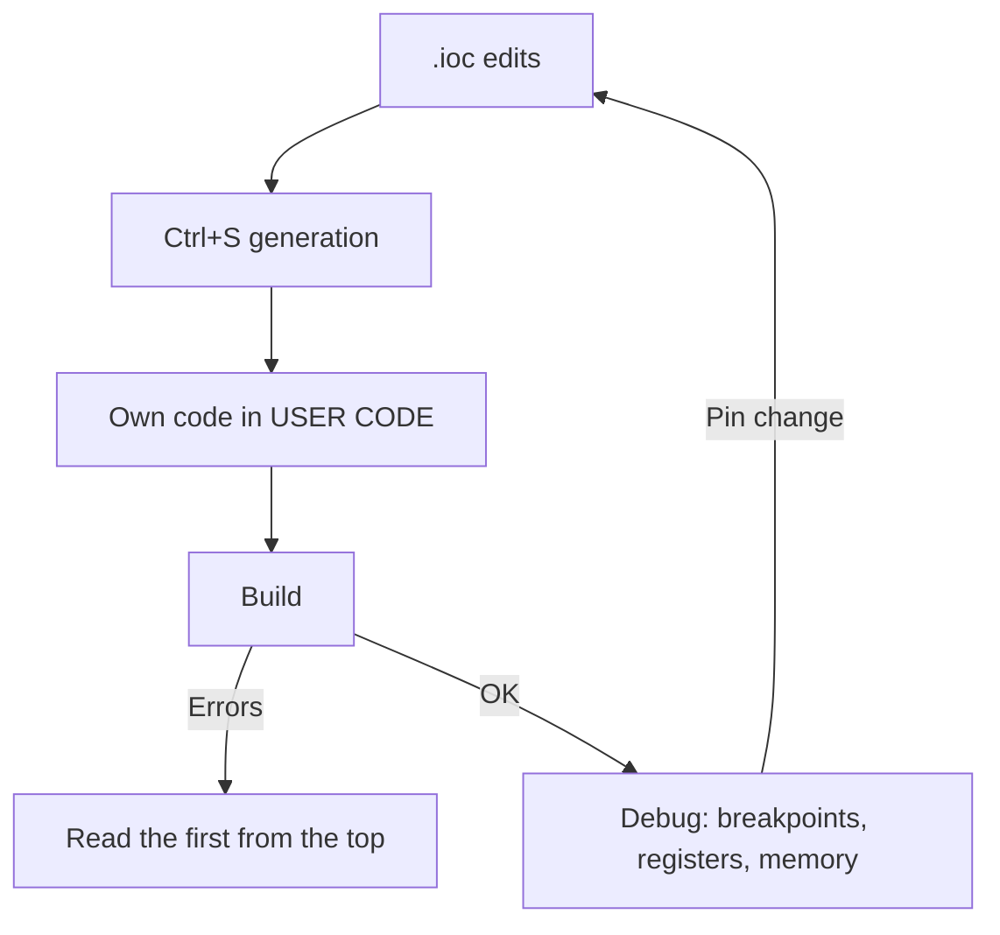

# STM32CubeIDE and CubeMX - Project from Scratch

![[assets/img/stm32-cubeide-project-scheme.png|600]]
*Fig. Chain: .ioc to generation to USER CODE to build to debug.*

> [!tip] Purpose of this note
> Take you from empty CubeIDE to a blinking LED with an understanding of what CubeMX generated and where to write your code.

## 1. Purpose

STM32CubeIDE is Eclipse plus ARM-GCC plus CubeMX plus GDB debug in one. CubeMX is a graphic configurator: you click pins, timers, UART, it generates init code. The main rule: your code goes ONLY between the `USER CODE BEGIN/END` markers, or regeneration wipes it.

## New project step by step

| Step | Action |
| --- | --- |
| 1 | File to New to STM32 Project to the exact chip part number |
| 2 | Name the project, C language (C++ if needed) |
| 3 | In `.ioc`: turn on the needed peripherals, set clocking (Clock Configuration!) |
| 4 | Project Manager to Code Generator: HAL plus separate `.c/.h` per peripheral |
| 5 | Ctrl+S means generation; write code between USER CODE |
| 6 | Green bug is Debug; red button is Run |

```text
Типовий маршрут тактування (приклад F401, мета 84 МГц):
  HSE 8 МГц (кварц!) → PLL: M=4, N=168, P=2 → SYSCLK 84 МГц
  APB1 /4 = 21 МГц (таймери ×2 = 42!) — пастка новачків
  APB2 /2 = 42 МГц
```

## Mermaid: work loop



## Clock Configuration: the main rake

| Question | Answer |
| --- | --- |
| HSE vs HSI | HSE crystal for USB, CAN and accuracy; HSI for start |
| PLL multipliers | Compute for the target SYSCLK, never leave defaults |
| APB dividers | Timers on APB get x2 with a divider above 1! |
| USB 48 MHz | Separate PLL branch (PLLSAI/PLLQ) - check it plainly |
| Fact check | MCO out to a pin plus oscilloscope or counter |

## Headless build (no IDE)

```text
# Той самий проєкт з консолі (для CI):
STM32CubeIDE --launcher.suppressErrors -nosplash \
  -application org.eclipse.cdt.managedbuilder.core.headlessbuild \
  -data workspace/ -import project/ -build project/Debug
```

## Common issues

| # | Issue | Why it is bad | Correct way |
| --- | --- | --- | --- |
| 1 | Own code outside USER CODE | Generation erases it | Only between markers! |
| 2 | Default clocking | Half speed or dead USB | Set the clock tree on purpose |
| 3 | Missing `HAL_Init` or SystemClock_Config | Peripherals stay silent | Order: HAL to clock to peripherals |
| 4 | -O0 optimization in release | Slow and fat | Release: -O2 or -Os plus timing check |
| 5 | Two `.ioc` files per project | Generation conflict | One .ioc is the source of truth |

## Official sources

- [STM32CubeIDE User Guide (ST)](https://www.st.com/en/development-tools/stm32cubeide.html) - install, debug.
- [STM32CubeMX User Manual UM1718 (ST)](https://www.st.com/en/development-tools/stm32cubemx.html) - configurator.

## .ioc tabs in detail: where to click what

| Tab | What is set | Trap |
| --- | --- | --- |
| Pinout and Configuration | Pins, modes, peripherals, NVIC, DMA | One pin means one function; conflict lights red |
| Clock Configuration | HSE/HSI, PLL, buses, dividers | Default is slow; USB wants exact 48 MHz |
| Project Manager | File names, HAL/LL, paths | A separate file pair per peripheral reads better |
| Code Generator | Copy only needed or all HAL | Whole HAL is a fat project; only needed saves |
| Advanced Settings | HAL vs LL for each peripheral on its own! | LL for the hot path turns on right here |

## Generated project layout: where to look

```text
проєкт/
  *.ioc .................... джерело правди (комітити в git!)
  Core/Inc/main.h .......... прототипи,defines
  Core/Src/main.c .......... main + SystemClock + USER CODE
  Core/Src/stm32f4xx_hal_msp.c .. піни/такти/NVIC (правити обережно!)
  Core/Src/gpio.c, usart.c ... окремі файли периферії (якщо увімкнено)
  Drivers/STM32F4xx_HAL_Driver/ .. сам HAL (не чіпати!)
  Debug/*.elf .............. результат збірки для прошивки
```

## First Blink done right (main template)

```c
int main(void)
{
  HAL_Init();
  SystemClock_Config();
  MX_GPIO_Init();
  while (1)
  {
    /* USER CODE BEGIN */
    HAL_GPIO_TogglePin(GPIOC, GPIO_PIN_13);
    HAL_Delay(500);
    /* USER CODE END */
  }
}
```

| Rule | Why |
| --- | --- |
| Own code between BEGIN/END | Regeneration erases all outside them! |
| Init top to bottom | HAL, then clocking, then peripherals |
| Endless loop always | Main exit is HardFault on bare metal |

## CubeIDE debug windows: what a beginner opens

| Window | What it shows | When needed |
| --- | --- | --- |
| Expressions/Variables | Variable values on pause | Logic is wrong |
| Registers | All core and peripheral registers | Suspected wrong init |
| Memory | Raw dump at an address | Table and buffer check |
| SFRs | Decoded peripheral bits | Check that UART is really on |
| SWV ITM Data Console | printf via SWO with no UART! | Fast log with no extra wires |
| Live Expressions | Values with no core halt | Live variable watch |

## SWV printf with no UART (setup)

```text
1. У .ioc: SYS → Debug = Serial Wire + Trace Asynchronous Sw.
2. Debug-конфіг → Debugger → увімкнути SWV, частота = SYSCLK фактична!
3. Код: переозначити _write на ITM_SendChar.
4. Відкрити SWV ITM Data Console, порт 0, Start Trace.
```

| Trap | Fix |
| --- | --- |
| Garbage instead of text | Wrong SWV frequency - check with SYSCLK |
| Silence | Trace pin (PB3/SWO) taken by another function |
| Drag at high rate | SWV divider; never log from a 100 kHz ISR |

## Git and versions: so it never hurts

| Topic | Practice |
| --- | --- |
| Commit .ioc | Yes! It is the generation source |
| Commit generated code | Yes for small teams; ignore Debug/ and .metadata/ |
| CubeMX update | Backup before migrate; HAL versions break API across majors |
| Two developers plus one .ioc | Edit in turns; manual .ioc merge hurts, avoid parallel edits |

## See also

- [[Home.en]]
- [[EN/00-Start/05-Vibir-seredovischa.en|environment choice]]
- [[EN/09-Firmware/02-HAL-LL.en|HAL and LL]]
- [[EN/09-Firmware/03-ST-Link-Proshivka.en|ST-Link]]
- [[EN/09-Firmware/04-Bez-CubeIDE.en|without CubeIDE]]
