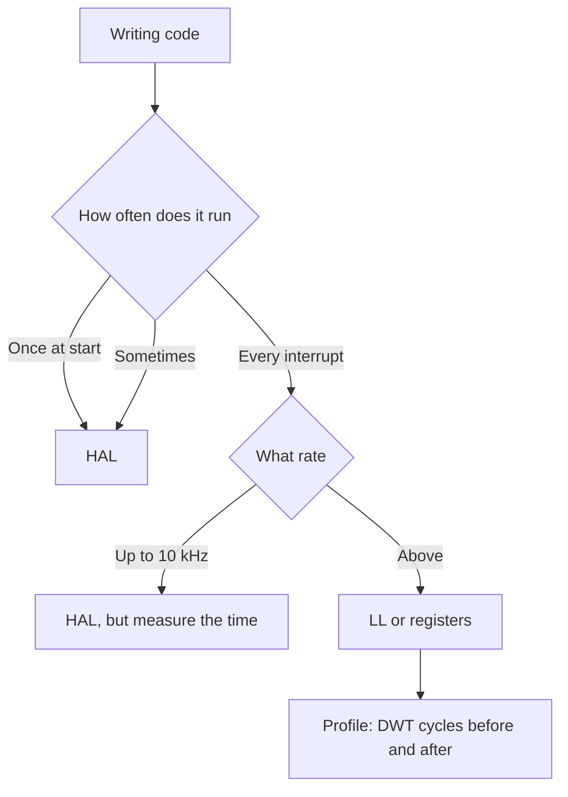

# HAL vs LL - Code Layers in Practice

![[assets/img/stm32-hal-ll-layers-scheme.png|600]]
*Fig. Your code to HAL/LL to CMSIS to registers; hot goes down, cold goes up.*

> [!tip] Purpose of this note
> Teach layer choice for the task: HAL for development speed, LL for run speed, registers for the extreme.

## 1. Purpose

HAL (Hardware Abstraction Layer) means functions with checks, timeouts and states: handy, portable, slow. LL (Low-Layer) means thin inlines 1-to-1 to registers: fast, compact, tied to the chip. Both are generated by CubeMX and live side by side in one project - mixing is normal and right.

## Comparison on one example (GPIO)

```c
// HAL: зручно читати
HAL_GPIO_WritePin(GPIOC, GPIO_PIN_13, GPIO_PIN_SET);
HAL_Delay(500);
// LL: те саме, в рази менше тактів
LL_GPIO_SetOutputPin(GPIOC, LL_GPIO_PIN_13);
LL_mDelay(500);
```

## Where to use what

| Place | Layer | Why |
| --- | --- | --- |
| Peripheral init | HAL | One call instead of 20 registers |
| Slow polls | HAL | No felt difference |
| ISR 1-10 kHz | HAL with care | Works, but watch the time |
| ISR 100 kHz plus or RMT-like | LL | HAL never makes it |
| Bit-bang protocols | LL plus DMA | Minimal jitter |
| Extreme timings | Registers directly | Read the Reference Manual! |

```text
Правило великого пальця:
  пишеш рідко → HAL; виконується часто → LL.
  Сумніваєшся → HAL, профіль покаже гаряче — перепишеш точково.
```

## Mermaid: layer choice



## MSP: where the iron init hides

HAL calls `HAL_UART_MspInit()`-like functions for pins, clocks and interrupts - CubeMX generates them, but you may edit. Golden rule: pins and NVIC go to MspInit, logic goes to `main` or tasks. A broken MspInit means "HAL does not work", though HAL is not guilty.

## Common issues

| # | Issue | Why it is bad | Correct way |
| --- | --- | --- | --- |
| 1 | HAL_Delay in ISR | Blocks the system, breaks timings | Flags plus handling in the main loop |
| 2 | HAL in a 100 kHz ISR | Never makes it, drops | LL version of the same |
| 3 | Mixed HAL and LL on one register | State conflict | One peripheral means one layer |
| 4 | `HAL_Init` never called | SysTick silent, Delay hangs | First line of main |
| 5 | HAL return codes ignored | `HAL_TIMEOUT` or `HAL_ERROR` get lost | Check `HAL_StatusTypeDef` in critical code |

## Official sources

- [STM32 HAL User Manual UM1905 (ST)](https://www.st.com/resource/en/user_manual/um1905-description-of-stm32f7-hal-and-lowlayer-drivers-stmicroelectronics.pdf) - HAL/LL layout.
- [CMSIS Documentation (ARM)](https://www.keil.arm.com/components/cmsis/) - base standard.

## UART side by side: HAL vs LL

```c
// HAL: блокуюча передача (просто, але чекає)
HAL_UART_Transmit(&huart1, buf, len, 100);

// HAL: неблокуюча через переривання (колбек!)
HAL_UART_Transmit_IT(&huart1, buf, len);
// ... в іншому місці:
void HAL_UART_TxCpltCallback(UART_HandleTypeDef *huart) { ready = 1; }

// LL: ручний цикл (максимум контролю)
while (len--) {
  while (!LL_USART_IsActiveFlag_TXE(USART1));
  LL_USART_TransmitData8(USART1, *buf++);
}
while (!LL_USART_IsActiveFlag_TC(USART1));
```

| Option | Plus | Minus |
| --- | --- | --- |
| HAL blocking | One line | Hangs waiting - never in ISR! |
| HAL IT/DMA | Never blocks | Callbacks plus states, harder debug |
| LL manual | Fast, transparent | You watch the flags yourself |

## Timer-PWM side by side: HAL vs LL

```c
// HAL: старт PWM
HAL_TIM_PWM_Start(&htim1, TIM_CHANNEL_1);
__HAL_TIM_SET_COMPARE(&htim1, TIM_CHANNEL_1, 500);

// LL: те саме
LL_TIM_EnableCounter(TIM1);
LL_TIM_CC_EnableChannel(TIM1, LL_TIM_CHANNEL_CH1);
LL_TIM_OC_SetCompareCH1(TIM1, 500);
```

## What HAL costs: order of numbers

| Operation | HAL | LL | Verdict |
| --- | --- | --- | --- |
| GPIO toggle | About 20-50 ticks | 1-2 ticks | In a 100 kHz ISR only LL |
| UART byte (polling) | Plus state checks | Bare flag | Times apart on a stream |
| ADC start plus poll | Plus timeout logic | 3 lines | HAL handier at start |
| ISR overhead | Callback dispatch | Direct call | Measure DWT and be surprised |

```c
// Вимір часу ділянки цикломірниками DWT (будь-який M3/M4/M7):
DWT->CTRL |= DWT_CTRL_CYCCNTENA_Msk;
uint32_t t0 = DWT->CYCCNT;
HAL_GPIO_TogglePin(GPIOC, GPIO_PIN_13);
uint32_t hal_cost = DWT->CYCCNT - t0;
```

## LL peripheral init (what it looks like)

```c
// CubeMX генерує таке для LL_GPIO — читати вміти обов'язково:
LL_AHB1_GRP1_EnableClock(LL_AHB1_GRP1_PERIPH_GPIOC);
LL_GPIO_SetPinMode(GPIOC, LL_GPIO_PIN_13, LL_GPIO_MODE_OUTPUT);
LL_GPIO_SetPinOutputType(GPIOC, LL_GPIO_PIN_13, LL_GPIO_OUTPUT_PUSHPULL);
LL_GPIO_SetPinSpeed(GPIOC, LL_GPIO_PIN_13, LL_GPIO_SPEED_FREQ_LOW);
```

| Mixing rule | Explanation |
| --- | --- |
| One peripheral means one layer | HAL-UART plus LL-UART on the same USART is a state conflict |
| Different peripherals mean different layers | UART on HAL plus timer on LL is fine! |
| MSP stays HAL-owned | Even with an LL peripheral HAL may do clocks and pins |
| Start from HAL | Rewrite hot spots point by point after profiling |

## CMSIS directly: when and how

```c
// Регістри без обгорток (приклад: увімкнути GPIOC-13):
RCC->AHB1ENR |= RCC_AHB1ENR_GPIOCEN;
GPIOC->MODER |= GPIO_MODER_MODE13_0;
GPIOC->ODR ^= GPIO_ODR_OD13;
```

| When | Why |
| --- | --- |
| Startup code | HAL is still far, a minimum is needed |
| Extreme bit-bang | Every tick counts |
| HAL misunderstanding | Read the registers to see what HAL does |
| Learning | Reference Manual plus registers means depth |

## HAL return code glossary

| Code | Meaning | What to do |
| --- | --- | --- |
| HAL_OK | Success | Nothing |
| HAL_ERROR | Generic error | Look at the peripheral state |
| HAL_BUSY | Busy with a previous call | Wait for ready or cancel |
| HAL_TIMEOUT | Time is out | Raise the timeout or fix the bus |

| Peripheral state | Where to look |
| --- | --- |
| ErrorCode in the handle | ORE, FE, NE bits for UART |
| HAL_X_GetError | Last error decode |
| HAL_X_GetState | READY, BUSY_TX, BUSY_RX, ERROR |

```text
Золоте правило:
  критичні виклики перевіряти завжди;
  init без перевірки — мовчазна смерть;
  помилку логувати з іменем функції і кодом.
```

## See also

- [[Home.en]]
- [[EN/09-Firmware/01-CubeIDE-CubeMX.en|CubeIDE]]
- [[EN/09-Firmware/03-ST-Link-Proshivka.en|ST-Link]]
- [[EN/00-Start/05-Vibir-seredovischa.en|environment choice]]
