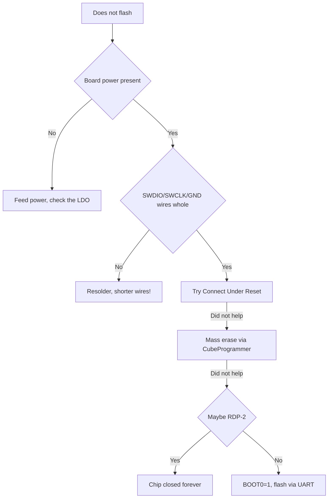

# ST-Link and Flashing - SWD, CubeProgrammer, OpenOCD

![[assets/img/stm32-stlink-flash-scheme.png|600]]
*Fig. 4 SWD wires, connect-under-reset, erase before write, verify after.*

> [!tip] Purpose of this note
> Teach how to flash any STM32 board: what goes where, what pours .elf, .bin and .hex, and how to revive a brick.

## 1. Purpose

ST-Link is a USB to SWD bridge: it flashes Flash, debugs via GDB, gives a virtual COM port (on Nucleo!). SWD is only 2 signal lines (SWDIO plus SWCLK) plus ground and reset. Understanding this chain removes 90 percent of panic: the board is silent, so you check power, wires, connect mode, protection.

## Minimal SWD wiring

| Signal | Where | Note |
| --- | --- | --- |
| SWDIO | PA13 (SWDIO) | Data, pull-up on the board |
| SWCLK | PA14 (SWCLK) | Clocks, pull-down |
| GND | GND | Common ground MANDATORY |
| NRST | NRST | Reset for connect-under-reset |
| 3V3 | 3V3 (optional) | Only for match-logic power, never feed a motor! |

```text
Зовнішній ST-Link v2 → Blue Pill:
  SWDIO → DIO (PA13)
  SWCLK → CLK (PA14)
  GND   → GND
  3V3   → 3V3 (якщо плата без свого живлення!)
  Живлення плати окремо, якщо є мотори/реле.
```

## Mermaid: board does not flash - what to do



## STM32CubeProgrammer: the main tool

| Tab or button | What it does | When |
| --- | --- | --- |
| Connect | Connect to the chip | Always first |
| Erasing and Programming | Pour the file plus verify | Plain flashing |
| Full chip erase | Erase all | Before the first flashing of a clone |
| Option bytes | RDP/WDG/protection | CAREFUL - you can brick it! |
| Firmware upgrade (WB/WL) | FUS plus radio stacks | Only for wireless chips |

```text
Режим підключення (важливо!):
  Normal ......... за замовчуванням
  Under Reset .... коли прошивка ламає SWD (sleep, remap пінів!)
  HotPlug ........ до живого без скидання
```

## Connect Under Reset: the brick saver

| Situation | Why Normal fails |
| --- | --- |
| Firmware dives to Stop or Standby at once | SWD domain off - the debugger never makes it |
| PA13/PA14 remapped to GPIO | Code turned SWD pins off! |
| Wrong clocking | Core hangs before connect |
| WDG resets every millisecond | Connect window is tiny |

```text
Процедура:
1. У CubeProgrammer вибери Under Reset.
2. Затисни NRST (або тримай кнопку).
3. Натисни Connect, відпусти NRST в потрібний момент.
4. Одразу Full chip erase — цегла оживає.
```

## Firmware files: elf vs hex vs bin

| Format | Holds | When to use |
| --- | --- | --- |
| .elf | Code plus symbols plus addresses (all!) | GDB debug, the main artifact |
| .hex | Addresses plus data as text | CubeProgrammer, universal |
| .bin | Bare data with no addresses | UART bootloader, OTA, exact address mandatory! |

| Rule | Explanation |
| --- | --- |
| Flashing .bin means giving an address | Usually 0x08000000 (Flash start) |
| Flashing .hex or .elf means address inside | No need to give it by hand |
| Always verify after a write | Catches broken Flash and bad contact |

## OpenOCD and st-flash (console and Linux)

```text
# OpenOCD: прошивка + OpenOCD-сесія для GDB:
openocd -f interface/stlink.cfg -f target/stm32f1x.cfg \
  -c "program firmware.elf verify reset exit"

# st-flash (пакет stlink-tools): швидко і просто:
st-flash --reset write firmware.bin 0x8000000
st-info --probe   # що за чип підключено
```

| Tool | Plus | Minus |
| --- | --- | --- |
| CubeProgrammer | GUI, option bytes, WB stacks | Heavy, wants Java |
| OpenOCD | Scripts, GDB server, CI | Configs for every family! |
| st-flash | One command | No debug, write only |
| pyOCD | Python ecosystem | Rarer updates for new chips |

## RDP: the protection that kills (read twice!)

| Level | What it means | Rollback |
| --- | --- | --- |
| RDP 0 | Open (factory) | - |
| RDP 1 | SWD read closed, write still can | Mass erase lifts it |
| RDP 2 | FOREVER. No read, no write, no erase | NONE. One-shot chip! |

> Never set RDP 2 during development. One careless click in option bytes means the board is for trash. RDP 1 covers 99 percent of tasks.

## SWD speed and safety

| Topic | Practice |
| --- | --- |
| SWD frequency | Lower on long wires (from 4 MHz to 950 kHz) |
| Wire length | Up to 10-15 cm; longer means glitches and breaks |
| Clone vs genuine ST-Link | Clones work, but their own firmware sometimes flies off |
| Built-in ST-Link on Nucleo | Can flash an outside board (drop the jumpers!) |
| Power from ST-Link | Logic only; motors and relays get a separate PSU! |

## Common issues

| # | Issue | Why it is bad | Correct way |
| --- | --- | --- | --- |
| 1 | No common GND | Random breaks, broken data | GND always the first wire |
| 2 | Flashing .bin with no address | Code in the wrong place means silence | 0x08000000 for Flash |
| 3 | RDP 2 on a debug board | Trash | Only RDP 0 or 1 in development |
| 4 | PA13/PA14 given to GPIO | SWD lost after the first flashing | Leave SWD or use Under Reset |
| 5 | Long wires on a breadboard | Breaks at high frequency | Shorter plus lower SWD frequency |
| 6 | Verify skipped | Broken firmware takes weeks to find | Verify always! |

## Official sources

- [STM32CubeProgrammer User Manual UM2237 (ST)](https://www.st.com/en/development-tools/stm32cubeprog.html) - flashing, option bytes.
- [ST-Link/V2 User Manual UM1075 (ST)](https://www.st.com/en/development-tools/st-link-v2.html) - wiring, modes.

## See also

- [[Home.en]]
- [[EN/09-Firmware/01-CubeIDE-CubeMX.en|CubeIDE]]
- [[EN/09-Firmware/02-HAL-LL.en|HAL and LL]]
- [[EN/09-Firmware/04-Bez-CubeIDE.en|without CubeIDE]]
