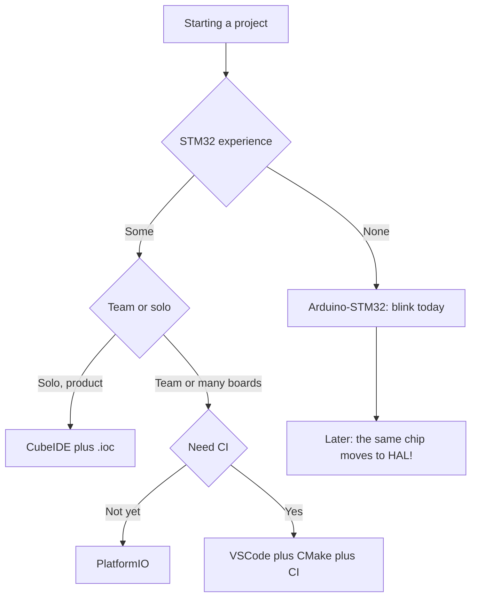

# Without CubeIDE - VSCode, CMake, Arduino and PlatformIO

![[assets/img/stm32-toolchain-alt-scheme.png|600]]
*Fig. CubeMX generates code, and anything can build it: IDE, CMake, PIO, CI.*

> [!tip] Purpose of this note
> Pick an environment for your style: fast start, team work or full build control.

## 1. Purpose

CubeIDE is not the only path. Arduino gives a start in an evening, PlatformIO gives handy work with libraries and boards, VSCode plus CMake gives full control and a sane CI. HAL and LL code is the same everywhere - only the build and load wrapper changes.

## Honest environment comparison

| Environment | Start | Control | Libraries | CI | When to take |
| --- | --- | --- | --- | --- | --- |
| Arduino-STM32 | Evening | Low | Thousands of sketches | Poor | Prototype, learning |
| CubeIDE | Day | Middle | Cube ecosystem | Headless | Solo shipping product |
| PlatformIO | Hour | Middle plus | PIO registry | Good | Team, several boards |
| VSCode plus CMake | Days | Full | By hand | Ideal | Skilled team, own pipeline |
| Bare Makefile | Week | Absolute | By hand | Ideal | Minimalists, legacy |

```text
Правило вибору:
  один вечір і миготіти → Arduino
  виріб на рік → CubeIDE або PIO
  команда + тести + CI → VSCode + CMake
```

## Mermaid: path choice



## Arduino-STM32: fast start

| Topic | Practice |
| --- | --- |
| Core | STM32duino (official!) via Board Manager |
| Boards | Blue Pill, Black Pill, Nucleo out of the box |
| Load | ST-Link, DFU (F072/F105), Serial (bootloader) |
| Pins | Arduino numbers plus STM numbers nearby (PA9 is TX1) |

```c
// Той самий Blink, вид Arduino:
void setup() { pinMode(PC13, OUTPUT); }
void loop() { digitalToggle(PC13); delay(500); }
```

| Limit | What it means |
| --- | --- |
| HAL under the hood, but simplified | Hot ISRs are harder to write |
| Timings rough | delay() is not for exact work |
| Move to HAL later | Pins and logic move over, sketch layout does not |

## PlatformIO: the golden middle

```text
platformio.ini для Blue Pill:
  [env:bluepill_f103c8]
  platform = ststm32
  board = bluepill_f103c8
  framework = stm32cube    ; або arduino!
  upload_protocol = stlink
```

| Topic | Practice |
| --- | --- |
| Framework of choice | arduino or stm32cube in one config! |
| Libraries | Deps in .ini, versions pinned |
| Port monitor | Built-in serial monitor |
| Debug | PIO Unified Debugger (GDB under the hood) |
| CI | pio run from console - the same config |

## VSCode plus CMake: full control

```text
Типова структура:
  проєкт/
    CMakeLists.txt ......... тулчейн + цілі
    cmake/gcc-arm-none-eabi.cmake .. компілятор, прапорці
    Core/ .................. код з CubeMX (скопійовано!)
    Drivers/ ............... HAL (сабмодуль або копія)
    build/ ................. артефакти (в .gitignore!)
```

```text
# Збірка:
cmake -B build -DCMAKE_BUILD_TYPE=Release
cmake --build build -j
# Прошивка:
openocd -f interface/stlink.cfg -f target/stm32f1x.cfg \
  -c "program build/firmware.elf verify reset exit"
```

| Topic | Practice |
| --- | --- |
| Toolchain file | Paths to arm-none-eabi-gcc, CPU flags (-mcpu=cortex-m4 -mfpu=fpv4-sp-d16 -mfloat-abi=hard!) |
| CubeMX plus CMake | Generate code with CubeMX, build with CMake - normal practice |
| Submodules | HAL as a git submodule - version pinned for the whole team |
| Tests | Host logic tests on GCC plus Unity or Ceedling apart from firmware |

## FPU flags: the classic CMake trap

| Chip | Flags |
| --- | --- |
| No FPU (F0/F1/L0) | -mcpu=cortex-m0/m3 -mfloat-abi=soft |
| With FPU (F4/G4/H7) | -mcpu=cortex-m4 -mfloat-abi=hard -mfpu=fpv4-sp-d16 |
| Float link error | Library and code flag mismatch! |

> Mixing soft and hard float in one project gives mystery falls. Check the flags the same across the whole team.

## CI pipeline: team minimum

```text
1. Чек-аут + сабмодулі (HAL!).
2. cmake -B build + cmake --build build.
3. Артефакт: firmware.elf + firmware.hex.
4. Опційно: cppcheck, clang-format --dry-run.
5. Реліз: прикріпити .hex до тегу.
```

| Service | Note |
| --- | --- |
| GitHub Actions | arm-none-eabi-gcc from apt, build/ cache |
| GitLab CI | docker image with the toolchain |
| Secrets | No signing keys in logs! |

## Common issues

| # | Issue | Why it is bad | Correct way |
| --- | --- | --- | --- |
| 1 | Arduino pins in HAL code | Different numbering systems | Match table before porting |
| 2 | FPU flags at random | Falls on float | Per the chip core datasheet! |
| 3 | HAL copied in pieces | Versions drift apart | Submodule or full package copy |
| 4 | build/ in git | Trash in the repo | .gitignore from day one |
| 5 | CI builds unlike local | Not reproducible | Same CMake plus pinned versions |
| 6 | Wrong board in .ini | Silence or glitches | Exact board part number! |

## Official sources

- [STM32duino Wiki (GitHub)](https://github.com/stm32duino/Arduino_Core_STM32) - Arduino core for STM32.
- [PlatformIO ST STM32 Docs](https://docs.platformio.org/en/latest/platforms/ststm32.html) - boards and protocols.

## See also

- [[Home.en]]
- [[EN/09-Firmware/01-CubeIDE-CubeMX.en|CubeIDE]]
- [[EN/09-Firmware/03-ST-Link-Proshivka.en|ST-Link]]
- [[EN/00-Start/05-Vibir-seredovischa.en|environment choice]]
