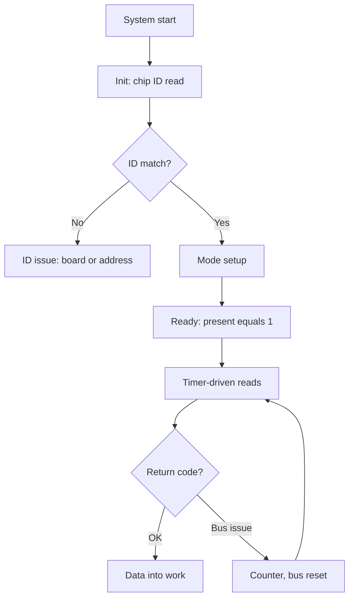

# HAL Driver Template - Structure and Error Codes

![[assets/img/stm32-driver-template-scheme.png|600]]
*Fig. Driver layers: hardware at the bottom, logic on top, errors outward.*

> [!tip] Purpose of this note
> Give a single driver skeleton so every sensor in the project looks the same and fails the same way.

## 1. Purpose

Every driver without a template is a new dialect: different names, different error codes, different init. A single template removes that: init always checks communication, reads always return a code, the device is always described by a descriptor. A new sensor connects by copying the skeleton.

## File layout

| File | Contents |
| --- | --- |
| sensor.h | Descriptor, error codes, prototypes |
| sensor.c | Init, reads, writes, callbacks |
| sensor_cfg.h | Address, pins, timeouts for the board |

```text
Правило шарів:
  верхній код не знає, I2C там чи SPI;
  драйвер не знає, яка плата;
  плата описана тільки в cfg.
```

## Device descriptor

```c
// Опис екземпляра: все станово в одному місці:
typedef struct {
  I2C_HandleTypeDef *bus;   // яка шина
  uint8_t addr;             // адреса на шині
  uint32_t timeout;         // таймаут операцій
  int32_t calib[3];         // калібрування з OTP
  uint8_t present;          // чип відповідає
} sensor_t;
```

## Init with communication check

```c
// Init завжди читає ID чипа — мовчазний старт заборонено:
int sensor_init(sensor_t *dev)
{
  uint8_t id = 0;
  if (HAL_I2C_Mem_Read(dev->bus, dev->addr, REG_ID,
                       1, &id, 1, dev->timeout) != HAL_OK)
    return SENSOR_ERR_BUS;
  if (id != EXPECTED_ID)
    return SENSOR_ERR_ID;
  // ... налаштування режимів ...
  dev->present = 1;
  return SENSOR_OK;
}
```

## Mermaid: driver lifecycle



## Error codes: unified across the project

| Code | Meaning |
| --- | --- |
| SENSOR_OK | Success |
| SENSOR_ERR_BUS | Bus not responding |
| SENSOR_ERR_ID | Foreign chip ID |
| SENSOR_ERR_TIMEOUT | Timeout exceeded |
| SENSOR_ERR_CRC | Data corrupted |
| SENSOR_ERR_ARG | Invalid argument |

```text
Правила:
  нуль — завжди успіх;
  верхній код логує, а не мовчить;
  повторні помилки шини рахуються лічильником.
```

## Reads with retries

```c
// Читання з повтором: одна глітч-передача не вбиває вимір:
int sensor_read(sensor_t *dev, int32_t *out)
{
  for (int i = 0; i < 3; i++) {
    if (HAL_I2C_Mem_Read(dev->bus, dev->addr, REG_DATA,
                         1, (uint8_t*)out, 4, dev->timeout) == HAL_OK)
      return SENSOR_OK;
  }
  return SENSOR_ERR_BUS;
}
```

## Common issues

| # | Issue | Why it is bad | Correct way |
| --- | --- | --- | --- |
| 1 | Init without ID read | Dead chip visible only in operation | ID on every start! |
| 2 | Globals instead of descriptor | Two sensors cannot coexist | State only in the struct |
| 3 | Address hardcoded | Board with another address means editing code | Address in cfg |
| 4 | Blocking loops without timeout | Whole system hangs | Timeout on every operation |
| 5 | Silent errors | Bug visible a month later | Codes upward, log at once |
| 6 | Driver knows the board number | Copy-paste per board | Board only in the cfg file |
| 7 | Magic register numbers | Nobody understands in a year | Named constants from the datasheet |

## Official sources

- [UM1905 HAL drivers (ST)](https://www.st.com/resource/en/user_manual/um1905.pdf) - HAL style and conventions.
- [MISRA C guidelines (MISRA)](https://www.misra.org.uk/misra-c) - safe embedded code style.

## Board config: example

```c
// sensor_cfg.h для конкретної плати:
#define SENSOR_I2C        (&hi2c1)
#define SENSOR_ADDR       (0x76 << 1)
#define SENSOR_TIMEOUT    100
#define SENSOR_POLL_MS    1000

// main.c: звязка за секунду:
static sensor_t env = {
  .bus = SENSOR_I2C, .addr = SENSOR_ADDR,
  .timeout = SENSOR_TIMEOUT, .present = 0,
};
```

| Rule | Explanation |
| --- | --- |
| Driver version in the header | DRIVER_VERSION visible in logs |
| API change means new major | Do not break compatibility silently |
| One driver one cfg | Boards do not mix |

## See also

- [[Home.en]]
- [[09-Firmware/02-HAL-LL.en | Code layers]]
- [[09-Firmware/01-CubeIDE-CubeMX.en | Build setup]]
- [[04-Interfaces/03-I2C.en | Exchange bus]]
- [[10-Sensors/02-BME280-SHT3x | Driver example]]
