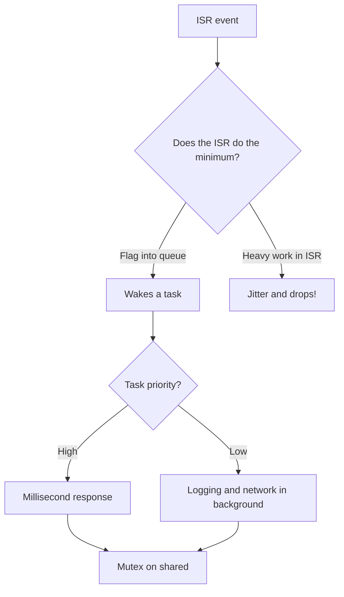

# FreeRTOS on STM32 - Tasks, Queues and ISRs

![[assets/img/stm32-freertos-scheme.png|600]]
*Fig. Data flow: the ISR wakes, the queue carries, the task parses.*

> [!tip] Purpose of this note
> Teach firmware splitting into tasks so ISRs stay short and data is never lost.

## 1. Purpose

A bare loop does not scale: add WiFi logic to a motor and everything jerks. FreeRTOS gives tasks with priorities, queues between them and kernel timers. The ISR only wakes, a low-priority task does the heavy work. The result is a deterministic system instead of flag spaghetti.

## Tasks: minimum

| Topic | Practice |
| --- | --- |
| Creation | xTaskCreate with a function, a stack and a priority |
| Task stack | With margin: overflow corrupts neighbouring memory! |
| Priorities | Higher number means more important; idle is always lowest |
| Delay | vTaskDelay instead of HAL_Delay - yields the kernel to others |

```c
// Задача вимірів раз на секунду:
void meas_task(void *arg)
{
  for (;;) {
    read_sensors();
    xQueueSend(data_q, &sample, 0);
    vTaskDelay(pdMS_TO_TICKS(1000));
  }
}
```

## Queues and semaphores

| Primitive | When |
| --- | --- |
| Queue | Data flow ISR-to-task or task-to-task |
| Binary semaphore | An event happened - wake up! |
| Mutex | Shared resource: UART log, bus |
| Direct notification | Lighter semaphore alternative for one task |

```c
// ISR кладе подію, задача забирає:
void EXTI0_IRQHandler(void)
{
  BaseType_t woken = pdFALSE;
  xQueueSendFromISR(btn_q, &evt, &woken);
  portYIELD_FROM_ISR(woken);
}
```

## Mermaid: work distribution



## ISRs and NVIC priorities: iron rule

| Topic | Practice |
| --- | --- |
| Kernel threshold | configMAX_SYSCALL_PRIORITY - the API call limit |
| ISR with API | Priority NUMERICALLY higher (logically lower!) than the threshold |
| ISR without OS | Top priorities, hardware only |
| Check | Port assert catches violations - never disable! |

> Confusion: on Cortex-M a SMALLER number means a MORE important interrupt. The OS threshold means ISRs above the OS hardware level never touch OS calls.

## Memory and stack

| Topic | Practice |
| --- | --- |
| Kernel heap | Scheme 4 by default in CubeMX is enough |
| Stack overflow | Hook vApplicationStackOverflowHook - blink SOS! |
| Margin measurement | uxTaskGetStackHighWaterMark shows the minimum |
| Heap for buffers | Large frames go to static storage, not the task stack |
| Static tasks | xTaskCreateStatic - no heap at all |

## Common issues

| # | Issue | Why it is bad | Correct way |
| --- | --- | --- | --- |
| 1 | Heavy work in ISR | Jitter, drops | Queue plus task |
| 2 | Plain call from ISR | Corrupts kernel queues | Only FromISR versions! |
| 3 | Forgotten YIELD | Task wakes up late | portYIELD_FROM_ISR |
| 4 | Small task stack | Silent memory corruption | Margin plus hook plus measurement |
| 5 | Mutex from ISR | Lock forever | Semaphore instead of mutex |
| 6 | ISR priority above threshold with API | Kernel crash | Cross-check numbers with the config! |
| 7 | HAL_Delay in a task | Blocks only the task but wastes time | vTaskDelay for pauses |

## Official sources

- [FreeRTOS on STM32 (ST)](https://www.st.com/en/development-tools/stm32cube-mcu-packages.html) - port in Cube packages.
- [Mastering the FreeRTOS Kernel (AWS)](https://www.freertos.org/Documentation/RTOS_book.html) - tasks, queues, memory.

## Software timers and kernel sleep

| Topic | Practice |
| --- | --- |
| Kernel timer | Periodic actions without a separate task |
| Daemon task | Timer callbacks run in it - keep them short! |
| Tickless idle | Kernel sleeps between ticks instead of a dead loop |
| Sleep and radio | Tickless plus Stop - years on battery |

```c
// Таймер раз на хвилину: скинути watchdog-лічильник:
TimerHandle_t t = xTimerCreate("wd", pdMS_TO_TICKS(60000),
                               pdTRUE, NULL, wd_callback);
xTimerStart(t, 0);
```

## Idle hook: what to do when idle

| Topic | Practice |
| --- | --- |
| Idle hook | vApplicationIdleHook - only fast work! |
| Load measurement | Idle counter shows the free kernel |
| Sleep in hook | WFI with tickless to save power |

```text
Орієнтир завантаження:
  простій понад 70 відсотків — запас є;
  простій близько нуля — ядро на межі, різати роботу.
```

## Task priorities: system map

| Task | Priority | Why |
| --- | --- | --- |
| Emergency (motor, protection) | Highest | Millisecond deadline |
| Measurements and control | Middle | Periodic with minimum jitter |
| Communication and logging | Low | Delays acceptable |
| Background and statistics | Lowest | When everyone sleeps |

```text
Правило: високі задачі короткі і без блокувань;
довге чекання — тільки в низьких;
інверсія через мютекс лікується наслідуванням пріоритету.
```

## Kernel load measurement

| Method | How |
| --- | --- |
| Idle counter | Free kernel percent |
| GPIO marker | Oscilloscope on task entry and exit |
| Trace | SEGGER SystemView for the whole picture |

## See also

- [[Home.en]]
- [[09-Firmware/02-HAL-LL.en | Code layers]]
- [[03-GPIO/04-NVIC-Priority-DeepDive.en | NVIC priorities]]
- [[03-GPIO/03-EXTI-NVIC.en | External interrupts]]
- [[07-Timers/02-LPTIM-RTC-WDT.en | Watchdog timers]]
