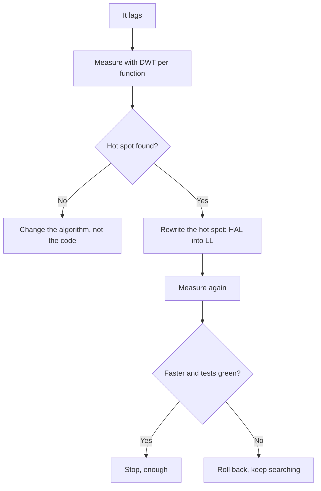

# STM32 Optimization - DWT, Memory and HAL vs LL

![[assets/img/stm32-perf-bench-scheme.png|600]]
*Fig. Measure in cycles, not feelings: DWT shows the truth.*

> [!tip] Purpose of this note
> Teach finding real bottlenecks with profiling and removing them point by point instead of rewriting everything.

## 1. Purpose

Optimization without measurements is guessing. The DWT cycle counter counts core clocks and shows the exact price of every function. The practice is simple: measure, find the hot spot, rewrite the hot spot one level down, check that nothing broke. Everything else stays readable.

## DWT: a ruler in clocks

```c
// Увімкнення циклового лічильника (M3/M4/M7):
CoreDebug->DEMCR |= CoreDebug_DEMCR_TRCENA_Msk;
DWT->CYCCNT = 0;
DWT->CTRL |= DWT_CTRL_CYCCNTENA_Msk;

// Вимір ділянки:
uint32_t t0 = DWT->CYCCNT;
HAL_GPIO_TogglePin(GPIOC, GPIO_PIN_13);
uint32_t cost = DWT->CYCCNT - t0;   // тактів!
```

| Measurement rule | Explanation |
| --- | --- |
| Measure in the release build (-O2) | Debug -O0 lies by multiples |
| Warm the cache before measuring | First run is always slower |
| Average over a hundred runs | Interrupts spoil single shots |
| Fix the core frequency | Clocks convert to microseconds via SYSCLK |

```text
Орієнтири ціни (порядок, не догма):
  GPIO через LL ............ 1-2 такти
  GPIO через HAL ............ 20-50 тактів
  Вхід-вихід з ISR .......... 100-300 тактів
  float-ділення .............. сотні тактів
```

## Mermaid: optimization loop



## HAL vs LL vs registers

| Operation | HAL | LL | Registers | Verdict |
| --- | --- | --- | --- | --- |
| Init | One call | Dozens of lines | Datasheet in hand | HAL wins outright |
| GPIO in a loop | Dozens of clocks | 1-2 clocks | 1 clock | LL or BSRR directly |
| UART byte | State checks | Flag | Flag | LL in the stream |
| 10 kHz ISR | Keeps up | Keeps up | Keeps up | Stay with HAL |
| 100 kHz ISR and up | Too slow | Keeps up | Keeps up | LL only |

```c
// Той самий пін трьома шарами:
HAL_GPIO_WritePin(GPIOC, GPIO_PIN_13, GPIO_PIN_SET);  // зручно
LL_GPIO_SetOutputPin(GPIOC, LL_GPIO_PIN_13);          // швидко
GPIOC->BSRR = GPIO_BSRR_BS13;                         // межа
```

## Memory: where the hot code lives

| Memory | Speed | What to place |
| --- | --- | --- |
| ITCM / CCM-RAM | Zero wait always | Critical ISR code and data |
| SRAM | Fast but shared with DMA | Exchange buffers |
| Flash with ART/cache | Fast on hits | Main code |
| Flash without cache | Slow (wait states!) | Nothing hot |
| External QSPI | Slowest | Data, not hot code |

| Topic | Practice |
| --- | --- |
| Wait states | Per datasheet for the frequency: 168 MHz needs 5 WS! |
| ART accelerator | Never disable - gives zero waits on Flash |
| Section attribute | Hot function into CCM: `__attribute__((section(".ccmram")))` |
| ISR stack | With margin: stack overflow breaks everything silently |

## Compiler flags

| Flag | Effect | When |
| --- | --- | --- |
| -O0 | No optimization, easy debug | Development only |
| -O2 | Speed and size balance | Release default |
| -Os | Minimum size | Tight Flash |
| -O3 | Aggressive, bloats code | Only after measurements! |
| LTO | Cross-file optimization | Release, if the build allows |

> Changing flags means remeasuring timings. -O3 sometimes BREAKS order-sensitive code.

## Common issues

| # | Issue | Why it is bad | Correct way |
| --- | --- | --- | --- |
| 1 | Blind optimization | Breaks working code with no gain | DWT first, then code |
| 2 | -O0 in release | Slow and fat | Release at least -O2 |
| 3 | Hot code in QSPI | Cache miss costs hundreds of clocks | Hot code only in internal memory |
| 4 | Wrong wait states | Glitches at high frequency | Per the datasheet table! |
| 5 | float where int is enough | Hundreds of clocks per division | Fixed point in loops |
| 6 | double instead of float | Software emulation even with FPU! | Only single-precision float |
| 7 | Single-run measurement | Interrupts lie | Average of a hundred, cache warm |

## Official sources

- [AN4661 Performance stats (ST)](https://www.st.com/resource/en/application_note/an4661.pdf) - STM32 core benchmarks.
- [Cortex-M4 Technical Reference (ARM)](https://developer.arm.com/documentation/100166/latest/) - pipeline, DWT, cache.

## Volatile and the optimizer: honesty contract

| Situation | What to do |
| --- | --- |
| ISR flag read by main | `volatile`, else the compiler drops the read! |
| Peripheral register in a loop | Always via the volatile CMSIS struct |
| Empty-loop delay | Optimizer drops the loop - DWT or timer only |

```c
// Класичний баг: без volatile цикл очікування зникає в -O2!
volatile uint32_t *reg = &TIM2->SR;
while ((*reg & TIM_SR_UIF) == 0) { /* чекаємо */ }
```

```text
Перевірка лінкера після оптимізації:
  arm-none-eabi-size firmware.elf  — text/data/bss по секціях;
  .map-файл: хто зжер Flash (profiler секцій!);
  стек + купа влазять у RAM з запасом 20%%?
```

## See also

- [[Home.en]]
- [[09-Firmware/02-HAL-LL.en | Code layers]]
- [[09-Firmware/01-CubeIDE-CubeMX.en | Build setup]]
- [[07-Timers/01-GPTIM-ADTIM.en | Timers and PWM]]
- [[04-Interfaces/07-DMA-DeepDive.en | DMA modes]]
