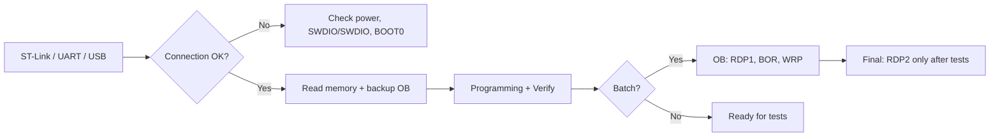

# STM32CubeProgrammer - Flash, Option Bytes and Mass Flashing

![[assets/img/stm32-cubeprogrammer-scheme.png|600]]
*Fig. CubeProgrammer: ST-Link connection to OB readout to programming to verification to mass flashing via CLI.*

> [!tip] Purpose of this note
> Teach an engineer not only flashing but also chip protection (RDP) and production scale-up without manual clicks.

## 1. Connection

- **ST-Link V2 / V3 / V4** - USB to SWD (SWCLK + SWDIO) + GND + 3.3V;
- **UART-BOOT (DFU)** - on F1/F4 via USART1 + BOOT0 = 1; on G0/G4 - USB-DFU;
- **USB-OTG / DFU** - on H5/U5 with built-in USB;
- Check `Target` to `Connection` to `Read Memory` - it must say `OK`.

## 2. Reading / writing

- `Erasing & Programming` to select `.hex` / `.bin` to `Programming -> Verify`;
- `External Loaders` - for external flash (QSPI / SPI-NOR);
- Byte count for `Flash` = sector size x count; do not overflow.

## 3. Option Bytes (OB)

| Bit / group | Value 0 | Value 1 | Danger |
| --- | --- | --- | --- |
| RDP Level 0 | Reading/writing open | Reading/writing open | None (default) |
| RDP Level 1 | Reading locked, debug available | Reading locked, debug available | Return to 0 needs erasure |
| RDP Level 2 | **IRREVERSIBLE** | not supported | **Once set, the chip is locked forever** |
| nBOOT0 | Boot from Flash | Boot from System Memory | Without BOOT0 pins it may not start |
| nBOOT1 | Boot from Flash | Boot from SRAM | Use with care |
| WRP (Write Protection) | Sectors open | Sectors write-protected | Irreversible without erasure |

- `STM32CubeProgrammer` to `OB` to `Read`, then `Modify` only after a backup `Read`;
- **Never set RDP2 before final testing** - it is the final seal.

## 4. Mass flashing (CLI)

```bash
# Один чип через ST-Link
STM32_Programmer_CLI -c port=SWD -p file.hex 0x08000000 -v -rst

# Багато через скрипт + log
for dev in /dev/ttyACM{0..3}; do
  STM32_Programmer_CLI -c port=SWD -p fw.hex 0x08000000 -v >> deploy.log 2>&1
done
```

- `-rst` - restart after programming;
- `-v` - verification (mandatory!);
- In production: `-no-progress` + `-log` for audit.

## 5. ST-Link updates

- `ST-LINK Firmware Update` in the GUI or `ST_Programmer_CLI -c port=USB -update`;
- Do not update during flashing - stoppage risk.

## Mermaid: path from connection to protection



## 7. CLI exit codes and automation

- `STM32_Programmer_CLI` returns 0 on success, a nonzero code on connection issues, wrong address or failed verification;
- in mass-flashing scripts check the exit code after every device and write a line to the journal with the programmer serial number;
- the `-v` (verify) option is mandatory in production: programming without verification does not count;
- for external flash add the `-el` loader to every CLI call, else the write silently goes internal;
- update the ST-Link programmer firmware as a separate step before a batch change, not mid-shift.

## 8. CubeProgrammer quick cheat sheet

- Connection: SWD (SWCLK + SWDIO) + GND + 3V3; for UART-boot: BOOT0 = 1 + USART1;
- Mandatory order: Read memory, backup OB, Erase where needed, Program, Verify, Reset;
- RDP1 clears only with full erasure; RDP2 never clears;
- Pick the BOR level for the board supply dips, not the default;
- Set WRP on bootloader sectors before shipping a batch;
- CLI for batches, GUI for exploration; keep a journal per device.

## 6. Common issues

| Symptom | Cause | Fix |
| --- | --- | --- |
| Target not found | Wrong port / power / cable | Check 3.3V, GND, SWDIO/SWCLK; try another ST-Link |
| Readout protection error | RDP1/2 set | If RDP1 - erase + reflash; if RDP2 - the chip is locked forever |
| OB not saved | MIT-test: Apply button not pressed | Press `Modify` to `Apply`; check `Read` after |
| Flash not responding | External QSPI - no External Loader selected | Add the loader in `External Loaders`; check `Memory` to `Add` |
| CLI code 1 | File not found / address out of range | Check `0x08000000`; check the `.hex` size; check `ls` |

## 9. Connection diagnostics step by step

- Step 1: target 3V3 power on the VDD pin with a multimeter; without power nothing further works;
- Step 2: SWDIO/SWCLK continuity with a beeper from programmer to chip pins, no opens and no shorts to ground;
- Step 3: NRST pulled to VDD via 10 kOhm; NRST stuck at zero holds the chip in reset;
- Step 4: BOOT0 = 0 for SWD work; BOOT0 = 1 sends it to System Memory and SWD goes silent;
- Step 5: lower SWD frequency on long cables (950 kHz instead of 4 MHz) - ringing on edges breaks packets;
- Step 6: another USB port/cable without a hub; clone ST-Links are picky on long cables.

## 10. Gang programming a batch without stops

- One host pulls 4-8 ST-Links via powered active USB hubs; a passive hub sags the bus;
- each programmer gets its serial number in the journal: firmware, OB backup, verify status, time;
- read the OB backup BEFORE the first erasure: factory calibration bytes are unrecoverable;
- never ship a batch without 100% verify: one unchecked chip comes back as a repair;
- set RDP1 only after the final functional board test, not before it.

## 11. CubeProgrammer versions and compatibility

- CLI syntax is stable across major versions: mass-flashing scripts survive updates;
- GUI 2.x needs the bundled Java runtime; the portable build carries its own;
- old ST-Link V2 units with firmware before J28 may miss H5/U5 - update the programmer firmware first;
- CubeProgrammer and CubeIDE share ST-Link drivers: simultaneous connection from two programs conflicts;
- external loaders ship separately per series; an F4 loader does not fit H7.

## 12. Checklist before irreversible RDP2

- Functional board test passed on 100% of the batch, not on a sample;
- OB backups of every device in two places (local + server);
- WRP on bootloader sectors confirmed by reading OB back;
- BOR level matches the minimum field supply, not the bench;
- verify journal of every serial signed and archived.

## See also

- [[01-Hardware/01-F0-F1-Classic.en | F0/F1 classics]] - where to start;
- [[09-Firmware/01-CubeIDE-CubeMX.en | CubeIDE/CubeMX]] - environment before CubeProgrammer;
- [[09-Firmware/03-ST-Link-Flashing.en | ST-Link]] - connection and flashing.

## Official sources

- [STM32CubeProgrammer (ST)](https://www.st.com/content/st_com/en/stm32cubeprogrammer.html) - GUI + CLI + docs.
- [Option bytes (ST docs)](https://dev.st.com/stm32cube-docs/prog/2.23.0/en/docs/markup/CubeProg_UserManual/Option_bytes.html) - RDP/BOR/WRP in detail.
- [ST-Link firmware update (ST docs)](https://dev.st.com/stm32cube-docs/prog/2.23.0/en/_pdf/STM32CubeProgrammer_en.pdf) - updates, CLI reference.
- [RM0316 for STM32F3 (ST)](https://www.st.com/resource/en/reference_manual/rm0316-stm32f303xbcde-stm32f303x68-stm32f328x8-stm32f358xc-stm32f398xe-advanced-armbased-mcus-stmicroelectronics.pdf) - Option Byte registers (FLASH_OPTR/WRPRA).
