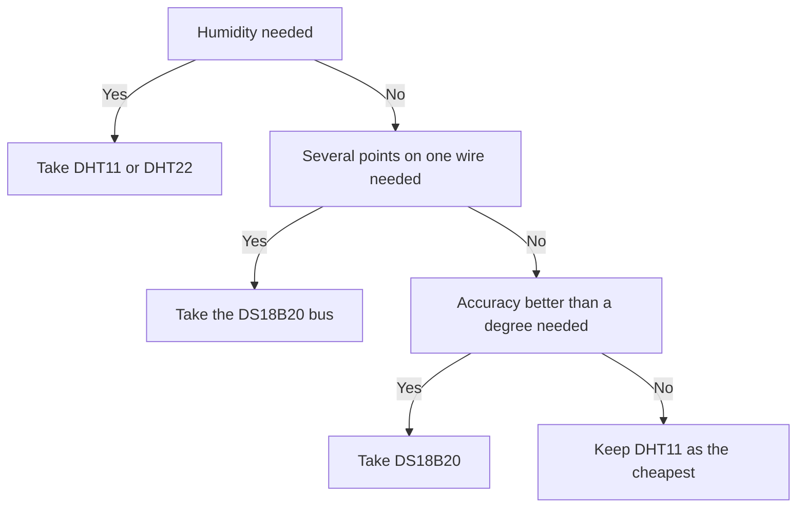

# DHT11 and DS18B20 - Temperature over a Single Wire

![[assets/img/stm32-dht-ds18b20-scheme.png|600]]
*Fig. DHT11 and DS18B20 connection to STM32: data line pull-up and parasitic power option.*

> [!tip] Purpose of this note
> Give a working scheme for reading cheap temperature sensors over a single wire: DHT11 timing, DS18B20 bus commands and ready HAL functions with no external libraries.

## 1. Purpose

DHT11 measures temperature and humidity and returns ready bytes with no calibration on the controller side. DS18B20 measures only temperature but gives an addressed bus, a checksum and a resolution choice. Both sensors connect over a single signal wire, so they suit distributed heat and climate metering nodes in greenhouses, warehouses and living rooms.

A typical bundle looks like this: STM32 polls the sensor once every one or two seconds, checks the checksum and puts the value into the telemetry queue. DHT11 fits where temperature and humidity are needed at once and accuracy is not critical. DS18B20 fits where accuracy, a long line or several measurement points on one bus are needed.

## 2. Sensor comparison

| Parameter | DHT11 | DS18B20 |
| --- | --- | --- |
| What it measures | Temperature and humidity | Only temperature |
| Interface | Proprietary DHT protocol, single wire | Addressed bus, single wire |
| Power supply | 3.0-5.5 V, separate power pin | 3.0-5.5 V or parasitic from the data line |
| Temperature range | 0-50 °C | -55 to +125 °C |
| Temperature accuracy | ±2 °C | ±0.5 °C in the middle of the range |
| Temperature step | 1 °C | 0.0625 °C at 12 bits |
| Humidity | ±5 %, 1 % step | None |
| Single measurement time | About 1 s, do not poll more often | 94-750 ms depending on resolution |
| Addressing | One sensor per line | Up to a hundred sensors on one bus |
| Checksum | Byte sum of the frame | Polynomial code of every block |
| Price | The cheapest | Slightly more expensive but more accurate |

## 3. DHT11 protocol

The controller always starts the exchange. The sequence is: a long low start pulse, a wait pause, the sensor response and 40 data bits. Data goes most significant bit first: humidity integer, humidity fraction, temperature integer, temperature fraction and checksum.

| Phase | Who holds the line | Duration |
| --- | --- | --- |
| Start | Controller pulls down | Minimum 18 ms |
| Pause | Controller releases, pull-up raises | 20-40 us |
| Sensor response | Sensor pulls down, then up | Low 80 us, high 80 ms |
| Bit 0 | Sensor | Low 50 us, high 26-28 us |
| Bit 1 | Sensor | Low 50 us, high about 70 us |
| Frame end | Line free | High level, pause until next start |
| Polling period | Controller waits | No more than once a second |

```text
Лінія даних DHT11, один кадр обміну:
  Хост тримає низький рівень ..... мінімум 18 мс, старт кадру
  Хост відпускає лінію ........... підтяжка піднімає рівень 20-40 мкс
  Датчик відповідає .............. низький 80 мкс, потім високий 80 мкс
  Біт нуль ....................... низький 50 мкс плюс високий 26-28 мкс
  Біт одиниця .................... низький 50 мкс плюс високий близько 70 мкс
  Кінець ......................... лінія у високому рівні, чекати секунду
```

The DHT11 frame checksum equals the sum of the first four bytes truncated to the low byte. If the sum does not match, drop the frame and repeat the request. Repeat after a pause, not at once, because the sensor is busy measuring.

## 4. Microsecond measurements: core counter or timer

The DHT11 protocol tells bits apart by high-level duration, 28 us versus 70 us. A delay function based on the system tick does not fit here because its step is a millisecond. A microsecond count is needed: either the core counter or a plain general-purpose timer.

| Option | How to enable | Accuracy | Note |
| --- | --- | --- | --- |
| Core counter | Enable tracing and start the cycle counter | One core cycle | Works on most series, stalls in debug |
| General-purpose timer | Prescaler for 1 MHz, free channel | 1 us | Stable, independent of the debugger |
| Input pulse capture | Channel in duration measurement mode | 1 us and better | Most accurate bit reading, but more complex |
| Wait loop | Calibrated loop at a known frequency | Approximate | Breaks when clocking changes, fallback only |

```c
#include "stm32f1xx_hal.h"

// Мікросекундна затримка через таймер, налаштований на 1 МГц.
// Приклад: TIM2 з переддільником під частоту шини.
void delay_us_tim(TIM_HandleTypeDef *htim, uint32_t us)
{
    __HAL_TIM_SET_COUNTER(htim, 0);
    HAL_TIM_Base_Start(htim);
    while (__HAL_TIM_GET_COUNTER(htim) < us)
    {
    }
    HAL_TIM_Base_Stop(htim);
}

// Мікросекундна затримка через лічильник тактів ядра.
// Перед першим викликом дозволити трасування.
void dwt_init(void)
{
    CoreDebug->DEMCR |= CoreDebug_DEMCR_TRCENA_Msk;
    DWT->CYCCNT = 0;
    DWT->CTRL |= DWT_CTRL_CYCCNTENA_Msk;
}

void delay_us_dwt(uint32_t us, uint32_t hclk_hz)
{
    uint32_t start = DWT->CYCCNT;
    uint32_t ticks = (hclk_hz / 1000000UL) * us;
    while ((DWT->CYCCNT - start) < ticks)
    {
    }
}
```

## 5. Reading DHT11 through HAL

The STM32 pin plays two roles: first an output for the start pulse, then an input for receiving bits. Mode switching is done by re-initializing the pin structure. The pull-up is enabled either with an external 4.7 kOhm resistor or the internal pull-up of the controller.

```c
#include "stm32f1xx_hal.h"

#define DHT_PORT GPIOA
#define DHT_PIN  GPIO_PIN_0

static void dht_pin_output(void)
{
    GPIO_InitTypeDef g = {0};
    g.Pin = DHT_PIN;
    g.Mode = GPIO_MODE_OUTPUT_PP;
    g.Speed = GPIO_SPEED_FREQ_HIGH;
    HAL_GPIO_Init(DHT_PORT, &g);
}

static void dht_pin_input(void)
{
    GPIO_InitTypeDef g = {0};
    g.Pin = DHT_PIN;
    g.Mode = GPIO_MODE_INPUT;
    g.Pull = GPIO_PULLUP;
    HAL_GPIO_Init(DHT_PORT, &g);
}

// Очікування рівня на лінії з таймаутом у мікросекундах.
// Повертає тривалість утримання рівня або нуль при таймауті.
static uint32_t dht_wait_level(TIM_HandleTypeDef *htim, GPIO_PinState level, uint32_t timeout_us)
{
    __HAL_TIM_SET_COUNTER(htim, 0);
    HAL_TIM_Base_Start(htim);
    while (HAL_GPIO_ReadPin(DHT_PORT, DHT_PIN) != level)
    {
        if (__HAL_TIM_GET_COUNTER(htim) > timeout_us)
        {
            HAL_TIM_Base_Stop(htim);
            return 0;
        }
    }
    uint32_t t0 = __HAL_TIM_GET_COUNTER(htim);
    while (HAL_GPIO_ReadPin(DHT_PORT, DHT_PIN) == level)
    {
        if ((__HAL_TIM_GET_COUNTER(htim) - t0) > timeout_us)
        {
            HAL_TIM_Base_Stop(htim);
            return 0;
        }
    }
    uint32_t dur = __HAL_TIM_GET_COUNTER(htim) - t0;
    HAL_TIM_Base_Stop(htim);
    return dur;
}

// Читання кадру DHT11. Повертає нуль при успіху.
// rh і temp — цілі частини вологості і температури.
int dht11_read(TIM_HandleTypeDef *htim, uint8_t *rh, uint8_t *temp)
{
    uint8_t data[5] = {0};

    dht_pin_output();
    HAL_GPIO_WritePin(DHT_PORT, DHT_PIN, GPIO_PIN_RESET);
    HAL_Delay(20);
    HAL_GPIO_WritePin(DHT_PORT, DHT_PIN, GPIO_PIN_SET);
    dht_pin_input();
    delay_us_tim(htim, 40);

    if (dht_wait_level(htim, GPIO_PIN_RESET, 120) == 0) return -1;
    if (dht_wait_level(htim, GPIO_PIN_SET, 120) == 0) return -1;

    for (int i = 0; i < 40; i++)
    {
        if (dht_wait_level(htim, GPIO_PIN_RESET, 100) == 0) return -2;
        uint32_t high = dht_wait_level(htim, GPIO_PIN_SET, 120);
        if (high == 0) return -3;
        data[i / 8] <<= 1;
        if (high > 40) data[i / 8] |= 1; // довгий високий рівень = одиниця
    }

    uint8_t sum = data[0] + data[1] + data[2] + data[3];
    if (sum != data[4]) return -4; // контрольна сума не збіглася

    *rh = data[0];
    *temp = data[2];
    return 0;
}
```

## 6. DS18B20 bus: reset and ROM commands

The DS18B20 bus can hold many sensors on one wire because every chip has a unique 64-bit number. The exchange starts with a reset: the controller pulls the line down for 480 us, releases it and waits for the presence pulse from the sensors. Next comes the addressee select command, then the function command.

| Command | Code | When to apply |
| --- | --- | --- |
| Number search | 0xF0 | First start, building the sensor list on the bus |
| Number reading | 0x33 | One sensor on the bus, learn its number |
| Select by number | 0x55 | Several sensors, access to a specific one |
| Skip select | 0xCC | One sensor or a command to all at once |
| Alarm search | 0xEC | Find sensors outside thresholds |
| Measurement start | 0x44 | Conversion start in selected sensors |
| Buffer reading | 0xBE | Take temperature and service bytes |
| Threshold write | 0x4E | Configure alarm thresholds and resolution |

Number search runs a special loop reading bit pairs and resolving collisions. For a single sensor on the bus the skip-select command is enough: reset, skip code, measurement start code, pause, reset, skip code, buffer read code.

```text
Обмін з одним DS18B20 через пропуск вибору:
  Скидання 480 мкс, імпульс присутності 60-240 мкс
  Байт 0xCC, пропуск вибору адресата
  Байт 0x44, старт конверсії температури
  Пауза за таблицею роздільності, до 750 мкс на 12 біт
  Скидання, імпульс присутності
  Байт 0xCC, пропуск вибору адресата
  Байт 0xBE, читання девʼяти байтів буфера
```

## 7. DS18B20 buffer and cyclic code

The sensor buffer holds nine bytes: temperature low and high bytes, alarm thresholds, configuration byte, three reserved bytes, remainder counter and cyclic code. Temperature is stored in two's complement, least significant bit first. The configuration byte sets 9-12 bit resolution.

| Byte | Purpose | Note |
| --- | --- | --- |
| 0 | Temperature, low byte | Low bits depend on resolution |
| 1 | Temperature, high byte | Sign in high bits of two's complement |
| 2 | High alarm threshold | Stored in independent memory |
| 3 | Low alarm threshold | Stored in independent memory |
| 4 | Configuration | Resolution bits for 9-12 bits |
| 5 | Reserved | Not used |
| 6 | Reserved | Not used |
| 7 | Remainder counter | For precise fraction completion |
| 8 | Cyclic code | Polynomial, zero start value |

```c
#include <stdint.h>

// Циклічний код шини, поліном x^8 + x^5 + x^4 + 1.
// Рахується по перших восьми байтах буфера.
uint8_t ds_crc8(const uint8_t *buf, int len)
{
    uint8_t crc = 0;
    for (int i = 0; i < len; i++)
    {
        crc ^= buf[i];
        for (int b = 0; b < 8; b++)
        {
            if (crc & 0x01) crc = (crc >> 1) ^ 0x8C;
            else crc >>= 1;
        }
    }
    return crc;
}

// Перетворення сирого коду у соті частки градуса.
// Працює для будь-якої роздільності, бо молодші біти вже нульові.
int32_t ds_raw_to_centi(int16_t raw)
{
    // raw у шістнадцятих частках градуса: 1 = 0.0625 C.
    // Множимо на 6.25 через цілочисельну формулу: raw * 25 / 4.
    return ((int32_t)raw * 25) / 4;
}
```

## 8. Resolution and conversion time

| Resolution | Step | Conversion time | Configuration byte |
| --- | --- | --- | --- |
| 9 bits | 0.5 °C | 94 ms | 0x1F |
| 10 bits | 0.25 °C | 188 ms | 0x3F |
| 11 bits | 0.125 °C | 375 ms | 0x5F |
| 12 bits | 0.0625 °C | 750 ms | 0x7F |

Default resolution is 12 bits. Lowering resolution halves conversion time and consumption on parasitic power. For a room thermostat 10-11 bits is enough because a hundredth of a degree drowns in mounting noise. For calibration and lab measurements keep 12 bits and average several frames.

## 9. Parasitic power

| Question | Regular power | Parasitic power |
| --- | --- | --- |
| Busy wires | Three: power, ground, data | Two: ground and data |
| Chip power pin | On the power rail through a capacitor | On ground |
| Capacitor | 100 nF near the chip desired | 100 nF near the chip mandatory |
| Data pull-up | 4.7 kOhm to power | 4.7 kOhm, 2.2 kOhm on a long line |
| Strong pull-up | Not needed | Transistor for conversion and memory write time |
| Check command | Not needed | 0xB4 reports who sits on parasitic |
| Long line | Up to a hundred meters with correct topology | Shorter spans, else code errors |

```text
Паразитне живлення одним поглядом:
  Земля спільна для контролера і всіх датчиків
  Дані через підтяжку 4.7 кОм до живлення контролера
  Пін живлення кожного DS18B20 на землі
  Конденсатор 100 нФ між даними і землею біля чипа
  На час конверсії вмикати сильну підтяжку транзистором
```

## 10. Reading DS18B20 through HAL

Read and write slots last about 60 us. Writing zero is a long low level, writing one is a short pulse with release. Reading is a short controller start pulse, then level sampling inside the window. All pauses use the microsecond timer from the measurement section.

```c
#include "stm32f1xx_hal.h"

#define OW_PORT GPIOA
#define OW_PIN  GPIO_PIN_1

extern TIM_HandleTypeDef htim2; // таймер на 1 МГц

static void ow_output(void)
{
    GPIO_InitTypeDef g = {0};
    g.Pin = OW_PIN;
    g.Mode = GPIO_MODE_OUTPUT_OD;
    g.Speed = GPIO_SPEED_FREQ_HIGH;
    HAL_GPIO_Init(OW_PORT, &g);
}

static void ow_input(void)
{
    GPIO_InitTypeDef g = {0};
    g.Pin = OW_PIN;
    g.Mode = GPIO_MODE_INPUT;
    g.Pull = GPIO_PULLUP;
    HAL_GPIO_Init(OW_PORT, &g);
}

static void ow_low(void)
{
    ow_output();
    HAL_GPIO_WritePin(OW_PORT, OW_PIN, GPIO_PIN_RESET);
}

static void ow_release(void)
{
    ow_input(); // відкритий стік відпускає, підтяжка піднімає лінію
}

// Скидання шини. Повертає одиницю, якщо датчик відповів присутністю.
int ow_reset(void)
{
    ow_low();
    delay_us_tim(&htim2, 480);
    ow_release();
    delay_us_tim(&htim2, 70);
    int presence = (HAL_GPIO_ReadPin(OW_PORT, OW_PIN) == GPIO_PIN_RESET);
    delay_us_tim(&htim2, 410);
    return presence;
}

void ow_write_bit(int bit)
{
    ow_low();
    if (bit)
    {
        delay_us_tim(&htim2, 6);
        ow_release();
        delay_us_tim(&htim2, 64);
    }
    else
    {
        delay_us_tim(&htim2, 60);
        ow_release();
        delay_us_tim(&htim2, 10);
    }
}

int ow_read_bit(void)
{
    ow_low();
    delay_us_tim(&htim2, 6);
    ow_release();
    delay_us_tim(&htim2, 9);
    int bit = (HAL_GPIO_ReadPin(OW_PORT, OW_PIN) == GPIO_PIN_SET);
    delay_us_tim(&htim2, 55);
    return bit;
}

void ow_write_byte(uint8_t b)
{
    for (int i = 0; i < 8; i++)
    {
        ow_write_bit(b & 0x01);
        b >>= 1;
    }
}

uint8_t ow_read_byte(void)
{
    uint8_t b = 0;
    for (int i = 0; i < 8; i++)
    {
        if (ow_read_bit()) b |= (1u << i);
    }
    return b;
}

// Читання температури одним датчиком, соті частки градуса.
// Повертає нуль при успіху, відʼємне — код помилки.
int ds18b20_read_centi(int32_t *out)
{
    uint8_t buf[9];
    if (!ow_reset()) return -1;
    ow_write_byte(0xCC); // пропуск вибору
    ow_write_byte(0x44); // старт конверсії
    HAL_Delay(750);       // чекати за таблицею роздільності
    if (!ow_reset()) return -2;
    ow_write_byte(0xCC);
    ow_write_byte(0xBE); // читання буфера
    for (int i = 0; i < 9; i++) buf[i] = ow_read_byte();
    if (ds_crc8(buf, 8) != buf[8]) return -3;
    int16_t raw = (int16_t)((buf[1] << 8) | buf[0]);
    *out = ds_raw_to_centi(raw);
    return 0;
}
```

## 11. Accuracy and price: what to choose

| Task | Recommendation | Why |
| --- | --- | --- |
| Room temperature and humidity display | DHT11 or newer DHT22 | Cheap, two quantities from one package |
| Thermostat with 1 °C hysteresis | DS18B20, 10 bits | Accuracy better than the regulation step |
| Outdoor station | DS18B20 in a sleeve | Wide range, long line |
| Several points on one cable | DS18B20 bus with number search | One wire for all rooms |
| Board calibration | DS18B20, 12 bits, averaging | A hundredth of a degree with no low-bit noise |
| Heat metering | DS18B20 in supply and return pairs | Matched pair characteristic after calibration |

## Mermaid: sensor choice



## Common issues

| # | Issue | Why it hurts | Fix |
| --- | --- | --- | --- |
| 1 | Polling DHT11 every 100 ms | Sensor has no time to measure, returns stale frames | Pause at least a second between starts |
| 2 | System tick delays for bits | Millisecond step cannot tell 28 from 70 us | Microsecond timer or core counter |
| 3 | Pin left as output after start | Controller and sensor pull the line at once | Switch pin to input with pull-up |
| 4 | No external 4.7 kOhm pull-up | Edges stretch, bits read at random | Place resistor near the sensor |
| 5 | Ignored checksum | Broken frames reach statistics and regulation | Drop frame and repeat after a pause |
| 6 | Parasitic power with no strong pull-up | Conversion aborts, code mismatches | Strong pull-up transistor for conversion time |

## Official sources

- [DS18B20 datasheet (Analog Devices, formerly Maxim)](https://www.analog.com/en/products/ds18b20.html) - buffer, bus commands, slot timing.
- [DHT11 datasheet (Adafruit mirror of Aosong)](https://cdn-shop.adafruit.com/datasheets/DHT11-chinese.pdf) - start pulse, 40-bit format, polling period.
- [1-Wire search algorithm (Analog Devices app note)](https://www.analog.com/en/resources/app-notes/1wire-search-algorithm.html) - number search and collision resolution.

## See also

- [[Home.en]]
- [[EN/03-GPIO/01-GPIO-Modes.en|GPIO modes]]
- [[EN/07-Timers/01-GPTIM-ADTIM.en|timers and PWM]]
- [[EN/10-Sensors/02-BME280-SHT3x.en|climate over I2C]]
- [[EN/10-Sensors/03-MPU6050-IMU.en|motion and orientation]]
