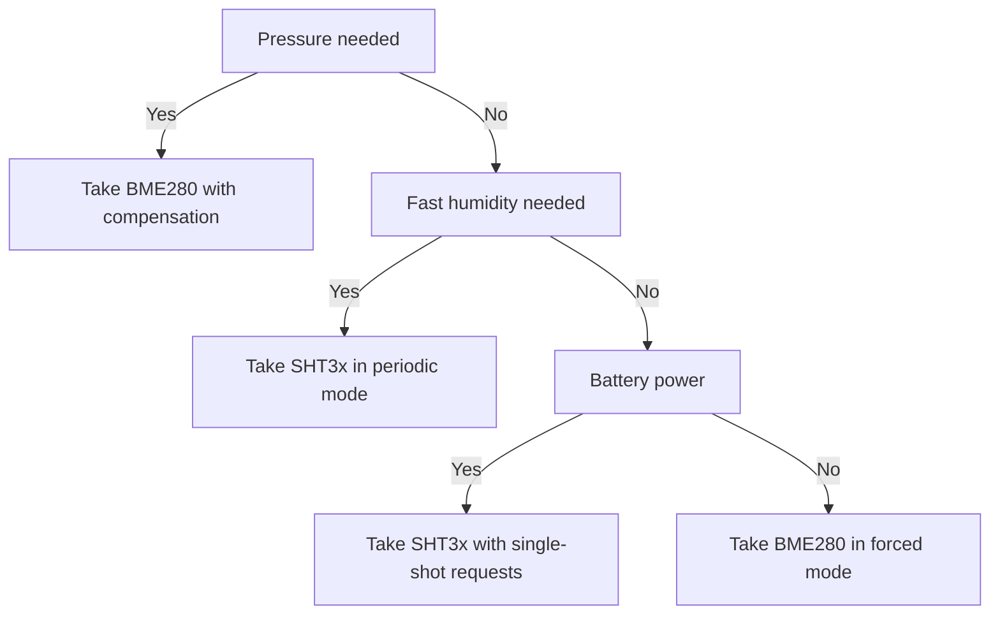

# BME280 and SHT3x - Climate over I2C

![[assets/img/stm32-bme-sht-scheme.png|600]]
*Fig. BME280 and SHT3x connection to STM32 over the I2C bus with pull-ups and address select.*

> [!tip] Purpose of this note
> Give the full work cycle with climate sensors on the bus: reading calibration coefficients, configuring modes, compensating raw codes and ready HAL functions.

## 1. Purpose

BME280 measures temperature, humidity and pressure with one chip and returns altitude above sea level after conversion. SHT3x measures temperature and humidity with factory calibration and a cyclic code on every result. Both sensors work over a two-wire bus, so they easily share the bus with a display, a clock and memory.

BME280 fits weather stations where pressure and altitude are needed. SHT3x fits room humidity regulators where humidity accuracy and fast response matter. Both sensors run from 1.8-3.6 V, so on a board with 5 V power a regulator is needed, or power from a controller output.

## 2. Register maps

| BME280 block | Addresses | Purpose |
| --- | --- | --- |
| Chip identifier | 0xD0 | Must read as 0x60, link check |
| Reset | 0xE0 | Writing the reset code restarts the logic |
| Temperature and pressure calibration | 0x88-0xA1 | First block of coefficients |
| Humidity calibration | 0xE1-0xE7 | Second block of coefficients |
| Humidity control | 0xF2 | Humidity oversampling |
| Status | 0xF3 | Measurement and data copy flags |
| Measurement control | 0xF4 | Temperature and pressure oversampling plus mode |
| Configuration | 0xF5 | Filter, standby time, interface |
| Pressure data | 0xF7-0xF9 | Raw pressure code, most significant bit first |
| Temperature data | 0xFA-0xFC | Raw temperature code |
| Humidity data | 0xFD-0xFE | Raw humidity code |

| SHT3x command | Code | Purpose |
| --- | --- | --- |
| Single-shot, high accuracy | 0x2C06 | Standard request for a room regulator |
| Single-shot, medium accuracy | 0x2C0D | Faster, lower consumption |
| Single-shot, low accuracy | 0x2C10 | Fastest, for rough estimates |
| Periodic measurement | 0x2130 and neighbors | Sensor measures alone at a set rate |
| Result reading | 0xE000 | Taking periodic mode data |
| Restart | 0x30A2 | Software sensor reset |
| Heater | 0x306D | Enabling the built-in heater for drying |
| Status | 0xF32D | State and checksum flags |

## 3. Bus exchange through HAL

| Operation | HAL function | Note |
| --- | --- | --- |
| BME280 register write | Memory write by address | Chip address, register address, data bytes |
| BME280 register reading | Memory read by address | One call reads the whole calibration block |
| SHT3x command | Two command bytes write | No register address, only command code |
| SHT3x result reading | Six bytes receive | Two temperature bytes, code, two humidity bytes, code |
| Ready check | Status polling | BME280 reports measurement end with a flag |
| Bus timeout | Call parameter | 100 ms is enough for all note operations |

```text
Підключення кліматичних датчиків до шини:
  Лінія тактів через підтяжку 4.7 кОм до живлення 3.3 В
  Лінія даних через підтяжку 4.7 кОм до живлення 3.3 В
  Адреса BME280 вибирається рівнем виводу вибору адреси
  Адреса SHT3x вибирається рівнем виводу вибору адреси
  Конденсатор 100 нФ біля кожного корпусу датчика
  Довжина шлейфа до метра без зниження швидкості шини
```

## 4. Calibration coefficients from memory

The main BME280 trait is that raw codes mean nothing without compensation. Every chip carries its own coefficient set written at the factory into independent memory. The driver reads these coefficients once after reset and keeps them in a state structure. Take compensation formulas from the vendor reference with no simplifications, because simplifications give degree-scale errors.

| Coefficient | Registers | Type | For what |
| --- | --- | --- | --- |
| First temperature | 0x88-0x89 | Unsigned | Temperature base point |
| Second temperature | 0x8A-0x8B | Signed | Characteristic slope |
| Third temperature | 0x8C-0x8D | Signed | Characteristic curvature |
| Pressure first-third | 0x8E-0x93 | Mixed | Pressure base point |
| Pressure fourth-eighth | 0x94-0x9F | Mixed | Pressure slope and curvature |
| Humidity first | 0xA1 | Unsigned | Humidity base point |
| Humidity second-third | 0xE1-0xE3 | Mixed | Humidity slope |
| Humidity fourth-sixth | 0xE4-0xE7 | Mixed | Curvature and offset |

```c
#include "stm32f1xx_hal.h"

#define BME_ADDR (0x76 << 1) // адреса залежить від виводу вибору, буває 0x77

typedef struct
{
    uint16_t t1;
    int16_t t2, t3;
    uint16_t p1;
    int16_t p2, p3, p4, p5, p6, p7, p8, p9;
    uint8_t h1, h3;
    int16_t h2, h4, h5, h6;
    int32_t t_fine; // проміжна величина формул виробника
} bme_calib_t;

// Читання всього блоку калібрування одним пакетом шини.
int bme_read_calib(I2C_HandleTypeDef *hi2c, bme_calib_t *c)
{
    uint8_t b1[26];
    uint8_t b2[8];
    uint8_t h1;
    if (HAL_I2C_Mem_Read(hi2c, BME_ADDR, 0x88, 1, b1, 26, 100) != HAL_OK) return -1;
    if (HAL_I2C_Mem_Read(hi2c, BME_ADDR, 0xE1, 1, b2, 8, 100) != HAL_OK) return -2;
    if (HAL_I2C_Mem_Read(hi2c, BME_ADDR, 0xA1, 1, &h1, 1, 100) != HAL_OK) return -3;

    c->t1 = (uint16_t)(b1[1] << 8 | b1[0]);
    c->t2 = (int16_t)(b1[3] << 8 | b1[2]);
    c->t3 = (int16_t)(b1[5] << 8 | b1[4]);
    c->p1 = (uint16_t)(b1[7] << 8 | b1[6]);
    c->p2 = (int16_t)(b1[9] << 8 | b1[8]);
    c->p3 = (int16_t)(b1[11] << 8 | b1[10]);
    c->p4 = (int16_t)(b1[13] << 8 | b1[12]);
    c->p5 = (int16_t)(b1[15] << 8 | b1[14]);
    c->p6 = (int16_t)(b1[17] << 8 | b1[16]);
    c->p7 = (int16_t)(b1[19] << 8 | b1[18]);
    c->p8 = (int16_t)(b1[21] << 8 | b1[20]);
    c->p9 = (int16_t)(b1[23] << 8 | b1[22]);
    c->h1 = h1;
    c->h2 = (int16_t)(b2[1] << 8 | b2[0]);
    c->h3 = b2[2];
    c->h4 = (int16_t)((b2[3] << 4) | (b2[4] & 0x0F));
    c->h5 = (int16_t)((b2[5] << 4) | (b2[4] >> 4));
    c->h6 = (int8_t)b2[6];
    return 0;
}

// Компенсація температури за формулою виробника, соті частки градуса.
int32_t bme_comp_temp(bme_calib_t *c, int32_t adc)
{
    int32_t v1 = ((((adc >> 3) - ((int32_t)c->t1 << 1))) * c->t2) >> 11;
    int32_t v2 = (((((adc >> 4) - c->t1) * ((adc >> 4) - c->t1)) >> 12) * c->t3) >> 14;
    c->t_fine = v1 + v2;
    return (c->t_fine * 5 + 128) >> 8;
}
```

## 5. Forced and normal modes

| Mode | How it works | When to take |
| --- | --- | --- |
| Sleep | Measurements stopped, microamp consumption | Battery power between measurements |
| Forced | One measurement on request, then sleep | Weather station once a minute |
| Normal | Cyclic measurements with a pause | Room regulator with frequent updates |

In forced mode the controller writes settings and mode, waits per the timing table and reads the data block. In normal mode the sensor measures alone, and the controller takes ready data on the ready interrupt or by polling status. Write order matters: first the humidity register, then the measurement register, because humidity latches together with the start.

## 6. Oversampling

| Setting | Factor | Effect |
| --- | --- | --- |
| Skip | 0 | Channel off, faster and lower consumption |
| Single | 1 | Base accuracy with no averaging |
| Double | 2 | Less temperature noise |
| Quadruple | 4 | Standard for outdoor stations |
| Eightfold | 8 | Quiet indoor humidity |
| Sixteenfold | 16 | Maximum pressure averaging |

A low-pass filter smooths pressure jumps from drafts and doors. The standby time between measurements in normal mode is picked so the sensor can fall asleep: too short a period keeps the chip active and heats the die with its own warmth. Self-heating gives errors up to a degree, so for accurate measurements take forced mode with pauses.

## 7. BME280 versus BMP280

| Question | BMP280 | BME280 |
| --- | --- | --- |
| Temperature | Yes | Yes |
| Pressure | Yes | Yes |
| Humidity | None | Yes, separate channel |
| Identifier | 0x58 | 0x60 |
| Humidity calibration | Missing | Second coefficient block |
| Price | Cheaper | More expensive by the humidity channel |
| When to take | Pressure and altitude only | Full weather station with one chip |

The compatibility trap is that the register maps look alike, and a BMP280 driver partly reads a BME280. Without the second calibration block humidity comes out as garbage and pressure shifts. Checking the identifier after reset filters out mixed-up packages at start time.

## 8. SHT3x: single-shot and periodic modes

| SHT3x mode | Command | Rate | When to take |
| --- | --- | --- | --- |
| Single-shot accurate | 0x2C06 | On request | Rare battery-powered measurements |
| Single-shot medium | 0x2C0D | On request | Speed and accuracy balance |
| Single-shot fast | 0x2C10 | On request | Rough humidity supervision |
| Periodic slow | 0x20xx series | Once a second and slower | Climate logger |
| Periodic fast | 0x27xx series | Up to 10 times a second | Regulator with a fast loop |

Periodic mode is handy because the sensor keeps the pace alone while the controller sleeps between data takes. Every result byte pair carries its own cyclic code, so broken frames are filtered before conversion into physical values. The heater is turned on briefly for drying after condensate, not kept on permanently.

```c
#include "stm32f1xx_hal.h"

#define SHT_ADDR (0x44 << 1) // адреса залежить від виводу вибору

// Циклічний код результату SHT3x, поліном x^8 + x^5 + x^4 + 1, старт 0xFF.
static uint8_t sht_crc(const uint8_t *d)
{
    uint8_t crc = 0xFF;
    for (int i = 0; i < 2; i++)
    {
        crc ^= d[i];
        for (int b = 0; b < 8; b++)
            crc = (crc & 0x80) ? (crc << 1) ^ 0x31 : (crc << 1);
    }
    return crc;
}

// Одноразовий вимір SHT3x. Повертає нуль при успіху.
// temp_c — соті частки градуса, rh_p/mille — тисячні частки відсотка.
int sht_single(I2C_HandleTypeDef *hi2c, int32_t *temp_centi, int32_t *rh_mille)
{
    uint8_t cmd[2] = {0x2C, 0x06};
    uint8_t rx[6];
    if (HAL_I2C_Master_Transmit(hi2c, SHT_ADDR, cmd, 2, 100) != HAL_OK) return -1;
    HAL_Delay(20);
    if (HAL_I2C_Master_Receive(hi2c, SHT_ADDR, rx, 6, 100) != HAL_OK) return -2;
    if (sht_crc(&rx[0]) != rx[2]) return -3;
    if (sht_crc(&rx[3]) != rx[5]) return -4;
    uint16_t t = (uint16_t)(rx[0] << 8 | rx[1]);
    uint16_t h = (uint16_t)(rx[3] << 8 | rx[4]);
    *temp_centi = ((int32_t)t * 17500) / 65535 - 4500;
    *rh_mille = ((int32_t)h * 100000) / 65535;
    return 0;
}
```

## 9. Altitude from pressure

| Step | Action | Note |
| --- | --- | --- |
| 1 | Measure pressure in hectopascals | Compensated with the vendor formula |
| 2 | Take sea-level reference pressure | From a local weather station or calibration |
| 3 | Apply the barometric formula | 0.19 exponent for the troposphere |
| 4 | Smooth with a filter | Pressure is noisy from wind and doors |

```text
Барометрична формула одним поглядом:
  Відношення тисків у ступені дає частку висоти
  Множник 44330 переводить частку у метри
  Опорний тиск оновлювати щодня, бо погода пливе
  Точність метри, а не сантиметри, без диференціального калібрування
```

## 10. BME280 driver: init and loop

```c
#include "stm32f1xx_hal.h"

// Налаштування forced-виміру: вологість, потім вимір.
int bme_start_forced(I2C_HandleTypeDef *hi2c)
{
    uint8_t hum = 0x01;   // передискретизація вологості
    uint8_t meas = 0x27;  // тиск і температура, режим forced
    uint8_t cfg = 0x00;   // фільтр вимкнено для одиничних вимірів
    if (HAL_I2C_Mem_Write(hi2c, BME_ADDR, 0xF2, 1, &hum, 1, 100) != HAL_OK) return -1;
    if (HAL_I2C_Mem_Write(hi2c, BME_ADDR, 0xF5, 1, &cfg, 1, 100) != HAL_OK) return -2;
    if (HAL_I2C_Mem_Write(hi2c, BME_ADDR, 0xF4, 1, &meas, 1, 100) != HAL_OK) return -3;
    return 0;
}

// Очікування готовності за прапорцем статусу.
int bme_wait_ready(I2C_HandleTypeDef *hi2c)
{
    uint8_t st;
    for (int i = 0; i < 50; i++)
    {
        if (HAL_I2C_Mem_Read(hi2c, BME_ADDR, 0xF3, 1, &st, 1, 100) != HAL_OK) return -1;
        if ((st & 0x08) == 0) return 0; // вимір завершено
        HAL_Delay(10);
    }
    return -2;
}

// Читання сирих кодів тиску, температури і вологості.
int bme_read_raw(I2C_HandleTypeDef *hi2c, int32_t *p, int32_t *t, int32_t *h)
{
    uint8_t d[8];
    if (HAL_I2C_Mem_Read(hi2c, BME_ADDR, 0xF7, 1, d, 8, 100) != HAL_OK) return -1;
    *p = ((int32_t)d[0] << 12) | ((int32_t)d[1] << 4) | (d[2] >> 4);
    *t = ((int32_t)d[3] << 12) | ((int32_t)d[4] << 4) | (d[5] >> 4);
    *h = ((int32_t)d[6] << 8) | d[7];
    return 0;
}
```

## Mermaid: climate sensor choice



## Common issues

| # | Issue | Why it hurts | Fix |
| --- | --- | --- | --- |
| 1 | Raw codes with no compensation | Values carry no physical meaning | Read coefficients and apply vendor formulas |
| 2 | Measurement register write before humidity | Humidity latches stale | Humidity register first, then measurement register |
| 3 | Ignored chip identifier | BMP280 masquerades as BME280 | Check chip code after reset |
| 4 | Skipped SHT3x cyclic code | Broken frames spoil statistics | Check code of every byte pair |
| 5 | Frequent measurements with no pauses | Die self-heating up to a degree | Forced mode with pauses, or slow periodic |
| 6 | Bus pull-ups to 5 V | Sensor input supply exceeded | Pull-ups to 3.3 V only, level matching |

## Official sources

- [BME280 datasheet (Bosch Sensortec)](https://www.bosch-sensortec.com/products/environmental-sensors/humidity-sensors-bme280/) - register maps, compensation formulas, modes.
- [SHT3x datasheet (Sensirion)](https://sensirion.com/products/catalog/SHT30-DIS-B) - measurement commands, cyclic code, periodic mode.
- [BME280 driver (Bosch Sensortec software)](https://github.com/bosch-sensortec/BME280_driver) - reference compensation formulas for checking your code.

## See also

- [[Home.en]]
- [[EN/04-Interfaces/03-I2C.en|I2C bus]]
- [[EN/10-Sensors/01-DHT11-DS18B20.en|temperature over a single wire]]
- [[EN/10-Sensors/03-MPU6050-IMU.en|motion and orientation]]
