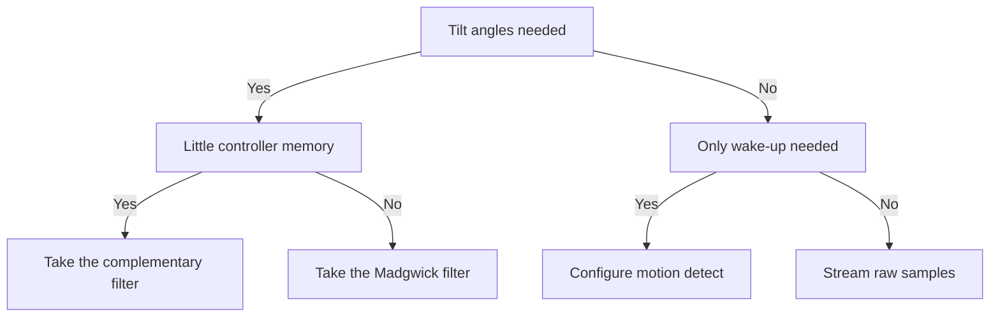

# MPU6050 and IMU - Motion and Orientation

![[assets/img/stm32-mpu-imu-scheme.png|600]]
*Fig. MPU6050 connection to STM32 over the I2C bus with data-ready interrupt and power decoupling.*

> [!tip] Purpose of this note
> Give a working scheme for an inertial node: MPU6050 init, zero-offset calibration, kilohertz-rate reading and orientation computation on the controller.

## 1. Purpose

The accelerometer measures acceleration together with gravity, so at rest it shows the vertical. The gyroscope measures angular speed of rotation around three axes. Together the pair gives the full motion picture: the accelerometer holds the long-term vertical, the gyroscope precisely tracks fast turns. MPU6050 keeps both sensors in one package with a digital bus output.

Typical use: platform stabilization, balance control, fall detect and wake-up on motion. STM32 polls the sensor at hundreds of hertz or kilohertz, calibrates zero offset and computes tilt angles with a filter. For flight controllers take higher rates and a hardware stream through direct memory access.

## 2. Motion measurement node parts

| Block | What it does | Note |
| --- | --- | --- |
| Accelerometer | Three acceleration axes with gravity | At rest the vector magnitude equals one |
| Gyroscope | Three angular speed axes | Zero drifts, calibration needed |
| Temperature sensor | Die temperature | Zero drift compensation |
| Interrupt logic | Data ready, motion, fall | Wakes the controller with no polling |
| Auxiliary bus | Magnetometer connection | Extension to nine axes |
| Queue buffer | Batched sample reading | Fewer bus transactions |

## 3. Scales and sensitivity

| Accelerometer scale | Sensitivity | When to take |
| --- | --- | --- |
| 2 g | 16384 units per g | Tilt meter, slow motion, maximum accuracy |
| 4 g | 8192 units per g | Manual control, sharp motion |
| 8 g | 4096 units per g | Vibration, medium impacts |
| 16 g | 2048 units per g | Falls, collisions, sports projectiles |

| Gyroscope scale | Sensitivity | When to take |
| --- | --- | --- |
| 250 degrees per second | 131 units per degree | Smooth platform turns |
| 500 degrees per second | 65.5 units per degree | Manual manipulators |
| 1000 degrees per second | 32.8 units per degree | Fast turnarounds |
| 2000 degrees per second | 16.4 units per degree | Free fall with rotation |

Read sensitivity from the reference and keep it in driver constants. Scale switching changes only the conversion factor, raw codes stay signed integers. A narrow scale gives a more accurate tilt at rest, a wide scale does not clip peaks on impacts.

```text
Вибір шкали одним поглядом:
  Нахил у спокої ................ акселерометр 2 g, гіроскоп 250
  Ручне керування ............... акселерометр 4 g, гіроскоп 500
  Вібрація і стрибки ............ акселерометр 8 g, гіроскоп 1000
  Падіння і удари ............... акселерометр 16 g, гіроскоп 2000
  Після зміни шкали перерахувати коефіцієнти у драйвері
```

## 4. MPU6050 register map

| Register | Address | Purpose |
| --- | --- | --- |
| Identifier | 0x75 | Must read as 0x68, link check |
| Power control | 0x6B | Sleep exit, clock source select |
| Filter configuration | 0x1A | Digital low-pass filter band |
| Sample rate | 0x19 | Internal cycle frequency divider |
| Gyroscope configuration | 0x1B | Angular speed scale |
| Accelerometer configuration | 0x1C | Acceleration scale |
| Interrupt enable | 0x38 | Data ready, motion, fall |
| Interrupt status | 0x3A | Event flags for the handler |
| Accelerometer data | 0x3B-0x40 | Three axes, most significant byte first |
| Temperature | 0x41-0x42 | Die temperature |
| Gyroscope data | 0x43-0x48 | Three axes, most significant byte first |
| Per-axis power control | 0x6C | Disabling unneeded channels |

## 5. Zero-offset calibration

| Step | Action | Note |
| --- | --- | --- |
| 1 | Lay the board still and horizontal | Any vibration spoils calibration |
| 2 | Collect a hundred samples per channel | Averaging removes noise |
| 3 | Compute the gyroscope mean | That is each axis zero offset |
| 4 | Compute the accelerometer mean | Vertical axis must show one |
| 5 | Write offsets into the state structure | Subtract from every new sample |
| 6 | Check the vector magnitude | At rest it must equal one |

Repeat calibration after power changes and on visible temperature shifts. The gyroscope zero offset drifts with die warmth, so precise stabilization nodes calibrate periodically in work pauses. Calibrate the accelerometer less often because its zero is steadier than the gyroscope zero.

## 6. Orientation filters: sensor processor or controller

| Option | Where computed | Pros | Cons |
| --- | --- | --- | --- |
| Built-in motion processor | Inside the sensor | Ready angles, controller free | Closed logic, complex firmware |
| Complementary filter | On the controller | A dozen code lines, predictable | One factor for all modes |
| Madgwick filter | On the controller | Fast convergence, little memory | Gain tuning needed |
| Kalman filter | On the controller | Best under noise | Heavier for a CPU with no floating point |

The complementary filter merges the fast gyroscope and the slow accelerometer with one equation: the angle equals the sum of the integrated gyroscope with weight and the accelerometer angle with small weight. A factor near 0.98 gives a smooth tilt with no jerks. The Madgwick filter holds fast turnarounds better, so take it for manual control.

```c
#include <math.h>

// Комплементарний фільтр одного кута.
// angle — поточна оцінка, gyro_rate — градуси на секунду,
// acc_angle — кут з акселерометра, dt — період у секундах.
float compl_angle(float angle, float gyro_rate, float acc_angle, float dt)
{
    const float alpha = 0.98f;
    float gyro_part = angle + gyro_rate * dt;
    return alpha * gyro_part + (1.0f - alpha) * acc_angle;
}

// Кут нахилу з акселерометра, градуси.
// ax, ay, az — прискорення в одиницях сили тяжіння.
float acc_pitch(float ax, float ay, float az)
{
    return atan2f(-ax, sqrtf(ay * ay + az * az)) * 57.2958f;
}

float acc_roll(float ay, float az)
{
    return atan2f(ay, az) * 57.2958f;
}
```

## 7. 1 kHz polling: timer and direct memory access

| Element | Setting | Note |
| --- | --- | --- |
| Timer | 1 kHz interrupt | Stable sample period |
| Bus | 400 kHz speed | Gets 14 bytes per period |
| Direct access | Receive into a ring buffer | CPU waits for no byte |
| Ready interrupt | Sensor pin on external interrupt input | Timer alternative, in sync with the chip |
| Priorities | Samples above telemetry | Motion data matters more than output |

Single-packet reading takes all 14 data bytes starting from the accelerometer address. Such a packet holds accelerometer, temperature and gyroscope with no gaps between axes. The timer interrupt handler only takes the ready sample from the buffer and raises a flag for the filter.

```text
Потік вибірок 1 кГц одним поглядом:
  Таймер дає імпульс кожну мілісекунду
  Прямий доступ забирає 14 байтів з датчика у буфер
  Переривання завершення ставить прапорець готовності
  Основний цикл рахує фільтр і керування
  Телеметрія відправляється окремо з нижчим пріоритетом
```

## 8. Motion and free-fall detect

| Event | Threshold registers | How to react |
| --- | --- | --- |
| Motion | Motion threshold and duration | Controller wake-up from sleep |
| Free fall | Threshold and minimum duration | Mechanics protection, journal record |
| Data ready | Interrupt enable | Synchronous sample take |
| Queue overflow | Queue status | Raise take frequency |

Motion detect allows years of sleep on a battery: the controller in deep sleep, the sensor watches the threshold and wakes with an interrupt. Set the threshold above the case vibration level, else false wake-ups follow. Free fall is recognized by weightlessness on all axes at once over a set time.

## 9. Init and reading through HAL

```c
#include "stm32f1xx_hal.h"

#define MPU_ADDR (0x68 << 1) // адреса залежить від виводу вибору

typedef struct
{
    int16_t ax, ay, az;
    int16_t temp;
    int16_t gx, gy, gz;
} mpu_raw_t;

typedef struct
{
    int32_t gx_off, gy_off, gz_off;
    int32_t ax_off, ay_off, az_off;
} mpu_off_t;

static int mpu_write_reg(I2C_HandleTypeDef *hi2c, uint8_t reg, uint8_t val)
{
    return (HAL_I2C_Mem_Write(hi2c, MPU_ADDR, reg, 1, &val, 1, 100) == HAL_OK) ? 0 : -1;
}

// Вихід зі сну, тактування від гіроскопа, шкали і фільтр.
int mpu_init(I2C_HandleTypeDef *hi2c)
{
    uint8_t id;
    if (HAL_I2C_Mem_Read(hi2c, MPU_ADDR, 0x75, 1, &id, 1, 100) != HAL_OK) return -1;
    if (id != 0x68) return -2; // датчик не відповідає
    if (mpu_write_reg(hi2c, 0x6B, 0x01)) return -3; // вихід зі сну
    HAL_Delay(100);
    if (mpu_write_reg(hi2c, 0x1A, 0x03)) return -4; // фільтр 44 Гц
    if (mpu_write_reg(hi2c, 0x1B, 0x00)) return -5; // гіроскоп 250
    if (mpu_write_reg(hi2c, 0x1C, 0x00)) return -6; // акселерометр 2 g
    if (mpu_write_reg(hi2c, 0x19, 0x07)) return -7; // дільник вибірок
    if (mpu_write_reg(hi2c, 0x38, 0x01)) return -8; // переривання готовності
    return 0;
}

// Пакетне читання всіх каналів одним викликом шини.
int mpu_read_raw(I2C_HandleTypeDef *hi2c, mpu_raw_t *r)
{
    uint8_t d[14];
    if (HAL_I2C_Mem_Read(hi2c, MPU_ADDR, 0x3B, 1, d, 14, 100) != HAL_OK) return -1;
    r->ax = (int16_t)(d[0] << 8 | d[1]);
    r->ay = (int16_t)(d[2] << 8 | d[3]);
    r->az = (int16_t)(d[4] << 8 | d[5]);
    r->temp = (int16_t)(d[6] << 8 | d[7]);
    r->gx = (int16_t)(d[8] << 8 | d[9]);
    r->gy = (int16_t)(d[10] << 8 | d[11]);
    r->gz = (int16_t)(d[12] << 8 | d[13]);
    return 0;
}

// Калібрування нуля по нерухомому датчику. N — кількість вибірок.
int mpu_calibrate(I2C_HandleTypeDef *hi2c, mpu_off_t *off, int n)
{
    int64_t sx = 0, sy = 0, sz = 0, px = 0, py = 0, pz = 0;
    mpu_raw_t r;
    for (int i = 0; i < n; i++)
    {
        if (mpu_read_raw(hi2c, &r)) return -1;
        sx += r.gx; sy += r.gy; sz += r.gz;
        px += r.ax; py += r.ay; pz += r.az;
        HAL_Delay(5);
    }
    off->gx_off = (int32_t)(sx / n);
    off->gy_off = (int32_t)(sy / n);
    off->gz_off = (int32_t)(sz / n);
    off->ax_off = (int32_t)(px / n);
    off->ay_off = (int32_t)(py / n);
    // Вертикальна вісь лишає одиницю тяжіння: віднімаємо тільки відхилення.
    off->az_off = (int32_t)(pz / n) - 16384;
    return 0;
}
```

## Mermaid: motion processing choice



## Common issues

| # | Issue | Why it hurts | Fix |
| --- | --- | --- | --- |
| 1 | Forgotten sleep exit after power | Sensor silent, bus returns zeros | Write clock select and wait 100 ms |
| 2 | Axis reading with separate calls | Axes from different moments, angles jump | One 14-byte packet at a time |
| 3 | Gyroscope zero with no calibration | Angle drifts degrees per minute | Calibrate at rest, subtract offset |
| 4 | Narrow scale on impacts | Peaks clip, fall detect blind | Scale for the strongest expected motion |
| 5 | Gyroscope integration with no accelerometer | Drift compensated by nothing | Merge through complementary or Madgwick filter |
| 6 | Polling in a free loop with no timer | Period floats, integration lies | Timer or ready interrupt at a fixed rate |

## Official sources

- [MPU-6050 product page (TDK InvenSense)](https://invensense.tdk.com/products/motion-tracking/6-axis/mpu-6050/) - traits, scales, power modes.
- [MPU-6000 and MPU-6050 register map (TDK InvenSense)](https://invensense.tdk.com/wp-content/uploads/2015/02/MPU-6000-Register-Map1.pdf) - full register and bit map.
- [AN-Madgwick filter report (x-io)](https://x-io.co.uk/res/doc/madgwick_internal_report.pdf) - orientation filter derivation for the controller.

## See also

- [[Home.en]]
- [[EN/04-Interfaces/03-I2C.en|I2C bus]]
- [[EN/07-Timers/01-GPTIM-ADTIM.en|timers and PWM]]
- [[EN/10-Sensors/01-DHT11-DS18B20.en|temperature over a single wire]]
- [[EN/10-Sensors/04-INA219-HX711.en|current and weight]]
