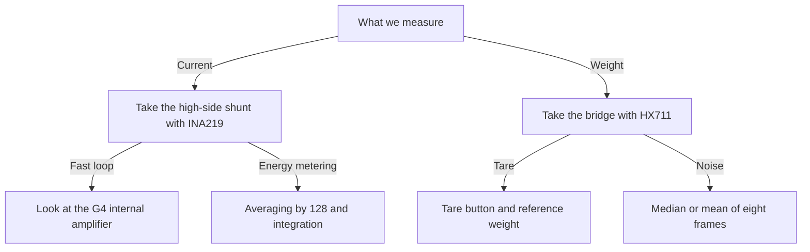

# INA219 and HX711 - Current and Weight

![[assets/img/stm32-ina-hx711-scheme.png|600]]
*Fig. Load current measurement with a high-side shunt through INA219 and scales through a load cell with HX711 near STM32.*

> [!tip] Purpose of this note
> Give two accurate channels for small quantities: load current through a shunt with digital output, and weight through a bridge with a slow accurate converter.

## 1. Purpose

INA219 measures the voltage drop over a shunt in the supply circuit and directly returns current, voltage and power over the bus. HX711 amplifies load-cell millivolts and returns a 24-bit weight code over a simple two-wire interface. Both nodes cover energy metering and dosing: the first watches consumption, the second weighs the product.

A typical bundle looks like this: STM32 reads current tens of times a second and integrates energy, and reads weight ten times a second and smooths it with a filter. INA219 sits in series with the load positive wire. HX711 sits next to the load cell on short wires to pick up no interference.

## 2. Channel comparison

| Parameter | INA219 | HX711 |
| --- | --- | --- |
| What it measures | Current, voltage, power | Load-bridge signal, weight after calibration |
| Interface | Addressed bus | Two wires: clock and data |
| Resolution | 12 bits per channel | 24 bits |
| Speed | Hundreds of samples a second | 10 or 80 samples a second |
| Power supply | 3.0-5.5 V logic | 2.6-5.5 V, analog part separate |
| Calibration | One register for the shunt | Tare and scale from a reference weight |
| Accuracy | Percent uncalibrated, better after | Per-mille after calibration with a weight |
| Price | Cheap module | Cheap module with a load cell |

## 3. High-side shunt: why plus, not ground

| Option | Where the shunt sits | Pros | Cons |
| --- | --- | --- | --- |
| High-side | In the positive wire | Sees shorts to ground | Input with high common-mode voltage needed |
| Low-side | In the ground wire | Simple amplifier near zero | Load ground floats, risky for digital |

INA219 is built exactly for the high-side shunt: inputs tolerate common-mode voltage up to 26 V with 3.3 V logic supply. Take a low-value shunt so the drop neither heats the board nor sags the load. A 0.1 Ohm shunt at 2 A gives a 0.2 V drop and 0.4 W of heat, which is already noticeable.

```text
Верхній шунт одним поглядом:
  Джерело плюс через шунт до навантаження
  Входи датчика до обох виводів шунта короткими доріжками
  Земля датчика спільна з контролером
  Фільтр 100 нФ між входами при довгих дротах
  Потужність шунта з запасом удвічі від робочої
```

## 4. INA219 calibration register

| Register | Address | Purpose |
| --- | --- | --- |
| Configuration | 0x00 | Ranges, averaging, modes |
| Shunt | 0x01 | Signed raw shunt drop |
| Bus | 0x02 | Load voltage |
| Power | 0x03 | Computed by the chip from calibration |
| Current | 0x04 | Computed by the chip from calibration |
| Calibration | 0x05 | Scale for a specific shunt |

The calibration register sets how the chip converts shunt codes into milliamps. The vendor formula takes the current LSB for the wanted resolution and divides by the shunt resistance with a constant. After writing the register, the current and power registers start giving ready physical values with no controller math.

| Step | Action | Note |
| --- | --- | --- |
| 1 | Pick a shunt for maximum current | Drop no more than tenths of a volt |
| 2 | Pick the current LSB | For example 0.1 mA for small currents |
| 3 | Compute the calibration value | Reference formula with shunt resistance |
| 4 | Write the calibration register | Right after chip reset |
| 5 | Configure averaging | 128 samples for quiet measurements |
| 6 | Check on a known load | Known-resistance resistor as reference |

```c
#include "stm32f1xx_hal.h"

#define INA_ADDR (0x40 << 1) // адреса залежить від виводів вибору

// Запис 16-бітного регістра старшим байтом уперед.
static int ina_write(I2C_HandleTypeDef *hi2c, uint8_t reg, uint16_t val)
{
    uint8_t d[2] = {(uint8_t)(val >> 8), (uint8_t)val};
    return (HAL_I2C_Mem_Write(hi2c, INA_ADDR, reg, 1, d, 2, 100) == HAL_OK) ? 0 : -1;
}

// Читання 16-бітного регістра старшим байтом уперед.
static int ina_read(I2C_HandleTypeDef *hi2c, uint8_t reg, uint16_t *val)
{
    uint8_t d[2];
    if (HAL_I2C_Mem_Read(hi2c, INA_ADDR, reg, 1, d, 2, 100) != HAL_OK) return -1;
    *val = (uint16_t)(d[0] << 8 | d[1]);
    return 0;
}

// Калібрування під шунт 0.1 Ом, молодший біт струму 0.1 мА.
// Значення 4096 випливає з формули довідника для цих параметрів.
int ina_calib_100mohm(I2C_HandleTypeDef *hi2c)
{
    // Конфігурація: діапазон 32 В, підсилення вісім, 12 біт, усереднення 128.
    if (ina_write(hi2c, 0x00, 0x1FFF)) return -1;
    if (ina_write(hi2c, 0x05, 4096)) return -2;
    return 0;
}

// Читання струму у десятих частках міліампера і напруги у мілівольтах.
int ina_read_power(I2C_HandleTypeDef *hi2c, int32_t *current_01ma, int32_t *bus_mv)
{
    uint16_t raw_i, raw_v;
    if (ina_read(hi2c, 0x04, &raw_i)) return -1;
    if (ina_read(hi2c, 0x02, &raw_v)) return -2;
    *current_01ma = (int16_t)raw_i; // молодший біт 0.1 мА
    *bus_mv = (int32_t)((raw_v >> 3) * 4); // молодший біт 4 мВ
    return 0;
}
```

## 5. INA219 averaging and modes

| Setting | Effect | When to take |
| --- | --- | --- |
| Single with no averaging | Fast, noisy | Overload protection |
| Averaging by 16 | Quieter by times | Charge control |
| Averaging by 128 | Quiet lab accuracy | Energy metering |
| Shunt only | Time saving | Current with no voltage |
| Bus only | Time saving | Voltage with no current |
| Both cyclic | Full power | Permanent monitoring |

## 6. Load cell and HX711 gain

| Element | Description | Note |
| --- | --- | --- |
| Bridge | Four strain resistors | Diagonal gives millivolts proportional to weight |
| Excitation | Bridge supply from the chip | Separate stabilized output |
| Channel A | Gain 128 or 64 | Main weight channel |
| Channel B | Gain 32 | Auxiliary, coarser |
| 10 rate | 10 samples a second | Quiet default mode |
| 80 rate | 80 samples a second | Fast mode, more noise |

Gain 128 converts bridge millivolts into the full converter scale. The channel is picked by the clock pulse count after reading: 25 pulses keep channel A at 128, 26 pulses give channel A at 64, 27 pulses switch to channel B. The rate switches with a separate chip output level.

```text
Тензодавач одним поглядом:
  Чотири дроти моста до відповідних входів чипа
  Екран кабелю на землю тільки з одного боку
  Чип біля давача, цифрові дроти до контролера довгі
  Механіка без люфтів, платформа на одному давача
  Гиря еталонна для масштабу після тари
```

## 7. Slow 24 bits: why so few and so accurate

| Question | Answer | Note |
| --- | --- | --- |
| Why 10 samples | Sigma-delta averages noise | Every sample already quiet |
| Why 24 bits | Millivolts split into millions | Low bits noisy, high bits stable |
| Last-digit jitter | Thermal noise and vibration | Mean or median filter |
| Long analog wires | 50 Hz interference antenna | Twisted pair, shield, chip near the bridge |
| Start-up jumps | Bridge and chip warm-up | Drop the first seconds |

## 8. Weight tare and calibration

| Step | Action | Note |
| --- | --- | --- |
| 1 | Warm the node up for minutes | Zero floats at start |
| 2 | Read zero with no load | That is the platform tare |
| 3 | Place a reference weight | Known-mass weight centered |
| 4 | Compute the scale | Code minus tare divided by grams |
| 5 | Save tare and scale | Controller independent memory |
| 6 | Check mid-scale | Bridge linearity confirmed |

Update tare with a button or a command because dust and tare build up. Keep the scale after the first calibration and do not touch it without mechanics changes. Check with two weights, small and large, to see mount non-linearity.

## 9. Bundle with the G4 series internal amplifier

| Question | HX711 | G4 internal amplifier |
| --- | --- | --- |
| Where it sits | Separate chip near the sensor | Inside the controller |
| Chain resolution | 24 bits slow | 12-16 bits fast through ADC |
| Speed | 10 or 80 a second | Kilohertz |
| When to take separate | Accurate scales, long wires | Dynamometer with fast reaction |
| When to take internal | Fast regulation loop | Motor current with no external chips |
| Combination | Weight slow, current fast | Energy and mass in one node |

The G4 series carries built-in op amps with output to the internal ADC. Such a bundle measures motor current through a shunt with no external chip at kilohertz rates. Keep HX711 for scales because 24 bits of slow conversion are out of reach for the built-in path.

## 10. Reading HX711 through HAL

The chip interface is simple: the data line falls low when ready, the controller gives 24 clocks and takes bits most significant first. Extra clocks pick the next measurement channel. All operations use plain outputs with no hardware bus.

```c
#include "stm32f1xx_hal.h"

#define HX_SCK_PORT  GPIOB
#define HX_SCK_PIN   GPIO_PIN_0
#define HX_DATA_PORT GPIOB
#define HX_DATA_PIN  GPIO_PIN_1

// Чекати готовності даних з таймаутом у мілісекундах.
static int hx_wait_ready(uint32_t timeout_ms)
{
    uint32_t t0 = HAL_GetTick();
    while (HAL_GPIO_ReadPin(HX_DATA_PORT, HX_DATA_PIN) == GPIO_PIN_SET)
    {
        if ((HAL_GetTick() - t0) > timeout_ms) return -1;
    }
    return 0;
}

// Прочитати сирий 24-бітний код, старшим бітом уперед.
// pulses: 25 — канал А 128, 26 — канал А 64, 27 — канал Б 32.
int32_t hx_read_raw(int pulses)
{
    int32_t v = 0;
    for (int i = 0; i < 24; i++)
    {
        HAL_GPIO_WritePin(HX_SCK_PORT, HX_SCK_PIN, GPIO_PIN_SET);
        v = (v << 1);
        if (HAL_GPIO_ReadPin(HX_DATA_PORT, HX_DATA_PIN) == GPIO_PIN_SET) v |= 1;
        HAL_GPIO_WritePin(HX_SCK_PORT, HX_SCK_PIN, GPIO_PIN_RESET);
    }
    for (int i = 0; i < pulses - 24; i++)
    {
        HAL_GPIO_WritePin(HX_SCK_PORT, HX_SCK_PIN, GPIO_PIN_SET);
        HAL_GPIO_WritePin(HX_SCK_PORT, HX_SCK_PIN, GPIO_PIN_RESET);
    }
    // Розширення знака з 24 біт до 32 біт.
    if (v & 0x800000) v |= (int32_t)0xFF000000;
    return v;
}

// Ваги: усереднення кількох кадрів, віднімання тари, масштаб.
// scale_lsbs_per_gram — кодів на грам з калібрування.
int hx_weight(int32_t tare, int32_t scale_lsbs_per_gram, int32_t *grams)
{
    if (hx_wait_ready(500)) return -1;
    int64_t acc = 0;
    const int n = 8;
    for (int i = 0; i < n; i++)
    {
        if (hx_wait_ready(500)) return -2;
        acc += hx_read_raw(25);
    }
    int32_t avg = (int32_t)(acc / n);
    *grams = (avg - tare) / scale_lsbs_per_gram;
    return 0;
}
```

## Mermaid: small-quantity path choice



## Common issues

| # | Issue | Why it hurts | Fix |
| --- | --- | --- | --- |
| 1 | Shunt in the ground wire | Load ground floats, digital glitches | High-side shunt with high common-mode inputs |
| 2 | Empty calibration register | Current and power registers sit at zero | Write calibration right after reset |
| 3 | Shunt with no power margin | Heating and resistance drift | Shunt power twice the working power |
| 4 | Long bridge analog wires | Mains interference drowns low bits | Chip near the sensor, shielded twisted pair |
| 5 | Weight with no tare and scale | Raw codes mean no grams | Button tare, reference-weight scale |
| 6 | HX711 reading with no ready wait | Old bits mix with new | Wait for data line fall with timeout |

## Official sources

- [INA219 datasheet (Texas Instruments)](https://www.ti.com/product/INA219) - calibration register, data formats, averaging modes.
- [HX711 datasheet (Avia Semiconductor)](https://www.aviyan.com/hx711-datasheet/) - clocking, channel select, conversion rates.
- [OPAMP STM32G4 reference (STMicroelectronics)](https://www.st.com/en/microcontrollers-microprocessors/stm32g4-series.html) - internal amplifiers for fast current loops.

## See also

- [[Home.en]]
- [[EN/04-Interfaces/03-I2C.en|I2C bus]]
- [[EN/06-Analog/01-ADC.en|ADC measurements]]
- [[EN/10-Sensors/02-BME280-SHT3x.en|climate over I2C]]
- [[EN/10-Sensors/03-MPU6050-IMU.en|motion and orientation]]
