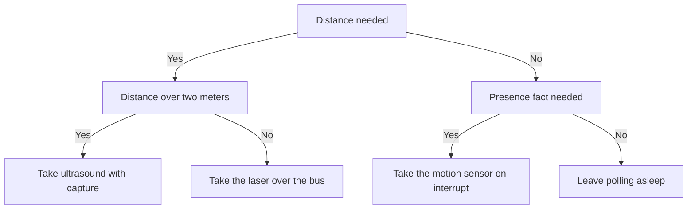

# HC-SR04 and VL53L0X - Distance and Presence

![[assets/img/stm32-hcsr-vl53-scheme.png|600]]
*Fig. Distance measurement with an ultrasonic module and a laser ranger plus a discrete motion sensor on the interrupt input.*

> [!tip] Purpose of this note
> Give three ready object-detection channels: long-range ultrasound, accurate bus laser and a discrete motion sensor with interrupt.

## 1. Purpose

HC-SR04 measures distance with an ultrasonic echo from a few centimeters to a few meters. VL53L0X measures distance with a laser pulse at millimeter resolution over a short range. A discrete infrared motion sensor reports a person appearing in the zone with no distance measurement. Together the trio covers security, parking, liquid level and visitor counting.

STM32 fires the ultrasound start pulse, measures echo duration with timer capture and converts into centimeters. The laser ranger works over the bus as a plain addressed member. The motion sensor connects to an external interrupt input with software bounce suppression.

## 2. Detection channel comparison

| Parameter | HC-SR04 | VL53L0X | Motion sensor |
| --- | --- | --- | --- |
| Principle | Ultrasonic echo | Light time of flight | Infrared body heat |
| Range | 2 cm - 4 m | Up to 2 m | Up to 7 m per lens datasheet |
| Accuracy | About 3 mm | Millimeters | Motion fact with no distance |
| View angle | About 15 degrees | Narrow beam | Wide Fresnel lens zone |
| Blind zone | First 2 cm | A few centimeters | Output settling delay |
| Interface | Two digital pins | Addressed bus | One discrete output |
| Interference | Soft fabrics muffle | Direct sun blinds | Heat flows and animals |
| Price | The cheapest | More expensive | Cheap but with a lens |

## 3. Ultrasound: 10 us start and echo

| Phase | Action | Duration |
| --- | --- | --- |
| Start | Controller drives the trigger input high | 10 us |
| Burst | Module emits eight 40 kHz pulses | Automatic |
| Echo | Echo output holds high | Proportional to double distance |
| Pause | Ring-down wait | Minimum 60 ms between starts |
| Timeout | No echo | Limit measurement to tens of milliseconds |

```text
Обмін з HC-SR04 одним поглядом:
  Контролер піднімає вхід запуску на 10 мкс
  Модуль випромінює пачку 40 кГц у простір
  Вихід відлуння піднімається до повернення хвилі
  Таймер міряє тривалість високого рівня
  Пауза 60 мс гасить перевідбиття у приміщенні
```

The distance formula follows from the 343 meters per second speed of sound at room temperature. The wave travels the double path to the obstacle and back, so centimeters equal echo microseconds divided by 58. At sub-zero temperatures the speed of sound drops, and an error of percents appears without correction.

## 4. Echo duration capture with a timer

| Setting | Value | Note |
| --- | --- | --- |
| Timer channel | Both-edge capture mode | Leading edge starts, trailing edge stops |
| Clocking | 1 MHz | Microsecond resolution |
| Trigger input | Plain controller output | 10 us pulse with software delay |
| Overflow | Flag for long distances | Timeout instead of hanging |
| Input filter | Timer digital filter | Removes long-line spikes |

```c
#include "stm32f1xx_hal.h"

#define TRIG_PORT GPIOA
#define TRIG_PIN  GPIO_PIN_0

extern TIM_HandleTypeDef htim2; // канал 1 у режимі захоплення

// Стартовий імпульс 10 мкс на вхід запуску модуля.
void hcsr_trig(TIM_HandleTypeDef *htim_us)
{
    HAL_GPIO_WritePin(TRIG_PORT, TRIG_PIN, GPIO_PIN_SET);
    delay_us_tim(htim_us, 10);
    HAL_GPIO_WritePin(TRIG_PORT, TRIG_PIN, GPIO_PIN_RESET);
}

// Перерахунок тривалості відлуння у міліметри.
// us — мікросекунди високого рівня, подвійний шлях хвилі.
int32_t hcsr_mm(uint32_t us)
{
    // Швидкість звуку 343 м/с дає 2.92 мкс на міліметр в один бік.
    // Подвійний шлях: міліметри = us / 5.85, округлюємо цілочисельно.
    return (int32_t)((us * 10) / 58);
}

// Опитування з таймаутом. Повертає нуль при успіху.
int hcsr_read_poll(TIM_HandleTypeDef *htim_us, GPIO_TypeDef *echo_port,
                   uint16_t echo_pin, int32_t *mm)
{
    hcsr_trig(htim_us);
    __HAL_TIM_SET_COUNTER(htim_us, 0);
    HAL_TIM_Base_Start(htim_us);
    while (HAL_GPIO_ReadPin(echo_port, echo_pin) == GPIO_PIN_RESET)
    {
        if (__HAL_TIM_GET_COUNTER(htim_us) > 30000) return -1; // немає переднього фронту
    }
    __HAL_TIM_SET_COUNTER(htim_us, 0);
    while (HAL_GPIO_ReadPin(echo_port, echo_pin) == GPIO_PIN_SET)
    {
        if (__HAL_TIM_GET_COUNTER(htim_us) > 30000) return -2; // немає заднього фронту
    }
    uint32_t us = __HAL_TIM_GET_COUNTER(htim_us);
    HAL_TIM_Base_Stop(htim_us);
    *mm = hcsr_mm(us);
    return 0;
}
```

## 5. Ultrasound blind zone and angles

| Effect | Cause | What to do |
| --- | --- | --- |
| 2 cm blind zone | Membrane ringing after the burst | Do not measure closer, place a laser |
| Wide 15-degree cone | Emitter nature | Side objects give false echoes |
| Soft surfaces | Fabric and foam absorb | Enlarge the reflector area |
| Tilted walls | Wave goes aside | Keep the surface perpendicular |
| Room re-reflections | Wave walks between walls | 60 ms pause between starts |
| Temperature drift | Sound speed depends on warmth | Correction from a temperature sensor |

## 6. Bus laser ranger

| Question | Answer | Note |
| --- | --- | --- |
| Default address | 0x29 | Same in all off-the-shelf modules |
| Address change | Shutdown input plus new write | Each module woken separately |
| Power supply | 2.6-3.6 V | Bus pull-ups to module supply only |
| Modes | Single and continuous | Single for rare measurements |
| Accuracy | Millimeters up to a meter | Spread grows further out |
| Sun | Direct light blinds the receiver | A hood and a diffuser help |

```text
Зміна адреси двох однакових модулів:
  Обидва входи вимкнення у низькому рівні
  Підняти вхід першого модуля, дати адресу один
  Підняти вхід другого модуля, дати адресу два
  Далі обидва живуть на одній шині паралельно
  Адреси губляться після зняття живлення
```

Several identical rangers on one bus are separated through shutdown inputs: hold everybody off, wake one by one and assign addresses. After assignment each module is polled separately with standard result register reads. Vendor reference init calibrates the optics for the specific board.

## 7. Discrete motion sensor as an interrupt input

| Parameter | Value | Note |
| --- | --- | --- |
| Output | Digital high level on motion | Trigger and non-trigger modes with a jumper |
| Power supply | 5 V for stable sensitivity | Match output with a divider or a transistor |
| Warm-up time | About a minute | Ignore trips after power |
| Output hold | Seconds, adjustable | Keeps light on after motion |
| Sensitivity | Adjustable | Lower on false trips |
| Lens | Fresnel zone | With no lens range drops by times |

The sensor connects to an external interrupt input firing on the leading edge. The interrupt handler raises the event flag and restarts the software bounce-suppression timer. The main loop reads the flag, turns light or alarm on and turns off on the no-motion timeout.

```c
#include "stm32f1xx_hal.h"

volatile uint8_t pir_event = 0;

// Виклик зворотного виклику зовнішніх переривань.
// Пін датчика налаштований на передній фронт.
void HAL_GPIO_EXTI_Callback(uint16_t pin)
{
    if (pin == GPIO_PIN_2)
    {
        pir_event = 1;
    }
}

// Обробка події руху в основному циклі.
// light_on і light_off керують виконавчим пристроєм.
void pir_task(uint32_t hold_ms)
{
    static uint32_t last = 0;
    if (pir_event)
    {
        pir_event = 0;
        last = HAL_GetTick();
        light_on();
    }
    if ((HAL_GetTick() - last) > hold_ms)
    {
        light_off();
    }
}
```

## 8. Shared polling loop for three channels

| Channel | Period | Action |
| --- | --- | --- |
| Ultrasound | 100 ms | Start, capture, convert to millimeters |
| Laser | 100 ms in antiphase | Bus request, result reading |
| Motion | On interrupt | Event flag, hold timeout |
| Fusion | Every loop | Close object confirmed by two channels |
| Telemetry | Once a second | Median of three measurements into a packet |

```text
Цикл охорони одним поглядом:
  Парні такти міряє ультразвук, непарні лазер
  Рух приходить перериванням незалежно від тактів
  Тривога тільки при збігу руху і близької дистанції
  Медіана трьох вимірів прибирає поодинокі викиди
```

## Mermaid: detection channel choice



## Common issues

| # | Issue | Why it hurts | Fix |
| --- | --- | --- | --- |
| 1 | Echo measurement with a software loop | Microsecond jitter gives centimeter jumps | Hardware timer capture |
| 2 | Ultrasound starts with no pause | Re-reflections mask as close walls | Pause at least 60 ms between fires |
| 3 | Two lasers on one address | Bus conflicts, both silent | Separate addresses through shutdown inputs |
| 4 | Laser bus pull-ups to 5 V | Module input supply exceeded | Pull-ups to module supply only |
| 5 | Motion sensor with no warm-up | False trips for the first minute | Ignore output until settled |
| 6 | Light straight from the sensor output | Bounce and output overload | Interrupt plus timeout in the controller |

## Official sources

- [VL53L0X datasheet (STMicroelectronics)](https://www.st.com/en/imaging-and-photonics-solutions/vl53l0x.html) - measurement modes, register map, address change.
- [HC-SR04 basic manual (Cytron)](https://www.cytron.io/p-hc-sr04-ultrasonic-sensor) - start and echo timing, distance formula.
- [PIR motion detector guide (Adafruit)](https://learn.adafruit.com/pir-passive-infrared-proximity-motion-sensor) - output modes, warm-up, sensitivity tuning.

## See also

- [[Home.en]]
- [[EN/03-GPIO/01-GPIO-Modes.en|GPIO modes]]
- [[EN/07-Timers/01-GPTIM-ADTIM.en|timers and PWM]]
- [[EN/04-Interfaces/03-I2C.en|I2C bus]]
- [[EN/10-Sensors/03-MPU6050-IMU.en|motion and orientation]]
