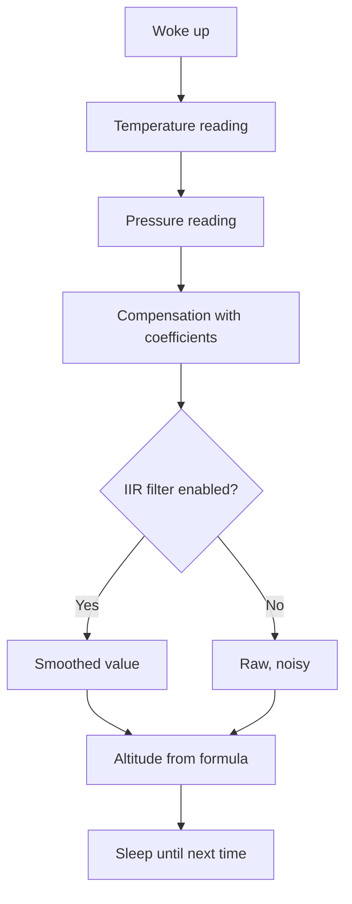

# BMP390 and MS5611 Pressure - Barometers and Altitude

![[assets/img/stm32-pressure-scheme.png|600]]
*Fig. From pascals to meters: compensation, filter, formula.*

> [!tip] Purpose of this note
> Teach pressure and altitude measurement with no noise: calibration, IIR filter and correct sealing.

## 1. Purpose

A barometer sees weather and altitude: falling pressure means a cyclone, pascal differences mean meters. BMP390 is cheap and accurate for hobby, MS5611 is precise for altimeters. Both demand temperature compensation: a raw ADC with no coefficients lies by percents.

## Sensor comparison

| Parameter | BMP390 | MS5611 |
| --- | --- | --- |
| Interface | I2C and SPI | I2C and SPI |
| Pressure accuracy | High relative | 24-bit ADC, precise |
| Noise | Low with filter | Very low |
| Price | Cheap | More expensive |
| For what | Weather, drone hold | Altimeter, variometer |

## Compensation: the driver heart

| Step | Action |
| --- | --- |
| 1 | Read calibration coefficients from NVM |
| 2 | Read raw temperature and pressure |
| 3 | Compensate temperature first! |
| 4 | Feed temperature into the pressure formula |

```c
// Порядок завжди такий: спочатку t_lin, потім тиск:
t_lin = compensate_temp(raw_temp, calib);
pressure = compensate_press(raw_press, t_lin, calib);
```

> Order is critical: pressure with no fresh temperature is garbage.

## Mermaid: measurement loop



## Altitude from pressure

| Topic | Practice |
| --- | --- |
| Formula | Barometric through sea-level pressure |
| Reference | Calibrate against a known altitude at start! |
| Relative accuracy | Meters if the reference is fresh |
| Absolute | Floats with weather - not for navigation |

## Sealing and wind

| Problem | Fix |
| --- | --- |
| Wind gives jumps | Foam or membrane over the hole |
| Moisture inside | Hole down, conformal coating nearby |
| Sun heats the case | Shade or remote sensor |
| Sealed enclosure | Hole outside with a tube! |

## Common issues

| # | Issue | Why it hurts | Fix |
| --- | --- | --- | --- |
| 1 | No compensation | Percent-scale error | Coefficients from NVM always! |
| 2 | Pressure before temperature | Formula lies | t_lin first |
| 3 | No filter in wind | Meter-scale jumps | IIR or oversampling |
| 4 | Sealed enclosure | Inside pressure differs from outside | Vent hole |
| 5 | Absolute altitude with no reference | Floats with weather | Calibration at start |
| 6 | I2C address at random | Two BMP options | SDO to ground or supply! |
| 7 | Frequent measurements with no sleep | Battery melts | Forced mode + sleep |

## Variometer: climb rate

| Topic | Practice |
| --- | --- |
| Pressure derivative | Altitude difference per second is meters per second |
| Derivative filter | With no filter noise beats signal! |
| Measurement rate | 25+ Hz for a smooth vario |
| Sound | Beeper pitched by rate - a paraglider classic |

```text
Ланцюжок варіометра:
  тиск 25 Гц -> IIR -> висота -> різниця за секунду -> другий IIR -> біпер.
  Два фільтри обовязкові: один на висоту, один на швидкість.
```

## SPI or I2C: what to choose

| Criterion | I2C | SPI |
| --- | --- | --- |
| Pins | Two for all | Four plus CS per each |
| Speed | Enough for pressure | Needed for 25+ Hz streams |
| Length | Short, else glitches | Tolerates longer cables |

## Official sources

- [BMP390 datasheet (Bosch)](https://www.bosch-sensortec.com/products/environmental-sensors/pressure-sensors/bmp390/) - compensation, modes.
- [MS5611 datasheet (TE)](https://www.te.com/usa-en/product-CAT-BLPS0003.html) - 24-bit, coefficients.

## Oversampling: accuracy versus current

| Mode | Noise | Current | When |
| --- | --- | --- | --- |
| Ultra low power | Higher | Minimum | Beacon once an hour |
| Standard | Medium | Medium | Home weather |
| High resolution | Small | Higher | Vario in flight |
| Ultra high | Minimum | Maximum | Laboratory |

```c
// Читання тиску через HAL (I2C, BMP390):
uint8_t buf[6];
HAL_I2C_Mem_Read(&hi2c1, BMP_ADDR, REG_PRESS, 1, buf, 6, 100);
raw_press = buf[2] << 16 | buf[1] << 8 | buf[0];
raw_temp  = buf[5] << 16 | buf[4] << 8 | buf[3];
```

## Long-term drift: what to expect

| Topic | Practice |
| --- | --- |
| MEMS aging | Pascals per year is normal for cheap ones |
| Recalibration | Once a year against a reference or sea level |
| Storage | No moisture or harsh vapors |
| Logging | Offset in node EEPROM with date |

## See also

- [[Home.en]]
- [[EN/10-Sensors/02-BME280-SHT3x.en|climate over I2C]]
- [[EN/10-Sensors/03-MPU6050-IMU.en|motion and orientation]]
- [[EN/04-Interfaces/03-I2C.en|exchange bus]]
- [[16-Projects/01-Meteostantsiya|weather node]]
