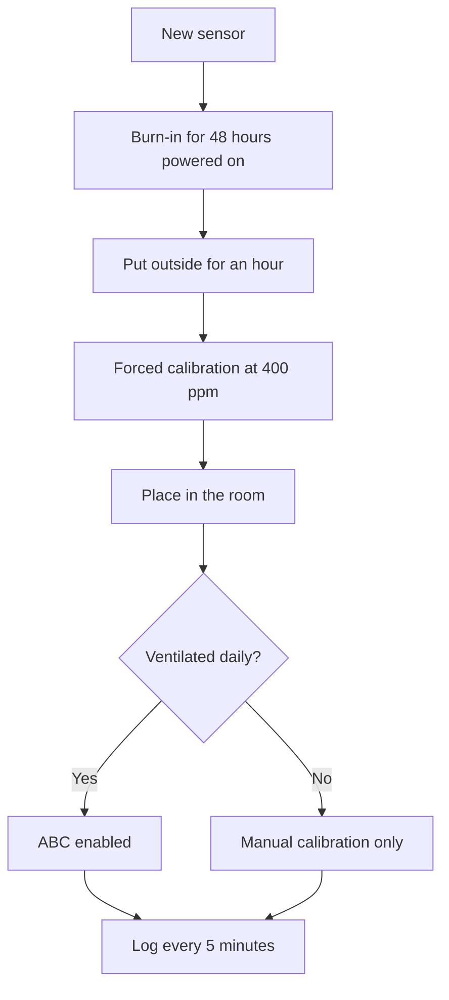

# SCD40 and MH-Z19 CO2 - Air Quality

![[assets/img/stm32-co2-scheme.png|600]]
*Fig. From molecule to ppm: optics, warm-up, calibration.*

> [!tip] Purpose of this note
> Teach honest CO2 measurement: warm-up, auto-calibration and correct sensor placement.

## 1. Purpose

Carbon dioxide is a stuffiness marker: over 1000 ppm focus drops and sleepiness comes. SCD40 is small and accurate for rooms, MH-Z19 is cheap with UART for ventilation. Both lie for the first days - warm-up and calibration are mandatory.

## Sensor comparison

| Parameter | SCD40 | MH-Z19 |
| --- | --- | --- |
| Principle | Photoacoustic | NDIR optics |
| Interface | I2C only | UART and PWM output |
| Range | Up to 40000 ppm | Up to 5000 ppm typical |
| Size | Tiny | Bigger, with a chamber |
| For what | Room, desktop | Ventilation, cabinet |

## NDIR: how optics measures

| Element | Role |
| --- | --- |
| IR emitter | Shines through the chamber |
| Gas chamber | CO2 absorbs its own wavelength |
| Detector | Less light means more ppm |
| Reference channel | Compensates lamp aging |

## ABC auto-calibration: the catch

| Topic | Practice |
| --- | --- |
| Idea | Sensor takes the week minimum as 400 ppm of street air |
| Condition | The room IS ventilated regularly! |
| Trap | Unventilated basement - calibration floats down |
| Way out | Turn ABC off and calibrate by hand outside |

```c
// Примусове калібрування SCD40 на свіжому повітрі:
HAL_I2C_Master_Transmit(&hi2c1, SCD_ADDR, cmd_forced_cal, 2, 100);
// Чекати 400+ секунд стабільного повітря!
```

## Mermaid: commissioning



## Where to place the sensor

| Rule | Reason |
| --- | --- |
| Breathing height | 1-1.5 m off the floor |
| Not near window or heater | Drafts and heat lie |
| Not in a corner behind a closet | Stale air |
| Case with holes | Gas must reach the chamber! |

## MH-Z19 over UART and PWM

| Mode | Practice |
| --- | --- |
| UART 9600 | Read command, 9-byte reply with CRC |
| PWM output | Pulse width is concentration, no protocol |
| Warm-up | 3 minutes after power-on |
| Zero calibration | HD pin to ground outside! |

## Common issues

| # | Issue | Why it hurts | Fix |
| --- | --- | --- | --- |
| 1 | Trust in the first day | Sensor still warming up | 48 hours of burn-in |
| 2 | ABC in unventilated rooms | Calibration slides | Manual calibration outside |
| 3 | Sensor in a sealed case | Gas never reaches | Vent holes |
| 4 | Near a breathing person | Peaks to 2000 for no reason | A meter from the desk |
| 5 | MH-Z19 with no warm-up | First minutes lie | Wait for ready |
| 6 | CRC ignored | Broken packets in the log | Check the checksum |
| 7 | Frequent measurements for nothing | CO2 is a slow gas | Once a minute is enough |

## SCD40 bonus: temperature and humidity from the same chip

| Channel | Accuracy | Nuance |
| --- | --- | --- |
| Temperature | The chip heats itself! | Upward offset with no board compensation |
| Humidity | Acceptable | Calibrate against SHT if needed |
| Self-test | Built-in | Run at start, log the result |

> SCD40 temperature always reads above room level from self-heating - take a separate sensor for weather.

## Power: measurement current

| Sensor | Peak | Mean |
| --- | --- | --- |
| SCD40 | Tens of mA in pulses | Milliamps at per-minute rates |
| MH-Z19 | Over 100 mA with the lamp | Tens of mA mean |

## Official sources

- [SCD40 datasheet (Sensirion)](https://sensirion.com/products/catalog/SCD40/) - calibration, commands.
- [MH-Z19C CO2 sensor (Winsen)](https://www.winsen-sensor.com/sensors/co2-sensor/mh-z19c.html) - UART protocol, zero.

## CO2 ventilation control

| Threshold | Action |
| --- | --- |
| Up to 800 ppm | All good, fan minimum |
| 800-1200 ppm | Raise speed, warn |
| Over 1200 ppm | Maximum, air-out alarm |
| Hysteresis | 100 ppm between on and off! |

```c
// Керування з гістерезисом проти смикання реле:
if (co2 > 1200) fan = MAX;
else if (co2 < 1100) fan = MIN;
// Між 1100 і 1200 — стан не міняється!
```

## Long-term log: what to write

| Field | Why |
| --- | --- |
| CO2, temperature, humidity | Correlation with well-being |
| Ventilation state | Whether airing helped |
| Calibration with date | Last time outside |
| Every 5 minutes | CO2 is slow, more often unneeded |

## See also

- [[Home.en]]
- [[EN/10-Sensors/02-BME280-SHT3x.en|climate over I2C]]
- [[EN/10-Sensors/06-Pressure-BMP390-MS5611.en|pressure and altitude]]
- [[EN/04-Interfaces/01-UART.en|serial port]]
- [[16-Projects/01-Meteostantsiya|weather node]]
