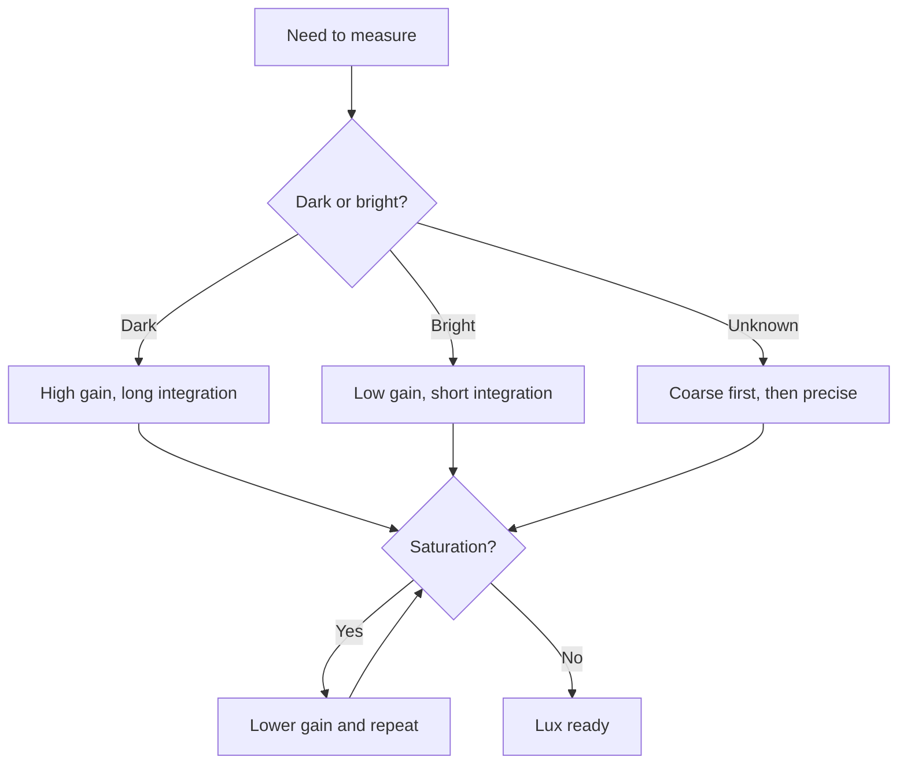

# BH1750 and TSL2591 Light - Lux and Spectrum

![[assets/img/stm32-light-scheme.png|600]]
*Fig. From photons to lux: integration, gain, spectrum.*

> [!tip] Purpose of this note
> Teach honest illuminance measurement: ranges, integration time and glass effects.

## 1. Purpose

Lux drives backlight, greenhouses and street lighting. BH1750 is simple and cheap for plain light-dark, TSL2591 sees visible and infrared channels separately for an accurate lux meter. Both demand correct integration time: a short one blinds in the sun, a long one is noisy in the dark.

## Sensor comparison

| Parameter | BH1750 | TSL2591 |
| --- | --- | --- |
| Interface | I2C | I2C |
| Range | Up to 65535 lux | 188 u - 88000 lux |
| Channels | One broadband | Visible + IR separate |
| Resolution | 1 lux typical | Configurable |
| For what | Street, greenhouse | Lux meter, adaptive backlight |

## Integration time and gain

| Parameter | Effect |
| --- | --- |
| Long integration | More accurate in the dark, slower |
| Short integration | Faster but noisy |
| High gain | Dark rooms |
| Low gain | Direct sun with no saturation |

```c
// BH1750: одноразовий вимір високої роздільності:
uint8_t cmd = 0x20;
HAL_I2C_Master_Transmit(&hi2c1, BH_ADDR, &cmd, 1, 100);
HAL_Delay(180);   // чекати інтеграцію!
uint8_t buf[2];
HAL_I2C_Master_Receive(&hi2c1, BH_ADDR, buf, 2, 100);
lux = ((buf[0] << 8) | buf[1]) / 1.2;
```

## Mermaid: mode choice



## Glass and case: the invisible enemy

| Problem | Fix |
| --- | --- |
| Tinted glass cuts the spectrum | Calibration for the exact glass! |
| Dust on the window | Wipe periodically |
| Small window over the sensor | Cosine response floats |
| Own plastic | Measure transmission with a lux meter |

## TSL2591 IR channel: why two eyes

| Topic | Practice |
| --- | --- |
| Visible channel | Lux for the eye |
| IR channel | Heat of incandescent lamps |
| Difference | Tells the light source type |
| Lux formula | From the datasheet, with both channels! |

## Common issues

| # | Issue | Why it hurts | Fix |
| --- | --- | --- | --- |
| 1 | Reading before integration ends | Stale or zero data | Wait the datasheet time! |
| 2 | One gain for everything | Saturation in the sun | Auto-range |
| 3 | Glass with no calibration | Minus tens of percent | Calibrate assembled |
| 4 | Sensor in the case shadow | Measures shadow, not the room | Window outside |
| 5 | Frequent measurements for nothing | Light is slow | Once a second is enough |
| 6 | Ignored IR channel | Lamps lie in lux | Formula with both channels |
| 7 | BH1750 address at random | Two pin options | ADDR to ground or supply |

## Mounting: where the eye looks

| Rule | Reason |
| --- | --- |
| Up or outside | Not at a wall or the floor |
| Away from own LED | Own backlight blinds the measurement |
| Eye level for rooms | We measure where people are |

## Official sources

- [BH1750 datasheet (ROHM)](https://www.rohm.com/products/sensors-mems/ambient-light-sensor/bh1750fvi-product) - modes, timing.
- [TSL2591 datasheet (ams OSRAM)](https://ams-osram.com/products/sensor-solutions/ambient-light-sensors) - channels, formulas.

## Calibration for your own case

| Step | Action |
| --- | --- |
| 1 | Reference lux meter next to the sensor |
| 2 | Points from dark to sun, a dozen points |
| 3 | Correction factor in node EEPROM |
| 4 | Check once a year - plastic yellows! |

## BH1750 measurement modes

| Mode | Code | When |
| --- | --- | --- |
| Continuous | 0x10-0x13 | Stream for regulation |
| Single-shot | 0x20-0x23 | Woke, measured, slept |
| Sleep between measurements | Power down command | Battery for years |

```c
// Економний цикл: вимір і назад у сон:
uint8_t once = 0x20;   // одноразово, висока роздільність
HAL_I2C_Master_Transmit(&hi2c1, BH_ADDR, &once, 1, 100);
HAL_Delay(180);
HAL_I2C_Master_Receive(&hi2c1, BH_ADDR, buf, 2, 100);
uint8_t down = 0x00;   // power down до наступного разу
HAL_I2C_Master_Transmit(&hi2c1, BH_ADDR, &down, 1, 100);
```

## Case: adaptive backlight

| Threshold | Action |
| --- | --- |
| Darker than 50 lux | Backlight 100 percent |
| 50-300 lux | Proportionally less |
| Brighter than 500 | Off |
| Hysteresis | 20 lux against flicker at the edge |

## See also

- [[Home.en]]
- [[EN/10-Sensors/02-BME280-SHT3x.en|climate over I2C]]
- [[EN/10-Sensors/06-Pressure-BMP390-MS5611.en|pressure and altitude]]
- [[EN/04-Interfaces/03-I2C.en|exchange bus]]
- [[16-Projects/01-Meteostantsiya|weather node]]
