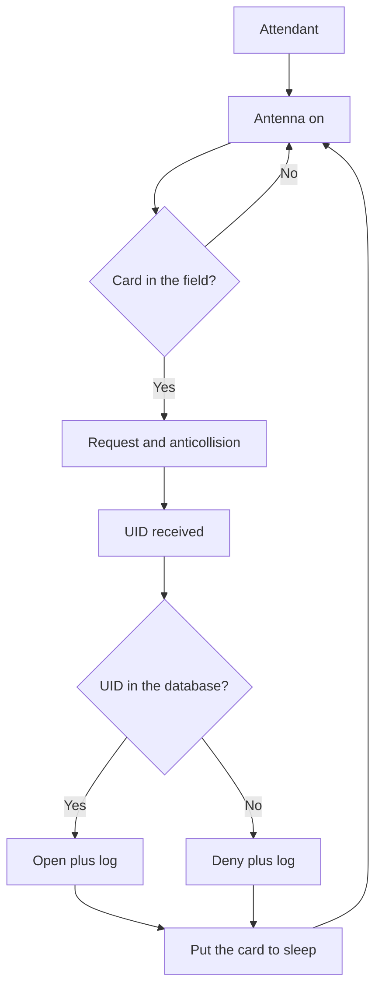

# RFID RC522 - 13.56 MHz Cards over SPI

![[assets/img/stm32-rc522-scheme.png|600]]
*Fig. 13.56 MHz field: the antenna wakes the card, SPI carries the data.*

> [!tip] Purpose of this note
> Teach card reading: SPI connection, anticollision, sectors and security limits.

## 1. Purpose

The RC522 reads contactless Mifare cards at 13.56 MHz: passes, keys, tags. The module is cheap, speaks SPI, and the coil antenna is already on the board. Enough for access accounting and tags, not for money and secrets: a UID is cloned in minutes.

## SPI Connection

| Module pin | Where | Note |
| --- | --- | --- |
| VCC | 3.3 V! | 5 V kills the module |
| GND | GND | Common ground |
| SCK, MOSI, MISO | Chip SPI | Clock up to 10 MHz |
| SDA (NSS) | Any GPIO | Chip select |
| RST | GPIO | Reset at start |
| IRQ | EXTI if wanted | Card arrived - wake up! |

```text
Живлення критичне:
  модуль їсть піками при ввімкненому полі;
  слабкий LDO просідає — читання рване;
  bulk 10 мкФ біля модуля обовязковий.
```

## Card Workflow

| Step | Action |
| --- | --- |
| 1 | Turn the antenna on (field on air) |
| 2 | Request: is there a card in the field |
| 3 | Anticollision: pick one of several |
| 4 | Select: get the UID |
| 5 | Sector key authentication |
| 6 | Block reads or writes |

## Mermaid: read cycle



## UID and Security: Honest Limits

| Topic | Truth |
| --- | --- |
| UID reads in the open | Any reader sees it |
| Chinese blanks | UID is writable - a clone in a minute |
| Mifare Classic crypto | Broken long ago, not for money |
| Secret data | Only on cards with sound crypto |

```text
Правило:
  UID — це логін, не пароль;
  для дверей підійде, для сейфа — ні;
  ключі секторів не в коді відкритим текстом!
```

## Mifare Sectors and Keys

| Topic | Practice |
| --- | --- |
| 16-byte block | Read and write unit |
| Sector trailer | Keys A and B plus access bits |
| Default key | Many zeros or ones - change at once! |
| Access bits | What key A allows, what key B allows |

## Range and Antenna

| Topic | Practice |
| --- | --- |
| Stock range | 2-5 cm above the coil |
| Metal nearby | Kills the field - keep distance from metal! |
| Case overlay | Thin plastic fine, no metal at all |
| Gain | TxControl register - no higher than needed |

## Common issues

| # | Issue | Why it hurts | Fix |
| --- | --- | --- | --- |
| 1 | 5 V power supply | The module burns out | Only 3.3 V! |
| 2 | UID as password | A clone passes | UID plus PIN or time |
| 3 | Keys openly in code | Firmware is readable | Keys in protected memory |
| 4 | Module on metal | The field stops working | Distance from metal |
| 5 | No bulk capacitor | Ragged reads | 10 uF near the module |
| 6 | SPI clock at maximum | Glitches on long wires | Lower and shorter |
| 7 | Card never halted | Read hundreds of times | Halt after the operation |

## Official sources

- [MFRC522 datasheet (NXP)](https://www.nxp.com/docs/en/data-sheet/MFRC522.pdf) - registers, commands, antenna.
- [MIFARE Classic info (NXP)](https://www.nxp.com/products/rfid-nfc/mifare-hf/mifare-classic) - sectors, keys.

## Module Init Order

| Step | Action |
| --- | --- |
| 1 | Hardware reset with the RST pin |
| 2 | Soft reset with a command |
| 3 | Set the timer and modulation |
| 4 | Turn the antenna on with TxControl bits |
| 5 | Check the chip version by reading a register |

```c
// Скелет старту (регістри за даташитом MFRC522):
RC522_Write(CommandReg, PCD_RESETPHASE);
HAL_Delay(50);
RC522_Write(TModeReg, 0x80);
RC522_Write(TPrescalerReg, 0xA9);
RC522_AntennaOn();   // без цього карток не видно!
```

## Turnstile Logic: Anti-Passback

| Rule | Why |
| --- | --- |
| Entry time record | The same UID cannot pass twice in a row |
| Turnstile direction | Entry and exit readers separate |
| Blocklist | Lost cards are blocked |
| Log of all events | Who, when, result - to SD or server |

## See also

- [[Home.en]]
- [[EN/10-Sensors/03-MPU6050-IMU.en|motion and orientation]]
- [[EN/04-Interfaces/02-SPI.en|exchange bus]]
- [[EN/15-Protocols/03-Security.en|product protection]]
- [[16-Projects/03-Energomonitor|accounting and log]]
