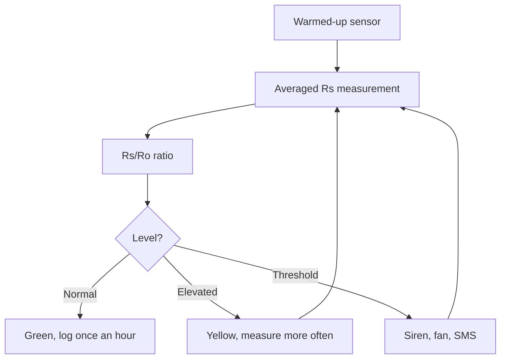

# MQ Gases - Smoke and Vapor Sensors

![[assets/img/stm32-mq-gas-scheme.png|600]]
*Fig. From resistance to alarm: warm-up, reference, thresholds.*

> [!tip] Purpose of this note
> Teach MQ use as an alarm: warm-up, clean-air reference, thresholds instead of ppm.

## 1. Purpose

MQ sensors hear smoke, vapors and leaks: MQ2 for smoke and LPG, MQ7 for CO, MQ135 for air quality. Cheap and omnivorous, but not measuring instruments: exact ppm cannot be pulled from them. Their role is a normal/alarm threshold for ventilation and alarms.

## Sensor Comparison

| Sensor | Target | Nuance |
| --- | --- | --- |
| MQ2 | Smoke, LPG, methane | Most common for home |
| MQ7 | CO | Cyclic heating: 5 V and 1.4 V! |
| MQ135 | CO2 equivalent, ammonia | Do not confuse with accurate CO2! |
| MQ3 | Alcohol | Breathalyzers |

## Warm-Up: A Day, Not Minutes

| Topic | Practice |
| --- | --- |
| First start | 24+ hours of warm-up before calibration! |
| Heater | Tens of mA constant - battery budget |
| Sleep mode | Turn the heater off, but then warm up again |
| Storage | No aggressive vapors, or the sensor is poisoned |

## Clean-Air Calibration

| Step | Action |
| --- | --- |
| 1 | Take outside after warm-up |
| 2 | Measure clean-air resistance Ro |
| 3 | Store Ro in node EEPROM |
| 4 | Thresholds as Rs/Ro ratio! |

```c
// Читання з усередненням (шум нагрівача!):
uint32_t sum = 0;
for (int i = 0; i < 64; i++) {
  HAL_ADC_Start(&hadc1);
  HAL_ADC_PollForConversion(&hadc1, 10);
  sum += HAL_ADC_GetValue(&hadc1);
}
uint16_t adc = sum / 64;
```

## Mermaid: from measurement to alarm



## Thresholds, Not ppm

| Topic | Practice |
| --- | --- |
| Datasheet curve | Logarithmic, approximate |
| Temperature and humidity | Shift readings - correct with BME! |
| Two thresholds | Warning and alarm with hysteresis |
| Smoke test | Trip check at install |

## Common issues

| # | Issue | Why it hurts | Fix |
| --- | --- | --- | --- |
| 1 | No warm-up | Lies by times | 24+ hours before calibration |
| 2 | Exact ppm from MQ | Physics says no | Normal/alarm thresholds |
| 3 | Heater always on battery | Battery dies | Mains power or rare cycles |
| 4 | Ro from the room | Dirty reference | Street air only! |
| 5 | MQ135 as CO2 meter | Equivalent, not ppm | Accurate CO2 is SCD40 |
| 6 | No hysteresis | Relay chatters | Two thresholds |
| 7 | MQ7 at constant 5 V | Sensitive layer overheat | 5 V / 1.4 V cycle per datasheet! |

| MQ7 cycle | 60 s at 5 V, 90 s at 1.4 V - measure at the end of the low phase |

## Heater Power: Current and Switch

| Topic | Practice |
| --- | --- |
| Heater current | 150+ mA per sensor - count in the budget! |
| MOSFET switch | Turn off between measurement cycles |
| Warm-up after sleep | Minutes, not seconds |
| USB is enough | One or two sensors, not a bed |

## Official sources

- [MQ-2 sensor (Winsen)](https://www.winsen-sensor.com/product/mq-2.html) - curves, warm-up, circuit.
- [MQ-7B sensor (Winsen)](https://www.winsen-sensor.com/sensors/co-sensor/mq-7b.html) - cyclic heating.

## Module or Bare Sensor

| Option | Pros | Cons |
| --- | --- | --- |
| Module with comparator | Threshold with a trimmer, digital at once | No accuracy, fact only |
| Bare plus chip ADC | Analog and two thresholds in code | Needs a divider and a filter |
| Module plus analog output | Both worlds | Best for a start |

## MQ Ventilation Control

| Level | Action |
| --- | --- |
| Normal | Fan minimum |
| Elevated | Speed up, log more often |
| Alarm | Siren, maximum, message |

```text
Логіка з гістерезисом:
  тривога при Rs/Ro нижче порога;
  скидання тільки коли повернулось з запасом;
  без запасу реле клацає на межі.
```

## Lifetime: When to Replace

| Topic | Practice |
| --- | --- |
| Sensor life | Years in clean air, months in aggressive air |
| Sensitivity check | Test gas every half year |
| Spare storage | Sealed, no vapors |
| Install date | With a marker on the case! |
| Spare sensor | Warm up before install, not on mounting day |

## See also

- [[Home.en]]
- [[EN/10-Sensors/07-CO2-SCD40-MH-Z19.en|accurate carbon dioxide gas]]
- [[EN/06-Analog/01-ADC.en|signal measurement]]
- [[EN/02-Power-Supply/01-Power-Supply-Rails.en|power supply rails]]
- [[16-Projects/01-Meteostantsiya|weather node]]
