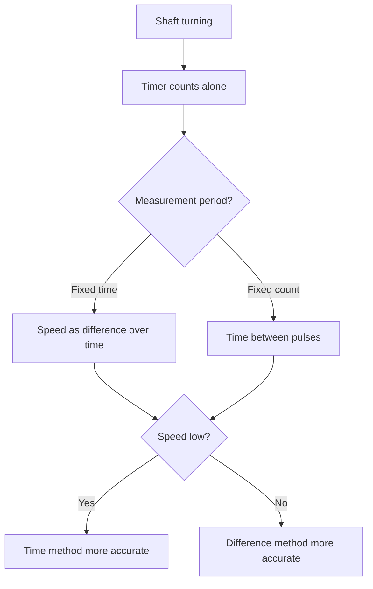

# Encoders - Quadrature, Speed and Position

![[assets/img/stm32-encoder-scheme.png|600]]
*Fig. Two phase-shifted channels: direction from phase, position from counting.*

> [!tip] Purpose of this note
> Teach reading rotation in hardware: the timer counts alone, the core only takes the value.

## 1. Purpose

An encoder tells where and how fast a shaft turns: motors, knobs, linear axes. Two channels A and B shifted by 90 degrees give direction, their edges give position. An STM32 timer in encoder mode counts everything alone: no interrupts per pulse, no missed steps.

## Signals A, B, Z

| Signal | Role |
| --- | --- |
| A | Position pulses |
| B | Same, shifted - direction from the phase shift! |
| Z (index) | One pulse per turn - zero mark |

```text
Напрям за 10 секунд:
  A випереджає B — крутиться в один бік;
  B випереджає A — у протилежний.
  Таймер розбирає сам, код лише читає напрям бітом.
```

## Timer Encoder Mode

| Setting | Value |
| --- | --- |
| Mode | Encoder mode 3: counts on both edges of both channels |
| Resolution | Encoder pulses times 4! |
| Input filter | Against mechanical bounce |
| Overflow | 16 bits is enough between polls |

```c
// Старт підрахунку:
HAL_TIM_Encoder_Start(&htim3, TIM_CHANNEL_ALL);
// Читання позиції будь-коли:
int32_t pos = (int32_t)__HAL_TIM_GET_COUNTER(&htim3);
```

## Mermaid: from pulses to speed



## Speed with Two Methods

| Method | Formula | When more accurate |
| --- | --- | --- |
| Difference over time | (pos2-pos1) / dt | Fast turns |
| Time between pulses | 1 / pulse dt | Slow turns |
| Combined | Switch at a threshold | Wide range |

## Bounce and Noise: Hardware Filter

| Topic | Practice |
| --- | --- |
| Mechanical bounce | Timer digital filter, not code! |
| Long lines | Differential driver or shield |
| Pull-ups | So inputs never float in the air |
| Z mark | Position reset once per turn |

## Absolute Encoders in Short

| Type | Difference |
| --- | --- |
| Incremental | Counts from power-on, Z gives zero |
| Absolute SSI/BiSS | Position at once, serial protocol |
| Magnetic AS5600 | 12 bits over I2C or PWM output |

## Common issues

| # | Issue | Why it hurts | Fix |
| --- | --- | --- | --- |
| 1 | Counting with interrupts | Misses at speed | Timer encoder mode! |
| 2 | No filter on mechanics | Bounce multiplies steps | Timer input filter |
| 3 | 16 bits with no overflow handling | Position jump | 32-bit accumulator in code |
| 4 | Speed with one method | Lies at range edges | Two methods with switching |
| 5 | Inputs with no pull-ups | False pulses | Pull-ups always |
| 6 | Z ignored | Zero drift | Reset on index |
| 7 | Long unshielded lines | Noise as steps | Shield and filter |

## Official sources

- [AN4013 Timers overview (ST)](https://www.st.com/resource/en/application_note/an4013.pdf) - timer encoder mode.
- [AS5600 datasheet (ams OSRAM)](https://ams-osram.com/products/sensor-solutions/position-sensors) - magnetic encoder.

## 32-Bit Accumulator over 16 Bits

```c
// Розширення лічильника без втрат:
static int32_t pos32 = 0;
static uint16_t prev = 0;
void encoder_poll(void)
{
  uint16_t cur = __HAL_TIM_GET_COUNTER(&htim3);
  int16_t delta = (int16_t)(cur - prev);  // знаковий!
  pos32 += delta;
  prev = cur;
}
```

> Poll faster than the counter makes a half turn, or the signed difference lies!

## Knob for HMI

| Topic | Practice |
| --- | --- |
| Knob step | Encoder click is an event, not a position |
| Acceleration | Fast spin means a bigger step |
| Shaft button | Press means enter, turn means select |
| Cheap bounce | Filter plus time debounce |

## Linear Encoders: Same Quadrature

| Topic | Practice |
| --- | --- |
| Ruler instead of disk | Position in millimeters |
| Ruler pitch | Micrometers in precise ones |
| Dirt on the ruler | Misses - clean and cover |
| Same timer | Mode does not change! |

## See also

- [[Home.en]]
- [[EN/07-Timers/01-GPTIM-ADTIM.en|timers and PWM]]
- [[EN/10-Sensors/03-MPU6050-IMU.en|motion and orientation]]
- [[EN/03-GPIO/01-GPIO-Modes.en|pin modes]]
- [[11-Vivid/03-Servo-Rele-MOSFET-WS2812|power outputs]]
