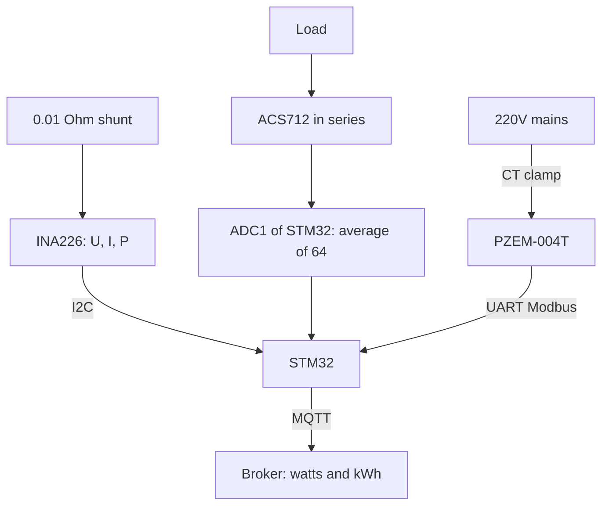

# STM32 Measures Current and Power - ACS712, INA226, PZEM-004T

![[assets/img/stm32-strum-power-scheme.png|600]]
*Fig. Three measurement levels: ACS712 in series with the circuit, INA226 on a shunt over I2C, PZEM-004T as a ready meter.*

> [!tip] What this note is
> From "how many volts" to "how many watt-hours": three proven ways to measure current with STM32 - from a penny Hall sensor to a meter with a display. Background: [[EN/10-Sensors/04-INA219-HX711.en|INA219 and strain gauges]], [[EN/06-Analog/01-ADC.en|STM32 ADC]], [[EN/06-Analog/05-Shunt-OPAMP.en|shunt and op amp]].

## 1. Goal

Cover current measurement for three scenarios:

- DC up to 30 A with galvanic isolation - ACS712;
- accurate small-power accounting (solar nodes, batteries) - INA226;
- 220V mains with no high-voltage soldering - PZEM-004T;
- from all this - watts, ampere-hours and MQTT telemetry.

| Sensor | Range | Accuracy | Interface |
| --- | --- | --- | --- |
| ACS712-05/20/30 | 5/20/30 A DC+AC | About 1.5 %, noise about 20 mA | analog, 185/100/66 mV/A |
| INA226 | 0-36V, shunt of choice | 0.1 %, 16 bit | I2C, alerts |
| PZEM-004T | 220V, up to 100 A with CT | About 1 % | UART Modbus, ready |

## 2. Architecture



Safety rule: STM32 and the low-voltage part are galvanically isolated from 220V only through the PZEM CT clamp. No phase shunts.

## 3. ACS712: Hall in Series

- current zero is VCC/2 (2.5V at 5V supply), sensitivity per version: 185, 100 or 66 mV/A;
- feed the module with 5V, read the output with the 3.3V ADC - no divider needed, since 2.5V plus the peak fits;
- 80 kHz band, but we need DC: average 64 measurements, drop min/max;
- zero calibration - with the load off, store in EEPROM.

## 4. INA226: Precise Metering

- 0.01 Ohm / 2W shunt at 3 A: 30 mV drop, 90 mW loss;
- address 0x40-0x4F with A0/A1 jumpers, up to 16 parts on one bus;
- x64 averaging and 1.1 ms conversion time - noise falls to microvolts;
- MASK/ENABLE register - hardware alert on current excess, route to EXTI;
- charge accounting: integrate current over time in the RTC domain.

## 5. Working HAL Code

```c
float acs_read_amps(void) {
  uint32_t sum = 0, mn = 4096, mx = 0;
  for (int i = 0; i < 64; i++) {
    HAL_ADC_Start(&hadc1);
    HAL_ADC_PollForConversion(&hadc1, 10);
    uint32_t v = HAL_ADC_GetValue(&hadc1);
    sum += v;
    if (v < mn) mn = v;
    if (v > mx) mx = v;
  }
  sum -= mn + mx;
  float mv = (sum / 62.0f) * 3300.0f / 4095.0f;
  return (mv - acs_zero_mv) / 66.0f;
}

float ina_read_amps(void) {
  uint8_t reg = 0x04;
  uint8_t buf[2];
  HAL_I2C_Master_Transmit(&hi2c1, 0x80, &reg, 1, 50);
  HAL_I2C_Master_Receive(&hi2c1, 0x80, buf, 2, 50);
  int16_t raw = (buf[0] << 8) | buf[1];
  return raw * 0.0005f;
}
```

The 66.0 factor is for the 30 A version; for 5 A use 185.0, for 20 A use 100.0. Calibrate `acs_zero_mv` at zero.

## 5.1 Energy Accounting: Ampere-Hours in Code

```c
static float ah_acc = 0;
static uint32_t ah_last = 0;

void energy_tick(float amps) {
  uint32_t now = HAL_GetTick();
  float dt_h = (now - ah_last) / 3600000.0f;
  ah_last = now;
  ah_acc += amps * dt_h;
  if (amps < 0.02f) return;
  mqtt_publish_float("energy/ah", ah_acc);
}
```

Call once a second with averaged current. The 20 mA zero threshold cuts Hall noise. Every hour write `ah_acc` to flash - accounting continues after reboot.

## 6. PZEM-004T over Modbus

| Step | Action |
| --- | --- |
| Connection | CT clamp on the phase, module power 5V, UART 9600 |
| Request | `B0 C0 A8 01 00 00 1D 94` - register read |
| Reply | voltage, current, power, energy, frequency, PF |
| Address | one on the bus by default, changed with a command |
| Bridge | publish further over [[12-Comm-Modules/06-WiFi-ESP-AT|WiFi modem]] or [[EN/15-Protocols/01-Modbus.en|Modbus bus]] |

The module counts energy (kWh) alone and never resets it on reboot - a ready meter out of the box.

## 7. Calibration and Checks

- ACS712: zero with no load, scale with a 1 A reference load (lamp plus multimeter);
- INA226: calibration register = 0.00512 / (Rshunt x Imax), check with a lab PSU;
- PZEM: compare against a home meter over a day, mismatch up to 2 % is normal;
- Hall temperature drift - re-calibrate zero once a season.

## 8. Common issues

| Symptom | Cause | Fix |
| --- | --- | --- |
| ACS712 shows 0.5 A with no load | zero offset not taken | zero calibration, store in EEPROM |
| Jumps of plus-minus 200 mA | PWM noise and nearby circuits | twisted pair, RC filter 1 kOhm plus 100 nF, averaging |
| INA226 reads zeros | wrong address (A0/A1) | I2C scan, check jumpers 0x40-0x4F |
| PZEM silent | wrong baud or address | 9600 8N1, read request per manual |
| Watts disagree with the meter | CT clamp on the wrong phase or open | clamp tight, arrow along the current |
| Zero drift in heat | Hall heating | re-calibration, or move to INA226 |

## 9. Related Notes

- [[EN/10-Sensors/04-INA219-HX711.en|INA219 and strain gauges]] - the younger brother of INA226.
- [[EN/06-Analog/05-Shunt-OPAMP.en|shunt and op amp]] - analog front end.
- [[EN/06-Analog/01-ADC.en|STM32 ADC]] - resolution, VREF, DMA.
- [[16-Projects/03-Energomonitor|energy monitor]] - ready project.
- [[EN/15-Protocols/01-Modbus.en|Modbus protocol]] - PZEM as slave.

## Official sources

- [ACS712 Current Sensor Carrier (Pololu)](https://www.pololu.com/product/2198) - 5/20/30 A versions, sensitivity.
- [INA226 (Texas Instruments)](https://www.ti.com/product/INA226) - registers, calibration, alerts.
- [PZEM-004T (Peacefair)](https://peacefair.cn/product/pzem-004t/) - protocol, CT clamps.
- [Arduino-INA226 (jarzebski, GitHub)](https://github.com/jarzebski/Arduino-INA226) - reference driver math.
