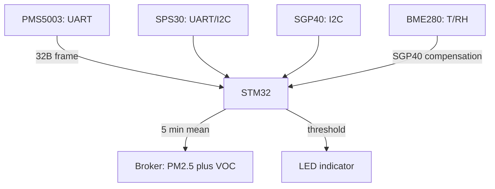

# STM32 and Air Quality - PMS5003/SPS30 Dust and SGP40 VOC

![[assets/img/stm32-air-quality-scheme.png|600]]
*Fig. Laser dust counter PMS5003 over UART plus digital SPS30/SGP40 over I2C - a full air quality post.*

> [!tip] What this note is
> A rare but wanted sensor class: PM2.5/PM10 and VOC index - what base BME/MQ kits lack. Three proven modules with different interfaces. Background: [[EN/10-Sensors/07-CO2-SCD40-MH-Z19.en|CO2 sensors]], [[EN/10-Sensors/08-Light-BH1750-TSL2591.en|light]], [[EN/04-Interfaces/01-UART.en|STM32 UART bus]].

## 1. Goal

Build a home air monitoring post on STM32:

- PM1.0/PM2.5/PM10 in ug/m3 - PMS5003 or SPS30;
- VOC index and raw ethanol/hydrogen - SGP40;
- WHO thresholds: PM2.5 over 15 ug/m3 (yearly norm) means alert;
- 5-minute averaging, send over [[12-Comm-Modules/06-WiFi-ESP-AT|WiFi modem]].

| Sensor | What it measures | Interface | Price/effort |
| --- | --- | --- | --- |
| PMS5003 | PM1/2.5/10, particles 0.3-10 um | UART 9600, 32-byte frame | cheap, fan |
| SPS30 | PM1/2.5/4/10, bins 0.3-10 um | UART or I2C | more accurate, auto-clean |
| SGP40 | VOC index 0-500, RH/T compensation | I2C 0x59 | needs SHT data |

## 2. Architecture



SGP40 lies with no temperature/humidity: the compensation algorithm wants RH/T from BME280 every cycle. PMS5003 and SPS30 are self-sufficient.

## 3. PMS5003: Laser Counter

- frame: `42 4D` plus length plus 12 PM values plus reserve plus checksum;
- passive mode: `42 4D E1 00 00 01 70 3F` - sleeps, read with a command;
- active mode - the fan spins always, lifetime about 8000 hours;
- for a home post: wake every 5 minutes, drop the first 30 s of data (flow warm-up);
- checksum is the sum of all bytes, always check it.

## 4. SPS30: Bins and Auto-Cleaning

- UART SHDLC protocol or plain UART, or I2C 0x69;
- start measurement, then read measured values: mass PM1/2.5/4/10 plus number bins;
- fan auto-clean once a week - schedule with a command;
- accuracy above PMS5003, price too;
- sleep command between cycles - no fan wear.

## 5. Working HAL Code

```c
int pms_read(uint16_t *pm25, uint16_t *pm10) {
  uint8_t f[32];
  if (HAL_UART_Receive(&huart2, f, 32, 2000) != HAL_OK) return -1;
  if (f[0] != 0x42 || f[1] != 0x4D) return -2;
  uint16_t sum = 0;
  for (int i = 0; i < 30; i++) sum += f[i];
  if (((sum >> 8) != f[30]) || ((sum & 0xFF) != f[31])) return -3;
  *pm25 = (f[12] << 8) | f[13];
  *pm10 = (f[14] << 8) | f[15];
  return 0;
}

int sgp_measure(uint16_t rh_ticks, uint16_t t_ticks, uint16_t *voc) {
  uint8_t cmd[8] = {0x26, 0x0F, 0, 0, 0, 0, 0, 0};
  cmd[2] = rh_ticks >> 8; cmd[3] = rh_ticks & 0xFF;
  cmd[5] = t_ticks >> 8; cmd[6] = t_ticks & 0xFF;
  cmd[4] = sgp_crc(cmd+2, 2); cmd[7] = sgp_crc(cmd+5, 2);
  HAL_I2C_Master_Transmit(&hi2c1, 0xB2, cmd, 8, 100);
  HAL_Delay(30);
  uint8_t out[3];
  HAL_I2C_Master_Receive(&hi2c1, 0xB2, out, 3, 100);
  if (out[2] != sgp_crc(out, 2)) return -1;
  *voc = (out[0] << 8) | out[1];
  return 0;
}
```

CRC-8 of SGP40: polynomial 0x31, init 0xFF - write `sgp_crc` separately:

```c
uint8_t sgp_crc(uint8_t *data, uint8_t len) {
  uint8_t crc = 0xFF;
  for (uint8_t i = 0; i < len; i++) {
    crc ^= data[i];
    for (uint8_t b = 0; b < 8; b++) {
      crc = (crc & 0x80) ? (crc << 1) ^ 0x31 : crc << 1;
    }
  }
  return crc;
}
```

Ticks for SGP40: relative humidity in ticks = RH% x 65535 / 100, temperature = (T + 45) x 65535 / 175. Compute from BME280 every cycle.

## 6. Reading the Data

| PM2.5, ug/m3 | Level | Action |
| --- | --- | --- |
| 0-12 | good | nothing |
| 12-35 | moderate | ventilate |
| 35-55 | bad for sensitive | filter/purifier |
| 55+ | bad | alert, close windows |

SGP40 VOC index: 100 is mean clean air, below 100 cleaner, above 100 worse, scale 0-500. This is a relative index, not ppm - explain in the interface.

## 7. Placement and Airflow

- PMS/SPS air intake - outside or near a window, not above a stove;
- SGP40 - inside the room, away from the kitchen and alcohol-based products;
- louvered case, sensors vertical (PMS fan blows up);
- first 24 hours - burn-in run, do not publish data;
- cross-check: two same sensors side by side for a week, PM2.5 mismatch up to 20 % is hobby-class normal.

## 8. Common issues

| Symptom | Cause | Fix |
| --- | --- | --- |
| PMS sends zeros | module in passive mode | read command or active mode |
| Checksum never matches | frame shift after restart | search for the 42 4D header, resync |
| SGP40 always 100 | no RH/T compensation | connect BME280, send ticks every second |
| PM2.5 jumps 10 times | fan clogged with dust | SPS30 auto-clean, blow out PMS |
| Data spikes at night | moisture/fog counts as PM | humidity filter: RH over 85 % means mark data suspect |
| I2C hangs after SGP40 | clock-stretching on a slow bus | 100 kHz, 4.7 kOhm pull-ups, HAL timeouts |

## 9. Related Notes

- [[EN/10-Sensors/07-CO2-SCD40-MH-Z19.en|CO2 sensors]] - the second pillar of air quality.
- [[EN/10-Sensors/02-BME280-SHT3x.en|BME280 and humidity]] - compensation for SGP40.
- [[EN/10-Sensors/10-MQ-Gas.en|MQ gas sensors]] - cheap VOC alternative.
- [[EN/04-Interfaces/03-I2C.en|I2C bus]] - addresses, pull-ups, clock-stretching.
- [[16-Projects/01-Meteostantsiya|weather station]] - where to fit the post.

## Official sources

- [PMS5003/7003 (AQICN Sensor Guide)](https://www.aqicn.org/sensor/pms5003-7003/) - frame format, checksum.
- [SPS30 (Sensirion)](https://sensirion.com/products/catalog/SPS30/) - bins, auto-clean, SHDLC.
- [SGP40 (Sensirion)](https://sensirion.com/products/catalog/SGP40/) - VOC index, RH/T compensation.
- [arduino-sps (Sensirion, GitHub)](https://github.com/Sensirion/arduino-sps) - reference driver math.
