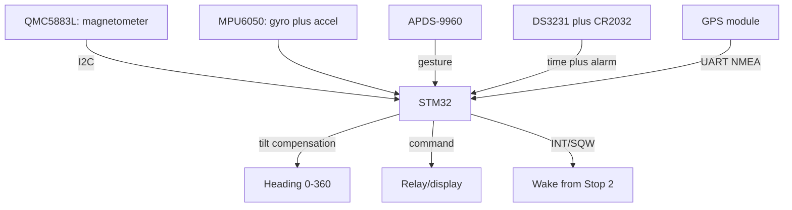

# STM32 and Rare Sensors - QMC5883L Magnetometer, APDS-9960 Gestures, DS3231 RTC

![[assets/img/stm32-mag-gesture-rtc-scheme.png|600]]
*Fig. Rare trio: QMC5883L gives heading, APDS-9960 reads gestures, DS3231 keeps time on a battery.*

> [!tip] What this note is
> Sensors with a long search: a digital compass for a robot and a drone, contactless gestures for a panel, accurate time for a logger. Plus fusion with gyroscope/accelerometer into 9-DOF. Background: [[EN/10-Sensors/03-MPU6050-IMU.en|gyroscope and accelerometer]], [[12-Comm-Modules/03-GPS-GSM|GPS modules]], [[EN/10-Sensors/11-Encoder.en|encoders]].

## 1. Goal

Give STM32 three rare measurements with ready modules:

- heading 0-360 deg with tilt compensation - QMC5883L plus accelerometer;
- up/down/left/right gestures and color - APDS-9960;
- time at plus-minus 2 ppm on a CR2032 battery - DS3231;
- together with MPU6050 and GPS - a full 9-DOF navigation fusion plus coordinates.

| Sensor | Bus/address | What it gives |
| --- | --- | --- |
| QMC5883L | I2C 0x0D | X/Y/Z of magnetic field, 16 bit |
| APDS-9960 | I2C 0x39 | gestures, RGB, proximity, ALS |
| DS3231 | I2C 0x68 | time, 2 alarms, temperature |
| MPU6050 (has) | I2C 0x68/0x69 | gyroscope plus accelerometer |
| GPS NEO (has) | UART | coordinates, PPS |

Warning: MPU6050 (AD0=HIGH) and DS3231 both sit on 0x68 - split AD0 to LOW (0x68) and leave DS3231, or the other way. Settle the address conflict before soldering.

## 2. Architecture



Heading with no tilt compensation lies up to 30 deg: take roll/pitch from the accelerometer and rotate the field vector. Gestures are for control with no touch (clean hands in the workshop).

## 3. QMC5883L: Digital Compass

- range plus-minus 8 Gauss, 16 bit, up to 200 Hz;
- modes: standby to continuous, oversampling 512;
- hard-iron calibration: turn the board in a figure eight for 30 s, take min/max offsets per axis;
- soft-iron (ellipse scale) - hard-iron is enough for hobby;
- heading formula: `atan2(-Y, X)` after compensation, then local magnetic declination;
- keep away from motors and steel screws - or move it out on a mast.

## 4. APDS-9960: Gestures, Color, Proximity

- gesture engine: 4 photodiodes U/D/L/R, interrupt on gesture;
- sensitivity and window time - GPENTH/GEXTH registers, tune for 5-20 cm distance;
- RGB plus ALS - object color and light level for backlight;
- proximity - wake the display on a hand approach;
- glass above the sensor - only IR-transparent, tinted glass kills gestures.

## 5. Working HAL Code

```c
float qmc_heading_deg(int16_t mx, int16_t my, float roll, float pitch) {
  float x = mx * cosf(pitch) + my * sinf(roll) * sinf(pitch);
  float y = my * cosf(roll);
  float h = atan2f(-y, x) * 57.2958f;
  if (h < 0) h += 360.0f;
  return h + MAG_DECL_DEG;
}

uint8_t apds_read_gesture(void) {
  uint8_t reg = 0xFC;
  uint8_t g = 0;
  HAL_I2C_Master_Transmit(&hi2c1, 0x72, &reg, 1, 50);
  HAL_I2C_Master_Receive(&hi2c1, 0x72, &g, 1, 50);
  return g;
}

void ds3231_get_time(uint8_t *h, uint8_t *m, uint8_t *s) {
  uint8_t reg = 0x00, b[3];
  HAL_I2C_Master_Transmit(&hi2c1, 0xD0, &reg, 1, 50);
  HAL_I2C_Master_Receive(&hi2c1, 0xD0, b, 3, 50);
  *s = (b[0] >> 4) * 10 + (b[0] & 0x0F);
  *m = (b[1] >> 4) * 10 + (b[1] & 0x0F);
  *h = ((b[2] >> 4) & 0x03) * 10 + (b[2] & 0x0F);
}
```

DS3231 keeps time in BCD - unpack high/low nibbles. Alarm1 alarm - to the second, route INT/SQW to EXTI for wake-up.

## 6. 9-DOF plus GPS Fusion

- the accelerometer gives roll/pitch in statics, the gyroscope gives fast turns, the magnetometer gives absolute course;
- complementary filter: angle = 0.98 x (angle plus gyro x dt) plus 0.02 x accel;
- GPS gives coordinates and speed, PPS gives the exact second for RTC trim;
- for a drone this fusion lives in [[16-Projects/06-Drone-FC|flight controller]];
- logging: DS3231 time plus coordinates plus course - a full track with no phone.

## 7. Compass Calibration

| Step | Action | Criterion |
| --- | --- | --- |
| 1 | Figure eight with the board for 30 s, record min/max | X/Y spread over 200 units |
| 2 | Offset = (max+min)/2, subtract | cloud center at zero |
| 3 | Check: 4 cardinal points | error up to 5 deg |
| 4 | Local magnetic declination | add a constant (Kyiv about +7 deg) |
| 5 | Check near the motor | move the module out if shift over 10 deg |
| 6 | Compare with GPS course in motion | mismatch up to 8 deg is normal |
| 7 | Repeat every half year | nearby magnets age the offset |

> [!warning] Iron near the compass
> Screws, motors and speakers are hard-iron offset sources. Calibrate in the final case: any move needs a new figure eight.

## 7.1 Quick Bench Check of the Fusion

- QMC5883L: turn the board, X/Y draw a circle in the plotter - alive.
- APDS-9960: move a palm at 10 cm, the gesture counter grows.
- DS3231: drop power for a minute, time did not reset - battery fine.
- All together: heading plus "right" gesture plus timestamp in one MQTT packet.

## 8. Common issues

| Symptom | Cause | Fix |
| --- | --- | --- |
| QMC5883L silent | address 0x0D vs 0x1A in clones | I2C scan, try both |
| Heading floats on tilt | no tilt compensation | add roll/pitch from the accelerometer |
| APDS-9960 sees phantoms | IR glare from lamps | lower sensitivity, shutter, dark glass |
| Gestures fire alone | proximity threshold low | raise threshold, gesture window 100-200 ms |
| DS3231 resets | dead CR2032 or no battery | replace, check 3V on the BAT pin |
| 0x68 conflict on the bus | MPU6050 and DS3231 together | MPU AD0 to LOW (0x68) or HIGH (0x69) |

## 9. Related Notes

- [[EN/10-Sensors/03-MPU6050-IMU.en|gyroscope and accelerometer]] - the second half of 9-DOF.
- [[12-Comm-Modules/03-GPS-GSM|GPS modules]] - coordinates and PPS.
- [[EN/10-Sensors/08-Light-BH1750-TSL2591.en|light sensors]] - the ALS part of APDS.
- [[EN/07-Timers/02-LPTIM-RTC-WDT.en|LPTIM, RTC, WDT]] - built-in RTC against DS3231.
- [[16-Projects/06-Drone-FC|flight controller]] - where the whole fusion lives.

## Official sources

- [Triple-axis Magnetometer QMC5883L (SparkFun)](https://www.sparkfun.com/products/17470) - registers, modes, calibration.
- [APDS-9960 Breakout (Adafruit)](https://www.adafruit.com/product/3595) - gestures, RGB, proximity.
- [DS3231 Precision RTC (Adafruit)](https://www.adafruit.com/product/3013) - BCD, alarms, battery.
- [Adafruit APDS9960 (Adafruit, GitHub)](https://github.com/adafruit/Adafruit_APDS9960) - reference gesture driver.
- [NEO-6 series (u-blox)](https://www.u-blox.com/en/product/neo-6-series) - GPS modules for navigation fusion, NMEA, PPS.
