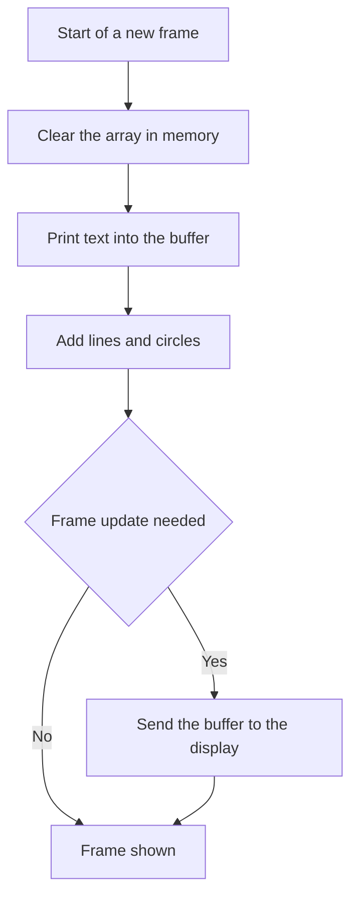

# OLED SSD1306 - Text and Graphics over I2C

![[assets/img/stm32-oled-ssd1306-scheme.png|600]]
*Fig. Connecting the OLED display to the controller over the data bus and power supply.*

> [!tip] Purpose of the note
> Give the full minimum for printing text and graphics on a small screen with no external frame memory.

## 1. Purpose

The small monochrome screen on the SSD1306 controller is the standard for debugging and indication. Typical resolution is 128 by 64 pixels. Connection runs over the data bus or over a fast serial channel. Logic power supply is 3.3 V. Built-in high-voltage generator feeds the organic LEDs. Contrast is controlled by software. Brightness is sufficient for indoor use. Outdoor use needs a protective shade. Lifetime is limited by pixel burn-in. Static pictures leave a ghost. A dynamic interface lives longer.

## 2. GDDRAM Memory and Pages

The controller holds its own 1 KB frame memory. The screen is split into eight pages of eight rows each. Every byte drives a vertical column of eight pixels. The lowest bit is on top. The horizontal coordinate runs from zero to 127. The vertical coordinate runs from zero to 63. The page number runs from zero to seven. Addressing can be horizontal or page based. Page mode suits text. Horizontal mode suits graphics. After a write the pointer moves on its own. A full frame goes out in one packet.

| Parameter | Value | Explanation |
| --- | --- | --- |
| Resolution | 128 by 64 pixels | Standard module |
| Frame memory | 1024 bytes | Eight pages of 128 bytes |
| Page | 8 pixel rows | Zero is the top of the screen |
| Data byte | 8 vertical pixels | Lowest bit on top |
| Addressing | Horizontal and page | Set by command |
| Logic power supply | 3.3 V | Compatible with the controller |
| Bus address | 0x3C or 0x3D | Depends on the select pin |

## 3. Data Bus Against Fast Channel

The data bus needs two wires and pull-up resistors. Standard speed reaches 400 kHz. A full frame takes about 20 ms. That is enough for text and slow menus. The fast channel needs four wires plus a select line and a command-data line. Speed is many times higher. A frame refreshes in a few milliseconds. It suits animation and plots. The choice depends on free pins and the task.

| Feature | Data bus | Fast channel |
| --- | --- | --- |
| Wires | Two plus power supply | Five plus power supply |
| Frame rate | No 50 frames really | Up to a hundred frames really |
| Bus load | Moderate | High but short |
| Free pins | Saves pins | Needs more pins |
| Animation | Weak | Good |
| Recommendation | Text and menus | Plots and gauges |

## 4. Frame Buffer in Controller Memory

Controller RAM is limited. A 1 KB buffer takes a visible share of small chips. In a chip with 20 KB it is five percent. In a chip with 4 KB it is a quarter of the memory. So sometimes drawing goes direct with no buffer. But a buffer simplifies fonts and overlays. Drawing goes into an array in memory. Then the whole array is sent to the screen. Double buffering is not needed. One array and one update flag are enough.

| Approach | Memory | Speed | When to take |
| --- | --- | --- | --- |
| Full 1 KB buffer | 1024 bytes | Fast drawing | Text plus graphics together |
| No buffer | Zero | Slow positioning | Very small chip |
| Partial update | 128 bytes | Medium | One status row |
| Two buffers | 2048 bytes | No flicker | Animation with no tearing |

```text
Карта памяті екрана 128 на 64:
  Сторінка 0 : рядки пікселів 00..07 | байти 000..127
  Сторінка 1 : рядки пікселів 08..15 | байти 128..255
  Сторінка 2 : рядки пікселів 16..23 | байти 256..383
  Сторінка 3 : рядки пікселів 24..31 | байти 384..511
  Сторінка 4 : рядки пікселів 32..39 | байти 512..639
  Сторінка 5 : рядки пікселів 40..47 | байти 640..767
  Сторінка 6 : рядки пікселів 48..55 | байти 768..895
  Сторінка 7 : рядки пікселів 56..63 | байти 896..1023
  Байт = 8 точок вертикально, молодший біт угорі
  Курсор сторінки рухається автоматично після байта
  Режими адресації: горизонтальний або посторінковий
```

## 5. Fonts and Graphic Primitives

A 5 by 7 font plus one gap gives 6 pixels per symbol. A row fits 21 symbols. The screen fits 8 rows in that font. A 3 by 5 font fits more symbols but reads worse. Cyrillic needs its own table. Latin is present in every library. Lines are drawn with the Bresenham algorithm. Circles are drawn with eight-point symmetry. Rectangles are four lines or a fill. Inversion gives a cursor and highlighting.

| Element | Size | Application |
| --- | --- | --- |
| Small font | 3 by 5 pixels | Service rows |
| Base font | 5 by 7 pixels | Main text |
| Large font | 11 by 18 pixels | Headers and digits |
| Line | Arbitrary | Grids and plot axes |
| Circle | Radius in pixels | Icons and scales |
| Fill | Rectangular area | Progress and background |

## 6. Refresh Rate and Brightness

A full frame transfer over the data bus takes about 20 ms. In practice that gives 30 frames per second for text. Plots refresh partially to save time. Brightness is set with the contrast command. Maximum brightness speeds up burn-in. A medium value extends lifetime. Display sleep switches off the voltage generator. Wake-up is instant. Separate power supply regulation apart from contrast is not needed.

| Setting | Range | Advice |
| --- | --- | --- |
| Contrast | 0..255 | Keep 160..200 for a room |
| Multiplex | 63 for height 64 | Do not change with no need |
| Screen offset | 0..63 | Zero for the standard module |
| Inversion | Yes or no | For cursor and alarms |
| Sleep | Off or on | Switch off when idle |
| Scroll | Hardware | For a running row |

## 7. Burn-in and Lifetime

Organic LEDs degrade with current and time. Static symbols darken unevenly. After a year of non-stop work the menu shadow is visible. Protection is simple. Blank the screen when idle. Lower the brightness. Move the splash screen. Avoid a full-screen white field. A black background lives longer. White text on black is optimal. Medium contrast doubles the lifetime against maximum.

## 8. Minimal HAL Driver

```c
#include "main.h"
#include "i2c.h"
#include <string.h>

#define OLED_ADDR   (0x3C << 1)
#define OLED_W      128
#define OLED_H      64
#define OLED_PAGES  8

static uint8_t oled_buf[1024];
extern I2C_HandleTypeDef hi2c1;

static void oled_cmd(uint8_t cmd)
{
  uint8_t d[2] = {0x00, cmd};
  HAL_I2C_Master_Transmit(&hi2c1, OLED_ADDR, d, 2, 100);
}

void oled_init(void)
{
  HAL_Delay(100);
  oled_cmd(0xAE);
  oled_cmd(0xD5); oled_cmd(0x80);
  oled_cmd(0xA8); oled_cmd(0x3F);
  oled_cmd(0xD3); oled_cmd(0x00);
  oled_cmd(0x40);
  oled_cmd(0x8D); oled_cmd(0x14);
  oled_cmd(0x20); oled_cmd(0x00);
  oled_cmd(0xA1);
  oled_cmd(0xC8);
  oled_cmd(0xDA); oled_cmd(0x12);
  oled_cmd(0x81); oled_cmd(0xCF);
  oled_cmd(0xD9); oled_cmd(0xF1);
  oled_cmd(0xDB); oled_cmd(0x40);
  oled_cmd(0xA4);
  oled_cmd(0xA6);
  oled_cmd(0xAF);
  memset(oled_buf, 0, sizeof(oled_buf));
}

void oled_setpos(uint8_t page, uint8_t col)
{
  oled_cmd((uint8_t)(0xB0 + page));
  oled_cmd((uint8_t)(0x00 + (col & 0x0F)));
  oled_cmd((uint8_t)(0x10 + (col >> 4)));
}

void oled_update(void)
{
  for (uint8_t p = 0; p < OLED_PAGES; p++)
  {
    oled_setpos(p, 0);
    uint8_t head = 0x40;
    HAL_I2C_Mem_Write(&hi2c1, OLED_ADDR, head,
      I2C_MEMADD_SIZE_8BIT, &oled_buf[p * 128], 128, 200);
  }
}

void oled_pixel(uint8_t x, uint8_t y, uint8_t on)
{
  if (x >= OLED_W || y >= OLED_H) return;
  uint16_t idx = (y / 8) * 128 + x;
  if (on) oled_buf[idx] |= (uint8_t)(1 << (y % 8));
  else    oled_buf[idx] &= (uint8_t)~(1 << (y % 8));
}

void oled_clear(void)
{
  memset(oled_buf, 0, sizeof(oled_buf));
  oled_update();
}
```

## 9. Frame Output Sequence



## Common Issues

| # | Issue | Why it is bad | Correct way |
| --- | --- | --- | --- |
| 1 | No pull-up resistors on the data bus | Lines float and the exchange breaks | Two 4.7 kOhm resistors to the power supply |
| 2 | Wrong address 0x78 instead of 0x3C | Driver stays silent with no answer | Shift by the read bit gives 0x78 in eight bits |
| 3 | Drawing past the buffer edge | Spoils the neighbour memory | Check coordinates in the pixel function |
| 4 | Maximum contrast always | Screen burns out in months | Keep a medium value and sleep |
| 5 | Refresh every loop with no need | Bus stays busy and slows tasks | Change flag and partial update |
| 6 | Cyrillic with no own table | Garbage instead of letters | Add a glyph table and encoding |

## Official Sources

- [SSD1306 datasheet (Solomon Systech)](https://www.adafruit.com/datasheets/SSD1306_1.0.pdf) - frame memory, commands, pages and power supply.
- [STM32 I2C HAL manual (ST)](https://www.st.com/en/embedded-software/stm32cube-mcu-packages.html) - bus transfer, memory and timeouts.

## See Also

- [[Home.en]]
- [[04-Interfaces/03-I2C.en | I2C bus]]
- [[04-Interfaces/02-SPI.en | SPI bus]]
- [[09-Firmware/02-HAL-LL.en | HAL and LL layers]]
- [[11-Vivid/02-TFT-LCD.en | Color display]]
- [[11-Vivid/03-Servo-Relay-MOSFET-WS2812.en | Power outputs and strips]]
