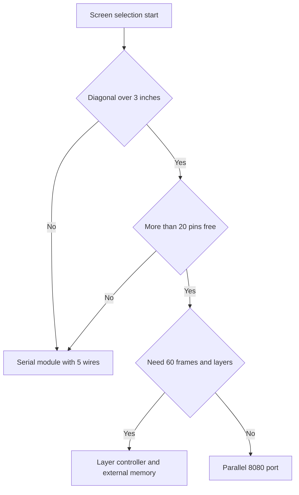

# TFT Displays - SPI, FSMC and LTDC

![[assets/img/stm32-tft-lcd-scheme.png|600]]
*Fig. Options for connecting a color matrix to the controller and backlight power supply.*

> [!tip] Purpose of the note
> Show three speed steps of a color screen from a simple serial channel to a full layer controller.

## 1. Purpose

A color matrix is needed where plots and menus with icons matter. Diagonals from one to seven inches. Resolution from 128 by 160 to 800 by 480. Color depth typically 16 bit. The 565 format gives speed and small memory. The ST7735 and ILI9341 matrix controllers are mass parts and cheap. A parallel bus gives more frames. A layer controller gives hardware layers and transparency. The choice depends on tasks and free pins. Backlight power supply runs separately over a switch.

## 2. ST7735 and ILI9341 Controllers

Both controllers understand the serial channel and the parallel port. The command-data select line decides what we send. Low level means command. High level means data. Reset uses a separate pin at start. The init script sets gamma and the window. With no script the screen is white or striped. Serial channel speed reaches tens of megahertz. A 320 by 240 frame in 565 format weighs 150 KB.

| Parameter | ST7735 | ILI9341 |
| --- | --- | --- |
| Typical diagonal | 1.8 inch | 2.4 and 2.8 inch |
| Pixels | 128 by 160 | 240 by 320 |
| Interface | Serial and parallel | Serial and parallel |
| Color depth | 12 and 16 bit | 16 and 18 bit |
| Frame in memory | About 40 KB | About 150 KB |
| Module price | Lowest | Medium |
| Application | Sensors and clocks | Remotes and menus |

## 3. Serial Channel Plus Select Line

The serial channel sends commands and data in one stream. The select line switches before every packet. Frame transfer goes in parts by rows. Direct output with no memory stalls the program. A channel with direct access frees the core. The core prepares the next row while transfer runs. A 20 MHz clock gives about 10 frames for ILI9341. That is enough for text and slow gauges. Video needs a parallel bus.

| Signal | Controller pin | Purpose |
| --- | --- | --- |
| Clock | Clock output | Bit sync |
| Data out | Data output | Stream of commands and pixels |
| Select | Any output | Frame active at low level |
| Command data | Any output | Command or data |
| Reset | Any output | Hardware reset of the matrix |
| Backlight | PWM output | Brightness over a switch |

```text
Звязки послідовного модуля ILI9341:
  Живлення логіки ......... 3.3 В від плати
  Земля ................... спільна з платою
  Вибір ................... PA4, активний низький
  Дані команди ............. PA6, нуль команда, одиниця дані
  Скидання ................. PA7, імпульс низького рівня
  Такти .................... PB3, до 20 МГц практично
  Дані ..................... PB5, молодший біт молодший
  Підсвітка ................ PA8 через ключ, ШІМ 1 кГц
  Сенсор окремо ............ чотири дроти того ж каналу
```

## 4. Direct Access and Frame Output

Direct access moves an array into the channel with no core help. Memory-to-peripheral mode. Half-word data size for the 565 format. Memory increment on. Transfer-complete interrupt switches the buffer. A double buffer removes tearing. One buffer is drawn while the other is sent. Memory for two ILI9341 frames is 300 KB. Only top chips hold that much. So strips of 20 rows go out more often. One strip weighs 15 KB and fits everyone.

| Mode | Strip memory | Speed | Complexity |
| --- | --- | --- | --- |
| No direct access | Zero | Lowest | Minimal |
| 20-row strip | 15 KB | Medium | Moderate |
| Full frame | 150 KB | High | Needs a big chip |
| Two frames | 300 KB | No tearing | Top chips only |

## 5. Parallel 8080 Port over FSMC

The 8080 parallel bus has 8 or 16 data lines. Write and read strobes are separate. Matrix select is separate. The command-data line is the lowest address bit. The memory controller maps the matrix as two addresses. One address for commands. Another address for data. A memory write becomes a matrix write. Speed is many times the serial channel. The price is more pins and a harder board. For F1 and F4 this is the classic path to a fast menu.

| 8080 Signal | Memory line | Explanation |
| --- | --- | --- |
| Data 0..15 | Data lines | Pixel and command bus |
| Select | Bank select | Matrix activity |
| Write | Write strobe | Byte write strobe |
| Read | Read strobe | Matrix status read |
| Command data | Lowest address bit | Zero command, one data |
| Reset | General-purpose output | Start pulse |

## 6. Layer Controller and External Memory

The layer controller builds sync for a large matrix. Row and frame sync signals. Pixel clock up to tens of megahertz. Two layers with transparency and color key. Background and menu with no copying. The frame lives in external dynamic memory. Size from 8 to 32 MB. Data bus 16 or 32 bit. On F4 and H7 chips this is the path to 800 by 480. Small chips have no layer controller. Then the serial channel and parallel bus remain.

| Feature | Serial channel | Parallel bus | Layer controller |
| --- | --- | --- | --- |
| Pins | Five | About twenty | About thirty |
| ILI9341 frames | About 10 | About 30 | No matrix controller needed |
| Large matrix | No | Hard | Yes up to 800 by 480 |
| Frame memory | In the matrix | In the matrix | External dynamic |
| Solution price | Lowest | Medium | Highest |
| Board complexity | Minimal | Medium | Four layers preferred |

## 7. XPT2046 Touch Controller

A resistive touch panel has four wires. The XPT2046 controller polls coordinates over the same serial channel. Separate select for the touch part. Touch interrupt on a separate pin. Polling runs in the interrupt or periodically. Calibration uses three corner points. Averaging five samples filters noise. Capacitive matrices have their own bus controller. There coordinates and gestures come ready.

## 8. Speed Price and Pin Comparison

| Option | Module price | Pins | 320 by 240 frames | Program resource |
| --- | --- | --- | --- | --- |
| ST7735 serial | Lowest | Five | About 30 | Small |
| ILI9341 serial | Low | Five | About 10 | Medium |
| ILI9341 direct access | Low | Five | About 20 | Medium plus buffer |
| ILI9341 parallel | Medium | Twenty | About 30 | Medium |
| Matrix on layer controller | High | Thirty | Sixty | Large plus memory |

## 9. HAL Code for a Serial Matrix

```c
#include "main.h"
#include "spi.h"

extern SPI_HandleTypeDef hspi1;
#define LCD_CS_GPIO   GPIOA
#define LCD_CS_PIN    GPIO_PIN_4
#define LCD_DC_GPIO   GPIOA
#define LCD_DC_PIN    GPIO_PIN_6
#define LCD_RST_GPIO  GPIOA
#define LCD_RST_PIN   GPIO_PIN_7

static void lcd_cs(uint8_t v)
{
  HAL_GPIO_WritePin(LCD_CS_GPIO, LCD_CS_PIN, v ? GPIO_PIN_SET : GPIO_PIN_RESET);
}

static void lcd_dc(uint8_t v)
{
  HAL_GPIO_WritePin(LCD_DC_GPIO, LCD_DC_PIN, v ? GPIO_PIN_SET : GPIO_PIN_RESET);
}

static void lcd_cmd(uint8_t c)
{
  lcd_dc(0); lcd_cs(0);
  HAL_SPI_Transmit(&hspi1, &c, 1, 100);
  lcd_cs(1);
}

static void lcd_data(uint8_t *p, uint16_t n)
{
  lcd_dc(1); lcd_cs(0);
  HAL_SPI_Transmit(&hspi1, p, n, 500);
  lcd_cs(1);
}

void lcd_reset(void)
{
  HAL_GPIO_WritePin(LCD_RST_GPIO, LCD_RST_PIN, GPIO_PIN_RESET);
  HAL_Delay(20);
  HAL_GPIO_WritePin(LCD_RST_GPIO, LCD_RST_PIN, GPIO_PIN_SET);
  HAL_Delay(120);
}

void lcd_window(uint16_t x0, uint16_t y0, uint16_t x1, uint16_t y1)
{
  uint8_t b[4];
  lcd_cmd(0x2A);
  b[0] = (uint8_t)(x0 >> 8); b[1] = (uint8_t)x0;
  b[2] = (uint8_t)(x1 >> 8); b[3] = (uint8_t)x1;
  lcd_data(b, 4);
  lcd_cmd(0x2B);
  b[0] = (uint8_t)(y0 >> 8); b[1] = (uint8_t)y0;
  b[2] = (uint8_t)(y1 >> 8); b[3] = (uint8_t)y1;
  lcd_data(b, 4);
  lcd_cmd(0x2C);
}

void lcd_fill(uint16_t color, uint32_t count)
{
  uint8_t b[64];
  for (uint8_t i = 0; i < 32; i++)
  {
    b[2 * i] = (uint8_t)(color >> 8);
    b[2 * i + 1] = (uint8_t)color;
  }
  lcd_dc(1); lcd_cs(0);
  while (count)
  {
    uint16_t chunk = (count > 32) ? 32 : (uint16_t)count;
    HAL_SPI_Transmit(&hspi1, b, (uint16_t)(chunk * 2), 500);
    count -= chunk;
  }
  lcd_cs(1);
}
```

## 10. Connection Path Selection



## Common Issues

| # | Issue | Why it is bad | Correct way |
| --- | --- | --- | --- |
| 1 | Select line never switches | Commands go as data and back | Separate pin and strict sequence |
| 2 | No init script | White screen or stripes | Init of gamma, windows and wake-up |
| 3 | Full frame in a small chip | Memory runs out and the stack falls | Transfer in 20-row strips |
| 4 | Backlight straight from the pin | Current exceeds the limit and the pin heats | Transistor switch and PWM brightness |
| 5 | Matrix reads with no delays | Wrong status and lock-up | Read pauses per controller manual |
| 6 | Long wires at high clock | Clock distortion and broken pixels | Short wires and lower speed |

## Official Sources

- [ILI9341 datasheet (Ilitek)](https://www.adafruit.com/datasheets/ILI9341.pdf) - commands, windows, color depth and reset.
- [STM32 LTDC application note (ST)](https://www.st.com/en/microcontrollers-microprocessors/stm32f429.html) - layers, sync and external memory.

## See Also

- [[Home.en]]
- [[04-Interfaces/02-SPI.en | SPI bus]]
- [[07-Timers/01-GPTIM-ADTIM.en | Timers and PWM]]
- [[02-Power-Supply/01-Power-Supply-Rails.en | Board power rails]]
- [[11-Vivid/01-OLED-SSD1306.en | OLED screen]]
- [[11-Vivid/03-Servo-Relay-MOSFET-WS2812.en | Power outputs and strips]]
