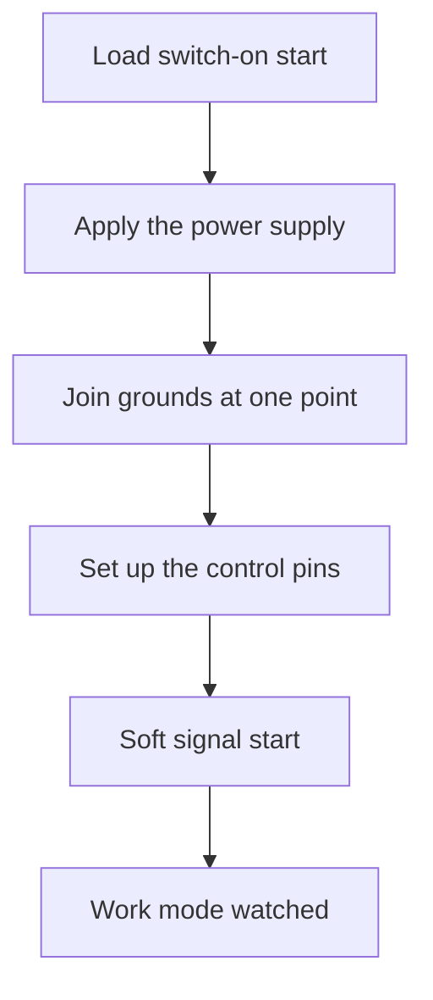

# Servo, Relay and WS2812 - Power Outputs

![[assets/img/stm32-servo-rele-ws-scheme.png|600]]
*Fig. Controller power outputs to drives, relays, switches and strips with separate power supply.*

> [!tip] Purpose of the note
> Gather the power outputs that beginners confuse and burn by wiring straight to pins.

## 1. Purpose

Controller pins source units of milliamps. Drives need hundreds of milliamps and amps. A switch or driver always sits between them. A servo asks for a control signal and separate power supply. A relay asks for a transistor and a protection diode. A heavy load asks for a logic-level field switch. An addressable strip asks for precise timing pulses and a strong PSU. Common ground is mandatory in every option. Split power supply saves from sags and restarts.

## 2. Servo and 50 Hz PWM

A standard servo expects a 20 ms period. Pulse width from 1 to 2 ms. The 1.5 ms middle is neutral. The 1 and 2 ms edges are minus and plus 90 degrees. Travel precision depends on timer stability. Servo power supply is 5 V separate from the board. Moving current is hundreds of milliamps. Stalled-rotor current is over an amp. Signal ground is common with the board. The first move starts smoothly from neutral.

| Parameter | Value | Explanation |
| --- | --- | --- |
| Period | 20 ms | 50 Hz rate |
| Minimum | 1 ms | Far left position |
| Neutral | 1.5 ms | Middle shaft position |
| Maximum | 2 ms | Far right position |
| Power supply | 5 V separate | Not from the controller board |
| Moving current | 200..600 mA | Depends on size |
| Control | Logic signal | Common ground |

## 3. Timer Math for Servos

Divide the timer clock with the prescaler down to 1 MHz. Then one microsecond is one tick. A 20000-tick period gives 20 ms. Compare 1000 gives 1 ms. Compare 1500 gives neutral. Compare 2000 gives 2 ms. A one-microsecond step gives smoothness. Jitter under a few microseconds is invisible. Changing compare with the timer running is safe. One timer with four channels feeds several servos.

| Step | Action | Example |
| --- | --- | --- |
| 1 | Set prescaler to 1 MHz | 84 MHz clock divided by 84 |
| 2 | Period 19999 plus zero | 20000 ticks total |
| 3 | Compare 1000..2000 | Shaft position |
| 4 | Start the PWM channel | Output to the servo |
| 5 | Smooth compare change | 10 us step per cycle |

```text
Налаштування таймера під серво:
  Такт шини .............. 84 МГц
  Прескалер ............... 83 (ділення на 84)
  Тік таймера ............. 1 мкс
  Період ARR .............. 19999 (20 мс разом)
  Порівняння CCR мінімум .. 1000 (1 мс, мінус 90)
  Порівняння CCR нейтраль . 1500 (1.5 мс, центр)
  Порівняння CCR максимум . 2000 (2 мс, плюс 90)
  Канал ................... ШІМ прямий, полярність висока
  Живлення серво .......... 5 В окремий блок, земля спільна
```

## 4. Relay over Transistor and Diode

A relay coil is an inductor. A 5 V coil current is typically 70 mA. A controller pin cannot pull that current. A transistor switches the coil to ground. A base resistor limits the control current. A protection diode kills the reverse spike. With no diode the spike punches the transistor. The diode sits across the coil in reverse. Cathode to the coil supply. Anode to the transistor collector. Relay contacts switch the load separately. Control and power grounds meet at one point.

| Element | Value | Purpose |
| --- | --- | --- |
| Transistor | Medium-power NPN | Coil switch to ground |
| Base resistor | 1 kOhm | Base current about 2 mA |
| Diode | Fast silicon | Coil spike killer |
| 5 V relay | Coil about 70 mA | Contacts for the load |
| Coil power supply | 5 V separate | Not from a controller pin |
| Isolation | Optocoupler if wanted | For inductive loads |

## 5. Logic-Level Field Switches

A logic-control field transistor opens from 3.3 V. Open-channel resistance is units of milliohms. Heating is small at amp currents. The gate has capacitance and asks for a resistor. A 100 Ohm series resistor removes ringing. A 10 kOhm pull-down to ground holds it closed at reset. The load switches to the supply over the drain. Leakage over a weak driver is slow. Fast PWM needs a gate driver. An inductive load again asks for a diode.

| Load | Switch | Note |
| --- | --- | --- |
| 12 V strip | N-channel logic | Brightness PWM possible |
| DC motor | N-channel plus diode | Reverse needs a bridge |
| Heater | N-channel with heatsink | Loss power math |
| Valve | N-channel plus diode | Spike protection |
| Bulb | N-channel with margin | Start current many times higher |

## 6. WS2812 Strip and Precise Pulses

Every LED has its own driver. The protocol is one-wire with time coding. Zero is a short high and a long low. One is the reverse. Bit period is 1.25 us. Reset is a long low over 50 us. Color order is green red blue. Power supply is 5 V from a separate unit. Full-white current is about 60 mA per LED. One hundred LEDs ask for 6 A. Thin tracks melt. Feed power from both ends and the middle.

| Parameter | Value | Explanation |
| --- | --- | --- |
| Zero bit | 0.4 us high | Tolerance of hundreds of ns |
| One bit | 0.8 us high | Tolerance of hundreds of ns |
| Period | 1.25 us | One bit time |
| Reset | Over 50 us low | End of the strip frame |
| Order | Green red blue | Not the classic order |
| LED current | Up to 60 mA white | PSU sizing math |
| Capacitor | 1000 uF at the input | Peak smoothing |

```text
Живлення стрічки окремим блоком:
  Блок 5 В 10 А ........... плюс до початку і кінця стрічки
  Земля блока ............. до землі плати обовязково
  Конденсатор 1000 мкФ .... між плюсом і землею на вводі
  Резистор 330 Ом ......... у лінії даних біля першого діода
  Дані .................... з виводу через резистор
  Запобіжник .............. у плюс стрічки на номінал блока
  Довжина ................. інжекція живлення кожні 2 метри
```

## 7. Bits as Bytes over Channel with Direct Access

Precise pulses are shaped by a channel in transmit mode. A strip bit is coded as a channel byte. A 6.4 Mbit channel speed gives 0.156 us per bit. Byte 11100000 gives a long high for one. Byte 11000000 gives a short high for zero. Direct access sends the array with no core. The timer or channel runs with no per-bit interrupts. Interrupt only fires at frame end. The method stays stable even with system interrupts. Hardware holds the bit rate.

## 8. HAL Code for Servo Relay and Strip

```c
#include "main.h"
#include "tim.h"
#include "spi.h"

extern TIM_HandleTypeDef htim3;
extern SPI_HandleTypeDef hspi2;

#define RELAY_GPIO GPIOA
#define RELAY_PIN  GPIO_PIN_5
#define WS_COUNT   24
#define WS_BUF_LEN (WS_COUNT * 24)

static uint8_t ws_spi_buf[WS_BUF_LEN];

void servo_init(void)
{
  HAL_TIM_PWM_Start(&htim3, TIM_CHANNEL_1);
}

void servo_angle(int8_t deg)
{
  if (deg < -90) deg = -90;
  if (deg > 90) deg = 90;
  uint16_t ccr = (uint16_t)(1500 + deg * 500 / 90);
  __HAL_TIM_SET_COMPARE(&htim3, TIM_CHANNEL_1, ccr);
}

void relay_set(uint8_t on)
{
  HAL_GPIO_WritePin(RELAY_GPIO, RELAY_PIN,
    on ? GPIO_PIN_SET : GPIO_PIN_RESET);
}

static void ws_add_byte(uint16_t pos, uint8_t v)
{
  for (uint8_t i = 0; i < 8; i++)
  {
    uint8_t bit = (uint8_t)((v >> (7 - i)) & 0x01);
    ws_spi_buf[pos + i] = bit ? 0xE0 : 0xC0;
  }
}

void ws_show(uint8_t r, uint8_t g, uint8_t b)
{
  uint16_t p = 0;
  for (uint8_t n = 0; n < WS_COUNT; n++)
  {
    ws_add_byte(p, g); p += 8;
    ws_add_byte(p, r); p += 8;
    ws_add_byte(p, b); p += 8;
  }
  HAL_SPI_Transmit_DMA(&hspi2, ws_spi_buf, WS_BUF_LEN);
  HAL_Delay(1);
}
```

## 9. Power Node Start-up Sequence



## Common Issues

| # | Issue | Why it is bad | Correct way |
| --- | --- | --- | --- |
| 1 | Servo powered from the board | Sags and controller restarts | Separate 5 V unit and common ground |
| 2 | Relay with no diode | Spike punches the transistor | Diode across the coil in reverse |
| 3 | Relay straight from the pin | Coil current burns the pin | Transistor switch and base resistor |
| 4 | Non-logic field switch | Opens partly and heats | Switch controlled from 3.3 V |
| 5 | Strip on thin wires | Voltage drop and red tail | Thick wires and feed every 2 meters |
| 6 | Strip data with no resistor | Echo and first-LED flicker | 330 Ohm resistor at the data input |

## Official Sources

- [STM32 TIM PWM manual (ST)](https://www.st.com/en/microcontrollers-microprocessors/stm32f4-series.html) - timer channels, compare and PWM rate.
- [WS2812B datasheet (Worldsemi)](https://cdn-shop.adafruit.com/datasheets/WS2812B.pdf) - timing diagrams, currents and color order.

## See Also

- [[Home.en]]
- [[07-Timers/01-GPTIM-ADTIM.en | Timers and PWM]]
- [[02-Power-Supply/01-Power-Supply-Rails.en | Board power rails]]
- [[11-Vivid/01-OLED-SSD1306.en | OLED screen]]
- [[11-Vivid/02-TFT-LCD.en | Color display]]
