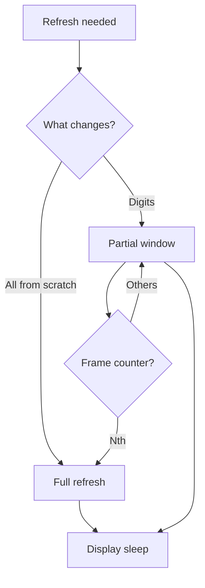

# E-paper - Ink Displays over SPI

![[assets/img/stm32-epaper-scheme.png|600]]
*Fig. Ink is in no hurry: full refresh against ghosts.*

> [!tip] Purpose of the note
> Teach e-paper output: full and partial refresh, temperature, sleep between frames.

## 1. Purpose

Electronic ink holds a picture with no power supply for years and reads in the sun. The price is seconds of refresh and ghosts from partial redraws. For price tags, plates and street boards there is nothing better.

## Full Against Partial

| Mode | Time | Quality | When |
| --- | --- | --- | --- |
| Full | Seconds | Perfect, no ghosts | Rare frames, price tag |
| Partial | Tens of ms | Ghosts pile up | Clock, digits |
| Rule | Every N-th partial takes one full! | Cleans the ghosts | N from the datasheet |

## Output Sequence

| Step | Action |
| --- | --- |
| 1 | Wake the display, wait for busy |
| 2 | Pour the frame into display RAM over SPI |
| 3 | Refresh command |
| 4 | Wait for busy to the end! |
| 5 | Put it back to deep sleep |

```c
// Скелет виводу кадру:
EPD_Wake();
EPD_SendFrame(fb, sizeof(fb));  // DMA бажано
EPD_Refresh(PARTIAL);
while (EPD_Busy());             // не чіпати під час!
EPD_Sleep();
```

## Mermaid: Refresh Mode Choice



## Temperature and LUT

| Topic | Practice |
| --- | --- |
| Cold slows down | Refresh time grows, contrast falls |
| LUT tables | Voltage waves from the datasheet for the temperature! |
| Built-in sensor | Some modules measure on their own |
| Street in winter | Full refresh and time margin |

## Power Supply: Sleep for Real

| Topic | Practice |
| --- | --- |
| Display deep sleep | Microamps between frames |
| Driver power supply | Switch off with a switch if the display never sleeps on its own |
| Battery for years | A frame once an hour is a tag beacon |

## Common Issues

| # | Issue | Why it is bad | Correct way |
| --- | --- | --- | --- |
| 1 | Only partial refreshes | Ghosts eat the picture | Periodic full refresh! |
| 2 | No busy wait | Frame is torn | Always wait for the flag |
| 3 | Wrong LUT | Pale picture | Tables for the temperature |
| 4 | Display never sleeps | Milliamps when idle | Deep sleep between frames |
| 5 | Frost with no margin | No time to refresh | Full plus longer wait |
| 6 | SPI at maximum | Glitches on the flat cable | Moderate speed |
| 7 | Whole frame in chip RAM | Never fits small chips | Strips over DMA |

## Three-Color Units: Red Is Slow

| Topic | Practice |
| --- | --- |
| Two passes | Black frame, then red |
| Double time | Plan into the refresh cycle |
| Partial red | Only on units that can! |
| Design | Red for accents, never whole text |

## Flat Cable and Mounting

| Rule | Explanation |
| --- | --- |
| Never bend the flat cable | A crack means stripes forever |
| Locked connector | Works loose from vibration |
| Display on a gasket | Glass cracks from screws |

## Official Sources

- [E-paper driver guides (Waveshare)](https://www.waveshare.com/wiki/Main_Page) - sequences, LUT, examples.
- [SSD1675 datasheet (Solomon)](https://www.solomon-systech.com/en/product/ssd1675a/) - commands, timings.

## Module Choice: Size and Color

| Diagonal | Resolution | For what |
| --- | --- | --- |
| 1.54 inch | 200x200 | Label, badge |
| 2.9 inch | 296x128 | Price tag, sensor |
| 4.2 inch | 400x300 | Plate, schedule |
| 7.5 inch | 800x480 | Street board |

| Color | Nuance |
| --- | --- |
| Black and white | Faster, cheaper |
| Three-color | Red refreshes long! |

## Fonts and Graphics: Memory Saving

| Topic | Practice |
| --- | --- |
| Whole font | Never fits small chips |
| Only needed glyphs | Digits and a few letters |
| RLE packing | Pack pictures, unpack in strips |
| Frame in flash | Static art lies ready, never drawn |

## Case: Battery Price Tag

| Parameter | Value |
| --- | --- |
| Refresh | Once a day from the server |
| Power supply | CR2450 for years |
| Cycle | Woke up, took the price, drew it, slept |
| Margin | Full refresh once a week against ghosts |

## See Also

- [[Home.en]]
- [[11-Vivid/01-OLED-SSD1306.en | OLED screen]]
- [[11-Vivid/02-TFT-LCD.en | Color display]]
- [[04-Interfaces/02-SPI.en | Exchange bus]]
- [[07-Timers/03-Sleep-Stop-Standby.en | Sleep modes]]
