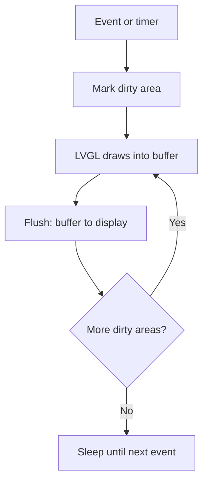

# LVGL - Graphics and Interfaces on STM32

![[assets/img/stm32-lvgl-scheme.png|600]]
*Fig. Pipeline: widget, buffer, flush to the display.*

> [!tip] Purpose of the note
> Teach interface bring-up: buffers sized for RAM, tick for animations, only needed fonts.

## 1. Purpose

LVGL draws buttons, plots and screens on a microcontroller with no OS. It works on top of your display driver: you give a flush function and a tick, the library gives widgets. For HMI panels and settings this is many times faster than hand-written graphics.

## What the Start Needs

| Component | Minimum |
| --- | --- |
| Display with driver | Flush in whole areas |
| Buffer | A tenth of the screen, two are better! |
| 1 ms tick | Timer or SysTick for animations |
| Input | Buttons, encoder or touch |

```c
// Скелет інтеграції:
lv_init();
lv_disp_draw_buf_init(&buf, buf1, buf2, SIZE);
lv_disp_drv_register(&drv);   // drv.flush = моя функція!
```

## Buffers: How Much RAM to Give

| Option | Memory | Effect |
| --- | --- | --- |
| Tenth of the screen | Little | Works, redraws in strips |
| Two buffers | Twice as much | Smooth, no tearing |
| Full frame | Whole screen | Perfect, but only with SDRAM! |
| No RAM | External SDRAM | F4 and H7 over FMC |

## Mermaid: Frame Cycle



## Widgets: What to Take

| Widget | For what |
| --- | --- |
| Label and Button | Text and presses |
| Slider and Switch | Settings |
| Chart | Measurement plot |
| Meter | Needle like a meter |
| Keyboard | Input with no physical buttons |
| Tabview | Tab screens |

## Fonts: Only Needed Ones

| Rule | Explanation |
| --- | --- |
| One size per task | Every font is kilobytes of flash! |
| Cyrillic separately | Latin and Cyrillic are different sets |
| LVGL converter | Makes a C array from TTF |
| Icon font | Symbols instead of pictures |

## Touch: Calibration

| Topic | Practice |
| --- | --- |
| XPT2046 over SPI | Classic for resistive panels |
| Calibration | Three points at first start |
| Storage | Factors in node EEPROM |
| Capacitive | More precise, but dearer and harder |

## Common Issues

| # | Issue | Why it is bad | Correct way |
| --- | --- | --- | --- |
| 1 | No 1 ms tick | Animations stand still | Timer or SysTick! |
| 2 | Flush blocks for long | Interface slows down | DMA plus ready flag |
| 3 | All fonts in the world | Flash is full | Only needed glyphs |
| 4 | Full frame with no RAM | Never fits | A tenth plus two buffers |
| 5 | Drawing from ISR | Buffer races | Only from tasks! |
| 6 | Touch with no calibration | Misses past buttons | Calibration at start |
| 7 | Heavy shadows and gradients | Frames take seconds | Plain style on weak chips |

## SquareLine: From Layout to Code

| Step | Action |
| --- | --- |
| 1 | Draw screens with the mouse |
| 2 | Export interface C files |
| 3 | Tie events to your logic |
| 4 | Logic apart - layout apart! |

## Resources: Where Pictures Lie

| Option | When |
| --- | --- |
| In chip flash | Small icons |
| In QSPI | Large backgrounds, no XIP needed |
| On SD card | Changes with no reflash |

## Official Sources

- [LVGL Documentation (LVGL)](https://docs.lvgl.io/master/) - widgets, buffers, porting.
- [SquareLine docs](https://docs.squareline.io/docs/squareline) - visual screen builder.
- [STM32 MCUs with Chrom-ART (ST)](https://www.st.com/en/microcontrollers-microprocessors.html) - DMA2D graphics booster.

## Styles and Themes: Cheap Beauty

| Trick | Price |
| --- | --- |
| Flat colors | Free |
| Small rounding | Cheap |
| Shadows and gradients | Dear on weak chips! |
| Dark theme | Fewer pixels glow on OLED |

## Settings Screen: Skeleton

```c
// Вкладки: виміри, налаштування, про пристрій:
lv_obj_t *tabs = lv_tabview_create(scr, LV_DIR_TOP, 40);
lv_obj_t *t1 = lv_tabview_add_tab(tabs, "Виміри");
lv_obj_t *t2 = lv_tabview_add_tab(tabs, "Ліміти");
lv_chart_create(t1);            // графік на першій
lv_slider_create(t2);           // повзунок на другій
```

## Performance: Keep It from Slowing

| Rule | Explanation |
| --- | --- |
| Refresh only what changed | Never redraw all every second |
| FPS counter | Measure, never feel |
| DMA2D (Chrom-ART) | Fills and copies in hardware on H7! |
| Display SPI rate | Maximum stable |

## See Also

- [[Home.en]]
- [[11-Vivid/02-TFT-LCD.en | Color display]]
- [[11-Vivid/04-Epaper.en | E-paper]]
- [[01-Hardware/04-H5-H7.en | Flagships for graphics]]
- [[04-Interfaces/02-SPI.en | Exchange bus]]
