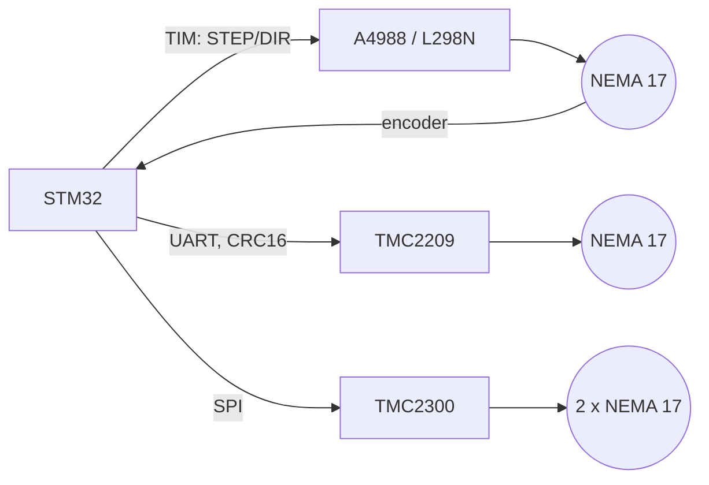

# Stepper Motors on STM32: L298N, A4988, TMC2209/2300

![[assets/img/stm32-stepper-scheme.png|600]]
*Fig. Stepper motors: TMC2209 UART, A4988 STEP/DIR from timers, encoder for the loop.*

> [!tip] What this note is
> Width extension of the output: timers ([[07-Timers/01-GPTIM-ADTIM.en | Timers]]) + control ([[10-Sensors/11-Encoder.en | Encoder]]). Three levels: L298N (cheap and rough), A4988 (microsteps, CNC classic), TMC2209/2300 (quiet, with UART/SPI and protection).

Three driver levels:



*Fig. Two mechanical levels on timers, one on UART/SPI.*

## 1. Motors: What NEMA 17 Is

- 1.8 deg per step gives 200 steps per turn; position counts with no encoder;
- holding torque 0.25-1.0 Nm (NEMA 17, 42 mm);
- winding current 1.5-2.0 A: the driver must feed no less, or the motor never opens up;
- full step means noise and vibration; microsteps split a step into 2-256 parts (256 in TMC2209).

## 2. Drivers: Comparison

| Driver | Interface | Current | Microsteps | Logic | Comment |
| --- | --- | --- | --- | --- | --- |
| L298N | STEP/DIR (2x) | to 2 A (really about 1) | only 1/1 | 5 V | cheap, hot, loud |
| A4988 | STEP/DIR + MS1-3 | 2 A | to 1/32 | 3.3-5.5 V | CNC classic, gantries, 3D |
| TMC2209 | UART + STEP/DIR | 2.2 A | to 1/256 | 3.3 V | quiet (StealthChop), torque protection |
| TMC2300 (carriage) | SPI | 2x2.5 A | to 1/32 | 3.3 V | two-motor carriage, always alive |

## 3. TMC2209: Pinout and Configuration

| TMC2209 Pin | On STM32 | Note |
| --- | --- | --- |
| STAP | TIM CH1 | steps to 250 kHz |
| SDIR | GPIO / PWM channel | direction |
| SCLK | GPIO | interface clock |
| MS0 / MS1 / MS2 | UART TX (config) | UART 115200 or 4.8 MHz |
| SEN / SP | GND + RSEN | 0.11 Ohm gives about 1.2 A, 0.15 gives about 0.9 A, 0.212 gives about 0.65 A |
| VMS | 12-24 V, to 30 V / 2 A | typical: 12 V, 2 A |
| PUL / EN | GPIO | enable control |

Configuration code (USART + HAL, 4-byte frames, CRC16-CCITT):

```c
// TMC2209: UART-регістри (16-бітні поля, CRC16-CCITT таблиця)
void tmc2209_write_reg(uint16_t reg, uint16_t val) {
  uint8_t b[4] = { (uint8_t)reg, 0, (uint8_t)val, 0 };
  b[1] = crc16_ccitt_table((uint8_t)reg);
  b[3] = crc16_ccitt_table((uint8_t)val);
  HAL_UART_Transmit(&huart1, b, 4, 10);
}
// GCONF: en_pwm_mode (StealthChop), mstep; CHOPCONF: toff, rhlg
// GSTAT / DRV_STATUS — читати: overheat, ступінь зсуву, lost step
```

## 4. A4988 on Timers: Working Code

- STEP - short pulses TIM CH1, DIR - GPIO switch or TIM CH2;
- trapeze: accel / cruise / brake over the steps-per-second profile;
- loop: TIM8 encoder mode (TI1/TI2 from the shaft encoder) gives eCAP counter gives plan difference.

```c
// STM32F4: A4988, TIM2 update @hz ( кроки/с), TIM8 ENC — енкодер
void TIM2_IRQHandler(void) {
  HAL_TIM_IRQHandler(&htim2);
  step_pulse();            // TIM8 CH1: імпульс 2 мкс (PWM, CCR=2)
  if (--remaining == 0) profile_state = IDLE;
  else if (profile_state == ACCEL) profile_hz++;
}
// кожен крок: порівнюємо eCAP_read() з планом; різниця > N → повернути крок
```

Microsteps: MS1 MS2 MS3 = 0/1/1 gives 1/16; 1/32 only at low speeds (torque falls about 30 %).

## 5. TMC2300: Short Note

- carriage with two SPI crystals (master-slave over SDO), both motors of one unit;
- driver always alive: current sensing on the GND return, with no separate H-bridge;
- STM32 only sends SPI commands plus trajectory planning remains;
- use: 3D printers, gantry machines, spindles with a high demand for silence.

## 6. Trajectory: Trapeze

| Phase | Formula | Note |
| --- | --- | --- |
| accel | v(t) = v0 + a·t, steps t = v0/a | a picked for torque (no dropouts) |
| cruise | v = const | 1/32 microsteps at work here |
| braking | symmetric, d = v²/2a | guaranteed stop with no slip |

Slip: too high an accel drops the motor out of step (knock, position drift). Control: encoder against the plan; a difference over N steps returns the cycle.

## 7. Common Issues

| Symptom | Cause | Fix |
| --- | --- | --- |
| Driver is hot | driver current over motor current | lower the CS register to the motor current |
| Drops out of step under load | accel too high / VMS low | smaller accel, VMS 24 V, smaller microsteps |
| TMC2209 silent over UART | SEN unjoined / wrong RSEN | check the 0.11/0.15 Ohm resistor, config revision |
| Loud buzz on full steps | no microsteps / L298N | A4988 1/16 or TMC2209 StealthChop |
| Loop is perfect but the table wobbles | mechanics: play, base screw, shaft | fix the mechanics, not the PID |
| Motor stops after 5 s | thermal protection (TMC2300) | less current, better heat removal |

## 8. Neighbour Notes

- [[07-Timers/01-GPTIM-ADTIM.en | Timers]], [[04-Interfaces/02-SPI.en | SPI]], [[04-Interfaces/01-UART.en | UART]]
- [[10-Sensors/11-Encoder.en | Encoder]] - quadrature and TIM-ENC
- [[09-Firmware/06-FreeRTOS.en | RTOS]] - planning for several axes
- [[02-Power-Supply/03-Power-Design.en | Power design]] - motor current peaks

## 9. Checklist When the Motor Never Turns

| Symptom | What to check |
| --- | --- |
| No reaction at all | EN pin HIGH, VMS 12 V, current on the driver |
| Turns in jerks | MS1/MS2/MS3 microstep state, driver current |
| Loud whistle | full steps give smaller microsteps or TMC2209 |
| Never keeps up with the profile | STEP rate (kHz), needless EN delay |
| Hot in 10 s | driver current over motor current gives lower CS |

Extra:

- VMS over 30 V - check the input protection, or lower the voltage;
- TMC2209 logic is 3.3 V - never tie 5 V to UART;
- keep STEP/DIR on one timer, never move between TIM units.

## Official Sources

- [TMC2209-Stepper (DigiKey)](https://www.digikey.com/en/products/detail/trinamic/TMC2209STEPPERTN/4989751) - UART driver, 2.2 A.
- [TMC2300-Stepper (DigiKey)](https://www.digikey.com/en/products/detail/trinamic/TMC2300STEPPERTN/6815382) - two-motor carriage, SPI.
- [A4988 (Analog Devices)](https://www.analog.com/en/timer-counter/digital-timer/a4988.html) - STEP/DIR, microsteps.
- [L298N (ST)](https://www.st.com/en/dual-power-supplies/l298n-dual-power-supply.html) - dual H-bridge 5 V.
- [STM32F4 (ST)](https://www.st.com/en/mcus-mpus/stm32f4.html) - TIM, encoder mode.
