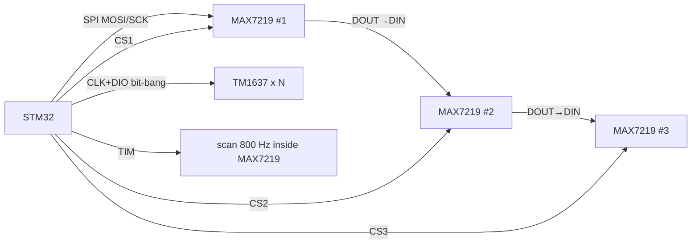

# STM32 and LED indication - MAX7219 matrices and TM1637 seven-segment

![[assets/img/stm32-max7219-tm1637-scheme.png|600]]
*Fig. MAX7219 via SPI drives 8x8 matrices, TM1637 - cheap 4-digit indicators over two wires.*

> [!tip] What this note is
> When OLED/TFT is too much: temperature table, counter, clock. MAX7219 is adult SPI driver with cascading, TM1637 is cheap I2C-like indicator. Base: [[EN/11-Vivid/01-OLED-SSD1306.en|OLED Displays]], [[EN/04-Interfaces/02-SPI.en|SPI Bus]], [[EN/03-GPIO/01-GPIO-Modes.en|GPIO Modes]].

## 1. Goal

Cover all LED indication with two chips:

- MAX7219: up to 8 seven-segment or 8x8 matrix, cascade to 8 units;
- TM1637: 4 digits + colon, clock/temperature for pennies;
- brightness by register, no PWM and flicker;
- 5x7 font for matrices stored in flash.

| Criterion | MAX7219 | TM1637 |
| --- | --- | --- |
| Interface | SPI 10 MHz, 16-bit packets | 2 wires (CLK/DIO), own protocol |
| Cascade | DOUT→DIN, as many as wanted | None, one per 2 pins (no address) |
| Power | 4-5.5V, segment current to 40 mA | 3.3-5V, brightness 8 levels |
| Price | More expensive, but one for 64 LED | Cheapest indicator overall |

## 2. Architecture



MAX7219 multiplexes scan at 800 Hz itself - MCU just writes registers. CS can be common (data goes through cascade) or separate for each - second option simpler to start.

## 3. MAX7219 registers

| Address | Register | Start value |
| --- | --- | --- |
| 0x09 | Decode-Mode | 0xFF - BCD decode all digits |
| 0x0A | Intensity | 0x08 - medium brightness |
| 0x0B | Scan-Limit | 0x07 - all 8 digits |
| 0x0C | Shutdown | 0x01 - on (0x00 - sleep 150 uA) |
| 0x0F | Display-Test | 0x00 - off |
| 0x01-0x08 | Digit 0-7 | data, lowest digit first |

RSET resistor between V+ and ISET sets segment current: 10 kOhm ≈ 40 mA. For home table use 20-30 kOhm - quieter and cooler. Driver power is 5V separate line, logic SPI is tolerant to 3.3V STM32 levels.

## 4. TM1637 protocol

- Start: CLK HIGH → DIO falls, stop - opposite;
- Command 0x40 - write data, 0xC0 - address 0, then 4 digit bytes;
- Command 0x88+N - display ON + brightness 0-7;
- Colon - bit 0x80 in second byte;
- ACK - module pulls DIO low on 9th clock, read and ignore;
- Timing microseconds - write bit-bang with `__NOP` delays.

## 5. Working HAL code

```c
void max7219_write(uint8_t addr, uint8_t data) {
  HAL_GPIO_WritePin(GPIOB, GPIO_PIN_6, GPIO_PIN_RESET);
  uint8_t pkt[2] = {addr, data};
  HAL_SPI_Transmit(&hspi1, pkt, 2, 50);
  HAL_GPIO_WritePin(GPIOB, GPIO_PIN_6, GPIO_PIN_SET);
}

void max7219_init(void) {
  max7219_write(0x0F, 0x00);
  max7219_write(0x09, 0xFF);
  max7219_write(0x0A, 0x08);
  max7219_write(0x0B, 0x07);
  max7219_write(0x0C, 0x01);
}

void max7219_number(int32_t v) {
  for (int d = 0; d < 8; d++) {
    max7219_write(d + 1, v < 0 && d == 7 ? 0x0A : abs(v) % 10);
    v /= 10;
  }
}

void tm1637_byte(uint8_t b) {
  for (int i = 0; i < 8; i++) {
    HAL_GPIO_WritePin(GPIOA, GPIO_PIN_5, GPIO_PIN_RESET);
    HAL_GPIO_WritePin(GPIOA, GPIO_PIN_6, (b & 1) ? GPIO_PIN_SET : GPIO_PIN_RESET);
    tm_tick();
    HAL_GPIO_WritePin(GPIOA, GPIO_PIN_5, GPIO_PIN_SET);
    tm_tick();
    b >>= 1;
  }
}
```

MAX7219 cascade: send packets for all chips in sequence (last in chain first), one LOAD pulse at end.

## 6. Fonts and matrices

- BCD decoder covers 0-9, minus, E, H, L, P, blank - rest drawn no-decode bit by bit;
- 8x8 matrix in no-decode: each digit register - one row, bits - columns;
- 5x7 font for rolling text kept as table 96×5 bytes in flash;
- Rolling text: frame shift every 120 ms by timer, no delays in code.

## 6.1 Cascade with separate CS: when simpler

If 2-3 matrices, separate CS per chip simplifies code: write same packets in parallel, LOAD common. Pins enough (PB6/PB7/PB8), speed same. Long DOUT→DIN chain saved for 4+ modules - there pin savings matter more than simplicity.

## 7. Power and currents

- 8 digits × 8 segments × 20 mA = peak 1.28 A with all eights - count PSU;
- Real average is 8 times lower (multiplex), but peak is real;
- RSET chosen by room brightness, not "by eye";
- Long SPI cables - twisted SCK/GND pair, else phantoms on matrix.

## 8. Common errors

| Symptom | Cause | Fix |
| --- | --- | --- |
| MAX7219 dark | Shutdown register 0x00 | Write 0x0C = 0x01 after init |
| All segments on | Display-Test on | 0x0F = 0x00 |
| Cascade shows same | Packets in wrong order | Last chip first in stream, LOAD at end |
| TM1637 garbage | No ACK pause or fast bit-bang | Delays 5-10 us, read ACK bit |
| Flickers on camera | Scan-limit less than digit count | Scan-Limit = count - 1 |
| Driver heats | RSET too small | Raise to 20-30 kOhm for indication |

## 9. Related notes

- [[EN/11-Vivid/01-OLED-SSD1306.en|OLED Displays]] - when graphics needed.
- [[EN/11-Vivid/05-LVGL.en|LVGL graphic library]] - heavy artillery.
- [[EN/04-Interfaces/02-SPI.en|SPI Bus]] - speeds, DMA output.
- [[EN/03-GPIO/01-GPIO-Modes.en|GPIO Modes]] - bit-bang for TM1637.
- [[EN/02-Power-Supply/03-Power-Design.en|STM32 Power Design]] - display peak current.

## Official sources

- [MAX7219 Datasheet (Analog Devices)](https://www.analog.com/en/products/max7219.html) - registers, RSET, cascade.
- [Grove 4-Digit Display / TM1637 (Seeed)](https://www.seeedstudio.com/Grove-4-Digit-Display.html) - protocol, commands, timing.
- [MD_MAX72XX (MajicDesigns, GitHub)](https://github.com/MajicDesigns/MD_MAX72XX) - fonts and matrix effects.
- [TM1637 (avishorp, GitHub)](https://github.com/avishorp/TM1637) - reference bit-bang driver.
