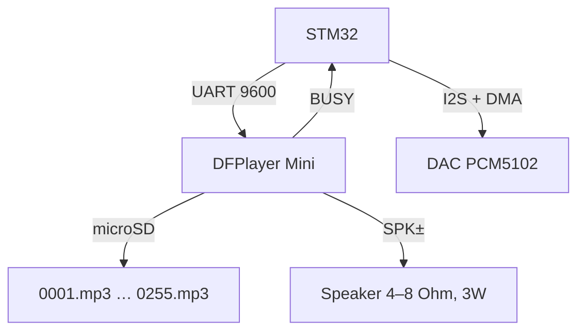

# STM32 and sound - DFPlayer Mini, I2S DAC and voice alerts

![[assets/img/stm32-audio-dfplayer-scheme.png|600]]
*Fig. DFPlayer plays MP3 from microSD by UART commands, I2S path for quality sound through external DAC.*

> [!tip] What this note is
> Sound on STM32 two ways: DFPlayer Mini (MP3 from card, controlled by 5 commands) and I2S (stream to DAC for music/synthesis). First covers 90% of tasks: doorbell, alarm, voice station assist. Base: [[EN/04-Interfaces/01-UART.en|UART Bus STM32]], [[EN/11-Vivid/03-Servo-Relay-MOSFET-WS2812.en|Power Peripherals]].

## 1. Goal

Give STM32 voice and music with minimal effort:

- DFPlayer Mini: MP3/WAV from microSD, volume, equalizer, busy signal;
- Control - UART 9600, answers parsed like AT;
- I2S: output PCM to DAC (PCM5102/MAX98357) for quality sound;
- Scenarios: measurement voice, alerts, doorbell with RFID.

| Path | Quality | Complexity | When to use |
| --- | --- | --- | --- |
| DFPlayer Mini | MP3 192 kbps, mono/stereo 3W | 5 commands | Voice, alerts, doorbell |
| I2S + DAC | 16-24 bit, 44.1 kHz | DMA stream, buffers | Music, synthesis, TTS stream |
| PWM + filter | Phone level | 1 pin + RC | Buzzer with melodies |

## 2. Architecture



## 3. DFPlayer commands

| Command | Hex | Meaning |
| --- | --- | --- |
| Play specific | 0x0D | File 0001-9999 |
| Volume | 0x06 | 0-30 |
| Play with repeat | 0x08 | 1-9999 times |
| Random | 0x18 | Random play |
| Query status | 0x42 | Busy, volume, errors |

```text
Handshake: send 0x7E 0xFF 0x06 ... 0xEF
Response: 0x7E 0xFF 0x06 0x00 ... if OK;
Timeout 2 s - if no answer, retry once, then alert.
```

## 4. I2S setup

```c
void I2S_Init(void) {
  hi2s2.Instance = SPI2;
  hi2s2.Init.Mode = I2S_MODE_MASTER_TX;
  hi2s2.Init.Standard = I2S_STANDARD_PHILIPS;
  hi2s2.Init.DataFormat = I2S_DATAFORMAT_16B;
  hi2s2.Init.MCLKOutput = ENABLE;
  hi2s2.Init.AudioFreq = I2S_AUDIOFREQ_44K;
  hi2s2.Init.CPOL = I2S_CPOL_LOW;
  hi2s2.Init.NSB = I2S_NSB_16BIT;
  HAL_I2S_Init(&hi2s2);
}
```

Buffer 512 samples in DMA circular mode; update from flash or stream.

## 6. Voice alert scenarios

| Scenario | Trigger | File | Priority |
| --- | --- | --- | --- |
| Door open | RFID tag | 001_door.mp3 | High |
| Temperature alert | ADC > threshold | 002_hot.mp3 | High |
| Low battery | VBAT < 3.0V | 003_battery.mp3 | Critical |
| Start finished | Boot complete | 004_start.mp3 | Low |

```text
Priority rule: critical > high > low; do not interrupt alert with lower priority.
```

## 7. Power and wire rules

| Topic | Practice |
| --- | --- |
| 5V to DFPlayer | Separate line, not from 3.3V LDO |
| Speaker current | Peak 3W, supply must hold |
| UART lines | Ground near, 9600 stable to 30 cm |
| I2S clock | Short to DAC, 44.1 MHz crystal near |

```text
Wire layout:
  red - 5V to module, black - GND, yellow - UART TX/RX;
  keep UART away from motor cables to avoid pickup;
  use twisted pair for UART over 10 cm.
```

## 8. File naming and SD rules

| Rule | Explanation |
| --- | --- |
| Names | 4 digits + .mp3: 0001.mp3 to 0255.mp3 |
| Format | FAT32, 8.3 filenames, not folder names |
| Size | Up to 32 GB, but small cards faster to scan |
| Folder | Flat in root, no subdirectories |

## 9. Volume and equalizer

| Volume | Hex command | Sound level |
| --- | --- | --- |
| 0 | 0x06 0x00 | Mute |
| 15 | 0x06 0x0F | Medium |
| 30 | 0x06 0x1E | Max |

```text
Equalizer preset: byte 0x07 with bitmask per band;
use factory preset if not required to personalize.
```

| Scenario | Trigger | File |
| --- | --- | --- |
| Door open | RFID tag | 001_door.mp3 |
| Temperature alert | ADC > threshold | 002_hot.mp3 |
| Low battery | VBAT < 3.0V | 003_battery.mp3 |
| Start finished | Boot complete | 004_start.mp3 |

## 6. Power and wire rules

| Topic | Practice |
| --- | --- |
| 5V to DFPlayer | Separate line, not from 3.3V LDO |
| Speaker current | Peak 3W, supply must hold |
| UART lines | Ground near, 9600 stable to 30 cm |
| I2S clock | Short to DAC, 44.1 MHz crystal near |

## 7. Common errors

| Symptom | Cause | Fix |
| --- | --- | --- |
| No sound from module | No microSD or wrong file name | 4-digit names, FAT32, 8.3 |
| Random skips | Power dip at peak | Bulk 470 uF near module |
| UART no answer | Wrong baud or wiring | 9600, GND first, 3.3V logic |
| I2S noise | Clock jitter | Dedicated crystal, short traces |
| Busy stuck | Previous play not finished | Wait or send stop command |

## 8. Official sources

- [DFPlayer Mini datasheet (DFRobot)](https://wiki.dfrobot.com/DFPlayer_Mini_SKU_DFR0299) - commands, timing, file rules.
- [PCM5102 datasheet (TI)](https://www.ti.com/lit/ds/symlink/pcm5102.pdf) - I2S, filter, analog out.
- [STM32 I2S reference (ST)](https://www.st.com/resource/en/application_note/an4031-stm32-spi-i2s-audio.pdf) - DMA, format, clock.

## See also

- [[EN/11-Vivid/01-OLED-SSD1306.en|OLED Displays]]
- [[EN/04-Interfaces/01-UART.en|UART Bus]]
- [[EN/03-GPIO/01-GPIO-Modes.en|GPIO Modes]]
- [[EN/02-Power-Supply/03-Power-Design.en|Power Design]]
