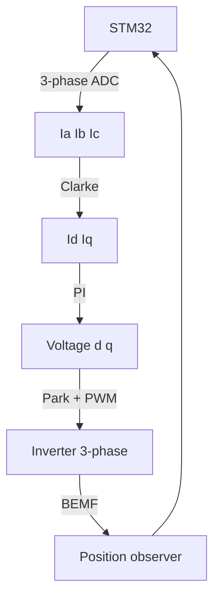

# STM32 and FOC BLDC - vector control and motor drive

![[assets/img/stm32-foc-bldc-scheme.png|600]]
*Fig. FOC block: current sensing, Park/Clarke, PWM, protection.*

> [!tip] Note purpose
> Move from simple block commutation to vector control for smooth torque, efficiency and silent operation.

## 1. Goal

- BLDC sensor: Hall + encoder for exact position;
- Sensorless: BEMF zero-cross or observer;
- FOC: Id=0 control for max torque per amp;
- Protection: overcurrent, overtemperature, undervoltage.

| Mode | Precision | Cost | When |
| --- | --- | --- | --- |
| Block (6-step) | Medium | Low | Simple fans, pumps |
| FOC + sensor | High | Medium | Robotics, drives |
| FOC sensorless | High | Higher software | Cost-sensitive |

## 2. FOC principle



## 3. Current sensing

| Method | Where | Accuracy |
| --- | --- | --- |
| Shunt low-side | Phase or DC bus | High, needs amplifier |
| Shunt high-side | Phase | High, more complex |
| Isolated | Phase with isolator | Best, expensive |

```c
uint16_t read_shunt(void) {
  return HAL_ADC_GetValue(&hadc1); // 12-bit, 3.3V ref
}
```

## 4. PWM and protection

| Protection | Threshold | Action |
| --- | --- | --- |
| Overcurrent | 150% rated | PWM off, wait 1 s |
| Overtemp | 85 C motor | Reduce current 50% |
| Undervoltage | 10V bus | Shutdown, alarm |
| Lock | No rotation 2 s | Stop and retry |

```text
PWM settings:
  frequency: 16-20 kHz (above audible, below switching loss);
  dead time: 1-2 us for MOSFET safety;
  resolution: 12-bit, center-aligned for symmetric PWM.
```

## 5. Common errors

| Symptom | Cause | Fix |
| --- | --- | --- |
| Torque ripples | Incorrect angle | Calibrate encoder or observer |
| Overcurrent trip | Noise on shunt | Filter, shield, layout |
| No start sensorless | Low BEMF | Pre-align or start at low speed |
| Overheating inverter | High PWM or poor heat | Heatsink, lower frequency |

## 6. Tuning parameters

| Parameter | Typical value | Note |
| --- | --- | --- |
| Id setpoint | 0 A | Max torque per amp |
| Current PI Kp | 0.5 | Start low, increase |
| Current PI Ki | 10 | Eliminate steady error |
| Speed PI Kp | 1.0 | Depends on inertia |
| PWM freq | 16 kHz | Above audible, efficient |

```text
Tune order: current loop first (fast), then speed loop (slow);
never change current and speed at same time.
```

## 6.1 Sensor comparison

| Type | Resolution | Cost | Wiring |
| --- | --- | --- | --- |
| Hall | 60° | Low | 3 wires |
| Encoder | High | Medium | 2-3 wires |
| Sensorless observer | High | Software only | None extra |

## 7. Protection logic

## 7. Protection logic

```c
void Safety_Check(void) {
  if (current_rms > I_MAX * 1.5f) {
    PWM_Disable();
    delay_ms(1000);
  }
  if (motor_temp > 85.0f) {
    id_ref *= 0.5f;
  }
}
```

## 8. Wiring and layout rules

| Rule | Practice |
| --- | --- |
| Shunt traces | Kelvin connection, short symmetrical |
| Phase wires | Twisted, near ground plane |
| Gate drive | Short to MOSFET, separate from power |
| Heat | Heatsink on inverter, temperature sensor |

## 9. Official sources

| Symptom | Cause | Fix |
| --- | --- | --- |
| Torque ripples | Incorrect angle | Calibrate encoder or observer |
| Overcurrent trip | Noise on shunt | Filter, shield, layout |
| No start sensorless | Low BEMF | Pre-align or start at low speed |
| Overheating inverter | High PWM or poor heat | Heatsink, lower frequency |

## 6. Official sources

- [ST Motor Control SDK](https://www.st.com/content/st_com/en/products/embedded-software/mcu-mpu-embedded-software/motor-control-software/stepping-motor-control-top-go.html) - FOC library.
- [AN1946 Sensors and actuators ST](https://www.st.com/resource/en/application_note/an1946-how-to-design-motion-control.pdf) - BLDC design.

## See also

- [[EN/11-Vivid/03-Servo-Relay-MOSFET-WS2812.en|Power Peripherals]]
- [[EN/03-GPIO/01-GPIO-Modes.en|GPIO Modes]]
- [[EN/02-Power-Supply/03-Power-Design.en|Power Design]]
