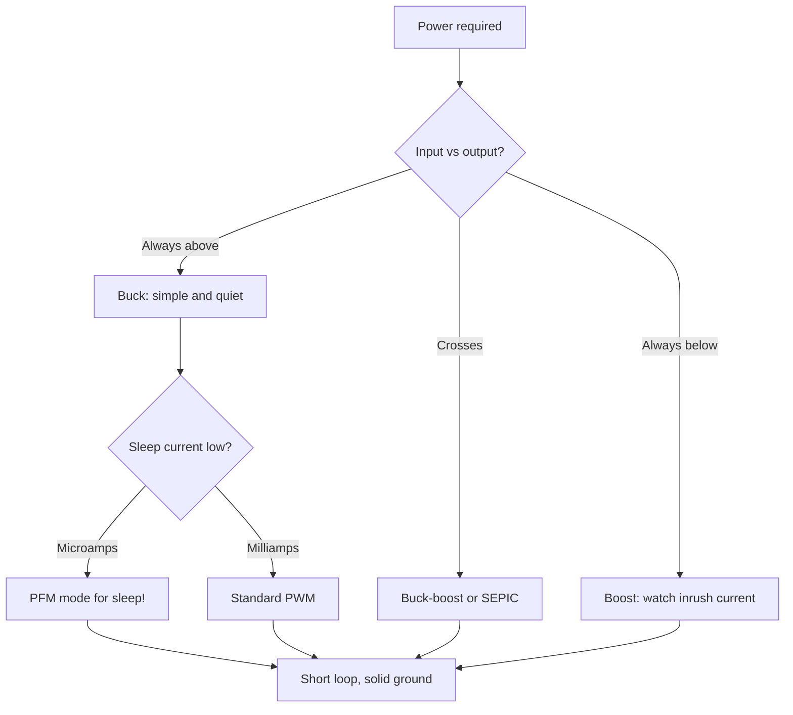

# Buck and boost - switched converters on board

![[assets/img/stm32-buck-boost-scheme.png|600]]
*Fig. From battery to 3.3 V: switch, inductor, diode and feedback loop.*

> [!tip] Note purpose
> Learn to choose the inductor and route the converter so efficiency is honest and noise is quiet.

## 1. Purpose

A linear regulator turns excess volts into heat. A switched converter turns the switch on and off hundreds of thousands of times per second and delivers almost everything to the load. For a battery node, the difference between 60 and 90 percent efficiency is months of life. The price is the right inductor and careful layout.

## Buck vs boost vs buck-boost

| Topology | Condition | Example |
| --- | --- | --- |
| Buck (step-down) | Input always above output | 5 V to 3.3 V |
| Boost (step-up) | Input always below output | 1.5 V to 3.3 V |
| Buck-boost | Input crosses output | Li-Ion 4.2-3.0 to 3.3 V |
| LDO | Difference small, current low | 3.6 V to 3.3 V, microamp sleep |

```text
Quick choice:
  stable 5 V supply ... buck;
  single AA cell ........ boost;
  Li-Ion full range .... buck-boost or LDO with margin.
```

## Inductor: heart of the circuit

| Parameter | Rule |
| --- | --- |
| Inductance | Per chip datasheet at switching frequency |
| Saturation current | With 30 percent margin over peak! |
| Winding resistance | Lower - less heating and higher efficiency |
| Shielding | Shielded inductor radiates less into air |

> An inductor in saturation is nearly a short. It heats, whistles, burns the switch.

## Capacitors and diode

| Element | Rule |
| --- | --- |
| Input bulk | Ceramic + electrolytic near the switch |
| Output LC | Ripple within analog tolerance |
| Schottky diode | Fast, with current and voltage margin |
| Synchronous switch | Replaces diode in modern chips - higher efficiency |

## Mermaid: selecting a converter



## Power-section layout

| Rule | Explanation |
| --- | --- |
| Switch-inductor-ground loop | Minimum area - less radiation |
| Feedback | Thin trace far from inductor |
| Power and signal ground | Single connection point near output |
| Heatsinking | Large copper polygons under hot packages |

## Converter sleep modes

| Mode | Behavior |
| --- | --- |
| PWM | Fixed frequency, hums at low current |
| PFM | Burst pulses, quiet in sleep |
| Shutdown | Disabled via EN pin, microamps |

```text
Battery practice:
  active - PWM, sleep - PFM automatically;
  EN pin from chip kills everything in deep sleep;
  converter sleep current - in the battery budget!
```

## Measuring efficiency honestly

| Step | Action |
| --- | --- |
| 1 | Electronic load or resistors |
| 2 | Measure input and output simultaneously with two instruments |
| 3 | Sweep from 10 to 100 percent of current |
| 4 | Check ripple with oscilloscope at full load |

## Common errors

| # | Error | Why bad | How right |
| --- | --- | --- | --- |
| 1 | Inductor without current margin | Saturation, heating, switch death | Peak + 30 percent |
| 2 | Long switch loop | Radiation and ringing | Compact near chip |
| 3 | Feedback near inductor | Ripple at output | Thin trace far away |
| 4 | No PFM in battery | Sleep eats milliamps | Chip with PFM! |
| 5 | Electrolytic without ceramic | High ESR at frequency | Ceramic at pins + bulk |
| 6 | Trusting datasheet efficiency | Ideal conditions there | Measure on your board |
| 7 | Forgotten sleep current | Battery drains in idle | Datasheet Iq in budget |

## Module ready or own schematic

| Variant | When |
| --- | --- |
| Ready module | Prototype, small batches, time more valuable |
| Own schematic | Series, price and size critical |
| Hybrid | Module on first revision, own on second |

## Official sources

- [TI Buck converter basics (TI)](https://www.ti.com/lit/an/slva059a/slva059a.pdf) - theory and calculation.
- [AN3435 SMPS layout (ST)](https://www.st.com/resource/en/application_note/an3435.pdf) - switched-circuit layout.

## Startup and soft-start: survive the first millisecond

| Problem | Solution |
| --- | --- |
| Charging output capacitors | Soft start: current rises gradually |
| Battery sag at start | Bulk at input holds first milliseconds |
| Power sequence | Core after peripheral - per chip datasheet! |

```text
Startup check with oscilloscope:
  channel 1 - input voltage, channel 2 - output voltage;
  starts monotonically without dips - good;
  ringing and sag - more bulk and softer start.
```

## Calculating inductor from scratch: example

| Step | Action |
| --- | --- |
| 1 | Input 5 V, output 3.3 V, current 1 A |
| 2 | Frequency from chip datasheet, e.g. 500 kHz |
| 3 | Current ripple 30 percent - classic |
| 4 | Formula from datasheet gives microhenries |
| 5 | Nearest standard value up! |

```text
Result check:
  inductor saturation current above peak with margin;
  winding resistance minimal among available;
  package does not overheat at full current.
```

## SEPIC: when buck-boost is not enough

| Topic | Practice |
| --- | --- |
| Plus SEPIC | No inversion, simpler control |
| Minus | Two inductors or coupled, lower efficiency |
| When | Battery crosses output regularly |

## See also

- [[Home.en]]
- [[EN/02-Power-Supply/01-Power-Supply-Rails.en|Power Supply Rails]]
- [[EN/02-Power-Supply/02-Battery-Power.en|Battery Power]]
- [[EN/17-Lab/04-EMI-EMC-Protection.en|EMI EMC Protection]]
- [[EN/13-Power-Modules/02-Level-Shift.en|Level Shift]]
