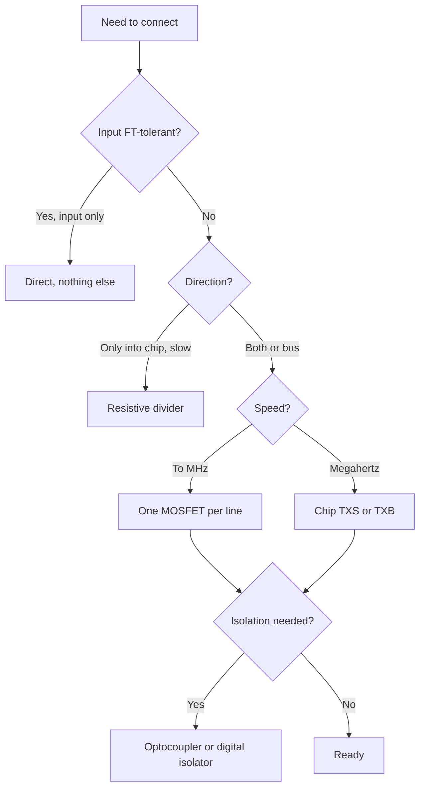

# Level shifting - 5 V and 3.3 V without smoke

![[assets/img/stm32-level-shift-scheme.png|600]]
*Fig. Bridge between worlds: what to put on each direction and speed.*

> [!tip] Note purpose
> Learn to connect 5-volt modules to a 3.3-volt chip so nothing burns and nothing stalls.

## 1. Purpose

The sensor and module world is still half 5-volt, while STM32 lives at 3.3 V. Some pins tolerate 5 V (FT), others do not. Direct connection by chance ends with a punctured input or crazy levels. The right bridge depends on direction, speed and bus.

## What pins tolerate

| Pin type | 5 V on input | How to know |
| --- | --- | --- |
| FT (five-volt tolerant) | Allowed | FT column in pin-table of datasheet! |
| Not FT (analog, NRST) | NOT ALLOWED | ADC inputs, reset, power |
| Chip output | Always 3.3 V | 5-volt module may not see a one |

```text
First rule:
  open pin table, find FT column;
  no mark - treat as non-tolerant.
```

## Methods by direction

| Method | Direction | Speed | Cost |
| --- | --- | --- | --- |
| Direct (FT input) | Into chip | Any | Free |
| Resistive divider | Into chip | Slow | Pennies |
| Bidirectional MOSFET | Both | To megahertz | Cheap |
| TXS0108 / TXB0108 | Both | Megahertz | Chip |
| Optocoupler | Into chip with isolation | Slow | Bonus isolation |

## Divider: only input and slow

| Topic | Practice |
| --- | --- |
| Calculation | Upper and lower resistors to 3.3 V from 5 V |
| Resistance | Tens of kOhm: less current, more noise |
| Speed | Only buttons, slow sensors |
| Output from chip | Divider NOT needed - chip gives 3.3 V by itself |

## MOSFET bridge for buses

| Topic | Practice |
| --- | --- |
| Schematic | One N-MOSFET + two pull-ups, gate at 3.3 V |
| Direction | Automatic both ways |
| Bus | I2C classic: works out of the box |
| Pull-ups | From each side to its own voltage! |

```text
I2C between 5 V and 3.3 V:
  MOSFET on SDA and on SCL;
  4.7 kOhm pull-up to 5 V on one side;
  4.7 kOhm pull-up to 3.3 V on the other;
  gate of both at 3.3 V permanently.
```

## Mermaid: selecting a bridge



## Specialized chips

| Chip | Channels | Feature |
| --- | --- | --- |
| TXS0108 | 8, open-drain | I2C and slow buses |
| TXB0108 | 8, push-pull | Fast, but fussy about capacitance |
| TXB0104 | 4 | Fewer pins for UART/SPI |
| 74LVC245 | 8, unidirectional | Simple and tough, direction by pin |

| TXB trap | Explanation |
| --- | --- |
| Long wires | Oscillation on line capacitance |
| Weak pull-ups | Conflict with internal drivers |
| Power from both sides | Both voltages mandatory! |

## Common errors

| # | Error | Why bad | How right |
| --- | --- | --- | --- |
| 1 | 5 V on non-FT pin | Input puncture | Pin table before connecting! |
| 2 | Divider on fast bus | Cut edges | MOSFET or chip |
| 3 | TXB on long wires | Oscillation | Short or TXS |
| 4 | No power from one side of TXS | Chip silent | Both voltages always |
| 5 | 3.3 V output not seen by 5 V input | One threshold above | Check module VIH! |
| 6 | Common ground missing | Floating levels | GND first wire |
| 7 | Optocoupler at megahertz | Too slow | Fast isolators for fast buses |

## Official sources

- [TXS0108 datasheet (TI)](https://www.ti.com/lit/ds/symlink/txs0108e.pdf) - bidirectional bridge.
- [AN10441 Level shifting (NXP)](https://www.nxp.com/docs/en/application-note/AN10441.pdf) - MOSFET bridges for I2C.

## 3.3 V output to 5-volt input: will it see

| Module parameter | Check |
| --- | --- |
| VIH minimum | Must be below 3.3 V minus margin! |
| TTL thresholds | See 3.3 V as one - good |
| CMOS at 5 V | Wants 3.5 V - 3.3 V at edge! |
| Output | Pull-up to 5 V via open-drain or bridge up |

```text
Practice:
  module with TTL input - direct, works;
  module with CMOS input at 5 V - bridge up mandatory;
  unsure - oscilloscope at module input under load.
```

## Bridge power: sequence

| Rule | Explanation |
| --- | --- |
| Both voltages before work | TXS without one side silent |
| Sequence | Per bridge datasheet, usually any |
| Bridge decoupling | 100 nF at each power pin |

## Bridge diagnostics: what to measure

| Symptom | Check |
| --- | --- |
| Output does not reach | Oscilloscope under load |
| Glitches at speed | Edges and ringing at edge |
| Bridge heats | Through currents during transition |
| Works sometimes | Both sides powered under load |

```text
Oscilloscope check:
  channel at bridge input, channel at output;
  sharp edges both sides - good;
  step in middle - bridge too slow.
```

## Long lines: what to add

| Length | Measure |
| --- | --- |
| To 30 cm | Bridge near receiver |
| To meters | Shielded pairs, lower speed |
| Meters | Differential RS485 pair instead of logic! |

## See also

- [[Home.en]]
- [[EN/13-Power-Modules/01-Buck-Boost.en|Switched converters]]
- [[EN/03-GPIO/01-GPIO-Modes.en|Pin modes]]
- [[EN/04-Interfaces/03-I2C.en|Exchange bus]]
- [[EN/17-Lab/04-EMI-EMC-Protection.en|Interference protection]]
