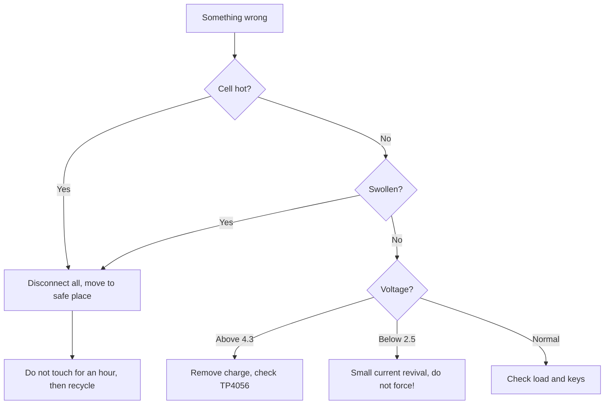

# Charge and battery protection - TP4056, DW01 and safety

![[assets/img/stm32-charger-protect-scheme.png|600]]
*Fig. Safety chain: charge, control, fuse.*

> [!tip] Note purpose
> Learn to charge Li-Ion safely: correct current, protection assembly and what to do on failure.

## 1. Purpose

Lithium gives energy density but does not forgive errors: overcharge - swelling, short - fire. The TP4056 (charge) + DW01 (protection) link covers the base for pennies. Understanding charge phases and protection thresholds separates a product from a petard.

## Charge phases CC and CV

| Phase | Condition | Current |
| --- | --- | --- |
| Pre-charge | Voltage below 3 V | Small revival current |
| CC (constant current) | Main charge | Set by resistor! |
| CV (constant voltage) | Near 4.2 V | Current falls by itself |
| End | Current below threshold | Charge done, LED off |

```text
TP4056 current by PROG resistor:
  larger resistor - smaller current;
  1.2 kOhm gives about 1 A;
  for small cell set less, else overheating.
```

## DW01: assembly guard

| Protection | Threshold | Action |
| --- | --- | --- |
| Overcharge | Near 4.3 V | Turns charge switch off |
| Overdischarge | Near 2.4 V | Turns load off |
| Short | Current through keys | Turns everything off instantly |
| Return | Remove load | Protection releases itself |

## Link with MOSFET keys

| Element | Role |
| --- | --- |
| Two N-MOSFETs back-to-back | Separate charge and discharge keys |
| DW01 controls gates | Opens and closes by thresholds |
| FS8205 ready pair | Two keys in one package |

```text
Typical protection board:
  cell -> keys -> DW01 measures;
  charge comes through the same keys;
  protection triggered - circuit broken.
```

## Mermaid: what to do on failure



## Thermal control

| Topic | Practice |
| --- | --- |
| NTC on cell | Stop charge on overheating |
| Charge range | Charge only when warm, not on freeze! |
| Placement | Sensor on cell itself, not nearby |
| Custom control | Chip ADC reads NTC - backup to hardware |

## Fuse: last line

| Type | When |
| --- | --- |
| PTC self-resetting | Small currents, convenient |
| Melting | Power circuits, reliable |
| None | Only if DW01 protection guaranteed |

## Node powered from Li-Ion

| Node | Schematic |
| --- | --- |
| Sleeping sensor | Cell -> LDO with low Iq |
| Active with peaks | Cell -> buck-boost |
| Charge from USB | USB -> TP4056 -> cell -> node |
| Load split | Radio and digital separate branches |

## Common errors

| # | Error | Why bad | How right |
| --- | --- | --- | --- |
| 1 | 1 A into small cell | Overheating and degradation | Current to cell capacity! |
| 2 | No DW01 protection | Short - fire | Protection board always |
| 3 | Charge on freeze | Lithium plating | Only when warm! |
| 4 | Forcing deep discharge | Cell does not revive | Small current, patience |
| 5 | Swollen cell in operation | Burst and ignition | Only recycle |
| 6 | Common GND bypassing keys | Protection does not see current | All through protection keys! |
| 7 | Storage fully charged | Accelerated aging | Store half charged |

## Official sources

- [TP4056 datasheet (Top Power)](https://dlnmh9ip6v2uc.cloudfront.net/datasheets/Prototyping/TP4056.pdf) - phases, current, NTC.
- [DW01 datasheet (Fortune)](https://www.ic-fortune.com/upload/Download/DW01-DS-English-V1.4.pdf) - protection thresholds.

## Choosing a cell for the node

| Parameter | Rule |
| --- | --- |
| Capacity | Sleep and active budget with 30 percent margin |
| Discharge current | Radio peaks 2 A - cell must deliver! |
| Format | 18650 for capacity, flat for size |
| With or without protection | Without - only with your DW01 board! |

```text
Cell check at purchase:
  weigh: light is fake, felt immediately;
  measure capacity with tester at low current;
  check internal resistance - high means old age.
```

## Storage and recycling

| Topic | Practice |
| --- | --- |
| Long storage | Half charge, cool |
| Dead cells | Not trash - to collection! |
| Damaged | Sand or salt solution, then recycle |
| Transport | Terminals insulated, short excluded |

## Solar top-up: nuances

| Topic | Practice |
| --- | --- |
| Panel through diode | Night discharge back excluded |
| MPPT for powerful | Cheap PWM controller for small |
| Cloud and shade | Design for worst week! |
| Supercap buffer | Radio peaks without cell sag |

```text
Energy balance:
  daily consumption vs worst-day generation;
  battery reserve for 5 cloudy days;
  else node goes silent exactly in winter.
```

## Protection test: checking triggering

| Test | How |
| --- | --- |
| Short at output | Through ammeter, instant off |
| Overcharge | Lab PSU instead of cell, slowly up |
| Overdischarge | Discharge to threshold, check off |

## See also

- [[Home.en]]
- [[EN/13-Power-Modules/01-Buck-Boost.en|Switched converters]]
- [[EN/13-Power-Modules/02-Level-Shift.en|Level shifting]]
- [[EN/02-Power-Supply/02-Battery-Power.en|Battery Power]]
- [[EN/02-Power-Supply/01-Power-Supply-Rails.en|Power Supply Rails]]
