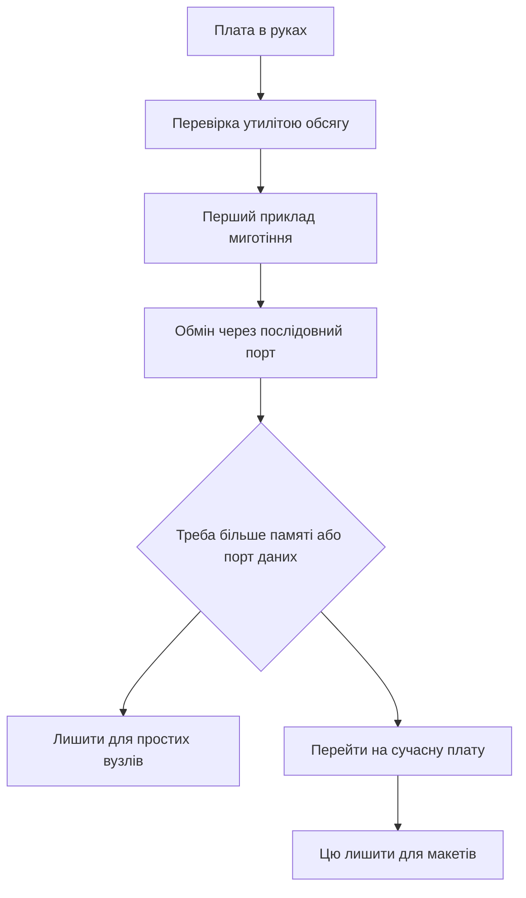

# Blue Pill - board map and limits

![[assets/img/stm32-bluepill-board-scheme.png|600]]
*Fig. Blue Pill map: controller, LED, mode jumpers, and weak regulator.*

> [!tip] Note purpose
> Give a map of the cheapest board: where the LED and buttons are, how to flash without data through the power connector, and when the board is already too little.

## 1. Purpose

The board gives the minimum to start: controller, crystal, reset and mode buttons, wire headers. A price of a few dollars makes it expendable for breadboards. Tons of examples for this controller shorten the search.

Плата вчить базовим речам: тактування від кварца, миготіння світлодіодом, обмін via послідовний порт, прошивка via налагоджувач. Обмеження вчать читати документацію: роз'єм живлення без даних, малий обсяг пам'яті, слабкий стабілізатор.

For serious tasks, modern boards with memory reserve and built-in debugger are used. This one remains for learning and simple nodes.

## 2. What is on the board

| Component | Where | Note |
| --- | --- | --- |
| Controller | Medium density, 64 КБ за маркуванням | Often 128 KB actually, перевіряти утилітою |
| LED | Line PC13, active low | Lights at zero on pin |
| Reset button | Near edge | Short reset pulse |
| Mode jumper | BOOT0 between zero and one | One leads to factory bootloader |
| Power connector | Power only | No data; a beginner trap |
| Regulator | Weak, about 100 mA | Power radio and motors separately |
| Crystal | 8 MHz | Accurate frequency for exchange |
| Headers | Two rows of 20 | Standard breadboard step |

```text
Карта плати вид зверху:
  +----------------------------------+
  |  [USB живлення]   [Кнопка RESET] |
  |                                  |
  |  BOOT0 [=]  BOOT1 (запаяно в 0)  |
  |                                  |
  |  Controller LQFP48 по центру      |
  |  Crystal 8 MHz поруч               |
  |                                  |
  |  PC13 -- LED (активний нуль)      |
  |  PA9  -- TX1  PA10 -- RX1        |
  |  PA13 -- SWDIO PA14 -- SWCLK     |
  |  3V3 -- стабілізатор -- 5V вхід  |
  +----------------------------------+
  Лівий ряд:  GND 3V3 5V ... PB...   |
  Правий ряд: GND 3V3 ... PA...      |
```

## 3. Controller details

| Parameter | Value | Explanation |
| --- | --- | --- |
| Core | 32-bit, 72 MHz | No hardware FPU |
| Program memory | 64 KB per passport | Check often shows 128 KB |
| RAM | 20 KB | Enough for learning |
| Voltage | 2.0-3.6 V | Pins partially tolerant to 5 V |
| Timers | Three general plus advanced | PWM and capture out of box |
| Interfaces | 3×USART, 2×I2C, 2×SPI (+ CAN in Connectivity Line) | CAN bus in larger packages |
| ADC | Twelve bits, ten channels | One module with switching |
| Unique ID | 96 bits | For firmware binding |

## 4. Clones and check

| Clone sign | How to see | What to do |
| --- | --- | --- |
| Different laser marking | Faint print or errors | Do not trust the label |
| Smaller size | Firmware does not fit | Tool will show real size |
| Crooked regulator | Heats and drops | Power from external source |
| No 32 kHz crystal | Empty pads for clock | Real-time clock drifts |
| LED on different line | Example does not blink | Seek specific vendor schematic |

```text
Перевірка утилітою перед роботою:
  1. Підключи налагоджувач: SWDIO, SWCLK, GND, 3V3.
  2. Запусти st-info --probe
  3. Дивись рядки flash і sram
  4. Якщо flash 131072 -- пощастило, вдвічі більше
  5. Запиши номер на стікері плати
```

## 5. Power and regulator limits

Board draws from power connector or from 5 V pin. Built-in regulator is weak and heats already with bright LED and two sensors. Radio modules with consumption peaks load the bus.

| Source | Voltage | Current | When to use |
| --- | --- | --- | --- |
| Power connector | 5 V | Up to 500 mA from port | Learning without peripherals |
| Вивід 5 V | 5 V | Depends on block | Separate block for breadboards |
| Вивід 3.3 in вхід | 3.3 in | Обхід стабілізатора | Точне лабораторне source |
| Налагоджувач | 3.3 in | Близько 100 мА | Тільки прошивка без навантаження |

## 6. Boot modes

| BOOT0 | Стан | Режим | how шити |
| --- | --- | --- | --- |
| 0 | Робота | Старт with пам'яті програм | Налагоджувач via дроти |
| 1 | Завантажувач | Заводський порт | Послідовний порт via перетворювач |

Послідовність for заводського завантажувача: перемичку in одиницю, натисни скидання, залий файл утилітою, перемичку назад in нуль, натисни скидання. Забута перемичка in одиниці це класика питань чому плата not стартує.

## 7. Flashing by three ways

| Шлях | that треба | Швидкість |
| --- | --- | --- |
| Налагоджувач | Чотири дроти and програматор | Швидко and with налагодженням |
| Послідовний порт | Перетворювач рівнів and утиліта | Повільно, але без програматора |
| Вбудований налагоджувач іншої плати | Перемички with плати with дебагером | Зручно, коли програматора немає |

```c
#include "stm32f1xx_hal.h"

int main(void)
{
  HAL_Init();
  __HAL_RCC_GPIOC_CLK_ENABLE();
  GPIO_InitTypeDef g = {0};
  g.Pin = GPIO_PIN_13;
  g.Mode = GPIO_MODE_OUTPUT_PP;
  g.Pull = GPIO_NOPULL;
  g.Speed = GPIO_SPEED_FREQ_LOW;
  HAL_GPIO_Init(GPIOC, &g);
  while (1)
  {
    HAL_GPIO_TogglePin(GPIOC, GPIO_PIN_13);
    HAL_Delay(500);
  }
}
```

code вище це перший example: налагоджувач заливає, світлодіод блимає двічі on секунду. Активний нуль означає запис нуля запалює, одиниці гасить.

```c
#include "stm32f1xx_hal.h"

extern UART_HandleTypeDef huart1;

void bluepill_hello(void)
{
  const char *msg = "Blue Pill живий\r\n";
  HAL_UART_Transmit(&huart1, (uint8_t *)msg, 17, 500);
}

void bluepill_button_poll(void)
{
  if (HAL_GPIO_ReadPin(GPIOA, GPIO_PIN_0) == GPIO_PIN_RESET)
  {
    HAL_GPIO_TogglePin(GPIOC, GPIO_PIN_13);
    HAL_Delay(200);
  }
}
```

## 8. Crystal and clocking

| Source | Частота | Точність |
| --- | --- | --- |
| Внутрішній 8 MHz | 8 MHz | Пливе with температурою |
| Зовнішній кварц | 8 MHz | Точний for обміну |
| Множник частоти | До 72 МГц | Максимум ядра |
| Годинник 32 кГц | Опція | Часто not запаяний |

Налаштування via графічний конфігуратор: зовнішній кварц, множник on максимум, дільники шин за паспортом. check миготіння with секундоміром показує помилку тактування.

## 9. Mermaid: what to do with the board



## 10. When the board is too little

| Задача | Чому not тягне | Куди рухатись |
| --- | --- | --- |
| Порт даних via роз'єм | Там тільки живлення | Плата with даними via роз'єм |
| Обробка звуку | Мало пам'яті and немає коми | Продуктивна родина with запасом |
| Бездротовий зв'язок | Слабке живлення | Плата with потужним стабілізатором |
| Точний годинник | No 32 kHz crystal | Плата with годинниковим кварцом |
| Налагодження with коробки | Треба зовнішній програматор | Плата with вбудованим дебагером |

## typical errors

| # | error | Чому погано | how правильно |
| --- | --- | --- | --- |
| 1 | Прошивка via роз'єм живлення | Там немає ліній даних | Налагоджувач або послідовний порт |
| 2 | Перемичка лишилась in одиниці | Плата завжди in завантажувачі | Повернути in нуль and скинути |
| 3 | Живлення радіо від плати | Просідання and перезапуски | Окреме source зі спільною землею |
| 4 | Довіра маркуванню пам'яті | Клон with іншим обсягом | check утилітою перед проєктом |
| 5 | 5 V on нетолерантний вхід | Пробій піна | table толерантності in паспорті |
| 6 | LED шукають одиницею | Він активним нулем | Нуль запалює, одиниця гасить |

## official джерела

- [Controller середньої щільності (ST)](https://www.st.com/en/microcontrollers-microprocessors/stm32f103c8.html) - паспорт, пам'ять and піни.
- [Заводський завантажувач for кожного чипа (ST)](https://www.st.com/resource/en/application_note/an2606-stm32-microcontroller-system-memory-boot-mode-stmicroelectronics.pdf) - режими and порти прошивки.
- [Утиліти програматора with відкритим кодом (GitHub)](https://github.com/stlink-org/stlink) - check обсягу and заливка.

## Див. також

- [[Home.en]]
- [[01-Hardware/01-F0-F1-Classic.en | F0/F1 classic]]
- [[09-Firmware/03-ST-Link-Proshivka.en | ST-Link flashing]]
- [[14-Devboards/02-Black-Pill.en | Black Pill board]]
- [[00-Start/04-Dev-Boards.en | Dev board overview]]
