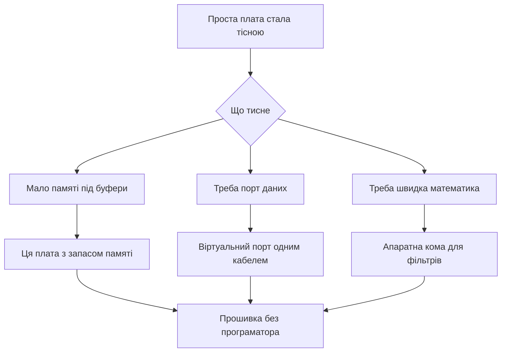

# Black Pill - board with built-in debugger and USB

![[assets/img/stm32-blackpill-board-scheme.png|600]]
*Рис. Карта Black Pill: продуктивне ядро, роз'єм даних, кнопки керування and запас живлення.*

> [!tip] Призначення ноти
> Показати наступний крок після простої плати: ті ж розміри, але швидше ядро, апаратна кома and справжній порт даних без зовнішніх перетворювачів.

## 1. Призначення

Плата лишається маленькою for макетів, але контролер вже with продуктивної родини. Апаратна кома прискорює фільтри and регулятори. Вища частота дає запас for дисплеїв and обміну.

Сучасний роз'єм несе дані, therefore консоль and прошивка йдуть одним кабелем. Кнопки скидання, режиму and користувача спрощують роботу без перемичок. Стабілізатор with запасом тримає датчики and карти пам'яті.

Плата підходить for навчання with прицілом on звук, графіку and швидкий обмін. Ціна трохи вища, але економить on перетворювачах and програматорі.

## 2. Варіанти контролера

| Плата | Контролер | Пам'ять | Особливість |
| --- | --- | --- | --- |
| Базова | F401CC | 256 КБ and 64 КБ | Апаратна кома and швидкість 84 МГц |
| Старша | F411CE | 512 КБ and 128 КБ | 100 МГц and більше інтерфейсів |
| Обидві | Корпус малий | Порти виведені on гребінки | Сумісні за пінами частково |

```text
Карта плати вид зверху:
  +----------------------------------+
  |  [USB-C дані]    [Кнопка NRST]   |
  |  [Кнопка BOOT0]  [Кнопка USER]   |
  |                                  |
  |  Контролер QFN48 по центру       |
  |  Кварц 25 МГц поруч              |
  |  Стабілізатор із запасом         |
  |                                  |
  |  PC13 -- LED (активний нуль)     |
  |  PA11 -- DM  PA12 -- DP          |
  |  PA13 -- SWDIO PA14 -- SWCLK     |
  |  5V вхід -- 3V3 вихід            |
  +----------------------------------+
```

## 3. Кнопки and керування

| Кнопка | Позначення | how тиснути |
| --- | --- | --- |
| Скидання | NRST | Коротке натискання перезапускає |
| Режим | BOOT0 | Тримати at ввімкненні for завантажувача |
| Користувача | USER on PA0 | Читати програмою how вхід |

Кнопка режиму замінює перемичку зі старої плати. not треба пінцета and загублених ковпачків. Користувацька кнопка дає вхід for меню без макетних дротів.

## 4. Порт даних via роз'єм

| Режим | that дає | Коли брати |
| --- | --- | --- |
| Віртуальний порт | Консоль via кабель | Налагоджувальні повідомлення |
| Завантажувач | Прошивка без програматора | Поле без інструментів |
| Пристрій свій | Клавіатура або флешка | Готові вироби |

Лінії даних виведені прямо on роз'єм via узгоджувальні резистори. Стара плата такого not мала and вимагала перетворювач. Тут один кабель закриває живлення, консоль and заливку.

## 5. Живлення із запасом

| source | Напруга | Можливість |
| --- | --- | --- |
| Роз'єм | 5 in | Живлення and дані разом |
| Вивід 5 in | 5 in | Зовнішній блок |
| Вивід 3.3 in | 3.3 in | Вхід від лабораторного джерела |
| Стабілізатор | 3.3 in до 500 мА | Датчики and карта пам'яті |

Запас струму тримає дисплей and датчики одночасно. Все одно радіо with піками краще живити окремо. Конденсатори біля контролера вже стоять достатні.

## 6. Кварц 25 МГц and тактування

| Параметр | Значення | Пояснення |
| --- | --- | --- |
| Кварц | 25 МГц | Базова точна частота |
| Максимум ядра | 84 або 100 МГц | Залежить від контролера |
| Порт даних | 48 МГц від множника | Точність критична for зв'язку |
| Внутрішній | 16 МГц | for старту без кварца |

Графічний конфігуратор сам рахує множники під 48 МГц for порту. error in налаштуванні дає непрацюючий порт at живому ядрі. check це поява віртуального порту in системі.

## 7. Прошивка без програматора

```text
Заливка через заводський завантажувач:
  1. Затисни BOOT0 і натисни NRST.
  2. Відпусти NRST, потім відпусти BOOT0.
  3. Підключи кабель до роз'єму плати.
  4. Система бачить пристрій завантажувача.
  5. Залий файл утилітою dfu-util.
  6. Натисни NRST для старту з пам'яті.
```

| Утиліта | Команда example |
| --- | --- |
| check | dfu-util -l показує пристрій |
| Заливка | dfu-util -a 0 -D firmware.bin -s 0x08000000 |
| Скидання | Натисни NRST руками |

## 8. Порівняння зі старою платою

| Параметр | Проста плата | Ця плата |
| --- | --- | --- |
| Ядро | 72 МГц без коми | 84-100 МГц with комою |
| Пам'ять програм | 64 КБ | 256-512 КБ |
| Оперативна | 20 КБ | 64-128 КБ |
| Роз'єм | Тільки живлення | Живлення плюс дані |
| Кнопки | Скидання and перемичка | Три кнопки без перемичок |
| Кварц | 8 МГц | 25 МГц |
| Стабілізатор | Слабкий | Із запасом |
| Прошивка | Тільки програматор або порт | Плюс режим via роз'єм |

## 9. code: перший віртуальний порт

```c
#include "usbd_cdc_if.h"

void cdc_hello(void)
{
  const char *msg = "Black Pill живий\r\n";
  CDC_Transmit_FS((uint8_t *)msg, 19);
}

void cdc_echo(uint8_t *buf, uint32_t len)
{
  CDC_Transmit_FS(buf, len);
}

int main_loop_cdc(void)
{
  cdc_hello();
  HAL_Delay(500);
  return 0;
}
```

Прийом реалізує колбек in стеку пристрою: байти with хоста приходять у буфер, програма відлунює назад. Передача це виклик відправки with копіюванням у кінцеву точку. Черги роблять for стабільного потоку.

```c
#include "stm32f4xx_hal.h"

void blackpill_led_init(void)
{
  __HAL_RCC_GPIOC_CLK_ENABLE();
  GPIO_InitTypeDef g = {0};
  g.Pin = GPIO_PIN_13;
  g.Mode = GPIO_MODE_OUTPUT_PP;
  g.Pull = GPIO_NOPULL;
  g.Speed = GPIO_SPEED_FREQ_LOW;
  HAL_GPIO_Init(GPIOC, &g);
}

void blackpill_user_button_init(void)
{
  __HAL_RCC_GPIOA_CLK_ENABLE();
  GPIO_InitTypeDef g = {0};
  g.Pin = GPIO_PIN_0;
  g.Mode = GPIO_MODE_INPUT;
  g.Pull = GPIO_PULLDOWN;
  HAL_GPIO_Init(GPIOA, &g);
}

void blackpill_poll(void)
{
  if (HAL_GPIO_ReadPin(GPIOA, GPIO_PIN_0) == GPIO_PIN_SET)
  {
    HAL_GPIO_WritePin(GPIOC, GPIO_PIN_13, GPIO_PIN_RESET);
  }
  else
  {
    HAL_GPIO_WritePin(GPIOC, GPIO_PIN_13, GPIO_PIN_SET);
  }
}
```

## 10. Mermaid: перехід on нову плату



## 11. Налагодження порту

| Симптом | Причина | Лікування |
| --- | --- | --- |
| Порт not with'являється | Множник not дає 48 МГц | verify дерево тактування |
| Пристрій невідомий | Немає резистора підтяжки | Дивитись схему конкретної плати |
| Обриви on швидкості | Довгий кабель | Короткий якісний кабель |
| Скидання at передачі | Слабке живлення | Живити від блока, not від хаба |

## typical errors

| # | error | Чому погано | how правильно |
| --- | --- | --- | --- |
| 1 | Очікування драйвера вручну | Сучасні системи бачать порт самі | verify диспетчер пристроїв після прошивки |
| 2 | Блокуюча відправка у перериванні | Зависання стеку пристрою | Відправка тільки with основного циклу |
| 3 | Довгий кабель for живлення and даних | Просідання and обриви | Короткий кабель and окреме живлення for навантаження |
| 4 | Плутанина варіантів контролера | Різний обсяг пам'яті | Читати маркування and конфігуратор |
| 5 | Ігнор тактування 48 МГц | Ядро живе, порт мовчить | Спочатку дерево частот, потім стек |
| 6 | Кнопка режиму без скидання | Завантажувач not стартує | Тримати кнопку and тиснути скидання |

## official джерела

- [Контролер F401CC with комою (ST)](https://www.st.com/en/microcontrollers-microprocessors/stm32f401cc.html) - частоти, пам'ять and порт.
- [Контролер F411CE with запасом (ST)](https://www.st.com/en/microcontrollers-microprocessors/stm32f411ce.html) - відмінності старшого варіанта.
- [Нота про порт пристрою повної швидкості (ST)](https://www.st.com/resource/en/application_note/an4879-usb-hardware-and-pcb-guidelines-using-stm32-mcus-stmicroelectronics.pdf) - плата and узгодження ліній.

## Див. також

- [[Home]]
- [[14-Devboards/01-Blue-Pill|плата Blue Pill]]
- [[09-Firmware/03-ST-Link-Proshivka|прошивка via ST-Link]]
- [[04-Interfaces/01-UART|послідовний порт UART]]
- [[00-Start/04-Devkit-plati|огляд плат]]
