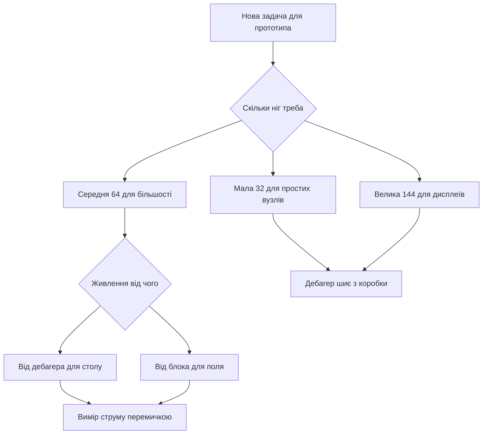

# Nucleo - development board with integrated ST-Link and Arduino headers

![[assets/img/stm32-nucleo-board-scheme.png|600]]
*Рис. Плата Nucleo: вбудований дебагер, гребінки розширення and перемички живлення.*

> [!tip] Призначення ноти
> Пояснити чому ця лінійка головна for старту: дебагер вже on платі, віртуальний порт with коробки and сумісність with модулями розширення.

## 1. Призначення

Лінійка закриває навчання and прототипи без купівлі програматора. Вбудований дебагер шиє свій контролер and зовнішні плати via дроти. Віртуальний порт дає консоль тим самим кабелем.

Три розміри дають вибір: маленька for компактних вузлів, середня for більшості задач, велика for процесорів with багатьма пінами. Сумісність with модулями розширення відкриває доступ до готових щитів.

Вимірювання струму via перемичку вчить оцінювати споживання. Гребінки with signals контролера дають доступ до всіх інтерфейсів.

## 2. Лінійка трьох розмірів

| Формат | Контролер example | Пінів | Коли брати |
| --- | --- | --- | --- |
| Мала 32 | F031, F042, G431 | 32 | Компактні вузли and навчання базове |
| Середня 64 | F103, F401, G474, L476 | 64 | Універсальна for більшості проєктів |
| Велика 144 | F429, F746, H743 | 144 | Дисплеї, мережа and запас інтерфейсів |

```text
Компонування середньої плати:
  +------------------------------------------+
  | [USB дебагер]  [Кнопка RESET чорна]      |
  | [Кнопка USER синя] [LED зелений LD2]     |
  |                                          |
  |  Контролер по центру                     |
  |  Кварц і кнопка користувача поруч        |
  |                                          |
  |  Морфо-гребінки ліва і права             |
  |  Гребінки під щити зверху і знизу        |
  |  Перемичка виміру струму IDD             |
  +------------------------------------------+
```

## 3. Вбудований дебагер

| Можливість | how працює | Навіщо |
| --- | --- | --- |
| Прошивка свого | via кабель with коробки | Старт без покупок |
| Прошивка зовнішньої | Вихідні сигнали on гребінці | Шиє прості плати поруч |
| Віртуальний порт | Міст до послідовного порту | Консоль без перетворювача |
| Оновлення | Окрема утиліта прошивки | Лікує старі версії |
| Живлення | Від роз'єму дебагера | Живить слабкі макети |

Дебагер шиє and зовнішні плати: зняти перемички, підключити три дроти сигналів and землю. Це рятує коли проста плата без дебагера лежить поруч.

## 4. Перемички живлення

| Позначення | Призначення | Положення |
| --- | --- | --- |
| JP5 | Вимір струму | Знята for амперметра |
| U5V | Живлення від дебагера | Замкнута за замовчуванням |
| E5V | Зовнішні 5 in | Замкнута at блоці живлення |
| VIN | Вхід 7-12 in | via стабілізатор плати |

typical error це живлення with двох джерел одночасно. Правило одне source for однієї плати. Вимір струму це зняти перемичку and in розрив увімкнути амперметр.

```text
Варіанти живлення однієї плати:
  Від дебагера ........ U5V замкнута, E5V розімкнута
  Від блока 5V ........ E5V замкнута, кабель дебагера тільки дані
  Від VIN 7-12V ....... VIN вхід, перемички за схемою плати
  Вимір струму ........ JP5 знята, амперметр у розрив
```

## 5. Гребінки розширення

| Гребінка | that виведено | Сумісність |
| --- | --- | --- |
| Морфо ліва | Живлення and аналогові | Всі сигнали контролера |
| Морфо права | Цифрові and інтерфейси | Прямий доступ без щитів |
| Щити зверху | Живлення 5 in and 3.3 in | Модулі розширення |
| Щити знизу | Послідовний and двопровідний | Датчики готовими пакетами |

Сумісність with щитами дає дисплей, мережу and мотори без паяння. Морфо-гребінки дають чисті сигнали for осцилографа and логічного аналізатора.

## 6. Вибір плати під задачу

| Задача | Яку брати | Чому |
| --- | --- | --- |
| Навчання базове | Мала 32 with простим чипом | Дешево and вистачає |
| Універсальна | Середня 64 with запасом | Більшість прикладів саме під неї |
| Дисплей and графіка | Велика 144 with контролером дисплея | Шина and пам'ять for кадрів |
| Низьке споживання | Варіант with літерою L | Режими сну and вимір струму |
| Звук and мотори | Варіант with F4 або G4 | Швидкість and точні таймери |
| Мережа дротова | Велика with мережевим інтерфейсом | Фізичний рівень on платі |

## 7. Перший проєкт крок за кроком

```text
Старт за десять хвилин:
  1. Постав перемичку живлення U5V.
  2. З'єднай кабелем роз'єм дебагера і комп'ютер.
  3. Відкрий графічний конфігуратор і вибери свою плату.
  4. Увімкни тактування від кварца і зелений світлодіод.
  5. Згенеруй код і натисни збірку.
  6. Натисни прошивку і дивись миготіння.
  7. Відкрий термінал віртуального порту для повідомлень.
```

```c
#include "stm32f4xx_hal.h"

extern UART_HandleTypeDef huart2;

void nucleo_hello(void)
{
  const char *msg = "Nucleo жива\r\n";
  HAL_UART_Transmit(&huart2, (uint8_t *)msg, 14, 500);
}

int main(void)
{
  HAL_Init();
  SystemClock_Config();
  MX_GPIO_Init();
  MX_USART2_UART_Init();
  nucleo_hello();
  while (1)
  {
    HAL_GPIO_TogglePin(GPIOA, GPIO_PIN_5);
    HAL_Delay(500);
  }
}
```

Зелений світлодіод on більшості плат висить on лінії PA5. Кнопка користувача on PC13 дає вхід for пауз and меню.

```c
#include "stm32f4xx_hal.h"

int nucleo_button_pressed(void)
{
  return HAL_GPIO_ReadPin(GPIOC, GPIO_PIN_13) == GPIO_PIN_RESET;
}

void nucleo_wait_button(void)
{
  while (!nucleo_button_pressed())
  {
    HAL_Delay(20);
  }
  HAL_Delay(50);
}
```

## 8. Вимірювання струму via перемичку

| Крок | Дія | Очікування |
| --- | --- | --- |
| 1 | Зняти перемичку виміру | Розрив шини живлення |
| 2 | Амперметр у розрив | Межа міліампер |
| 3 | Прошивка with циклами сну | Струм падає in паузах |
| 4 | Запис трьох значень | Робота, сон, простій |

Вимір вчить бачити ціну мегагерців: зниження частоти вдвічі ріже споживання помітно. Режими сну дають мікроампери між вимірами.

## 9. Mermaid: вибір плати



## 10. Зовнішня прошивка via дебагер

```text
Шиємо просту плату дебагером цієї:
  Дебагер Nucleo       Проста плата
  ----------------     ----------------
  SWCLK -------------- SWCLK
  SWDIO -------------- SWDIO
  GND ---------------- GND
  3V3 ---------------- 3V3 (якщо слабка)
  Крок: зняти перемички дебагера на цій платі!
```

## typical errors

| # | error | Чому погано | how правильно |
| --- | --- | --- | --- |
| 1 | Два джерела живлення разом | Зустрічні стабілізатори гріються | Одне source and правильні перемички |
| 2 | Стара прошивка дебагера | Обриви and невідомий пристрій | Оновити утилітою перед роботою |
| 3 | Щит with 5 in логікою | Перевантаження входів | Дільники або перетворювачі рівнів |
| 4 | Вимір струму без розриву | Амперметр паралельно дає коротке | Тільки in розрив знятої перемички |
| 5 | Плутанина номерів гребінок | Дзеркальні назви сигналів | Звіряти схему саме своєї ревізії |
| 6 | Консоль not бачить порт | Забутий міст дебагера | verify порт після підключення кабеля |

## official джерела

- [Керівництво плат середнього формату (ST)](https://www.st.com/resource/en/user_manual/um1724-stm32-nucleo64-boards-mb1136-stmicroelectronics.pdf) - перемички, живлення and дебагер.
- [Керівництво малих плат (ST)](https://www.st.com/resource/en/user_manual/um1956-stm32-nucleo32-boards-based-on-32pin-stm32-mcus-stmicroelectronics.pdf) - компактний формат and межі.
- [Оновлення прошивки дебагера (ST)](https://www.st.com/en/development-tools/stsw-link007.html) - утиліта оновлення and драйвери.

## Див. також

- [[Home]]
- [[00-Start/04-Devkit-plati|огляд плат]]
- [[09-Firmware/01-CubeIDE-CubeMX|налаштування CubeMX]]
- [[09-Firmware/03-ST-Link-Proshivka|прошивка via ST-Link]]
- [[14-Devboards/01-Blue-Pill|плата Blue Pill]]
