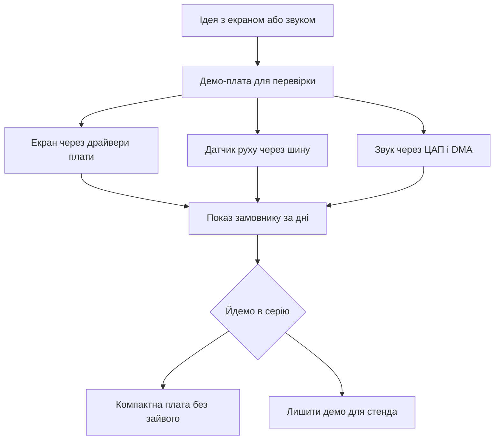

# Discovery - evaluation board with LCD, audio and USB

![[assets/img/stm32-discovery-board-scheme.png|600]]
*Рис. Плата Discovery: дисплей, датчики руху, звуковий тракт and кнопки введення.*

> [!tip] Призначення ноти
> Показати коли брати демо-плату замість універсальної: потрібен екран, звук або датчики with коробки for швидкої перевірки ідеї.

## 1. Призначення

Демо-плата це вітрина можливостей контролера: дисплей, датчики руху, мікрофони, звуковий тракт and кнопки вже розпаяні. Ідея перевіряється без макетних дротів and пошуку модулів.

Заводська прошивка одразу показує графіку, звук and сенсори in дії. Пакет драйверів плати дає прості виклики for екрана and звуку. Приклади виробника розкривають кожен вузол окремо.

for серії плата завелика and дорога, але for прототипа економить тижні. Після перевірки ідеї проєкт переносять on компактну плату.

## 2. that є on платі

| Вузол | example | Навіщо |
| --- | --- | --- |
| Дисплей | Кольоровий with сенсором | Графіка and меню без модулів |
| Датчик руху | Акселерометр and гіроскоп | Жести and нахил |
| Мікрофони | Цифрові with інтерфейсом | Голос and рівень шуму |
| Звуковий тракт | ЦАП and підсилювач | Мелодії and сигнали |
| Кнопки | Скидання and користувача | Введення без дротів |
| Дебагер | Вбудований with віртуальним портом | Прошивка with коробки |
| Пам'ять | Зовнішня флеш for кадрів | Картинки and шрифти |

```text
Компонування демо-плати:
  +------------------------------------------+
  | [USB дебагер]  [USB користувача]        |
  |                                          |
  |  +------------------------------------+  |
  |  |   Дисплей кольоровий з сенсором  |  |
  |  +------------------------------------+  |
  |                                          |
  |  Контролер + зовнішня флеш поруч         |
  |  Датчик руху + мікрофони з краю          |
  |  ЦАП звук + кнопки знизу                 |
  |  Гребінки розширення по боках            |
  +------------------------------------------+
```

## 3. Популярні варіанти

| Плата | Контролер | Екран | Фішка |
| --- | --- | --- | --- |
| F4 класика | F407 або F429 | Кольоровий | Дешева and тони прикладів |
| F7 швидка | F746 або F769 | Великий with сенсором | Швидка графіка and кеш |
| H7 флагман | H743 або H747 | Висока роздільність | Запас for складних інтерфейсів |
| L4 економна | L476 | Малий | Низьке споживання with екраном |

Вибір залежить від задачі: звук тягне навіть класика, плавна графіка просить швидку, складна логіка with мережею просить флагман.

## 4. Заводська прошивка

| Крок | Дія | Результат |
| --- | --- | --- |
| 1 | Живлення від кабелю | Екран світиться меню |
| 2 | Гортання сенсором | Сторінки демо |
| 3 | Нахил плати | Кулька або стрілка рухається |
| 4 | Кнопка користувача | Зміна режиму |
| 5 | Підключення навушників | Звукові приклади |

Демо варто зберегти окремим файлом перед своєю прошивкою. Злитий образ дозволяє повернути вітрину for показу. Утиліта зчитує образ via дебагер.

## 5. Пакет драйверів плати

| Виклик | that робить | Коли зручно |
| --- | --- | --- |
| Ініціалізація екрана | Налаштовує шину and підсвітку | Старт графіки одним рядком |
| Очищення екрана | Заливка кольором | Новий кадр меню |
| Вивід тексту | Шрифт on координати | Підписи and значення |
| Малювання кола | Примітив for індикаторів | Стрілки and шкали |
| Старт звуку | Налаштовує ЦАП and DMA | Мелодії без тріску |
| Читання датчика | Опитує рух via шину | Жести кожні 20 мс |

Драйвери плати лежать окремо від рівня абстракції контролера. Вони знають адреси мікросхем and розводку саме цієї плати. Перенос on свою плату вимагає своїх адрес and пінів.

```text
Шари коду для демо-плати:
  Твій код (меню, гра, виміри)
  -----------------------------
  Драйвери плати (екран, звук, датчики)
  -----------------------------
  Рівень абстракції (шина, таймер, DMA)
  -----------------------------
  Залізо контролера
```

## 6. Коли брати замість універсальної

| Задача | Чому демо краще | Межа |
| --- | --- | --- |
| check меню за день | Екран and сенсор вже є | Потім робити компактно |
| Датчик руху in керуванні | Калібрований вузол on платі | Точність побутова |
| Звукові сигнали | Тракт with підсилювачем | Гучність for столу |
| Навчання графіці | Приклади with кадрами | Пам'ять під великі картинки |
| Показ замовнику | Красива вітрина | Ціна for серії зависока |

Універсальна плата дешевша and гнучкіша for серії. Демо виграє швидкістю старту: розпакував, увімкнув, бачиш результат.

## 7. code: екран via драйвери

```c
#include "stm32f429i_discovery_lcd.h"

void demo_lcd_start(void)
{
  BSP_LCD_Init();
  BSP_LCD_LayerDefaultInit(1, LCD_FRAME_BUFFER);
  BSP_LCD_SelectLayer(1);
  BSP_LCD_Clear(LCD_COLOR_DARKBLUE);
  BSP_LCD_SetFont(&LCD_DEFAULT_FONT);
  BSP_LCD_SetTextColor(LCD_COLOR_WHITE);
  BSP_LCD_DisplayStringAtLine(2, (uint8_t *)"Discovery жива");
}

void demo_lcd_value(int line, int value)
{
  char buf[24];
  sprintf(buf, "Значення: %d", value);
  BSP_LCD_DisplayStringAtLine(line, (uint8_t *)buf);
}

void demo_lcd_circle(uint16_t x, uint16_t y, uint16_t r)
{
  BSP_LCD_SetTextColor(LCD_COLOR_YELLOW);
  BSP_LCD_DrawCircle(x, y, r);
}
```

Буфер кадру лежить у зовнішній пам'яті for великих роздільностей. Шар дозволяє малювати меню окремо від фону. Шрифти тримають кирилицю частково, перевіряти таблицею символів.

```c
#include "stm32f429i_discovery_gyroscope.h"
#include "stm32f429i_discovery_audio.h"

void demo_motion_start(void)
{
  BSP_GYRO_Init();
}

void demo_motion_poll(float *gx, float *gy, float *gz)
{
  BSP_GYRO_GetXYZ(gx, gy, gz);
}

void demo_beep(void)
{
  BSP_AUDIO_OUT_Init(OUTPUT_DEVICE_HEADPHONE, 70, 44100);
  BSP_AUDIO_OUT_Play((uint16_t *)tone_buf, TONE_LEN);
  HAL_Delay(200);
  BSP_AUDIO_OUT_Stop(CODEC_PDWN_SW);
}
```

Опитування датчика кожні 20 мс дає плавні жести. Звук via прямий доступ not вантажить ядро. Гучність 70 це голосно for навушників, починати with меншої.

## 8. Mermaid: від ідеї до серії



## 9. Живлення and споживання

| Режим | Споживання | Пояснення |
| --- | --- | --- |
| Демо with підсвіткою | Сотні міліампер | Екран їсть найбільше |
| Звук on динамік | Піки вище середнього | Підсилювач просить струму |
| Сон with екраном вимк | Міліампери | Датчики можна приспати |
| Живлення | Від роз'єму | Блок for стабільної картинки |

for батарейного вузла екран гасять між показами. Підсвітку керують широтно-імпульсною модуляцією for економії.

## typical errors

| # | error | Чому погано | how правильно |
| --- | --- | --- | --- |
| 1 | Драйвери від іншої ревізії | Інші адреси and екран білий | Брати пакет саме під свою плату |
| 2 | Кадр у внутрішній пам'яті | not влазить and падає | Буфер у зовнішній пам'яті |
| 3 | Опитування датчика in циклі без пауз | Шина забита, графіка гальмує | Таймер кожні 20 мс |
| 4 | Гучність on максимум одразу | Спотворення and переляк | Починати with малої and додавати |
| 5 | Перенос коду on свою плату без змін | Адреси and піни інші | Переписати рівень плати під свою схему |
| 6 | Стерта заводська прошивка | Немає that показати швидко | Злити образ перед своєю заливкою |

## official джерела

- [Демо-плата with контролером F429 (ST)](https://www.st.com/en/evaluation-tools/32f429idiscovery.html) - схема, дисплей and приклади.
- [Пакет драйверів for демо-плат (ST)](https://www.st.com/en/embedded-software/stm32cubef4.html) - драйвери екрана, звуку and датчиків.
- [Керівництво швидкого старту демо (ST)](https://www.st.com/resource/en/user_manual/um1670-discovery-kit-with-stm32f429zi-mcu-stmicroelectronics.pdf) - перше ввімкнення and режими.

## Див. також

- [[Home]]
- [[14-Devboards/03-Nucleo|плати Nucleo]]
- [[01-Hardware/02-F3-F4|продуктивні F3 and F4]]
- [[04-Interfaces/02-SPI|шина SPI]]
- [[00-Start/04-Devkit-plati|огляд плат]]
