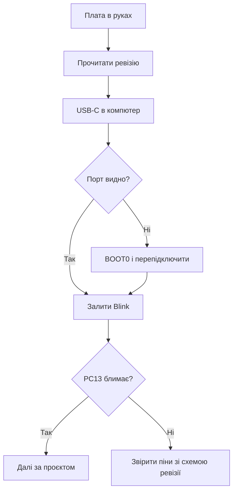

# WeAct - minimal STM32 board with USB-C

![[assets/img/stm32-weact-board-scheme.png|600]]
*Рис. Мінімум розміру, максимум зручності: USB-C, кнопки, документація.*

> [!tip] Призначення ноти
> Навчити вибирати and шити WeAct-плати: моделі, ревізії, USB-режими and приклади.

## 1. Призначення

WeAct Studio робить акуратні міні-плати: Black Pill, MiniF4, Mini Debugger окремо. USB-C with даними, кнопки NRST and BOOT0 on платі, схеми у відкритому доступі. for прототипів це крок угору від безіменних клонів: відома розводка and живі приклади.

## 2. Модельний ряд: that брати

| Плата | Чип | Особливість | for чого |
| --- | --- | --- | --- |
| Black Pill F401 | F401CC | USB-C, FPU | Універсальний прототип |
| Black Pill F411 | F411CE | Більше памяті | USB-девайси, звук |
| MiniF4 F401 | F401CC | Компактна | Вбудовані вузли |
| Mini Debugger | - | ST-Link клон | Прошивка голих плат |

## 3. Ревізії: перевіряй перед купівлею

| Тема | Практика |
| --- | --- |
| Номер ревізії | on шовкографії плати! |
| Зміни між ревізіями | Кварц, LDO, розводка USB |
| Приклади під ревізію | code зі старої може not зійтись пінами |
| Відгуки | Свіжі партії перевіряти першою |

## 4. USB-C: дані, but not тільки живлення

| Режим | how увімкнути |
| --- | --- |
| CDC VCP | Прошивка with USB-стеком |
| DFU прошивка | BOOT0 at підключенні! |
| Живлення | USB-C дає більше струму |

```text
Перша DFU-прошивка без ST-Link:
  затиснути BOOT0, підключити USB;
  залити через DfuSe або dfu-util;
  відпустити, натиснути NRST.
```

## Mermaid: старт with WeAct



## 5. Приклади WeAct: де брати

| source | that всередині |
| --- | --- |
| GitHub WeAct | Приклади під кожну плату |
| Схеми плат | PDF with розводкою |
| Заводські демо | USB, дисплей, SD |

## 6. WeAct проти безіменних клонів

| Критерій | WeAct | Клон |
| --- | --- | --- |
| Схема | Відкрита | Вгадай сам |
| USB-C | with даними | Часто тільки живлення |
| Кварц | Нормальний | Буває перемарковано |
| Ціна | Трохи дорожче | Дешевше |

## typical errors

| # | error | Чому погано | how правильно |
| --- | --- | --- | --- |
| 1 | Ревізію not подивились | Піни not зійшлись | Читати шовкографію! |
| 2 | Старий example | Інша розводка | example під свою ревізію |
| 3 | DFU без BOOT0 | Порта немає | Кнопка at підключенні |
| 4 | Живлення моторів with плати | LDO вмирає | Окремий БЖ! |
| 5 | Дешевий кабель USB-C | Тільки живлення | Кабель with даними |
| 6 | NRST not виведено in коді | Немає скидання | Кнопка on платі є |
| 7 | Клон замість WeAct | Сюрпризи with кварцом | Перевіряти st-info |

## Зберігання and ESD: дрібниці with ціною

| Правило | Пояснення |
| --- | --- |
| Антистатичний пакет | Гола плата без нього вбивається взимку |
| not класти on метал | Коротке знизу |
| USB-C гніздо берегти | Механічно найслабше місце |

## official джерела

- [WeAct GitHub (WeAct Studio)](https://github.com/WeActStudio) - приклади, схеми, прошивки.
- [MiniF4 product page (WeAct)](https://github.com/WeActStudio/MiniF4-STM32F4x1) - розводка and демо.

## Mini Debugger: прошивка голих плат

| Тема | Практика |
| --- | --- |
| Підключення | SWDIO, SWCLK, GND, NRST до своєї плати |
| Живлення цілі | Краще окреме, not від дебагера! |
| CubeProgrammer | Бачить how звичайний ST-Link |
| Оновлення прошивки | Дебагер сам шиється via USB |

## Живлення периферії with плати: межі

| Споживач | Можна? |
| --- | --- |
| Датчики міліамперні | Так, with 3.3 in плати |
| Дисплей маленький | Так, with запасом |
| Реле and мотори | Ні! Окремий БЖ |
| ESP-модуль поруч | Ні, піки WiFi вбивають LDO |

```text
Правило струму:
  сума споживачів менше половини LDO;
  гріється палець — вже забагато;
  реле і мотори завжди окремо.
```

## WeAct проти Nucleo: коли that

| Задача | Вибір |
| --- | --- |
| Навчання with дебагом | Nucleo, все with коробки |
| Компактний вузол | WeAct міні |
| Своя плата потім | WeAct how референс розводки |
| Вимір струму | Тільки Nucleo with IDD! |

## Див. також

- [[Home]]
- [[14-Devboards/02-Black-Pill|плата Black Pill]]
- [[14-Devboards/01-Blue-Pill|плата Blue Pill]]
- [[14-Devboards/03-Nucleo|плати Nucleo]]
- [[04-Interfaces/05-USB|порт USB]]
- [[09-Firmware/03-ST-Link-Proshivka|прошивка via ST-Link]]
