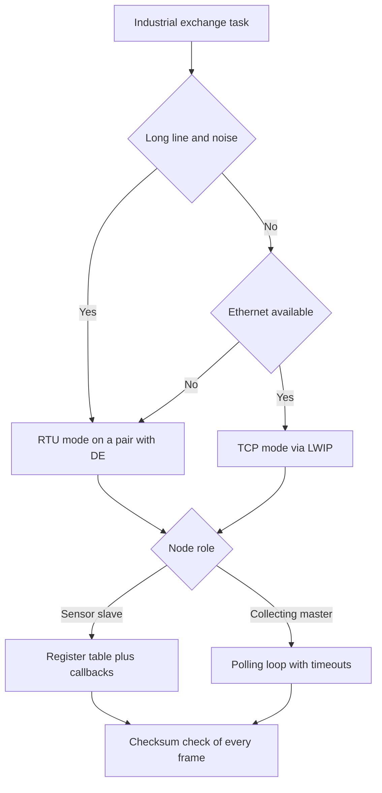

# Modbus RTU and TCP - Registers and CRC

![[assets/img/stm32-modbus-scheme.png|600]]
*Fig. Modbus diagram on STM32: slave on a pair, polling master, transition to TCP over the network.*

> [!tip] Purpose of this note
> Give a working map of industrial exchange: how a frame is built, how to count the checksum, how to lay out registers, how to hold the pause and how to raise a slave on the controller.

## 1. Purpose

Modbus stays the main language of industrial automation: energy meters, frequency converters, temperature sensors, ventilation controllers. One master polls dozens of slaves on a shared pair or over the network. The protocol is simple, so it lives for decades.

On STM32 a typical node is a slave on a pair via a transceiver or a master collecting data from meters. For the physical layer see [[04-Interfaces/01-UART.en | UART serial port]] and [[12-Comm-Modules/02-RS485-CAN-Ethernet | Wired networks]]. The move to the network gives TCP mode via the LWIP stack with no change to register logic.

## 2. RTU frame and checksum field

An RTU frame is a dense byte stream with no delimiters. Only the pause on the line sets frame borders. Every byte goes out as 8N1 or 8E1.

| Field | Length | Contents |
| --- | --- | --- |
| Address | 1 byte | Slave number from 1 to 247, zero means broadcast |
| Function | 1 byte | Operation code, for example read or write |
| Data | Variable | Register address, count, values |
| Checksum | 2 bytes | CRC16 checksum, low byte first |

```text
Кадр запиту читання:
  Адреса ............ 0x01, слейв номер один
  Функція ........... 0x03, читання регістрів зберігання
  Початкова адреса .. 0x00 0x00, перший регістр карти
  Кількість ......... 0x00 0x02, прочитати два регістри
  Сума .............. 0xC4 0x0B, приклад суми для цього запиту
  Пауза до і після .. тиша довжиною у паузу між кадрами
```

| Checksum property | Explanation |
| --- | --- |
| Polynomial | 0xA001, reversed form of the known polynomial |
| Start | 0xFFFF, starting value of the checksum register |
| Order | Low checksum byte goes first |
| Check | Mismatch means a broken frame, no answer |

```text
Алгоритм суми крок за кроком:
  1. Завантаж регістр значенням FFFF
  2. Для кожного байта зроби XOR з молодшим байтом регістра
  3. Вісім разів зсунь вправо, якщо був перенос додай поліном
  4. Повтори для всіх байт кадру без поля суми
  5. Готовий результат допиши молодшим байтом уперед
```

## 3. Read and write functions

Four functions cover most tasks. The remaining codes serve diagnostics and events.

| Code | Name | What it does |
| --- | --- | --- |
| 03 | Read holding registers | Reads a word group for setpoints and state |
| 04 | Read input registers | Reads measurements with no write right |
| 06 | Write single register | Writes one word at the given address |
| 16 | Write register group | Writes several words in one frame |

```text
Приклади обміну:
  03 .......... мастер просить два слова, слейв повертає чотири байти даних
  04 .......... мастер читає температуру і напругу як вхідні слова
  06 .......... мастер пише уставку у одне слово, слейв повторює кадр у відповідь
  16 .......... мастер пише блок уставок, слейв підтверджує адресу і кількість
  Помилка ..... слейв повертає код плюс 0x80 і номер винятку
```

| Exception | Number | When to return |
| --- | --- | --- |
| Illegal function | 01 | Code not supported by the node |
| Illegal address | 02 | Address outside the register map |
| Illegal value | 03 | Count or value out of range |
| Slave failure | 04 | Internal handling issue |

## 4. Node register map

The map is the contract between master and slave. Without a written map both sides read data differently.

| Address | Type | Contents | Access |
| --- | --- | --- | --- |
| 0x0000 | Holding | Temperature setpoint in tenths of a degree | Read and write |
| 0x0001 | Holding | Fan mode | Read and write |
| 0x0002 | Holding | Hysteresis in tenths of a degree | Read and write |
| 0x0010 | Input | Actual temperature in tenths of a degree | Read only |
| 0x0011 | Input | Supply voltage in millivolts | Read only |
| 0x0020 | Input | Exchange issue counter | Read only |
| 0x0030 | Holding | Node address on the line | Read and write |

| Map rule | Explanation |
| --- | --- |
| Zero-based numbering | Frame address is always one less than the manual number |
| Value scaling | Decimal values go as integers in tenths or hundredths |
| Reserve | Keep spare addresses for new parameters |
| Version | A separate word with the map version for master checks |

```text
Фрагмент карти для паспорта виробу:
  Слово 0x0000 ...... уставка, діапазон від 50 до 300, означає від 5 до 30 градусів
  Слово 0x0010 ...... вимір, від мінус 400 до 850, означає температуру датчика
  Слово 0x0020 ...... діагностика, росте на кожному битму кадрі
  Слово 0x00F0 ...... версія карти, мастер звіряє перед опитуванням
```

## 5. Inter-frame pause and direction control

Frame borders hold on a 3.5-character pause. A character is start plus data plus parity plus stop. At 9600 the pause is about 4 ms, at 115200 under a millisecond.

| Speed | 11-bit character time | 3.5-character pause |
| --- | --- | --- |
| 9600 | About 1.15 ms | About 4.0 ms |
| 19200 | About 0.57 ms | About 2.0 ms |
| 115200 | About 0.10 ms | About 0.35 ms |

The pair is half-duplex, so the driver DE pin sets direction. The controller drives this pin in hardware with no program help.

```text
Вузол на парі:
  TX контролера ---> DI драйвера пари
  RX контролера <--- RO драйвера пари
  DE контролера ---> DE і RE драйвера разом
  A і B ---> вита пара з термінатором 120 Ом на кінцях лінії
  Пауза ---> тиша на лінії означає межу кадру
```

| Parameter | Contents | Typical value |
| --- | --- | --- |
| DE polarity | Active high level during transmit | High during the frame |
| Pre-frame delay | Pause from DE rise to the first bit | One or two characters |
| Post-frame delay | Pause from the last bit to DE release | One or two characters |
| Terminator | Resistor between A and B at bus ends | 120 Ohm |
| Biasing | Idle pull-up on the leading node | A pair of 680 Ohm resistors |

## 6. Modbus TCP and the MBAP header

TCP mode hides pauses inside the stream. The length field in the header sets borders, so line timeouts are unneeded.

| Header field | Length | Contents |
| --- | --- | --- |
| Identifier | 2 bytes | Transaction number for a request-answer pair |
| Protocol | 2 bytes | Always zero for Modbus |
| Length | 2 bytes | Byte count that follows including the node address |
| Node address | 1 byte | Slave number behind a gateway or 255 on a direct link |

```text
Порівняння режимів:
  RTU ........... адреса 1 байт, функція, дані, сума, межі паузою
  TCP ........... заголовок 7 байт, адреса, функція, дані, без суми
  Сума у TCP .... не потрібна, цілісність дає контрольна сума мережі
  Шлюз .......... перекладає TCP у RTU і чекає паузу на парі
```

| Difference | RTU on a pair | TCP on a network |
| --- | --- | --- |
| Frame borders | 3.5-character pause | Length field in the header |
| Checksum | CRC16 mandatory | Not used |
| Addressing | Number on the pair | Network address plus node number |
| Stack | Port driver | LWIP stack and socket |
| Speed | Kilobits per second | Megabits per second |

## 7. Slave on the controller

A slave holds the register table in memory and answers master requests. The logic splits into frame receive, checksum check, handler call, answer build.

| Element | Implementation | Note |
| --- | --- | --- |
| Receive buffer | DMA ring plus line-idle flag | Frame ready when the line goes quiet |
| Check | Own address, checksum matches | Foreign frame silently ignored |
| Table | Word array in RAM with a setpoint mirror | Table writes persist at once |
| Callback | Function on setpoint writes | Checks limits and writes to independent memory |
| Answer | Same format with a fresh checksum | Issue gives an exception frame |

```text
Цикл слейва:
  Чекати кадр з DMA ---> перевірити адресу і суму
    Чужий кадр ---> мовчати, відповіді нема
    Свій кадр ---> розібрати функцію
      Читання ---> віддати слова з таблиці
      Запис ---> перевірити межі, записати, гукнути колбек
      Помилка ---> повернути код винятку
```

## 8. Polling master

A master asks nodes in turn and gathers answers into a shared table. Timeouts and a per-node issue counter matter.

| Master step | Action |
| --- | --- |
| 1 | Build a read frame with the node address |
| 2 | Enable the transmitter and wait for transmit end |
| 3 | Switch to receive and start the answer timer |
| 4 | Take the answer and check the checksum |
| 5 | Move words into the node data struct |
| 6 | On timeout bump the counter and move on |

```text
Розклад опитування трьох вузлів:
  Вузол 1 ....... читання 03, два слова стану, таймаут 100 мс
  Вузол 2 ....... читання 04, два слова вимірів, таймаут 100 мс
  Вузол 3 ....... запис 06 при зміні уставок, інакше пропуск
  Пауза ......... коротка тиша між транзакціями для стабільності
```

## 9. Slave HAL code on a DE port

The example holds receive via DMA with an idle interrupt. Transmit uses hardware DE control.

```c
UART_HandleTypeDef huart2;
#define MODBUS_ADDR 1
#define REG_COUNT 64
uint16_t modbus_regs[REG_COUNT];
uint8_t modbus_rx[256];
uint8_t modbus_tx[256];

uint16_t modbus_crc16(const uint8_t *buf, uint16_t len)
{
    uint16_t crc = 0xFFFF;
    for (uint16_t i = 0; i < len; i++)
    {
        crc ^= buf[i];
        for (uint8_t b = 0; b < 8; b++)
        {
            if (crc & 0x0001)
            {
                crc >>= 1;
                crc ^= 0xA001;
            }
            else
            {
                crc >>= 1;
            }
        }
    }
    return crc;
}

void modbus_slave_init(void)
{
    huart2.Instance = USART2;
    huart2.Init.BaudRate = 9600;
    huart2.Init.WordLength = UART_WORDLENGTH_8B;
    huart2.Init.StopBits = UART_STOPBITS_1;
    huart2.Init.Parity = UART_PARITY_NONE;
    huart2.Init.Mode = UART_MODE_TX_RX;
    HAL_UART_Init(&huart2);
    HAL_RS485Ex_Init(&huart2, UART_DE_POLARITY_HIGH, 16, 16);
    HAL_UART_Receive_DMA(&huart2, modbus_rx, sizeof(modbus_rx));
}

void modbus_send(uint16_t len)
{
    uint16_t crc = modbus_crc16(modbus_tx, len);
    modbus_tx[len] = (uint8_t)(crc & 0xFF);
    modbus_tx[len + 1] = (uint8_t)(crc >> 8);
    HAL_UART_Transmit(&huart2, modbus_tx, len + 2, 100);
}
```

```c
void modbus_on_write(uint16_t addr, uint16_t value)
{
    if (addr == 0x0000)
    {
        if (value < 50)
        {
            value = 50;
        }
        if (value > 300)
        {
            value = 300;
        }
        modbus_regs[addr] = value;
    }
    else
    {
        modbus_regs[addr] = value;
    }
}

int modbus_handle(uint8_t *req, uint16_t req_len)
{
    if (req_len < 4)
    {
        return 0;
    }
    if (req[0] != MODBUS_ADDR && req[0] != 0)
    {
        return 0;
    }
    return 1;
}
```

## Mermaid: exchange mode choice



## Common issues

| # | Issue | Why it is bad | Correct way |
| --- | --- | --- | --- |
| 1 | No pause between frames | Frames stick together, checksum fails | Hold 3.5-character silence, at 9600 about 4 ms |
| 2 | DE released before transmit end | Frame tail cut on the pair | Wait for the transmit-end flag and hold the post-frame delay |
| 3 | Register number vs address mix-up | Off-by-one gives foreign data | Subtract one from the manual number when building a frame |
| 4 | Checksum byte order ignored | Slave silent, master waits in vain | Low checksum byte first, check on a known frame |
| 5 | Slave answers a foreign address | Collisions on the pair, broken answers | Answer only your own address, never confirm broadcast |
| 6 | No terminator at the ends | Reflections give errors at speed | Put 120 Ohm on both line ends |
| 7 | Register writes with no limit check | Setpoints break product logic | Check the range in the write callback and return exception 03 |

## Official sources

- [Modbus RTU specification (Modbus Org)](https://www.modbus.org/specs.php) - frames, functions, exceptions, checksum.
- [USART in RM0008 for STM32F1 (ST)](https://www.st.com/resource/en/reference_manual/rm0008-stm32f101xx-stm32f102xx-stm32f103xx-stm32f105xx-and-stm32f107xx-advanced-armbased-32bit-mcus-stmicroelectronics.pdf) - baud rate, parity, DE control.
- [STM32 Ethernet LWIP manual (ST)](https://www.st.com/en/embedded-software/stm32cubef4.html) - network stack for TCP mode.

## See also

- [[Home.en]]
- [[04-Interfaces/01-UART.en | UART serial port]]
- [[12-Comm-Modules/02-RS485-CAN-Ethernet | Wired networks]]
- [[04-Interfaces/05-USB.en | USB port]]
- [[15-Protocols/02-DFU-Bootloader.en | Firmware update]]
- [[15-Protocols/03-Security.en | Product protection]]
