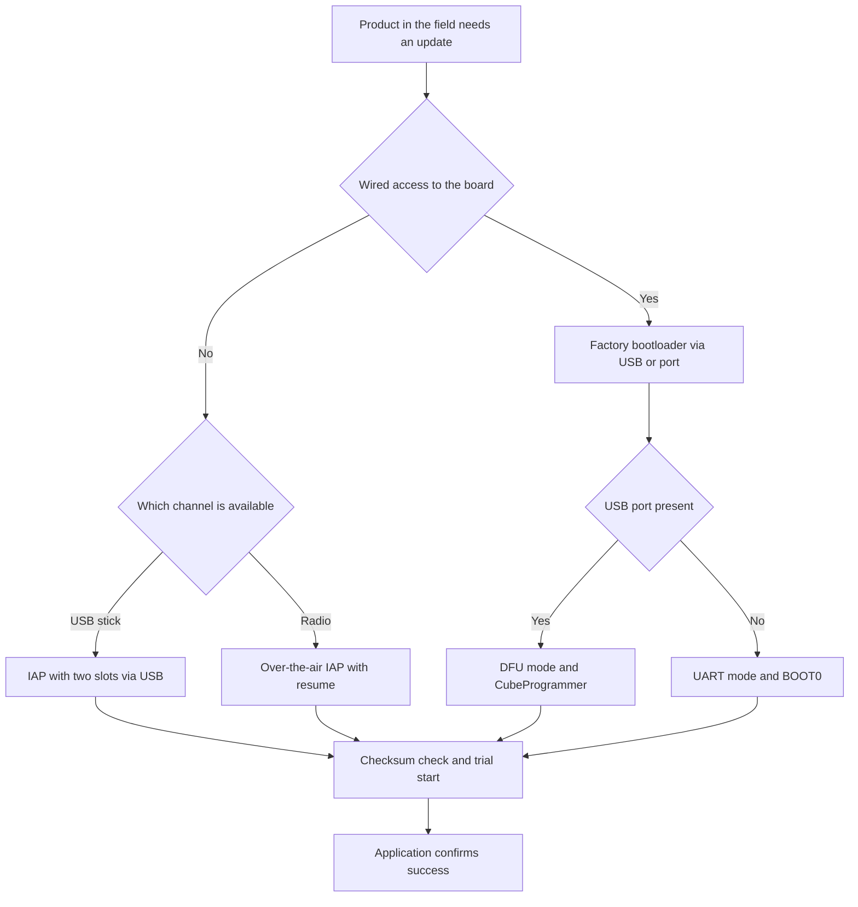

# DFU and IAP - Firmware Updates in the Field

![[assets/img/stm32-dfu-bootloader-scheme.png|600]]
*Fig. Field update diagram: factory bootloader, DFU over USB, custom IAP with two slots.*

> [!tip] Purpose of this note
> Show the full update path without a programmer: when the factory bootloader is enough, how DFU works, how to write your own IAP with a safe rollback.

## 1. Purpose

A product in the field needs updates without opening the case: a flash drive over USB, a packet over the port, an image over the air. The factory bootloader saves the start, a custom IAP gives flexibility for your own channel. Two slots and a golden image save you from a brick on power loss.

The update process always rests on the physical channel. For a port overview see [[04-Interfaces/05-USB.en | USB port]] and [[04-Interfaces/01-UART.en | UART serial port]]. Radio updates for wireless chips go via [[01-Hardware/06-WB-WL.en | Wireless chips]]. The emergency path stays via [[09-Firmware/03-ST-Link-Flashing.en | Flashing via ST-Link]].

## 2. Factory bootloader and the AN2606 document

System memory of every chip holds ST code. It starts on the right BOOT combination and writes flash via one of the interfaces. The AN2606 document holds a table per part number.

| Chip | UART | USB DFU | CAN | I2C and SPI |
| --- | --- | --- | --- | --- |
| F103C8 | UART1 | None | None | None |
| F072C8 | UART1 | USB device | None | I2C and SPI |
| G030F6 | UART1 | None | None | I2C and SPI |
| G474RE | UART1 | USB device | FDCAN | I2C and SPI |
| H563ZI | UART1 | USB DFU | FDCAN | I2C and SPI |
| WB55CG | UART1 | USB DFU | None | I2C and SPI |

```text
Вхід у заводський режим:
  1. BOOT0 у високий рівень, скинути плату кнопкою скидання
  2. Плата мовчить у робочій прошивці і слухає інтерфейси
  3. Програматор шле кадр синхронізації на швидкості порту
  4. Після відповіді починається запис і перевірка образу
  5. BOOT0 назад у низький рівень, скидання, старт з флеші
```

| Step | Action | Note |
| --- | --- | --- |
| 1 | Find your part number in AN2606 | Watch the interface columns and pin numbers |
| 2 | Pull BOOT0 and reset | On Nucleo boards these are jumpers on the header |
| 3 | Connect USB or a port converter | UART needs a shared ground |
| 4 | Pour the image via CubeProgrammer | The program verifies the write itself |
| 5 | Return BOOT0 and restart | Else the board drops into the bootloader again |

## 3. DFU over USB

DFU is a standard USB flashing class. The board looks like a DFU device, the driver comes from the DfuSe package or CubeProgrammer. Speed beats the port by an order of magnitude.

| DFU element | Contents |
| --- | --- |
| Descriptor | Board declares the DFU class with alternate settings for flash |
| Block | Data cut into 1 or 2 Kbyte blocks |
| Erasure | Sector erased before block write |
| Check | After writing read back and compare |
| Detach | Exit command launches the working firmware |

```text
Сеанс DFU крок за кроком:
  ПК бачить пристрій у режимі DFU ---> список секторів флеші
  Вибрати файл образу ---> стерти потрібні сектори
  Записати блоки ---> дочекатись підтвердження кожного
  Перевірити ---> залишити DFU і запустити застосунок
```

| Advantage | Explanation |
| --- | --- |
| Speed | Full bus speed gives seconds instead of minutes |
| Power | The same line powers the board during writes |
| No converter | No port bridge needed on the board |
| Tool | One CubeProgrammer covers USB, UART and ST-Link |

| Board requirement | Explanation |
| --- | --- |
| USB connector with data | Charge-only sockets with no data do not fit |
| Line pull-ups | See the USB topology advice |
| Crystal or calibration | Exact frequency for a stable link |
| Entry button | BOOT0 plus reset for the first entry |

## 4. Custom IAP bootloader and the VTOR register

A custom IAP is a small firmware at the start of flash. It decides to start the old image, take a new one or roll back. The application sits above with a vector offset.

| Flash area | Address approx | Contents |
| --- | --- | --- |
| IAP | Flash start | Image receive, check, slot pick |
| Main slot | Flash middle | Working application image |
| Spare slot | Further in flash | Previous image for rollback |
| Service | Flash end | Attempt flags, start counter, versions |

```text
Карта памяті з IAP:
  0x0800 0000 ..... IAP, таблиця векторів IAP, старт завжди сюди
  0x0800 8000 ..... застосунок, своя таблиця векторів зі зсувом
  0x0801 0000 ..... резервна копія для відкату при невдалому старті
  Службова ....... прапорець новий образ, лічильник вдалих стартів
```

| Jump step | Action |
| --- | --- |
| 1 | Disable interrupts and stop timers |
| 2 | Clear peripheral flags and kill DMA |
| 3 | Point VTOR at the application start |
| 4 | Load the stack pointer from the image first word |
| 5 | Jump to the reset address from the image second word |

## 5. Two slots and the golden image

One slot is brick risk. A power cut mid-erase leaves the board with no code. Two slots hold a working copy to the last.

| Strategy | How it works | When to take |
| --- | --- | --- |
| One slot | Writes over the working image | Bench with a programmer nearby only |
| Two slots | Writes to the free one, switches by flag | Field with no board access |
| Golden image | Factory minimum in a separate sector | Rollback when both slots are broken |

```text
Оновлення з відкатом:
  Працює слот А ---> приймаємо образ у слот Б
  Перевірка суми слота Б ---> ставимо прапорець пробний старт Б
  Старт Б ---> застосунок підтверджує успіх записом у службову
  Нема підтвердження ---> IAP повертає старт на слот А
  Лічильник невдач ---> після трьох провалів старт золотого образу
```

| Flag | Value |
| --- | --- |
| Active slot | Which image starts by default |
| Trial start | Next start is a test, waiting for confirmation |
| Success | Application alive and in control |
| Fail counter | How many times the new image failed to confirm |

## 6. Image checksum and signature

A checksum catches broken bytes, a signature catches foreign code. A checksum is enough for a home build, a batch needs a signature.

| Method | What it catches | Price |
| --- | --- | --- |
| Image CRC32 | Random channel and memory errors | A few lines of code |
| SHA256 hash | Deliberate and random changes | More memory and time |
| Signature | Foreign image with a right hash | Keys and secure storage |

```text
Формат образу з хвостом:
  Заголовок ....... магічне слово, версія, довжина, адреса старту
  Тіло ............ код застосунку як є
  Хвіст ........... сума всього образу і версія карти параметрів
  IAP перевіряє .. магію, довжину, суму, потім ставить прапорець
```

```c
uint32_t image_crc32(const uint8_t *buf, uint32_t len);

int image_check(const uint8_t *base, uint32_t len, uint32_t expect)
{
    uint32_t got = image_crc32(base, len);
    if (got != expect)
    {
        return 0;
    }
    if (base[0] == 0xFF && base[1] == 0xFF)
    {
        return 0;
    }
    return 1;
}
```

| Rule | Explanation |
| --- | --- |
| Version only forward | Old image must not wipe a new one without permission |
| Length inside the slot | Sector overrun corrupts the neighbour image |
| Magic at the start | Foreign garbage in the slot rejected at once |
| Flag backup | Duplicate the service area with a spare copy |

## 7. WB and WL radio stack updates

Wireless chips have two floors: the application and the radio core firmware. The radio core updates with a separate FUS image. Wrong order means bricks.

| Element | Role |
| --- | --- |
| FUS | Service firmware that writes the radio core |
| Stack | Radio core firmware for the protocol |
| Application | User code on top of the stack |

```text
Порядок оновлення бездротового чипа:
  1. Перевірити версію FUS і стека через штатну команду
  2. Спочатку оновити FUS якщо таблиця сумісності вимагає
  3. Потім залити стек потрібної версії
  4. В кінці залити застосунок під цей стек
  Порушення порядку дає несумісність і мовчання радіо
```

| Stack issue | Symptom |
| --- | --- |
| Old FUS | New stack rejected |
| Foreign stack | Application starts but the air is silent |
| Power cut | Radio core half-written, wired retry needed |

## 8. HAL jump-to-application code

The example shows a safe jump from IAP to the application with a vector offset.

```c
#define APP_ADDR 0x08008000U

typedef void (*app_entry_t)(void);

void iap_jump_to_app(void)
{
    uint32_t stack = *(volatile uint32_t *)APP_ADDR;
    uint32_t reset = *(volatile uint32_t *)(APP_ADDR + 4U);
    if ((stack & 0x2FFE0000U) != 0x20000000U)
    {
        return;
    }
    __disable_irq();
    HAL_SuspendTick();
    for (int i = 0; i < 8; i++)
    {
        NVIC->ICER[i] = 0xFFFFFFFFU;
        NVIC->ICPR[i] = 0xFFFFFFFFU;
    }
    SysTick->CTRL = 0U;
    SCB->VTOR = APP_ADDR;
    __set_MSP(stack);
    __enable_irq();
    ((app_entry_t)reset)();
}
```

```c
void iap_try_update(void)
{
    if (image_check((const uint8_t *)0x08010000U, 96000U, 0x12345678U) == 0)
    {
        return;
    }
    iap_jump_to_app();
}

void app_confirm_ok(void)
{
    uint32_t *flag = (uint32_t *)0x0807F800U;
    HAL_FLASH_Unlock();
    HAL_FLASH_Program(FLASH_TYPEPROGRAM_WORD, (uint32_t)flag, 0xA11CEU);
    HAL_FLASH_Lock();
}
```

```text
Перевірка IAP на столі:
  Залий IAP з адресою застосунку ---> залий застосунок зі зсувом лінкера
  Перевір стрибок без образу ---> IAP лишається і чекає, це норма
  Залий образ у вільний слот ---> перевір суму і прапорець пробного старту
  Імітуй битий образ ---> IAP повертається на робочий слот
  Висмикни живлення під час запису ---> після вмикання стартує старий слот
```

## Mermaid: update path choice



## Common issues

| # | Issue | Why it is bad | Correct way |
| --- | --- | --- | --- |
| 1 | BOOT0 left at one | Board always starts into factory mode | Return BOOT0 to zero after writing |
| 2 | Application built with no offset | Vectors overlap IAP, jump falls | Write the application address into the linker script |
| 3 | VTOR not relocated | Interrupts lead to the IAP table | Point VTOR at the application start before jumping |
| 4 | Writing over the active slot | Power cut gives a brick | Write to the free slot and switch by flag |
| 5 | No checksum check | Broken image starts and hangs | Count CRC and compare with the image tail |
| 6 | FUS and stack out of order | Radio silent with a live application | Keep the order FUS then stack then application |
| 7 | No start confirmation | Broken image loops forever | Application writes success, else IAP rolls back |

## Official sources

- [Factory bootloader per chip (ST)](https://www.st.com/resource/en/application_note/an2606-stm32-microcontroller-system-memory-boot-mode-stmicroelectronics.pdf) - mode table by part number.
- [STM32CubeProgrammer (ST)](https://www.st.com/en/development-tools/stm32cubeprog.html) - writing via DFU, port and debugger.
- [STM32WB55CG datasheet (ST)](https://www.st.com/en/microcontrollers-microprocessors/stm32wb55cg.html) - memory, radio core, FUS update order.

## See also

- [[Home.en]]
- [[04-Interfaces/05-USB.en | USB port]]
- [[09-Firmware/03-ST-Link-Flashing.en | Flashing via ST-Link]]
- [[01-Hardware/06-WB-WL.en | Wireless chips]]
- [[15-Protocols/01-Modbus.en | Modbus industrial protocol]]
- [[15-Protocols/03-Security.en | Product protection]]
