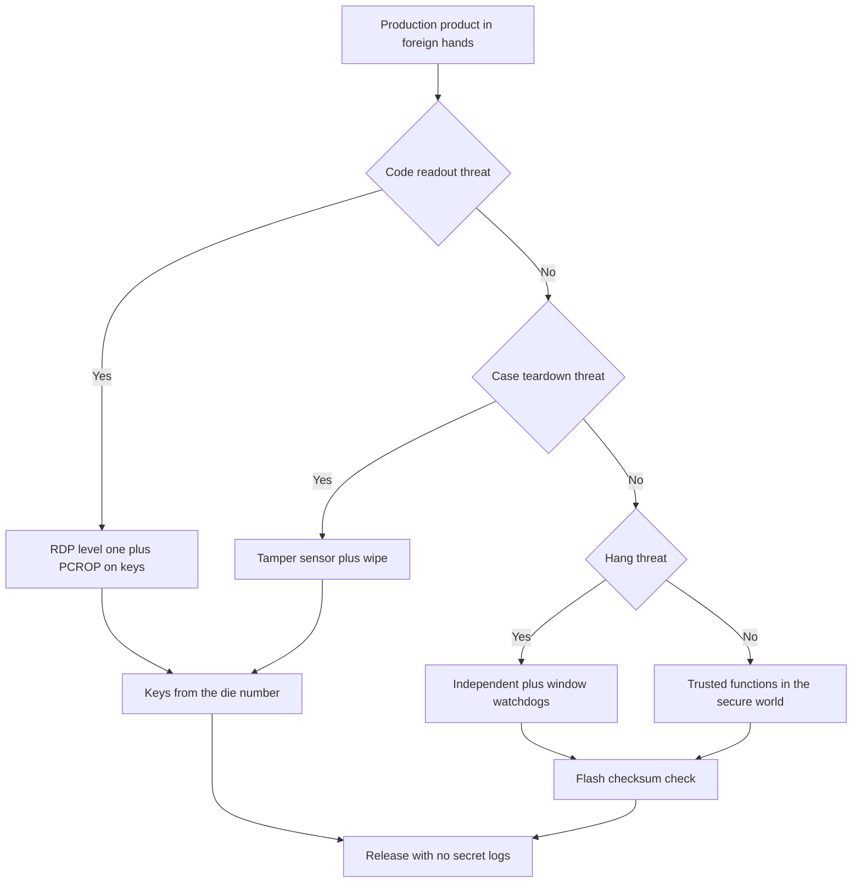

# STM32 Security - RDP, TrustZone and Supervision

![[assets/img/stm32-security-scheme.png|600]]
*Fig. Product protection diagram: access levels, trusted zone, keys, tampering and timer supervision.*

> [!tip] Purpose of this note
> Assemble the minimum protection loop of a production product: how to close readout, how to split code, where to keep keys, how to wipe secrets and how to keep the board from hanging.

## 1. Purpose

A production product lives in foreign hands: a competitor reads flash, a user climbs into the case, firmware hangs in the field. Basic protection closes code readout, splits firmware into trusted and normal parts, hides keys and wipes secrets on tampering. Timer supervision returns the board from a hang with no human help.

The hardware base sits in flagships with a trusted zone, for details see [[01-Hardware/04-H5-H7.en | H5 and H7 flagships]]. Time and watchdog supervision is covered in [[07-Timers/02-LPTIM-RTC-WDT.en | Time and watchdog timers]]. Emergency recovery stays via [[09-Firmware/03-ST-Link-Flashing.en | Flashing via ST-Link]] before access closes.

## 2. RDP levels

The readout protection level is set by an option byte. Zero is open for development, one closes flash to external reads, two closes forever.

| Level | State | What it means |
| --- | --- | --- |
| Zero | Open | Debugger reads and writes free |
| One | Closed | External readout forbidden, updates possible |
| Two | Forever | Debug dead, no rollback, a lifelong decision |

```text
Вибір рівня під етап:
  Розробка ............ рівень нуль, налагоджувач повний
  Тестова партія ...... рівень один, перевірка оновлення без читання
  Серія ............... рівень один для виробів з оновленням
  Одноразовий виріб ... рівень два лише коли оновлення не буде ніколи
```

| Action | Level zero | Level one | Level two |
| --- | --- | --- | --- |
| Wired readout | Allowed | Forbidden | Forbidden forever |
| New firmware write | Allowed | Allowed | Forbidden |
| Erase and return | Possible | Possible via full erasure | Impossible |
| Factory bootloader | Active | Limited | Locked |

```text
Увага про другий рівень:
  Другий рівень не має зворотного шляху
  Помилка у прошивці стане вічною без можливості ремонту
  Перевіряй виріб на першому рівні мінімум один цикл оновлення
  Став другий рівень лише свідомо під одноразову логіку
```

## 3. PCROP and WRP sectors

Even at level one part of memory closes precisely. Two mechanisms complement each other.

| Mechanism | What it does |
| --- | --- |
| PCROP | Forbids reads of selected sectors, code runs but is unreadable |
| WRP | Forbids writes and erasures of selected sectors, guards against accidental damage |

| Task | Setup |
| --- | --- |
| Keys in flash | Key sector under PCROP, only its own code reads |
| Bootloader | IAP sector under WRP, the image never wipes itself |
| Calibration | Constant sector under WRP, the field never wipes factory data |
| Secrets | Both flags together for critical areas |

```text
Розкладка захисту секторів:
  IAP ................. WRP, ніхто не перепише завантажувач з поля
  Ключі ............... PCROP, виконання дозволене, дамп заборонений
  Застосунок .......... без прапорців, оновлення через IAP вільне
  Калібрування ........ WRP, тільки заводський стенд знімає захист
```

## 4. TrustZone and secure boot on H5 and U5

Flagships split the system into secure and normal worlds. The secure world holds keys and verification, the normal one runs application logic.

| World | What lives | Access |
| --- | --- | --- |
| Secure | Root of trust, keys, image check | Sees everything |
| Normal | Application, drivers, network | Sees only its own |
| Periphery | Split by worlds in the configurator | Bridge between worlds via gates only |

```text
Ланцюжок безпечного старту:
  Корінь у памяті ---> перевіряє завантажувач
  Завантажувач ---> перевіряє застосунок по підпису
  Застосунок ---> просить ключі лише через ворота безпечного світу
  Провал перевірки ---> стоп і спроба золотого образу
```

| Stage | Check |
| --- | --- |
| Start | Bootloader hash and signature |
| Jump | Application hash and signature |
| Update | New image signature before slot write |
| Rollback | Ban on an old version with a known flaw |

## 5. Unique ID and key derivation

Every die carries a 96-bit unique number. It derives per-unit keys with no master key stored in firmware.

| Source | Length | Where it sits |
| --- | --- | --- |
| Unique number | 96 bit | Factory system-area addresses |
| Randomness | Hardware generator | Random-number periphery |
| Batch salt | String in a protected sector | Same per batch, different across batches |

```text
Схема виведення ключа:
  Унікальний номер плюс сіль ---> хеш ---> ключ вузла
  Один образ прошивки ---> різні ключі на різних платах
  Витік образу не дає ключів чужих плат
  Сервер рахує той самий ключ по номеру з паспорта вузла
```

```c
#define UID_BASE 0x0BFA0590U

void node_key_derive(const uint8_t *salt, uint32_t salt_len, uint8_t *out32)
{
    const uint8_t *uid = (const uint8_t *)UID_BASE;
    uint32_t acc = 0x811C9DC5U;
    for (uint32_t i = 0; i < 12; i++)
    {
        acc ^= uid[i];
        acc *= 0x01000193U;
    }
    for (uint32_t i = 0; i < salt_len; i++)
    {
        acc ^= salt[i];
        acc *= 0x01000193U;
    }
    for (int i = 0; i < 32; i++)
    {
        out32[i] = (uint8_t)(acc >> ((i % 4) * 8));
        acc = acc * 1664525U + 1013904223U;
    }
}
```

| Key handling | Explanation |
| --- | --- |
| Never put keys in code | Images get read, keys lift from images in minutes |
| One device one key | One node leak never downs the whole batch |
| Keys under PCROP | Dump reads closed, execution allowed |
| Key rotation | A new image takes a new key with no brick |

## 6. Tampering and secret wiping

The tamper block watches the case and the supply. On trigger it wipes backup registers and keys.

| Event | Reaction |
| --- | --- |
| Case opening | Backup register and key wipe |
| Supply failure | Timestamp mark and access close |
| External edge | Interrupt with instant secret overwrite |
| Filter reset | Short noise ignored with no wipe |

```text
Контур втручання:
  Датчик корпусу ---> фільтр завад ---> подія втручання
  Подія ---> стирання резервних регістрів і ключів у RAM
  Журнал ---> запис факту у захищений лічильник без самих секретів
```

| Setting | Explanation |
| --- | --- |
| Filter | Cuts lid bounce with no false wipes |
| Active level | Pull-up so a torn cable counts as tampering too |
| Backup supply | Wipe finishes on the domain cell |
| Test | Service button mimics tampering on the bench |

## 7. IWDG and WWDG supervision against hangs

Security is not secrets only. A hung product with an open drive is physically dangerous. Two watchdogs return control.

| Watchdog | Clock | What it catches |
| --- | --- | --- |
| Independent | Own generator | Hangs anywhere, even on bus drops |
| Window | Core bus | Early and late refresh in the loop |

```text
Правило погладжування:
  Гладити в одному місці кінця головного циклу
  Не гладити у перериваннях, вони маскують зависання основи
  Період сторожів під реальний цикл плюс запас на зв'язок
  Причина скидання у журнал після старту
```

```c
IWDG_HandleTypeDef hiwdg;
WWDG_HandleTypeDef hwwdg;

void watchdog_init(void)
{
    HAL_IWDG_Init(&hiwdg);
    HAL_WWDG_Init(&hwwdg);
}

void main_loop_tick(void)
{
    HAL_IWDG_Refresh(&hiwdg);
    HAL_WWDG_Refresh(&hwwdg);
}
```

## 8. CRC periphery for flash checks

A hardware checksum block counts flash integrity with no core load. Periodic checks catch broken sectors.

```c
CRC_HandleTypeDef hcrc;

uint32_t flash_crc_check(uint32_t *base, uint32_t words)
{
    uint32_t acc = 0U;
    for (uint32_t i = 0; i < words; i++)
    {
        acc = HAL_CRC_Accumulate(&hcrc, &base[i], 1U);
    }
    return acc;
}

int boot_image_ok(uint32_t *base, uint32_t words, uint32_t expect)
{
    uint32_t got = flash_crc_check(base, words);
    return (got == expect) ? 1 : 0;
}
```

| Task | Period |
| --- | --- |
| IAP check at start | Every start before the jump |
| Application check | Every start and once a day in background |
| Key check | After every case tamper |
| Journal | Mismatch into the event counter with no product stop |

## 9. Release firmware rules

| Rule | Explanation |
| --- | --- |
| Close debugging | Level one minimum, level two only deliberately |
| Drop secret logs | Keys and passwords never go to the port |
| Switch off test commands | Service menu with no protection bypass |
| Check rollback | Broken image returns to the working slot |
| Keep the option map | Option-bytes file sits in the release repo |

```text
Чекліст перед серією:
  1. Прошивка зібрана у релізі без символів налагодження
  2. Логи не містять ключів і персональних даних
  3. Рівень один ставиться штатним скриптом, не вручну
  4. Оновлення і відкат перевірені на трьох платах
  5. Байти опцій і версії записані у паспорт партії
  6. Тест втручання стирає ключі і лишає журнал
```

## Mermaid: building protection



## Common issues

| # | Issue | Why it is bad | Correct way |
| --- | --- | --- | --- |
| 1 | Level two set at once | No rollback, a faulty batch is eternal | Start at level one, level two only deliberately |
| 2 | Keys in code as strings | An image dump gives away all secrets | Derive keys from the die number, sector under PCROP |
| 3 | Watchdog pet in the interrupt | Base hang masked by a live tick | Pet in one place at the main loop end |
| 4 | No WRP on the bootloader | The field rewrites IAP itself on a glitch | Close the IAP sector to writes |
| 5 | Logs send keys to the port | Secrets settle in service terminals | Drop secrets from release output |
| 6 | No image check | Broken code starts and hangs | Check checksum and signature before jumping |
| 7 | Test commands left in release | Protection bypass via the service menu | Switch the test interface off with a build flag |

## Official sources

- [STM32H563ZI datasheet (ST)](https://www.st.com/en/microcontrollers-microprocessors/stm32h563zi.html) - trusted zone, secure boot, protection options.
- [STM32U585AI datasheet (ST)](https://www.st.com/en/microcontrollers-microprocessors/stm32u585ai.html) - RDP levels, PCROP and WRP sectors, tampering.
- [IWDG and WWDG ST](https://www.st.com/en/microcontrollers-microprocessors/stm32-32-bit-arm-cortex-mcus.html) - watchdog timer choice for supervision.

## See also

- [[Home.en]]
- [[07-Timers/02-LPTIM-RTC-WDT.en | Time and watchdog timers]]
- [[01-Hardware/04-H5-H7.en | H5 and H7 flagships]]
- [[09-Firmware/03-ST-Link-Flashing.en | Flashing via ST-Link]]
- [[15-Protocols/01-Modbus.en | Modbus industrial protocol]]
- [[15-Protocols/02-DFU-Bootloader.en | Firmware update]]
