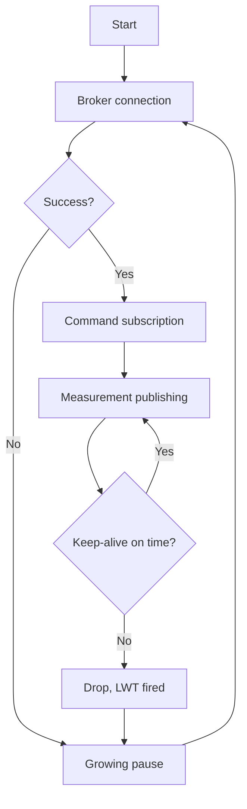

# MQTT on STM32 - Publishing via LWIP and GSM

![[assets/img/stm32-mqtt-scheme.png|600]]
*Fig. Bridge to the cloud: node, broker, subscribers.*

> [!tip] Purpose of this note
> Teach sending data to the cloud: QoS per task, a will on disconnect, TLS without killing RAM.

## 1. Purpose

MQTT is mail for sensors: a node publishes to a topic, whoever wants subscribes. The light protocol pulls even a GSM modem. On STM32 the client lives on top of LWIP (Ethernet) or an AT modem (GSM). Understanding QoS and sessions separates reliable telemetry from leaky telemetry.

## QoS: three delivery levels

| Level | Guarantee | Price |
| --- | --- | --- |
| QoS 0 | Once - and forget | Losses possible |
| QoS 1 | Arrives at least once | Duplicates possible! |
| QoS 2 | Exactly once | Slow and heavy |

```text
Практика:
  телеметрія датчиків .... QoS 0, часта;
  аварії і команди ........ QoS 1 з ідемпотентністю;
  QoS 2 на мікроконтролері — майже ніколи.
```

## Topics: hierarchy without chaos

| Rule | Example |
| --- | --- |
| Tree per object | shop1/line2/temperature |
| Status apart | .../status: online and offline |
| Commands down | .../cmd with confirmation |
| No spaces or Cyrillic | ASCII only! |

## LWT: a will on disconnect

| Topic | Practice |
| --- | --- |
| Idea | Broker publishes offline if the node is gone |
| Keep-alive | Ping holds NAT and detects death |
| Clean session | Zero - the broker remembers subscriptions |
| Reconnect | Exponential pause, no spam! |

## Mermaid: client life



## Transport: Ethernet or GSM

| Option | Pros | Cons |
| --- | --- | --- |
| Ethernet + LWIP | Fast, stable | A wire needed |
| GSM modem AT | Anywhere with cellular | Slow, traffic costs money |
| Modem built-in TLS | Chip RAM untouched! | AT commands trickier |

## TLS on a microcontroller: full practice

| Topic | Practice |
| --- | --- |
| Library | mbedTLS in the Cube package, trim the config to fit! |
| RAM per session | Dozens of KB: buffers, certificate, handshake |
| Flash | Root certificate in firmware as a constant |
| Time | RTC in sync, else the expiry check falls! |
| Ciphers | Modern only, switch old ones off in the config |

| mbedTLS config | What to cut |
| --- | --- |
| Unneeded ciphers | Minus kilobytes of Flash and RAM |
| Large buffers | Sized to your MTU, not with x10 margin |
| Debug logs | Off in release - they eat time and memory |

## Mutual TLS: client with a certificate

| Step | Action |
| --- | --- |
| 1 | Own CA, per-node client certificate |
| 2 | Private key in protected memory, not in git! |
| 3 | Broker checks the client, client checks the broker |
| 4 | Revocation: list or short lifetimes |

## TLS in the modem: unloading the chip

| Option | When |
| --- | --- |
| SIM7600 does TLS itself | Chip RAM whole, AT trickier |
| Chip does TLS | Full control, more RAM |
| No TLS at all | Closed network or VPN only! |

```text
Перевірка TLS-зєднання при пуску:
  час синхронізовано? -> handshake проходить? -> сертифікат валідний?;
  ні на будь-якому кроці — зрозуміла помилка в лог, не мовчання.
```

## TLS alternatives

| Option | When it is enough |
| --- | --- |
| Private broker in VPN | Channel guarded by the tunnel |
| Local network with no internet | Physical isolation |
| Hand-rolled payload cipher | Only with a ready protocol, never self-made! |

## Common issues

| # | Issue | Why it is bad | Correct way |
| --- | --- | --- | --- |
| 1 | Everything QoS 2 | Brakes and memory | QoS per criticality |
| 2 | No LWT | Dead node looks alive | A will always! |
| 3 | Keep-alive long behind NAT | Silent drops | Ping faster than the NAT timeout |
| 4 | QoS 1 duplicates break logic | Double commands | Idempotent handlers |
| 5 | TLS with no exact time | Certificate fails | RTC in sync! |
| 6 | Unlimited traffic on GSM | The bill | Rarer, batched, QoS 0 |
| 7 | Passwords in code | Firmware is readable | Secrets in protected memory |

## Fleet monitoring: what to watch

| Metric | Trouble signal |
| --- | --- |
| Online via LWT | Node silent longer than a cycle |
| Last data age | Heat map of overdue nodes |
| Reconnects | Spam means a network issue |
| Duplicated commands | QoS 1 with no idempotence |

## Official sources

- [MQTT Specification (OASIS)](https://mqtt.org/mqtt-specification/) - QoS, sessions, LWT.
- [LWIP Documentation (Savannah)](https://www.nongnu.org/lwip/) - TCP under the client.

## Retained: last value for newcomers

| Topic | Practice |
| --- | --- |
| Idea | Broker holds the last value and gives it to new subscribers |
| Status | Retained offline and online - must have |
| Telemetry | Not retained, else old passes for fresh! |
| Cleanup | Empty retained deletes the leftover |

## Code: publishing skeleton

```c
// Логіка циклу телеметрії (клієнт умовний):
mqtt_connect(broker, client_id, LWT_TOPIC, LWT_MSG);
mqtt_subscribe(cmd_topic, on_command);
for (;;) {
  read_sensors(&sample);
  mqtt_publish(telemetry_topic, &sample, QOS0, false);
  keep_alive_tick();
  vTaskDelay(pdMS_TO_TICKS(60000));
}
```

## Broker security: minimum

| Measure | Why |
| --- | --- |
| Login and password | No anonymous internet access! |
| Topic ACL | Node writes only its own tree |
| TLS on 8883 | Cipher on the road |
| IP allowlist | For static addresses - simple and solid |

## See also

- [[Home.en]]
- [[15-Protocols/01-Modbus.en | Industrial protocol]]
- [[12-Comm-Modules/03-GPS-GSM | Satellites and cellular]]
- [[12-Comm-Modules/02-RS485-CAN-Ethernet | Wired networks]]
- [[16-Projects/04-Modbus-Gateway | Data gateway]]
