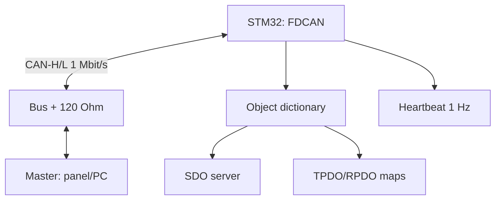

# STM32 CANopen - Object Dictionary, SDO/PDO and CiA-301

![[assets/img/stm32-canopen-scheme.png|600]]
*Fig. CANopen node: FDCAN bus 1 Mbit/s, object dictionary, SDO server, event TPDO.*

> [!tip] What this note is
> Industrial CAN one level above raw CAN: node addressing, standardized data, configuration with no reflashing. CANopenNode stack + FDCAN. Base: [[04-Interfaces/04-FDCAN.en | FDCAN bus]], [[12-Comm-Modules/02-RS485-CAN-Ethernet | RS485/CAN/Ethernet]].

## 1. Goal

Raise a CANopen slave on STM32:

- object dictionary (OD): what it is and the minimum set;
- SDO: parameter reads/writes (expedited/segmented);
- PDO: cyclic data with mapping;
- NMT: pre-op/op/stop, heartbeat producer;
- EDS file for configurators.

| Service | COB-ID (NodeID=5) | Purpose |
| --- | --- | --- |
| NMT | 0x000 | state control |
| SYNC | 0x080 | synchronization |
| EMCY | 0x085 | emergencies |
| TPDO1 | 0x185 | fast data |
| RPDO1 | 0x205 | commands |
| SDO rx/tx | 0x605/0x585 | parameters |
| Heartbeat | 0x705 | "i am alive" |

## 2. Architecture



Speed is single on the bus (125K/500K/1M). 120 Ohm terminators at the ends - as in plain CAN.

## 3. Node pinout (F4/F7)

| Signal | STM32 pin | Note |
| --- | --- | --- |
| CAN_TX | PA12/PB9 | to the transceiver |
| CAN_RX | PA11/PB8 | from the transceiver |
| TJA1050 VCC | 5V | 5V transceiver! |
| TJA1050 STB | GND | high-speed mode |
| NodeID jumpers | PB0-PB3 | ID 1-15 with no reflashing |
| CAN-H/L | twisted pair | 120 Ohm at the ends |

The transceiver runs on 5V, logic tolerates 3.3V. ADuM isolation - for shields.

## 4. Minimum object dictionary

- 0x1000: device type (read);
- 0x1001: error register;
- 0x1005: SYNC COB-ID;
- 0x1017: heartbeat period (ms);
- 0x1018: identity (vendor/product/rev/serial);
- 0x1A00+: TPDO maps; 0x1600+: RPDO maps;
- 0x2000+: maker parameters (our data);
- generate the EDS file from the same description.

## 5. Working code (C, HAL + CANopenNode)

```c
#include "CANopen.h"

#define NODE_ID 5
#define BITRATE 1000

CO_Data *od;

void app_main(void) {
  od = CO_OD_create();
  CO_config_t cfg = {.nodeId = NODE_ID, .bitrate = BITRATE};
  CO_init(od, &cfg);
  CO_NMT_setState(od, CO_NMT_PREOP);
  uint32_t hb = 0;
  while (1) {
    CO_process(od);
    if (HAL_GetTick() - hb > 100) {
      hb = HAL_GetTick();
      CO_HB_producer(od);
      CO_TPDO_send(od, 0);
    }
  }
}

void CO_TPDO_send(CO_Data *od, int n) {
  uint8_t d[8];
  int16_t temp = read_temp_dc();
  d[0] = temp & 0xFF; d[1] = temp >> 8;
  FDCAN_Tx(0x185, d, 2);
}
```

CANopenNode is a frame: describe OD with a script, add callbacks. Master NMT commands switch pre-op/op.

## 6. Working code (MicroPython)

```python
# MicroPython: CANopen-монітор через MCP2515-SPI (навчальний сніфер)
import struct
import time
from machine import Pin, SPI

spi = SPI(1, baudrate=10000000, sck=Pin(10), mosi=Pin(11), miso=Pin(12))
cs = Pin(13, Pin.OUT, value=1)
NODE = 5

def cob(function, node):
    return (function << 7) | node

def send_nmt(cmd):
    # NMT: COB 0x000, дані [команда, node]
    frame = struct.pack('>HBB', 0x000, cmd, NODE)
    cs.value(0)
    spi.write(frame)
    cs.value(1)

def heartbeat_listener():
    # TPDO1 0x185: читаємо 2 байти температури
    cs.value(0)
    raw = spi.read(4)
    cs.value(1)
    temp = struct.unpack('>h', bytes(raw[:2]))[0] / 10.0
    return temp

send_nmt(0x01)
while True:
    print('temp', heartbeat_listener())
    time.sleep(1)
```

Honestly: a full MicroPython stack is for learning; production is C + CANopenNode. The sniffer above fits bus debugging.

## 7. NMT and heartbeat

- states: Init to Pre-op to Op, Stop apart;
- master sends `01 05` (start node 5);
- heartbeat every 100-1000 ms: a state byte;
- guarding is legacy, we use heartbeat;
- boot-up message `00` - node woke up.

## 8. Common issues

| Symptom | Cause | Fix |
| --- | --- | --- |
| Master misses the node | wrong NodeID/bitrate | ID jumpers, single speed |
| SDO timeout | node in Stop or wrong EDS | NMT start, compare dictionaries |
| No PDO arriving | mapping/period unconfigured | SDO map write + save |
| Bus-off | Short/terminators/speed | 120 Ohm, beeper, oscilloscope |
| Heartbeat gone | node hung | WDT + boot-up monitoring |
| Two nodes with one ID | same jumpers | unique ID, LSS scan |

## 9. CANopen quick cheat sheet

- ID by jumpers, speed single;
- heartbeat always on;
- PDO maps via SDO, then save;
- EDS from the same OD description;
- terminators at bus ends.

## 10. Related notes

- [[04-Interfaces/04-FDCAN.en | FDCAN bus]] - iron level.
- [[15-Protocols/01-Modbus.en | Modbus protocol]] - younger brother.
- [[12-Comm-Modules/02-RS485-CAN-Ethernet | RS485/CAN/Ethernet]] - transceivers.
- [[09-Firmware/06-FreeRTOS.en | RTOS operation]] - stack tasks.
- [[Home.en | Main map]] - full navigation.

## Official sources

- [CANopen (CAN in Automation)](https://www.can-cia.org/can-knowledge/canopen/) - CiA-301, services, profiles.
- [CANopenNode (GitHub)](https://github.com/CANopenNode/CANopenNode) - open stack, examples.
- [STM32F4 (ST)](https://www.st.com/en/mcus-mpus/stm32f4.html) - bxCAN/FDCAN periphery.
