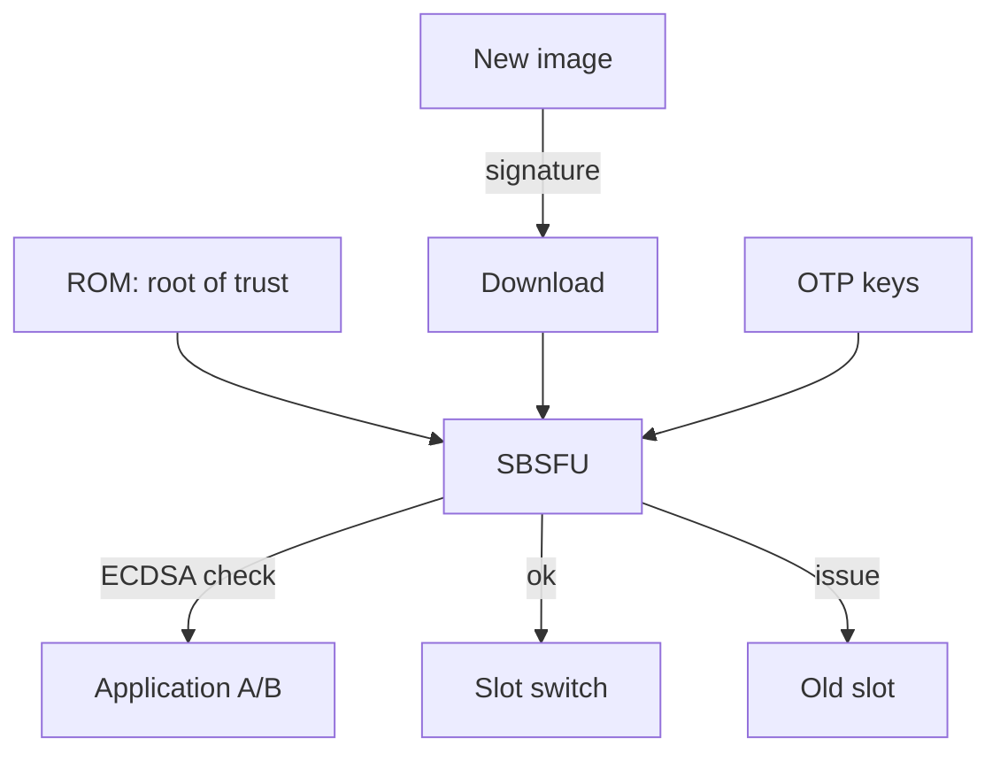

# STM32 Secure Boot - Trusted Start, SBSFU and Updates

![[assets/img/stm32-secure-boot-scheme.png|600]]
*Fig. Chain of trust: ROM to SBSFU to signature check to application; updates signed only.*

> [!tip] What this note is
> Production security: nobody swaps firmware or rolls back to a leaky one. SBSFU + TrustZone + rollback protection. Base: [[15-Protocols/03-Security.en | STM32 security]], [[01-Hardware/10-U5-Deep.en | U5 series]].

## 1. Goal

Close the firmware life cycle:

- chain of trust from ROM to the application;
- image signing (ECDSA) and check at start;
- OTA updates with rollback on failure;
- rollback protection: back to old is forbidden;
- secrets: where keys live.

| Stage | Who checks | What |
| --- | --- | --- |
| ROM | hardware | SBSFU by OTP key |
| SBSFU | bootloader | application signature |
| Application | - | runs |
| OTA | SBSFU | new image signature |

## 2. Architecture



Two slots A/B: the new image goes to the inactive one, switching follows the check. On failure we stay on the old one.

## 3. Security pinout (what to lock)

| Measure | Where | Note |
| --- | --- | --- |
| RDP level 2 | option bytes | debug closed forever! |
| OTP keys | OTP zone | one-time write |
| Write-protect SBSFU | option bytes | bootloader unwritable |
| Tamper pins | PC13 and others | secret wipe on case opening |
| DBG in production | switch off | no ST-Link attach |

RDP 2 is one-way: debug everything on RDP 0/1 first, then close. A mistake here is a brick.

## 4. Keys and signatures

- ECDSA pair: private in a safe/HSM, public in OTP;
- sign image + version + nonce;
- monotonic version counter - the heart of rollback protection;
- development keys differ from production keys (separate OTP profiles);
- development key leak means recall and reissue the batch;

## 5. Working code (C, image check)

```c
#include "crypto.h"

int image_verify(const uint8_t *img, size_t len,
                 const uint8_t *sig, const uint8_t *pubkey) {
  uint8_t hash[32];
  sha256(img, len, hash);
  if (ecdsa_verify(pubkey, hash, sig) != 0) {
    return -1;
  }
  uint32_t ver = image_version(img);
  if (ver <= stored_version()) {
    return -2;
  }
  return 0;
}

void boot_flow(void) {
  if (image_verify(active_image(), active_len(),
                   active_sig(), otp_pubkey()) == 0) {
    jump_to_app();
  }
  rollback_to_previous();
}
```

Hash + signature + version check - three conditions, not one. Skipping any is a hole.

## 6. Working code (MicroPython)

```python
# MicroPython: перевірка цілісності конфігів (не boot — політика!)
import hashlib
import json
import time

EXPECTED = {}

def snapshot(path):
    h = hashlib.sha256()
    with open(path, 'rb') as f:
        while True:
            b = f.read(1024)
            if not b:
                break
            h.update(b)
    return h.hexdigest()

def policy_check(files):
    bad = []
    for f in files:
        digest = snapshot(f)
        if EXPECTED.get(f) and EXPECTED[f] != digest:
            bad.append(f)
    return bad

EXPECTED['/flash/config.json'] = snapshot('/flash/config.json')
while True:
    bad = policy_check(list(EXPECTED))
    if bad:
        print('TAMPER:', bad)
    time.sleep(3600)
```

Honestly: secure boot belongs to ROM/SBSFU, not a script. The script above detects config swaps on a running system.

## 7. OTA procedure

- image + manifest (version, size, hash, signature);
- download to the inactive slot with resume;
- check, then switch, then trial boot;
- watchdog confirms success, else back;
- update journal for audit.

## 8. Common issues

| Symptom | Cause | Fix |
| --- | --- | --- |
| No start after signing | wrong key/version lower | compare keys and counter |
| Early RDP 2 | debug closed too soon | debug everything first! |
| OTA bricks the batch | no rollback | A/B slots + watchdog |
| Key in the repo | leak | HSM/safe, revocation |
| Tamper fires alone | floating pin | pull-up + filter |
| Old image accepted | no rollback protection | monotonic counter |

## 9. Security quick cheat sheet

- keys in a safe, not in git;
- RDP 2 as the last step;
- A/B slots + rollback;
- version forward only;
- tamper pins pulled up.

## 10. Related notes

- [[15-Protocols/03-Security.en | STM32 security]] - protection base.
- [[01-Hardware/10-U5-Deep.en | U5 series]] - TrustZone hardware.
- [[15-Protocols/02-DFU-Bootloader.en | DFU bootloader]] - update mechanics.
- [[15-Protocols/04-MQTT.en | MQTT protocol]] - OTA delivery.
- [[Home.en | Main map]] - full navigation.

## Official sources

- [STM32CubeU5 (STMicroelectronics, GitHub)](https://github.com/STMicroelectronics/STM32CubeU5) - SBSFU examples, TrustZone.
- [STM32F4 (ST)](https://www.st.com/en/mcus-mpus/stm32f4.html) - option bytes, RDP.
- [MQTT Specification (OASIS)](https://mqtt.org/mqtt-specification/) - OTA transport.
