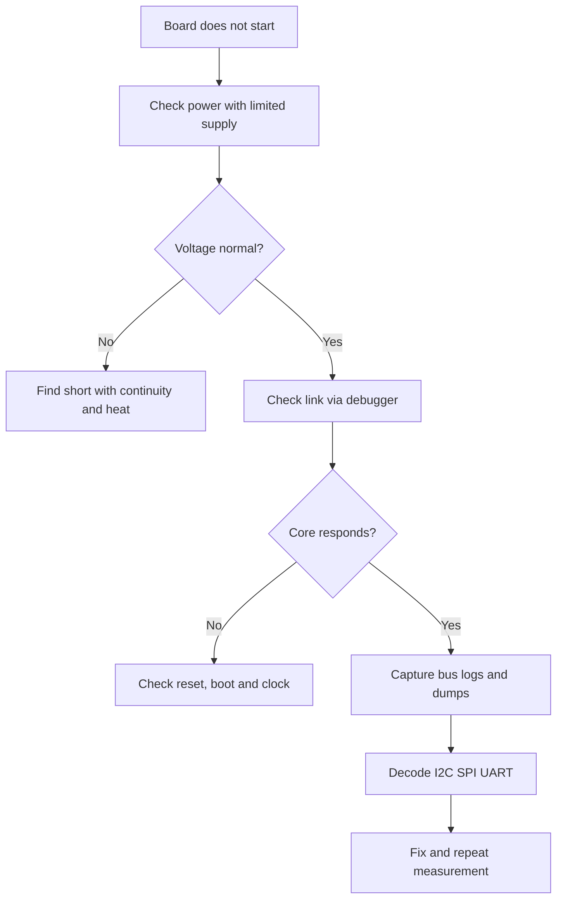

# Lab instruments - measure correctly

![[assets/img/stm32-lab-tools-scheme.png|600]]
*Fig. Lab instruments: multimeter, oscilloscope, logic analyzer, power supply and debug tracing.*

> [!tip] Note purpose
> Learn to measure without magic: where to put probes, how not to burn the board, how to decode buses and how to see what firmware is doing.

## 1. Purpose

The lab is a table where a board comes to life or dies. The minimum set is a multimeter, oscilloscope, lab power supply and logic analyzer. Further come programmer, tracing and static protection.

Correct measurements save weeks. Incorrect ones give false conclusions: searching for an error in code when power drifts, or blaming a sensor when the probe introduces pickup.

About board firmware see material on [[EN/09-Firmware/03-ST-Link-Flashing.en|Flashing via ST-Link]] and about board design see material on [[EN/17-Lab/02-PCB-Board.en|PCB Design]].

## 2. Multimeter - current in break, voltage in parallel

| Measurement | How to connect | Typical ranges |
| --- | --- | --- |
| Supply voltage | Parallel to VDD and ground | 20 V range, up to millivolt accuracy |
| Sleep current | In break of supply, serially | mA or uA range, wait for settling |
| Operating current | In break through 10 A terminals | Short wires else sag |
| Trace resistance | Without power | Find short circuits |
| Continuity | Without power | Check jumpers and cold joints |

Current is measured in a break, not in parallel. Probes in current sockets must not be put on voltage or a short occurs. After measuring current, return probe to voltage socket.

Sleep in microamps is measured separately because a cheap instrument on amp range will not see it. For transmission peaks look at oscilloscope on shunt.

```text
Multimeter:
  voltage:  COM -> GND, V -> VDD (parallel, board powered)
  current:  break + supply, COM -> battery -, mA -> board -
            wait 10 s until capacitors charge
  continuity: power OFF, probes on two ends of trace
  caution: 10A socket has no fuse, do not measure mains!
```

## 3. Oscilloscope - probes, multiplier, ground

| Question | Rule |
| --- | --- |
| Probe divider | Set x10 for fast signals and less loading |
| Calibration | Before work turn compensation for 1 kHz square |
| Ground | Short lead to board ground near measurement point |
| Two channels | One on signal, second on supply to see sag |
| Bandwidth | 100 MHz is enough for SPI 20 MHz with margin |
| Trigger | On packet edge or on supply drop |

A long ground lead is an antenna. At SPI 10 MHz it will show ringing that does not exist. Replace alligator with spring ground or measure differentially.

An inexpensive oscilloscope has no galvanic isolation. Probe case is connected to mains ground. Measuring mains without isolation is forbidden.

```text
Oscilloscope:
  channel 1: PA9 TX UART, x10, trigger on byte start
  channel 2: VDD near chip, x1, look for sag during transmission
  ground: spring to GND within 5 mm of point, no long wire
  example: SPI SCK 8 MHz - clean square without ringing
           I2C SCL - 4.7 kOhm pull-up, edge to 1 us
```

## 4. Logic analyzer - bus decoders

| Bus | What to watch |
| --- | --- |
| UART | Speed, start, stop, parity, exchange without breaks |
| I2C | Address, ACK, NACK, repeated starts, bus hangs |
| SPI | Phase and polarity, bit order, chip select |
| SWD | Is there core link or reset holding |

An 8-channel analyzer at 24 MHz is enough for buses up to a few megahertz. Signals clip with thin hooks to test points. Ground takes one short wire.

Decoder shows bytes immediately, not just waveforms. A saved dump is attached to error reports. This is faster than reading oscillograms by hand.

About driver layers for these buses read in note on [[EN/09-Firmware/02-HAL-LL.en|HAL and LL Layers]].

## 5. Power supply with current limit

| Step | Action |
| --- | --- |
| Voltage | Set 3.3 V before connecting board |
| Limit | Set 100 mA for first power-on |
| Turn on | Turn on and watch current should be tens of mA |
| Short | Current hits limit, voltage drops, find heat |
| Normal | Raise limit to 500 mA after check |

First power-on of a new board is always through a limit. This burns the supply fuse, not traces. A hot element is found by finger or thermal imager.

About board power chains read in material on [[EN/02-Power-Supply/01-Power-Supply-Rails.en|Power Supply Rails]] and about batteries in material on [[EN/02-Power-Supply/02-Battery-Power.en|Battery Power]].

## 6. Tracing instead of port output

Port output slows the program and changes timing. Hardware tracing through debug output gives logs without stopping the core.

```c
#include "stm32f4xx_hal.h"
#include <stdio.h>

int _write(int file, char *ptr, int len)
{
  for (int k = 0; k < len; k++)
  {
    ITM_SendChar((uint32_t)ptr[k]);
  }
  return len;
}

void Trace_Init(void)
{
  CoreDebug->DEMCR |= CoreDebug_DEMCR_TRCENA_Msk;
  DBGMCU->CR |= DBGMCU_CR_TRACE_IOEN_Msk;
}

void App_Task(void)
{
  static uint32_t cnt = 0;
  cnt++;
  printf("tick %lu adc %u\r\n", (unsigned long)cnt, (unsigned)1234);
  HAL_Delay(500);
}
```

| Method | Plus | Minus |
| --- | --- | --- |
| UART logs | Simple, visible in terminal | Slows queues, overflows |
| SWV trace | Fast with timestamps, no stop | Needs debugger and setup |
| LED codes | Works without anything | Little information |
| Save in RAM | View after stop | Limited size |

Trace is enabled in development environment by choosing clock and output. Logs are viewed in trace window, not port terminal.

## 7. Static protection and table order

| Measure | How to do |
| --- | --- |
| Bracelet | On wrist through resistor to table ground |
| Mat | Conductive mat grounded |
| Storage | Boards in anti-static bags, not on battery |
| Humidity | Do not rub plastic near boards in winter |
| Power | Ground first, then signals, then power |

Static kills inputs quietly. A board seems to work but ADC lies or pin leaks. Risk is highest in winter with dry air.

## 8. Measurement logic in schematic



## Common errors

| # | Error | Why bad | How right |
| --- | --- | --- | --- |
| 1 | Measure current in parallel | Short through ammeter and burned fuse | Only in break serially with load |
| 2 | Long oscilloscope ground | Ringing and false spikes on fast edges | Short spring to ground near point |
| 3 | Probe x1 on SPI 10 MHz | Probe loads bus and breaks exchange | x10 mode and compensation calibration |
| 4 | Logs in interrupt | Delays, broken exchange, lost bytes | Logs in main loop or trace |
| 5 | First power-on without limit | Trace or regulator burns | 100 mA limit and current control |
| 6 | Work without anti-static | Hidden input damage | Bracelet, mat, bags |

## Official sources

- [Oscilloscope probes ABC Tektronix](https://www.tek.com/en/documents/primer/oscilloscope-probe-fundamentals) - dividers, compensation, grounding.
- [ST-Link debug and trace ST](https://www.st.com/en/development-tools/st-link-v3.html) - debugging and SWV tracing.

## See also

- [[Home.en]]
- [[EN/09-Firmware/03-ST-Link-Flashing.en|Flashing via ST-Link]]
- [[EN/09-Firmware/02-HAL-LL.en|HAL and LL Layers]]
- [[EN/02-Power-Supply/01-Power-Supply-Rails.en|Power Supply Rails]]
- [[EN/16-Projects/03-Energy-Monitor.en|Energy Monitor]]
- [[EN/17-Lab/02-PCB-Board.en|PCB Design]]
