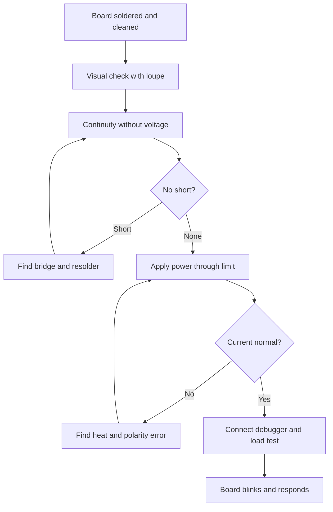

# STM32 board - design and assembly

![[assets/img/stm32-pcb-montazh-scheme.png|600]]
*Fig. Controller board: power and isolation, clock, debug connector, routing and assembly.*

> [!tip] Note purpose
> Give a checklist for the first board: what must be in the schematic, how to route ground and power, how to solder without bridges, and how to start on first try.

## 1. Purpose

Your own board is needed when a breadboard build is already too tight: fewer wires, stable power, envelope. The first board is usually simple: controller, regulator, crystal, debug connector and a few sensors.

Most failures of first boards are power and assembly, not firmware. No decoupling near pins, floating reset or a short under the package. So schematic and routing matter more than silk beauty.

About power read in material on [[EN/02-Power-Supply/01-Power-Supply-Rails.en|Power Supply Rails]] and about measurements after assembly in material on [[EN/17-Lab/01-Instruments.en|Lab Instruments]].

## 2. Minimum schematic for startup

| Node | What to put | Values |
| --- | --- | --- |
| VDD decoupling | Ceramic to each power pin | 100 nF + 1 uF near chip |
| VCAP | Capacitor on core pin | 2.2 uF close to pin |
| VDDA | Analog supply filter | 10 Ohm + 100 nF + 1 uF |
| VBAT | Battery or jumper to VDD | If no battery connect to VDD |
| Reset NRST | Pull-up plus button plus capacitor | 10 kOhm to VDD, 100 nF to ground |
| Boot BOOT0 | Resistor to ground plus jumper to VDD | 10 kOhm to ground |
| SWD connector | SWDIO SWCLK GND NRST VDD | 1.27 mm or 2.54 mm pitch |
| Crystal HSE | Crystal plus two capacitors | 8 MHz plus 18 pF per datasheet |

Without decoupling the controller resets on current jumps. Without reset pull-up the board starts sometimes. Without debug connector the first firmware has nowhere to be loaded.

About flashing read in note on [[EN/09-Firmware/03-ST-Link-Flashing.en|Flashing via ST-Link]] and boards for comparison in note on [[EN/14-Devboards/03-Nucleo.en|Nucleo Boards]].

```text
Minimum schematic:
  VDD o--+--100n--+--> VDD_1
         +--100n--+--> VDD_2
         +--1u----+--> VDD_3
  VDDA o--10R--+--100n--+--> VDDA
                  +--1u--+
  VCAP o--2u2--> GND
  NRST o--10k--> VDD, button --> GND, 100n --> GND
  BOOT0 o--10k--> GND, jumper --> VDD for bootloader
  SWD: 1-VDD 2-SWDIO 3-GND 4-SWCLK 5-GND 6-NRST
  HSE: 8 MHz between OSC_IN OSC_OUT + 2 x 18 pF to GND
```

## 3. Routing - ground, crystal, antenna

| Rule | How to do |
| --- | --- |
| Ground polygon | Solid layer without cuts under chip and crystal |
| Decoupling | Capacitors closer than 3 mm to power pins |
| Crystal | Near pins without digital traces under it |
| Power | Star from regulator, wide traces |
| Analog | Separate VDDA branch away from digital noise |
| Antenna | Free zone without copper and battery over printed antenna |
| Test points | VDD GND SWD UART at edge for probes |

Digital traces do not run under crystal because they disturb frequency. Fast SPI is made short and near ground. Gaps in polygon are patched with jumpers or moved to another layer.

Printed antenna requires a free zone per module documentation. A metal case or nearby battery cuts range by multiples.

## 4. Assembly - paste, hot air, check

| Step | Action |
| --- | --- |
| Paste | Thin layer through stencil or toothpick on pads |
| Placement | With tweezers by body, do not bend pins |
| Hot-air solder | 320 degrees with circular motion to solder shine |
| Iron solder | Tip 0.5 mm, solder 0.5 mm, paste gel flux |
| Cleaning | Wash with alcohol and dry |
| Visual | Loupe searches for bridges and unsoldered joints |

After soldering wash and dry the board. Sticky flux collects dust and causes leakage between pins. Especially watch 0.5 mm steps in LQFP packages.

```text
Assembly order:
  1. regulator + power capacitors
  2. controller (check first pin key!)
  3. crystal + small resistors and capacitors
  4. debug connector + buttons
  5. sensors and modules last
  check: continuity VDD-GND, VDD-3.3V, GND-integrity
```

To find bridges set multimeter to continuity and go through neighboring pins. Resistance between power and ground should be kilohms, not single ohms.

## 5. First startup checklist

| Step | Expectation |
| --- | --- |
| Without chip or without power - continuity VDD GND | No short |
| Apply 3.3 V through 100 mA limit | Current tens of mA, voltage holds |
| Measure VDD VCAP VDDA NRST | 3.3 V, 1.8 V, 3.3 V, high level |
| Connect debugger | Core visible, identifier readable |
| Load LED blink | LED blinks once per second |
| Check clocking | HSE 8 MHz at output or by registers |
| Connect UART logs | Startup line from firmware visible |

If core is not visible check power, reset, boot and SWDIO SWCLK connection. A frequent cause is swapped SWDIO and SWCLK or floating reset.

About flashing via ST-Link see material on [[EN/09-Firmware/03-ST-Link-Flashing.en|Flashing via ST-Link]].

## 6. HAL board-check code

```c
#include "stm32f4xx_hal.h"

void Board_SelfTest(void)
{
  HAL_GPIO_TogglePin(GPIOC, GPIO_PIN_13);
  HAL_Delay(200);
}

int Board_CheckPower(void)
{
  uint32_t vdd_mv = 3300;
  if (vdd_mv < 3000 || vdd_mv > 3600)
  {
    return -1;
  }
  if (HAL_GPIO_ReadPin(GPIOA, GPIO_PIN_0) == GPIO_PIN_RESET)
  {
    return -2;
  }
  return 0;
}

int main(void)
{
  HAL_Init();
  SystemClock_Config();
  MX_GPIO_Init();
  MX_USART1_UART_Init();

  const char *msg = "board alive\r\n";
  HAL_UART_Transmit(&huart1, (uint8_t *)msg, 13, 100);

  if (Board_CheckPower() != 0)
  {
    while (1)
    {
      HAL_GPIO_TogglePin(GPIOC, GPIO_PIN_13);
      HAL_Delay(100);
    }
  }

  while (1)
  {
    Board_SelfTest();
    HAL_UART_Transmit(&huart1, (uint8_t *)msg, 13, 100);
    HAL_Delay(1000);
  }
}
```

The test blinks LED and sends a line to port. Fast blinking means power error or button error. After this test load working firmware.

## 7. Startup logic in schematic



## Common errors

| # | Error | Why bad | How right |
| --- | --- | --- | --- |
| 1 | No decoupling near pins | Reset on transmission jumps and floating failures | 100 nF to each pin closer than 3 mm |
| 2 | NRST floating | Starts sometimes, picks up pickup | 10 kOhm to power plus 100 nF to ground |
| 3 | BOOT0 without resistor | Random bootloader entry | 10 kOhm to ground plus jumper |
| 4 | Crystal far and digital under it | Frequency wanders, exchange breaks | Crystal near pins, clean ground under it |
| 5 | Polygon cut with gaps | Ringing on edges and noise in ADC | Solid ground with layer stitching |
| 6 | Bridge under LQFP | Short not visible to eye | Loupe, continuity, hot air and resolder with flux |

## Official sources

- [AN2586 STM32 hardware development ST](https://www.st.com/resource/en/application_note/an2586-getting-started-with-stm32f10xxx-hardware-development--stmicroelectronics.pdf) - decoupling, reset, boot.
- [AN4728 STM32 PCB guidelines ST](https://www.st.com/resource/en/application_note/an4728-stm32f3-and-stm32g4-series-pcb-guidelines--stmicroelectronics.pdf) - routing, ground, crystal, analog.

## See also

- [[Home.en]]
- [[EN/02-Power-Supply/01-Power-Supply-Rails.en|Power Supply Rails]]
- [[EN/09-Firmware/03-ST-Link-Flashing.en|Flashing via ST-Link]]
- [[EN/14-Devboards/03-Nucleo.en|Nucleo Boards]]
- [[EN/16-Projects/01-Weather-Station.en|Weather Station]]
- [[EN/17-Lab/01-Instruments.en|Lab Instruments]]
