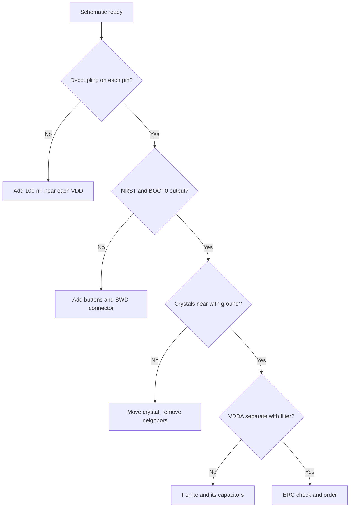

# STM32 board design - power, crystals and routing

![[assets/img/stm32-pcb-guidelines-scheme.png|600]]
*Fig. Board that starts first time: power, crystals, debug.*

> [!tip] Note purpose
> Give a schematic checklist so your board starts immediately, not on third revision.

## 1. Purpose

The microcontroller is only part of the board. Ninety percent of "chip is defective" is schematic errors: forgotten capacitor, long crystal trace, shared analog and digital ground. This note collects the mandatory minimum of schematic and routing.

## Power: mandatory minimum

| Element | Rule | Why |
| --- | --- | --- |
| VDD decoupling | 100 nF near EACH power pin | Core pulse currents |
| Bulk capacitor | 4.7-10 uF at board input | Sag at radio and relay start |
| VDDA filter | Ferrite + 1 uF + 100 nF separately | ADC without digital noise |
| VCAP (H7) | 2.2 uF per datasheet, near pins | Without it core does not start! |
| VBAT | Battery or jumper to VDD | Otherwise RTC and backup dead |

```text
Typical board power schematic:
  5V input -> protection diode -> LDO 3.3V -> bulk 10 uF
  3.3V -> each VDD pin through 100 nF (trace short!)
  3.3V -> ferrite -> VDDA + VREF through its capacitors
```

## Reset and boot

| Signal | Schematic | Trap |
| --- | --- | --- |
| NRST | 10 kOhm pull-up to 3.3V + 100 nF to ground + button | Without cap - false resets from noise |
| BOOT0 | Jumper or resistor to ground + button to 3.3V | No access - cannot enter bootloader! |
| SWDIO/SWCLK | Connector 2.54 or Tag-Connect + pull-ups | Without connector - flash only after soldering |

## Crystals: near and short

| Resonator | Routing requirements |
| --- | --- |
| HSE 8-25 MHz | Crystal as close as possible, traces symmetric and short |
| Load capacitors | Per crystal datasheet (usually 12-22 pF) |
| Ground under crystal | Solid polygon, no digital traces nearby! |
| LSE 32.768 kHz | Separate small crystal, its own ground zone |

```text
NO Femto under crystal:
  no vias in crystal zone;
  no fast signals (SPI, USB) nearby;
  crystal body to ground.
```

## Mermaid: schematic review before order



## Analog part

| Topic | Practice |
| --- | --- |
| Ground separation | One connection point of AGND and DGND near source |
| VREF | Precise source or VREFBUF, capacitor per datasheet |
| ADC inputs | RC filter against aliasing, protection diodes |
| Current shunts | Kelvin connection, short symmetric pairs |

## Digital interfaces on board

| Interface | Requirements |
| --- | --- |
| USB | Differential pair 90 Ohm, equal length, no vias! |
| SDMMC/SDIO | Short level traces, ground nearby |
| Ethernet RMII | Pair lengths, 50 MHz crystal near PHY |
| Antenna (WB/WL) | Keepout zone, pi-network, 50 Ohm |

## Debug conveniences

| Element | Why |
| --- | --- |
| SWD connector | Firmware and debug after assembly |
| UART output | Logs without debugger |
| Test points | VDD, GND, key signals for probes |
| LED power + user LED | See board is alive |
| Current measurement jumper | Break supply for ammeter |

## Common errors

| # | Error | Why bad | How right |
| --- | --- | --- | --- |
| 1 | One capacitor for all VDD | Sag and core failures | 100 nF near each pin! |
| 2 | No VCAP on H7 | Does not start at all | Per datasheet, near pins |
| 3 | BOOT0 without access | Cannot enter bootloader | Button or jumper on board |
| 4 | Crystal far with neighbors | Does not start, frequency wanders | Near, short, quiet zone |
| 5 | AGND cut | ADC noise and hum | One connection near source |
| 6 | USB pair sloppy | Not seen by host | 90 Ohm, equal length, no vias |
| 7 | No SWD connector | Brick after first bad flash | Connector or test points with NRST |

## Board revision marking

| Rule | Explanation |
| --- | --- |
| Revision number on silk | Otherwise cannot distinguish boards with different bugs |
| Change log per revision | What fixed from previous |
| Save gerbers of each revision | Reorder without surprises |

## Official sources

- [AN2586 Getting started with hardware (ST)](https://www.st.com/resource/en/application_note/an2586.pdf) - basic STM32 board schematic.
- [AN2867 Oscillator design guide (ST)](https://www.st.com/resource/en/application_note/an2867.pdf) - crystals and capacitors.

## First power-on: action sequence

| Step | Action |
| --- | --- |
| 1 | Visual inspection: bridges, polarity, no extra solder |
| 2 | Continuity power: no short between 3.3V and GND! |
| 3 | Apply power through PSU with 100 mA limit |
| 4 | Check 3.3V with multimeter, then idle current |
| 5 | Connect ST-Link, read chip ID |
| 6 | Load Blink, check LED and UART log |

```text
If current hits limit immediately:
  turn OFF IMMEDIATELY, find short with thermal imager or finger;
  common culprits: swapped LDO, solder blob, TVS reverse.
```

## See also

- [[Home.en]]
- [[EN/17-Lab/02-PCB-Board.en|PCB Design]]
- [[EN/17-Lab/01-Instruments.en|Lab Instruments]]
- [[EN/02-Power-Supply/01-Power-Supply-Rails.en|Power Supply Rails]]
- [[EN/01-Hardware/04-H5-H7.en|Flagships and domains]]
