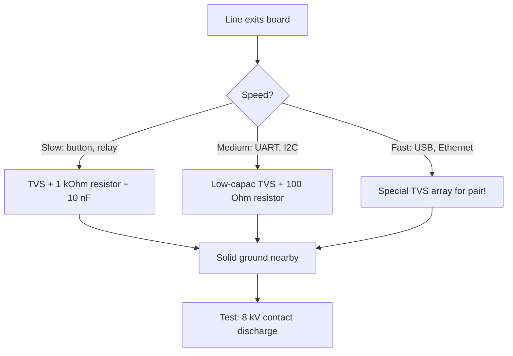

# EMI and STM32 board protection - TVS, ferrites and ground

![[assets/img/stm32-emi-emc-scheme.png|600]]
*Fig. Quiet board: protection on inputs, filters on power, solid ground.*

> [!tip] Note purpose
> Learn to suppress noise and protect pins so the board passes tests and lives in the field.

## 1. Purpose

The microcontroller sees the world through pins - and every pin is an antenna for interference and a gate for static. Without protection one finger touch or relay click nearby turns into a false interrupt, reset or punctured input. Protection costs pennies at schematic stage and thousands at claim stage.

## Two directions: emission and immunity

| Direction | Question | Tools |
| --- | --- | --- |
| Emission (you emit) | Do you jam neighbors? | Soft edges, filters, shields |
| Immunity (you endure) | Do you survive near a contactor? | TVS, ferrites, isolation, ground |

```text
Rule: first do not emit yourself (cheap),
then protect from others (more expensive).
A quiet source does not need thick walls.
```

## TVS protection for inputs

| Element | Where | How to choose |
| --- | --- | --- |
| TVS diode unidirectional | DC lines, buttons, sensors | Breakdown above working, below pin maximum! |
| TVS diode bidirectional | RS485, CAN, differential pairs | Low capacitance, else eats fast edges |
| Series resistor | Before pin, 100 Ohm - 1 kOhm | Limits current into chip protection diodes |
| Capacitor to ground | 1-10 nF near connector | Cuts high-frequency ringing |

```text
Discrete input protection chain:
  connector -> TVS to ground -> 1 kOhm resistor -> 1 nF cap -> pin.
  TVS takes hit, resistor cuts current, cap suppresses ringing.
```

## Power: ferrites and filters

| Element | Where | Effect |
| --- | --- | --- |
| Ferrite bead | Series in 3.3V before noisy part | Suppresses MHz, passes DC |
| LC filter VDDA | Ferrite + capacitors | Clean analog near digital storm |
| Separate LDO for analog | Demanding measurements | Isolation from digital sags |
| Reverse-polarity diode | Board input | Saves from swapped PSU |

## Mermaid: line protection selection



## Ground and routing against noise

| Rule | Explanation |
| --- | --- |
| Solid ground polygon | No gaps under fast signals! |
| Return current under trace | Polygon break forces current around and radiates |
| Analog and digital | Separate zones, one connection point |
| Crystal in quiet zone | No power traces under resonator |
| Cable shield to ground | One side for low freq, both for high |

## Slew-rate: soft edges

| Topic | Practice |
| --- | --- |
| Pin OSPEEDR speed | Minimal that is enough for the task! |
| Series resistor | 22-100 Ohm on fast lines suppresses ringing |
| Differential pairs | Equal length, constant gap |
| PWM to motor | Ferrite + RC snubber on keys |

```c
// Example: reduce edge speed of unimportant pin:
LL_GPIO_SetPinSpeed(GPIOA, LL_GPIO_PIN_5, LL_GPIO_SPEED_FREQ_LOW);
```

## Testing: minimum for yourself

| Test | How | Criterion |
| --- | --- | --- |
| ESD | Piezo lighter or discharge near case | No resets and hangs |
| Supply sag | Short PSU off 10-100 ms | BOR/PVD work clean |
| Relay nearby | 220V load click nearby | No false interrupts |
| Long lines | Maximum cable length | Protocol holds without retries |

## Common errors

| # | Error | Why bad | How right |
| --- | --- | --- | --- |
| 1 | TVS breakdown below working | Clamps line permanently | Breakdown between working and pin max |
| 2 | Large TVS capacitance on USB | Eats signal | Special low-cap arrays |
| 3 | Ground gap under SPI | Radiation and ringing | Solid polygon without cuts |
| 4 | OSPEEDR max everywhere | Ringing and emission | Minimum that is enough |
| 5 | Cable shield nowhere | Antenna instead of shield | To ground, one/two sides rule |
| 6 | No protection at all | First storm or touch | TVS + resistor at least on external lines |
| 7 | Ferrite in main supply | Voltage drops under load | Ferrite only on sensitive branches, not power |

## Official sources

- [AN1709 EMC design guide (ST)](https://www.st.com/resource/en/application_note/an1709.pdf) - interference suppression on STM32 boards.
- [IEC 61000-4-2 ESD standard (IEC)](https://webstore.iec.ch/en/publication/26121) - static test levels.

## Galvanic isolation: when grounds differ

| Case | Solution |
| --- | --- |
| RS485/CAN long line | Isolated transceiver + isolated DC-DC |
| 220V network measurement | Optocoupler or digital isolator, no common GND! |
| USB at different potentials | USB isolator or same source power |
| Ribbon cables between boards | Twisted pair with ground near signal |

```text
Isolation rule:
  barrier must hold kilovolts, not volts;
  grounds on both sides of barrier NEVER connect;
  power on each side - its own, with its decoupling.
```

## Board layout: zone order

| Zone | What inside |
| --- | --- |
| Power input | Diode, bulk, LDO, ferrites |
| Digital core | Chip, decoupling, crystals, SWD |
| Analog | VDDA filter, VREF, ADC inputs |
| Power keys | MOSFET, relay, snubbers - as far from crystals! |
| Connectors | TVS barrier at board edge |

## See also

- [[Home.en]]
- [[EN/17-Lab/03-Hardware-Design-Guidelines.en|Schematic design]]
- [[EN/17-Lab/02-PCB-Board.en|PCB Design]]
- [[EN/02-Power-Supply/01-Power-Supply-Rails.en|Power Supply Rails]]
- [[EN/03-GPIO/01-GPIO-Modes.en|Pin Modes]]
