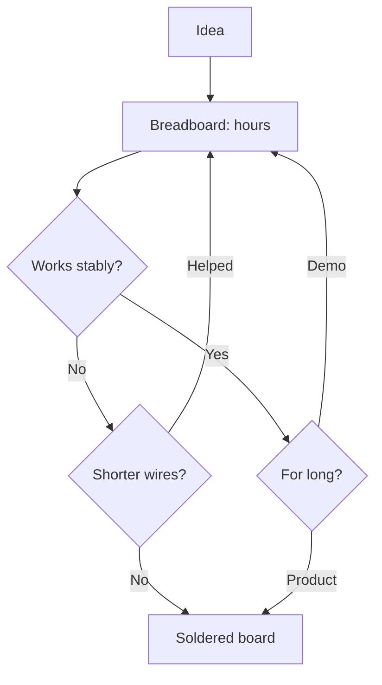

# Breadboard - STM32 assembly without soldering and its limits

![[assets/img/stm32-maketka-scheme.png|600]]
*Fig. Breadboard as stage: assemble fast, move to soldering in time.*

> [!tip] Note purpose
> Learn to assemble an STM32 node on breadboard so glitches come from code, not wires.

## 1. Purpose

Breadboard is the first hour of the project: insert Blue Pill, toss wires, Blink blinks. But every contact adds picofarads and milliohms, and each wire is an antenna. This note gives rules under which breadboard works, and signs it is time to solder.

## Breadboard power buses

| Rule | Explanation |
| --- | --- |
| Red and blue strips | Plus and ground along full length |
| Middle jumpers | Strips often broken in center! |
| Bulk near chip | 10 uF + 100 nF directly in neighbor sockets |
| Thick power wires | Thin ones sag on radio peaks |

```text
Check buses with multimeter:
  continuity from edge to edge;
  find break in middle before, not after debugging hour.
```

## SWD on breadboard: short

| Signal | Rule |
| --- | --- |
| SWDIO, SWCLK | To 10 cm, ground wire nearby! |
| GND | First wire, thick |
| NRST | Bring to button |
| Frequency | Lower if breaks |

## What works, what does not

| Task | On breadboard |
| --- | --- |
| Blink, buttons, UART log | Yes, no questions |
| I2C sensors | Yes, to 100 kHz and short |
| SPI display | Yes, to 1 MHz |
| Fast SPI, SDIO | No - guaranteed glitches |
| USB data | No, only power |
| Accurate ADC | No, noise from neighbors |
| Crystal HSE | Only on module board, not bare chip! |

## Mermaid: breadboard or solder



## BOOT0 and buttons on breadboard

| Element | How |
| --- | --- |
| BOOT0 jumper | Jumper to 3.3 V or GND |
| Reset button | To ground through pull-up |
| User button | To EXTI pin for menu |
| LEDs | PC13 on Blue Pill already present |

## VDDA noise on breadboard

| Problem | Solution |
| --- | --- |
| Neighbor digital wires | Analog lines to separate side! |
| Shared decoupling | Own 100 nF near VDDA pin |
| Long ADC probes | Twisted pair or shorter |
| Accuracy | For calibration - only soldered board |

## Transition to soldered board: signs

| Sign | Action |
| --- | --- |
| Glitch disappears on touch | Contacts - solder |
| Works only with specific wire position | Solder |
| Need enclosure | Solder |
| Second copy needed | Solder two at once |

## Common errors

| # | Error | Why bad | How right |
| --- | --- | --- | --- |
| 1 | Power strips broken | Half circuit without power | Check continuity first! |
| 2 | Long SWD across breadboard | Flash breaks | To 10 cm + ground near |
| 3 | I2C at 400 kHz with long wires | NACK and hangs | 100 kHz and short |
| 4 | No bulk near chip | Reset on peaks | 10 uF in neighbor sockets |
| 5 | ADC near SPI wires | Noise in measurements | Analog to separate side |
| 6 | Bare chip without crystal | HSE does not start | Only modules with crystal! |
| 7 | Breadboard as product | Oxidation and drops | Demo - yes, series - solder |

## Storage of build between sessions

| Rule | Explanation |
| --- | --- |
| Photo from above | Restore in minute after disassembly |
| Box with lid | Dust in contacts - glitches |
| Do not carry to I2C adapter | Wires fall and tangle |

## Official sources

- [AN2586 Getting started (ST)](https://www.st.com/resource/en/application_note/an2586.pdf) - power and decoupling.
- [Nucleo boards guide (ST)](https://www.st.com/en/evaluation-tools/stm32-nucleo-boards.html) - Morpho as breadboard replacement.

## Wire organization: colors and length

| Color | Signal |
| --- | --- |
| Red | Power plus |
| Black or blue | Ground |
| Yellow | I2C and SPI signals |
| Green | UART and control |

| Rule | Explanation |
| --- | --- |
| Length by need | Extra loops - antennas |
| Signals near ground | Twisted pair with GND for long |
| Do not cross power | Relays and motors separate bundle |

## Module power: 5 V and 3.3 V together

| Topic | Practice |
| --- | --- |
| Two buses on breadboard | One strip 5 V, second 3.3 V |
| AMS1117 LDO module | Cheap 5 to 3.3 converter |
| AMS1117 current | Heats over half amp! |
| FT pins | 5-volt modules only on FT inputs |

## See also

- [[Home.en]]
- [[EN/17-Lab/02-PCB-Board.en|PCB Design]]
- [[EN/17-Lab/03-Hardware-Design-Guidelines.en|Schematic Design]]
- [[EN/09-Firmware/03-ST-Link-Flashing.en|Flashing via ST-Link]]
- [[EN/14-Devboards/01-Blue-Pill.en|Blue Pill Board]]
